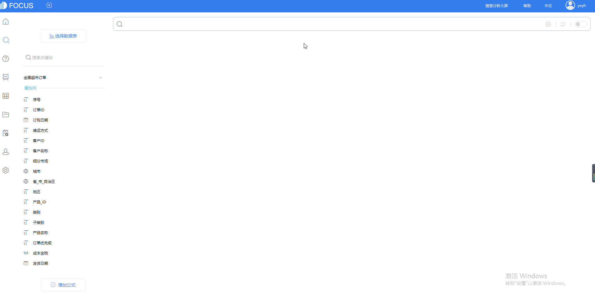

你有没有出现这样的时候，想数据分析结果却发现需要学习代码知识，于是你好不容易下定决心，终于强逼着自己学习代码。3天过去了...5天过去了...一个星期过去了...1个月过去了...一点进展也没有。

终于，3个月过去了，你学完了从入门到放弃精通的代码教程。

正当你觉得自己好不容易学会了又发现自己根本就没学懂，实际操作起来完全不是一回事，又重新学习了一遍。

于是你又花了1个月终于把代码给学懂并且会运用了。

久而久之你又发现，用代码这种计算机语言来进行数据分析还是太复杂太累了，要实现明明很简单的一个操作却要输入一大段的代码。而且面对海量的数据你还要从中如大海捞针一般地挑选出你要分析的数据列，再手动一个一个地拖拽。

你不禁开始怀疑...

为什么明明很简单的事情要弄得那么复杂？

能不能不要大海捞针式地找数据列拖拽？

能不能不要代码也可以数据分析？

DataFocus Cloud拒绝代码！拒绝拖拽！像Google一样用人类的类自然语言搜索就可以进行数据分析。

**搜索vs拖拽**

DataFocus Cloud搜索式的分析是基于自然语言处理（NPL）技术之上的创新，随着人工智能技术的普及，搜索式分析将成为业界主流，颠覆、取代现有的由Tableau开创的拖拽式分析方式。

相比于拖拽式，搜索式分析更符合人类的使用习惯。

DataFocus Cloud像Google一样的搜索引擎，用户在智能提示引导下，输入相应的关键词、或者对应的数据字段名称，或者以上两者的结合，就可以迅速得到答案。除此之外，你还可以直接双击数据表中的数据字段，搜索框将直接输入这个数据字段。

同时，搜索不仅更简单，而且更灵活了。

要获得各种维度的分析结果，你不需要反复拖拽多次，甚至进行事先的配置，搜索即可。

你可以在单维度和多维度之间灵活转换，搜索结果实时可得。

基于语义的理解，拖拽式操作永远无法实现。

简单的语句可以表达复杂的意思，有些用拖拽的方式永远无法实现，或许你还得借助SQL语句。但是有了DataFocus，你不需要重拾代码，搜索即可。

**拒绝代码的搜索**

替代代码的是DataFocus Cloud独有的关键词搜索，这可以帮助用户使用关键词进行搜索式分析。关键词分为中文关键词和英文关键词，支持筛选、聚合、日期、时间、字符串、排名、vs等多种关键词。

你只需要在搜索框输入这些关键词，比如排名最前的销售量 产品名称，就可以直接搜索出结果销售量。如图所示。

而且你搜索的次数越多，搜索得到结果所需的时间就越短，同时系统会自动记录下你的搜索历史记录，你可以更快地选择你习惯的搜索语句。

如果你不知道该怎么描述你的搜索语句，DataFocus还提供了自动搜索建议功能。它可以智能提示你接下来可以输入什么样的语句，输入更高效了。

DataFocus Cloud主动学习人类的分析方法，能让你体会到愈用愈智能，同时也逐渐让你产生依赖感。
