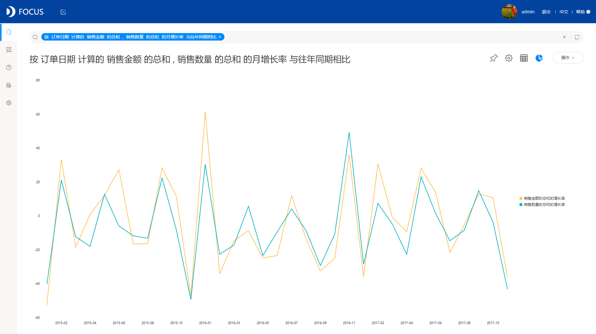
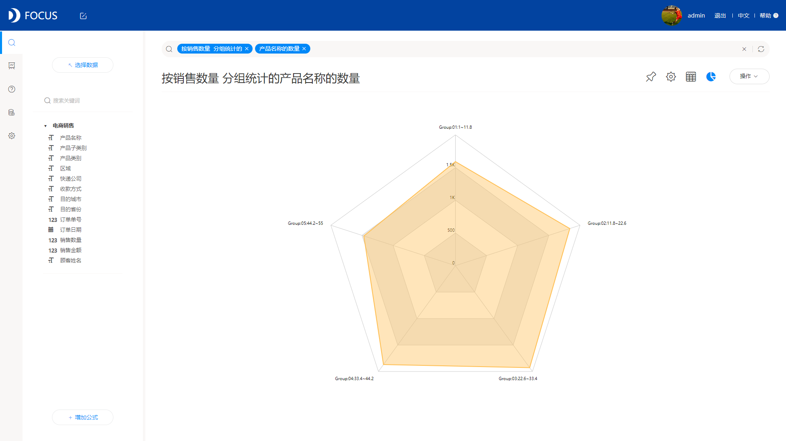

现如今，数据分析越来越重要，在业务管理是重中之重，各大小企业纷纷开展数据分析，为管理层决策提供数据支持。

数据分析的开展，必然要依赖于数据分析工具的使用，市场上分析工具多种多样，有通过代码交互的，也有通过写SQL语句进行分析的，当然，最常见也最多的，就属拖拽式分析。但是，我们今天就要颠覆这种固有思想，革新数据分析方式，拒绝平庸，拒绝随波逐流，拒绝大众化，我们要有创新，故我们选择用最具创新的DataFocus数据分析工具，其颠覆了我对于数据分析工具的固有印象，不再使用拖拽的方法，而是采用全新的搜索式分析。

听到搜索式分析，是不是也被瞬间吸引了，是不是打破了对于数据分析交互方式的固有印象？DataFocus是国内首个中文搜索式数据分析工具，拥有专利权，通过对搜索框进行提问，系统以图表的形式进行回答，使数据分析如谷歌搜索一样简单，DataFocus此创新不仅革新了交互方式，还大大降低了数据分析的难度，做到了人人都能进行数据分析。现在是不是都很好奇DataFocus是怎么进行搜索分析的，我们可以一起看下面的几个实例，你就知道搜索式分析的优势在哪里了。

多个数值的环比，直接搜索得出：

多个数值的同比，直接搜索得出：

每年/季度/月…销售，直接搜索得出：

销量Top10，直接搜索得出：

分组统计，直接搜索得出结果：

从以上的实例中，大家也可以感受到这种搜索式分析的便捷之处，信息化时代发展如此快速，技术的不断迭代更新，未来这种搜索式分析必定成为主流。
