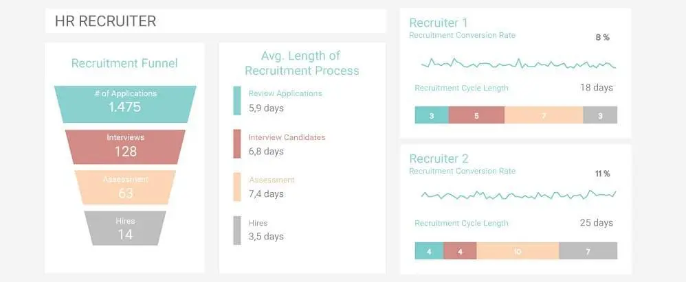
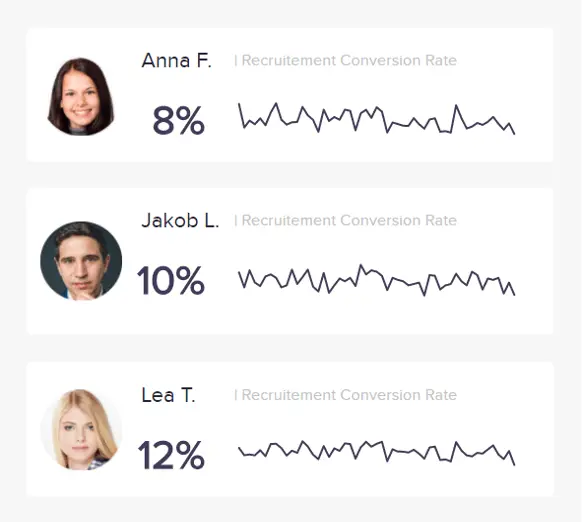
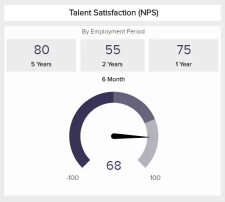
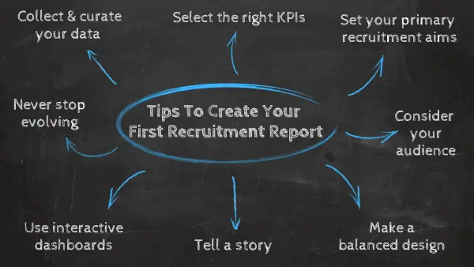

为了竞争、发展和保持相关性，当今最具前瞻性的企业优先考虑持续改进其内部流程，同时精确地衡量其成功——招聘人才也不例外。

那里可能有大量有才华的求职者，但对于当今的许多组织来说，与最佳求职者建立联系正成为一项越来越大的挑战。不仅为您的公司寻找合适的人才很重要，而且对于您的新员工来说，融入您的内部文化、始终保持积极性、快乐和敬业度也很重要。这就是招聘 KPI 指标的用武之地。

通过利用通过可视化和交互式[人力资源仪表板](https://www.datafocus.ai/infos/dashboard-examples-and-templates-human-resources)呈现的招聘 KPI，可以使用招聘 KPI 指标来更好地解释和评估有助于招聘流程的各种人才招聘因素。如果您在各种人力资源 KPI 的帮助下采用招聘分析，您将能够制定新的策略，从[人力资源](https://www.datafocus.ai/infos/kpi-examples-and-templates-human-resources)、部门间协作和[KPI 管理](https://www.datafocus.ai/infos/kpi-management-and-best-practices)的角度对您的组织产生积极影响。

根据万宝盛华的数据，大约72.8%的公司在寻找熟练的候选人时遇到了困难，45%的雇主担心为组织内的特定职位找到具有合适才能的员工。

为了帮助您更深入、更实用地了解招聘分析和招聘指标，我们将研究使用招聘 KPI 的好处，探索指标和分析在招聘中的含义，浏览招聘仪表板，展示 24 个有效的招聘指标示例，并为您提供创建自己的招聘报告实践的基本技巧。

让我们开始吧。

您的机会：[想要免费创建一个现代招聘仪表板？](https://www.datafocus.ai/console/)我们提供 14 天免费试用。受益于交互式人力资源仪表板！

## 什么是招聘分析？

招聘分析是使用数据驱动的见解来改善组织中关键职位的最佳候选人来源的过程。借助预测和实时数据，您将降低成本并确定影响招聘流程的因素。

在我们深入研究招聘指标和仪表板的动态之前，了解招聘分析的含义及其在商业世界中的角色非常重要。

当您是一家希望雇用新员工的组织时，分析和数据分析工具允许您读取[数据](https://www.datafocus.ai/infos/data-analyst-tools-software)模式，帮助您制定信息驱动的战略。在这种情况下，您将需要策略来帮助您雇用最适合该职位的最合格员工。

为了读取这些数据和分析模式，人力资源部门使用[在线商业智能](https://www.datafocus.ai/infos/online-bi-tools)来帮助他们整合数据并对其进行处理。凭借其数据可视化功能，他们可以轻松制作招聘仪表板，这些仪表板是帮助人们以简化、全面的方式阅读和理解数据模式的工具。您可以使用招聘仪表板将各种 KPI 或指标输入系统，并且可以评估有助于您的招聘策略的各种因素。

现在，在数据驱动的商业世界中，您必须能够利用数据，以便能够在竞争中保持领先地位，雇用合适的员工，确保您的经理遵循最佳合同实践，并采取措施确保员工在您的组织内尽其所能。

通过利用招聘分析的力量并使用交互式[仪表板软件](https://www.datafocus.ai/infos/best-dashboard-software-features)，您将能够简化许多关键领域的人才招聘工作，包括空缺填补时间、申请审查、人才筛选和入围，以及招聘价值或准确性等。

在设定的时间范围内衡量、探索和分析与您的企业招聘目标相关的招聘分析将帮助您随着时间的推移完善您的工作，减少效率低下，同时简化您的流程，而招聘 KPI 将帮助您为您的业务设定和衡量特定的基于招聘的目标，这最终将帮助您的组织寻找和留住这种人才将推动它达到繁荣的新高度。现在您已经了解有关招聘分析的详细信息，让我们专注于招聘 KPI 和基本定义。

“未来几年，招聘最优秀人才的竞争将会加剧。为员工提供额外灵活性的公司将在这一领域占据优势。

## 什么是招聘关键绩效指标？

招聘 KPI 是帮助人力资源专业人员优化招聘流程、提高绩效和提高生产力的业务指标。借助实时洞察，人力资源团队可以做出明智的战略决策来实现他们的招聘目标。

这些指标对于建立健康的人力资源流程并最终为公司及其资源带来可持续发展至关重要。我们现在将更详细地介绍您可以从这些指标中学到什么以及它们可以提供什么样的帮助。

## 您可以从招聘指标中学到什么

在我们介绍用于招聘仪表板的更精细的细节和具体指标工具之前，重要的是要了解您可以从招聘指标中学到什么。首先考虑以下几点：

- 雇用员工需要多长时间？
- 您的潜在候选人是否适合这份工作？
- 您在整个招聘过程中花了多少钱？
- 您在招聘过程中的效率如何？
- 有多少候选人正在申请您的职位发布？
- 候选人在哪些地方寻找您的职位发布？
- 您的新员工在工作中的表现如何？
- 您在列表中提供的职位描述是否准确反映了实际的职位详细信息？
- 您的招聘之旅是否引人入胜、透明且高效？

借助这些要点，您可以在[实时仪表板](https://www.datafocus.ai/infos/live-dashboards)上使用招聘指标并生成惊人的见解。

正如您将慢慢发现的那样，您可以从使用招聘指标中获得一些非常有价值的信息。在信息驱动的世界中，使用适当的[在线数据可视化工具来](https://www.datafocus.ai/infos/data-visualization-tools)了解这些数字和数字背后的内容将帮助您正确打牌。既然招聘有才华的专业人士可以推动您的业务走向成功，您不想错过在竞争对手首先到达之前更好地了解如何获得理想员工的机会。

现在，您已经了解了招聘分析的基础知识，让我们看一些招聘仪表板示例。

## 为什么需要招聘仪表板

人力资源仪表板在当今的人力资源部门越来越受欢迎和重要。它们有助于可视化关键信息，以最佳方式管理劳动力，并了解潜在的痛点，以便在发现后立即解决它们。巧妙地使用招聘分析可以节省大量时间和金钱，帮助管理人员做出更明智的人才决策或跟踪员工的绩效。虽然有许多类型的仪表板，但您可以使用以下招聘[仪表板](https://www.datafocus.ai/infos/strategic-operational-analytical-tactical-dashboards)示例来可视化与招聘漏斗相关的主要 KPI：

当您利用[在线仪表板](https://www.datafocus.ai/infos/online-dashboard)上的招聘指标时，数据是招聘过程中人力资源的一个非常强大的工具。您需要花费大量时间根据有限的信息为您的组织雇用员工的日子现在已经结束。

作为一个数据驱动的组织，您可以衡量各种有助于招聘流程的因素，为此，您可以使用招聘仪表板更好地阅读关键绩效指标 （KPI），并评估招聘流程的有效性。

除了使用数据吸引新员工加入您的业务外，人力资源经理还可以使用可视化仪表板来管理他们现有的人才。

例如，我们上面的人才管理仪表板提供了所有工具，以保持员工的敬业度和积极性。通过使用人才满意度、人才评级和人才流动率等 KPI，您可以做出战略决策以提高忠诚度，同时保持全面的一致绩效水平。

让我们面对现实吧，您必须在这个不断快速适应的数据世界中保持竞争力，为了做到这一点，您必须雇用最优秀的员工，并使用最先进的[人力资源分析软件](https://www.datafocus.ai/infos/business-intelligence-human-resources)，这可以帮助您获得额外的优势来提高业务的成功率。

您可以在仪表板上使用各种各样的招聘[KPI 示例](https://www.datafocus.ai/infos/kpi-examples-and-templates)来简化招聘流程。

## 为什么您需要跟踪招聘漏斗

很明显，招聘[在线报告工具和招聘报告](https://www.datafocus.ai/infos/online-reporting)指标是一股强大的力量。但是，如果不准确跟踪您的招聘渠道，从长远来看，您的努力可能会被稀释并变得效率降低。

正如我们所确定的，为您的组织找到合适的人可能是一个棘手的过程。也就是说，您的招聘漏斗将有助于制定您在所有部门（从客户服务到营销等）成功获取人才的策略。

尽管每个招聘漏斗因企业而异，但从根本上说，您的招聘漏斗包括：

- 为特定角色吸引被动候选人。
- 设置申请流程并提供入围面试或评估。
- 入围的活跃候选人的面试和评估。
- 雇用或向最合适的候选人提供该职位。
- 接受和入职。

通过在动态招聘漏斗仪表板的帮助下跟踪漏斗的每个阶段，您将能够简化流程的每个阶段，让您的候选人始终参与其中，最终为该职位找到最合适的人选。反过来，这将推动组织增长、持续发展和底线的增加。

这个特定的招聘漏斗模板是由专业的[仪表板制造商](https://www.datafocus.ai/infos/dashboard-creator)创建的，它提供了对招聘流程每个阶段的全面洞察，提供有关元素的关键数据——例如特定阶段或运营周期的长度——同时提供有关招聘漏斗每个阶段的活动水平的指标。

这些信息非常宝贵，因为它将帮助繁忙的现代企业不断改进和增强其整体招聘策略，巩固可持续的成功水平。在当今的数字时代，不断改进和发展至关重要，尤其是在人才招聘方面。

现在您知道如何优化招聘[BI 仪表板](https://www.datafocus.ai/infos/bi-dashboard-best-practices)，让我们看一下动态招聘 KPI 示例的组合。

## 我们的 24 大招聘指标和 KPI 示例

现在我们已经掌握了招聘指标的力量，并了解了我们可以从招聘 KPI 指标中学到什么，现在是时候深入了解招聘指标示例了，这些示例将确保您的人力资源和招聘计划针对可持续成功水平进行优化，从而推动您的组织更上一层楼。

首先，我们将查看您通常在招聘仪表板上找到的招聘 KPI。这些重要的见解旨在减少效率低下的情况，同时简化招聘流程。让我们从招聘和招聘绩效指标开始。

### 1\. 录取率（OAR）

您的 OAR 是最重要的人才招聘 KPI 之一，因为它将证明您了解候选人偏好和优先事项的能力。

如果您的 OAR 一直很高，这清楚地表明您的工作规格是透明的，您的招聘流程是流动的，并且您正在采取措施定制您的报价以满足候选人的需求和期望。

如果您的 OAR 没有衡量招聘成功，通过分析趋势和模式，您将能够直接找到问题的根源并采取战略行动来改善您的沟通、工作规范信息和整体候选人体验。因此，您将始终如一地吸引高素质人才加入您的业务，同时全面提高员工保留率。

总之，如果您的候选人体验的各个方面都具有凝聚力和信息量，您将使潜在人才更容易融入您的公司文化，在流程结束之前培养动力和忠诚度。从这个意义上说，OAR 是任何招聘或人力资源部门最重要的招聘报告指标之一。

### 2\. 候选人体验

就像净推荐值指标对于保持现有人才的快乐、敬业和积极性至关重要一样，NPS 风格的 KPI 对候选人体验也非常有效。

除了 OAR 之外，候选人体验 NPS 指标将使您能够通过了解候选人的整体满意度来深入了解招聘流程的特定领域。

使用招聘指标模板来量化您的候选人体验 NPS 将提供您优化招聘旅程特定领域所需的洞察力水平——从初始申请和第一次面试到评估、数字通信等。

为了证明使用 NPS 分数对候选人体验计划进行基准测试的价值，您只需使用此指标即可从招聘角度一目了然地了解您的人才满意度的成功。

为了收集干净、可靠的数据来衡量此类招聘分析指标，您还可以调整此指标，并要求您的候选人在征求具体反馈的同时，将他们的整体体验从 1 到 10 进行评分（以确定您的促销员、被动者和批评者的百分比）。

这种定性和定量数据的强大组合将描绘出您的候选人跨接触点参与工作的全景图景，为您提供不断适应周围环境所需的情报。

### 3\. 填充时间

填充指标的时间可提高组织内的稳定性。它衡量寻找和雇用潜在新员工所需的时间。该过程从公司批准的申请开始，一直延伸到候选人完成必要的背景调查。从本质上讲，它使管理人员有机会了解填补职位需要多长时间。

这很重要，因为雇用员工通常是一个涉及多个步骤的漫长过程。最成功的组织希望采取措施，大大减少其人力资源 KPI 的“填补时间”数字，同时保持良好的招聘质量——否则，这是浪费时间。

### 4\. 招聘质量

这个招聘指标基本上表明被任命填补该职位的人对您的组织是好是坏。

它通常用于衡量 1 年内招聘的表现。低评级可能表明招聘不当，这可能会使公司损失大量资金。准确了解您的员工如何帮助您的组织以及他们为工作带来的技能组合是不可或缺的。

### 5\. 雇佣来源

在为您的组织招聘最优秀的人才时，您如何知道在哪里寻找？好吧，最聪明的招聘人员使用招聘来源。候选人正在使用许多数字渠道来研究和找到您的公司。因此，最聪明的招聘人员使用多种渠道才有意义，无论是LinkedIn、广告还是社交网络。

您如何知道这些渠道中哪个最有效？您可以在招聘[数字仪表板](https://www.datafocus.ai/infos/digital-dashboard-definition-and-examples)上可视化招聘来源。它指示以下信息：

- 来自每个来源的申请人数量。
- 来到特定渠道的所有申请人中，有多少是合格的？

通过这个[运营 KPI，](https://www.datafocus.ai/infos/operational-metrics-and-kpi-examples)您可以更好地了解您的招聘支出，并停止使用没有吸引感兴趣的候选人的渠道，这将为您节省一些钱。同样，您可以在渠道上花更多的钱，这些渠道实际上为您的组织带来了最感兴趣、最合格的人，他们希望成为您公司的一部分。

您的机会：[想要免费创建一个现代招聘仪表板？](https://www.datafocus.ai/console/)我们提供 14 天免费试用。受益于交互式人力资源仪表板！

### 6\. 渠道效率的来源

扩展我们之前的观点，渠道效率来源是招聘指标 KPI 之一，可帮助您评估主要候选人招聘来源的成功和效率。

通过识别和分析您的主要招聘来源，您可以使用来源效率指标来了解哪些来源转换了最优质的候选人，哪些来源需要工作。

一旦您深入了解了候选人来源的质量，您就可以采取明确的措施，对表现良好的招聘渠道进行额外投资，同时优化较弱的接触点，以改善您的信息传递并吸引更广泛的有才华的候选人——同时降低招聘成本。

### 7\. 采购渠道成本

如果您的招聘流程脱节、冗长且效率低下，您的投资回报率 （ROI） 将受到严重影响。

通过计算和比较每个招聘渠道（第三方招聘网站、Facebook、LinkedIn、招聘服务等）的招聘成本，您可以就围绕每个正在进行的活动的活动或策略做出快速而明智的决策。

例如，您可能会发现您在Facebook上的广告支出正在飙升，而人才回报却很少。因此，您将能够改善您的沟通或尝试在该特定频道上停止付费广告一段时间。从本质上讲，这个精明的 KPI 将使您的招聘策略尽可能经济高效。

### 8\. 招聘时间

招聘时间是一个有价值的招聘指标，因为它量化了候选人被接洽特定职位和他们实际接受工作之间的天数。此 KPI 有时会与填充时间混淆。两者之间的主要区别在于，雇用时间指标从候选人申请工作时开始，而填补时间从职位申请获得批准时开始。

该指标有用的原因是，它将向您展示招聘流程的效率，为您提供简化漏斗每个阶段所需的深度见解。

如果您缩短招聘时间，您将提高招聘质量。如果你花的时间太长，潜在的候选人更有可能被竞争对手抢购一空。

### 9\. 每次雇用成本

了解您在招聘过程中花费了多少钱可能是分配支出的一种非常有效的方法。在雇用员工时查看所有成本非常重要，这样您就可以了解在招聘过程中可以削减成本的地方，而不会影响候选人的质量或经验水平。

以下是[人力资源指标](https://www.datafocus.ai/infos/kpi-examples-and-templates-human-resources#cost-per-hire)“每次招聘成本”有助于发现的一些因素：

- 招聘时间成本
- 参与招聘流程的经理和员工的成本
- 与培训和实施新员工的过程相关的管理成本

### 10\. 每个职位空缺的申请人

这是衡量工作受欢迎程度的一个很好的指标。但是，仅仅因为很多人正在申请您的工作并不一定等同于对您的公司有利的事情。例如，这可能表明职位描述过于模糊。

但这个指标也可以给你一个很好的起点，开始缩小你的职位描述，同时仍然保持合适的候选人正在申请这个职位，即使申请该特定工作的人更少。

这些有价值的 KPI 将帮助您深入了解人力资源指标和招聘实践。经常跟踪这些见解将为您的整体招聘策略提供额外的深度，确保它始终保持凝聚力和生产力。

### 11\. 申请完成率

在我们的招聘指标示例中，接下来是申请完成率。这个特定的指标将告诉您有多少潜在申请人正在放弃或放弃完成该过程。

如果您的完成率一直很低，这会让您知道您的申请系统中的某些内容令人困惑、冗长或被视为无关紧要。使用此 KPI，您可以查明问题并优化您的应用程序系统或流程。

### 12\. 招聘经理满意度

这是一个有趣的指标，您应该包括它，因为您希望能够了解您的经理对员工绩效的满意度。同样，您可以使用净推荐值 （NPS） 方法来衡量这一点：

这个三层数字系统将让您清楚地衡量您的招聘经理是否对招聘不满意、满意或特别满意。这是一个可视化，将帮助您了解您的人才招聘工作是否总体上有效。

例如，如果您的经理满意，则意味着候选人非常适合团队，这表明成功聘用。

### 13\. 招聘漏斗有效性

回到招聘漏斗，这个有效的指标提供了一种非常集中的方法，可以分析招聘旅程每个阶段的有效性 - 仅从候选人的角度来看，这些见解就超越了流程。

随着数字时代的不断转变和变化，招聘流程的动态也在不断变化。随着比以往更多的接触点、工具和候选人评估方法，全面了解每一项努力和举措至关重要。招聘隧道有效性 KPI 将帮助您做到这一点。

此招聘指标仪表板 KPI 提供的最有用的见解之一是每一步的收益率——基于成功完成漏斗每个阶段的申请人数量与进入该阶段的申请人总数的计算。

通过了解此指标，您将了解需要改进工作的地方，以实现最大的招聘成功。

### 14\. 招聘转化率

转化对于确定您在广泛的业务相关领域（例如营销和销售）中工作的整体成功至关重要。再说一遍，招聘也不例外。

招聘指标仪表板的这一特定部分是必不可少的人力资源绩效指标，因为它专注于内部人力资源主管的绩效，而不是只关注潜在员工。

通过查看招聘硬币的两面，您将全面了解招聘人员的总体表现。例如，如果您发现您的一位人才招聘人员的招聘率随着时间的推移而下降，您可以找到问题的根源，提供培训和指导以做出积极的改变。

最后但并非最不重要的一点是，这些招聘指标专注于让您的员工在整个企业中保持积极性、内容和生产力。

### 15\. 人才满意度

在许多方面，您的才能是您整个业务的支柱。如果没有敬业、积极进取的员工队伍，您的生产力和进步就会下降。

作为我们最强大的人才招聘指标之一，这种以员工为中心的 NPS 式 KPI 将使您能够创造一种文化，让您的人才始终满意。通过频繁进行员工满意度调查并使用这个动态招聘 KPI 来衡量您企业的整体满意度水平，您可以采取直接的战略行动，确保您的员工在工作生活的每个关键方面都感到受到重视、参与和激励。

### 16\. 求职者工作满意度

职位描述与新员工在工作场所的经历有多大匹配？该指标通过工作满意度来衡量员工的期望，并且可以确定现实的工作预览。这有助于正确看待您的员工在您的组织中的体验。

此 KPI 招聘仪表板指标不仅对于了解候选人体验的质量至关重要。这些以人才为中心的宝贵数据还可以帮助您获得见解，并将其应用于持续的人才满意度战略。

### 17\. 选择比例

任何现代招聘指标模板的另一个关键功能是，选择比率 KPI 基于您雇用的候选人总数与特定时间范围内的候选人总数的比较。

这个特定的指标值得衡量，因为它可以准确了解您在人才招聘和招聘过程中关闭了多少优质候选人。如果您正在培养或面试很多候选人，但没有看到很多招聘，您将能够深入了解问题并评估您的沟通、招聘工具和评估流程的价值，从而在此过程中做出重大改进。

### 18\. 员工流失率

作为招聘最强大的指标之一，您的员工流失率将让您全面了解员工保留工作是如何运作的。

我们的员工流失 KPI 以易于理解的条形图格式呈现，可以快速了解特定时间范围内自愿与非自愿离职的百分比。通过定期跟踪此人才招聘仪表板指标，您将能够在保留率下降时制定有效的人才替换计划。

通过频繁监控，您可以找到任何员工流失问题的根源，并做出战略决策，以鼓励员工忠诚度并降低离职率。

### 19\. 第一年减员

此处介绍的见解是衡量招聘成功与否的优秀指标和分析。第一年的减员可以分为托管或非托管，这意味着合同要么被雇主终止，要么员工离开公司。

这可能表明职务说明不符合候选人的期望，或者候选人不适合团队。

### 20\. 男女比例

你知道吗？工作场所的性别多样性仍然是一个紧迫的问题。虽然近年来我们取得了长足的进步，但许多行业严重缺乏女性人才，这对她们不利。

拥有公平、平等、性别多元化的员工队伍有很多好处。如果您的工作场所不平衡，这个重要的招聘分析 KPI 将帮助您做出积极的改变，使您的业务变得更好。

虽然这个指标在很大程度上取决于候选人的可用性，但通过利用它来发挥您的优势，您将能够跟踪工作场所的性别平等，并为您的招聘人员提供他们吸引更广泛多元化人才所需的信息。这种基于招聘的 KPI 将推动您的业务走向更光明、更繁荣的未来。

您的机会：[想要免费创建一个现代招聘仪表板？](https://www.datafocus.ai/console/)我们提供 14 天免费试用。受益于交互式人力资源仪表板！

### 21\. 候选人多样性

使您的人才多样化对于创造一个公平、平等和平衡的工作环境至关重要，该环境受益于广泛的观点、经验和技能组合。

为了确保您与广泛的优秀人才建立联系，并确保您的公司不仅仅由志同道合的克隆人组成，使用候选人多样性指标是前进的方向。利用这样的 KPI 将确保您从多个招聘渠道中吸引优秀候选人的注意力，同时在管道的每个阶段吸引更广泛的人才组合。

### 22\. 提高工作效率的时间

提高工作效率的时间 KPI 衡量新员工需要多长时间才能站稳脚跟，融入公司文化，并开始以有价值、一致的方式工作。

提高工作效率的时间侧重于正式聘用与新员工开始始终如一地履行其职责之间的时间。这个时间框架因行业而异，通过为自己设定一个可行的基准，您可以破译您的入职或初始培训计划是否需要改进。

如果您缩短提高工作效率的时间，您将获得更好的内部凝聚力、更好的人才保留和商业增长的回报。

### 23\. 晋升时间

通过向下钻取到晋升时间 KPI，您可以准确查看在特定时间范围内有多少员工在公司内取得了进展。

这很重要，因为通过减少晋升时间，您基本上将使您的内部培训和人才培养计划更具影响力，从而在此过程中提高员工保留率。留住优质员工对于在数字时代的成功至关重要，而这个 KPI 将成为您的北极星，使您的保留和发展战略达到最佳状态。

### 24\. 解雇率

接下来，在我们概述招聘的基本指标时，我们有解雇率。您的员工周转率对于评估人才招聘决策的价值以及您的新候选人是否符合您的公司文化至关重要。

解雇通常受到雇主和雇员的影响，发生的原因有很多，包括合同终止、辞职和员工违约。通过将解雇率作为招聘指标模板的关键指标，您将能够了解在特定时期内您遭受了多少人才流失，并采取有针对性的措施来降低流失率。

在这里，专注于留住您的初级人才尤为重要，因为这些新员工将塑造您组织的未来。

现在我们已经包含了创建强大的人力资源[分析报告](https://www.datafocus.ai/infos/analytical-report-example-and-template)所需的顶级指标，我们将通过查看一些最佳实践和高效招聘报告的技巧来更深入地研究该主题。

您的机会：[想要免费创建一个现代招聘仪表板？](https://www.datafocus.ai/console/)我们提供 14 天免费试用。受益于交互式人力资源仪表板！

## 创建第一份招聘报告的 8 个技巧

许多各行各业的世界领先品牌都在使用招聘报告和招聘报告指标来寻找和留住推动其业务发展的候选人。

例如，GAP利用招聘报告和招聘KPI来描绘其当前招聘流程的全景图景，目的是在利用其现有优势的同时识别任何弱点。这个具有前瞻性思维的品牌还使用招聘指标报告来衡量其人才招聘成功与否，同时定制其招聘旅程，以更好地满足当今数字原生求职者的需求。

招聘指标仪表板是[在线数据分析](https://www.datafocus.ai/infos/data-analysis-tools)的强大工具。如果设计正确，您的招聘指标仪表板将几乎立即帮助加快公司的招聘工作。

为了引导您成功进行招聘报告并从您的活动中榨取最后一滴价值，需要考虑以下五个基本步骤：

### 1\. 收集和整理您的数据

在您开始实际编制第一份招聘报告之前，收集您认为与您的工作、策略和计划相关的所有数据至关重要。确定潜在数据源后，应检查每个指标，并省略您认为超出所需范围的任何信息。您的“清理”和精选数据将构成您的[人力资源分析](https://www.datafocus.ai/infos/workforce-people-hr-analytics)报告的基础。

### 2\. 设定主要招聘目标

清理和整理数据后，您将拥有定义主要（或更广泛）招聘目的和目标所需的方向。

虽然“改善招聘工作”无疑是您的主要目标，但重要的是要从招聘和招聘的角度来看考虑您的企业需要做些什么来实现这一目标。

为了获得灵感，您的主要招聘目标或支柱可能是：

- 我们希望提高数字招聘网站广告的投资回报率 （ROI）。
- 我们希望从数字角度让候选人体验更好。
- 我们希望通过聘用现有员工并为我们的职位空缺雇用更好、更相关的候选人来降低员工流失率。
- 我们希望将年度招聘支出减少特定百分比。

这些示例让您了解更广泛的招聘策略目标。一旦你知道你的目标是什么，你就可以通过采取下一步来完善这些目标。

### 3\. 选择正确的关键绩效指标

请记住，设定正确的目标对于成功招聘分析至关重要。一旦您采取措施来整理相关数据并在协作环境中设定可衡量的招聘目标，您就可以使用 KPI 进一步深入了解您的目标。

有了您的主要目的和目标，您将能够选择正确的 KPI，以帮助您在整个招聘过程和招聘漏斗中精确地跟踪、衡量和监控您的工作。这样做将确保[您的业务仪表板](https://www.datafocus.ai/infos/dashboard-examples-and-templates)针对成功进行优化，涵盖招聘和招聘策略的每个关键方面。

如需灵感，请查看我们关于最相关的基于 HR 的 KPI 以及如何将它们实施到综合[人力资源报告中](https://www.datafocus.ai/infos/monthly-and-annual-hr-report-templates)的指南。

### 4\. 考虑您的受众

在完整创建招聘报告之前，请花点时间考虑谁需要使用或从中提取信息。它会针对特定的活动或部门吗？您会向高级管理人员展示您的数据吗？内部各方是否需要访问您的报告？花点时间回答这些问题。有关如何将信息传达给组织内的其他人的灵感，请浏览我们的指南，以选择正确的[数据可视化类型](https://www.datafocus.ai/infos/how-to-choose-the-right-data-visualization-types)。

### 5\. 讲故事

数据叙事是一个强大的工具，主要是因为，作为人类，我们处理叙事的能力远远超过任何其他形式的信息。在招聘人才时，使用您的招聘 KPI 模板作为讲故事的容器将帮助您准确了解您吸引的人才类型以及您的招聘在价值或寿命方面的成功程度。

通过按照逻辑格式（并讲述一个故事）的方式安排您的招聘分析，您将能够看到您需要改进的地方以及实现目标所需的内容。例如，如果您发现您正在面试符合您工作规格的候选人，但您的保留率正在下降，您可能会发现您的新员工与您的公司文化不符。通过数据叙事，发现这样的趋势将非常清晰。

### 6\. 确保您的设计是平衡的

招聘是一个快节奏的过程，需要大量的流动性，再加上敏锐的决策。

创建招聘报告时，确保您的设计平衡非常重要。首先，您应该始终记住，少即是多，信息或可视化之间的空间是必要的。您还应该设计仪表板以轻松提取见解，而不是优先考虑美学。

假设您是一位忙碌的招聘经理，并且您正在招聘一个历史上有大量候选人流失的职位。通过拥有一个招聘仪表板，该仪表板不仅配备了最佳招聘指标，而且合乎逻辑且易于一目了然，您可以就人才招聘流程做出快速、自信的决策。

空缺职位可能会花费组织无数的时间和金钱，因此在招聘指标分析方面，准确性、速度和清晰度至关重要。坚固的设计将确保它是这种情况。

为了确保您的招聘指标和分析流程非常敏锐，请查看我们的[仪表板设计](https://www.datafocus.ai/infos/dashboard-design-principles-and-best-practices)原则基本指南。

### 7\. 使用交互式仪表板

有了您的信息和整齐策划的数据，您应该使用交互式仪表板来创建将获得实际结果的报告。最好的[交互式仪表板](https://www.datafocus.ai/infos/interactive-dashboard-features)直观、易于导航、完全可定制，并在一个中心位置呈现您需要的所有见解。如果您已完成第一步到第三步，选择了正确的[KPI 仪表板软件](https://www.datafocus.ai/infos/kpi-dashboard-software)，并花时间熟悉它，那么编译报告将很容易，一切都将整齐地到位。最好的事情是 - 如果您需要进行调整或更改，您可以在闲暇时进行。

### 8\. 永不停止发展

在这一点上，您无疑会意识到您拥有大量有效的招聘指标供您使用。

现在，您将学到的最重要的招聘指标最佳实践之一是不断发展您的努力。我们生活在一个快节奏的数字时代，候选人的价值观、想法和技能处于不断变化的状态。在内部，您还可能会发现组织内的角色会随着您周围的环境而不断变化或发展。

也就是说，一旦您的招聘指标仪表板模板牢固到位，您应该抽出时间来定期访问您的 KPI 和设计，以确保您能够访问最相关的指标或可视化效果。通过不断调整，您将确保您的招聘人员绩效指标始终针对成功进行优化，并确保您的招聘流程是最好的。

您的机会：[想要免费创建一个现代招聘仪表板？](https://www.datafocus.ai/console/)我们提供 14 天免费试用。受益于交互式人力资源仪表板！

## 总结和后续步骤

以下是我们讨论过的所有招聘指标的摘要：

- 报价接受率
- 候选人体验
- 填充时间
- 招聘质量
- 雇佣来源
- 渠道效率来源
- 采购渠道成本
- 招聘时间
- 每次雇用成本
- 每个职位空缺的申请人
- 申请完成率
- 招聘经理满意度
- 招聘漏斗有效性
- 招聘转化率
- 人才满意度
- 候选人工作满意度
- 选择比例
- 员工流失率
- 第一年减员
- 男女比例
- 候选人多样性
- 提高工作效率的时间
- 晋升时间
- 解雇率

数据和分析工具正在迅速发展。技术和数据正在改变企业制定影响其成功的战略的方式，尤其是在招聘和留住人才方面。这些策略延伸到围绕这个不断适应的数据世界制定的招聘策略。为了创建影响企业未来的智能、可靠的战略，人力资源部门和经理正在转向招聘 KPI。

“如果您认为雇用专业人士很昂贵，请尝试雇用业余爱好者。”

我们生活在信息时代。现在，可以通过利用动态招聘 KPI 仪表板的力量来利用招聘分析，您可以负责有效地雇用新员工、[衡量员工满意度](https://www.datafocus.ai/infos/measuring-employee-satisfaction-with-metrics)、通过智能分配招聘流程成本以及了解候选人的申请动机。

为了从 KPI 中榨取最后一滴价值，您需要实时招聘仪表板，以改进基于招聘的商业[智能解决方案](https://www.datafocus.ai/infos/business-intelligence-bi-solutions)，并最终推动您领先。现在是罢工的时候了。

既然您已经了解了指标和分析在招聘中的力量，那么是时候尝试[DataFocus 的免费试用](https://www.datafocus.ai/console/)版，并朝着商业智能启蒙迈出重要的第一步了。
