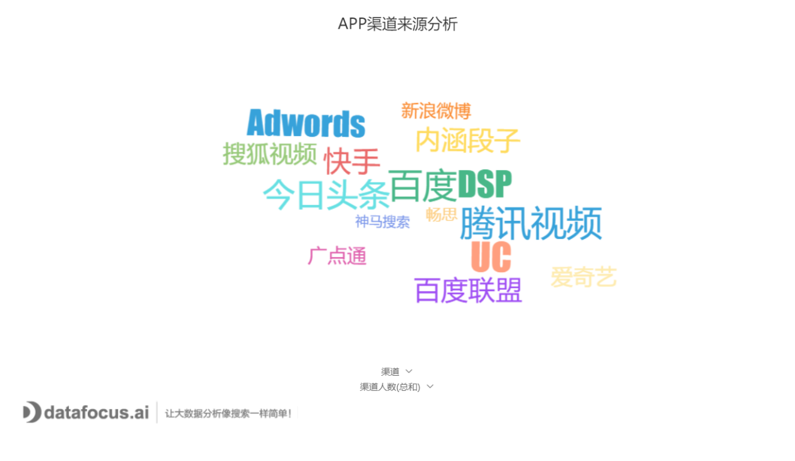
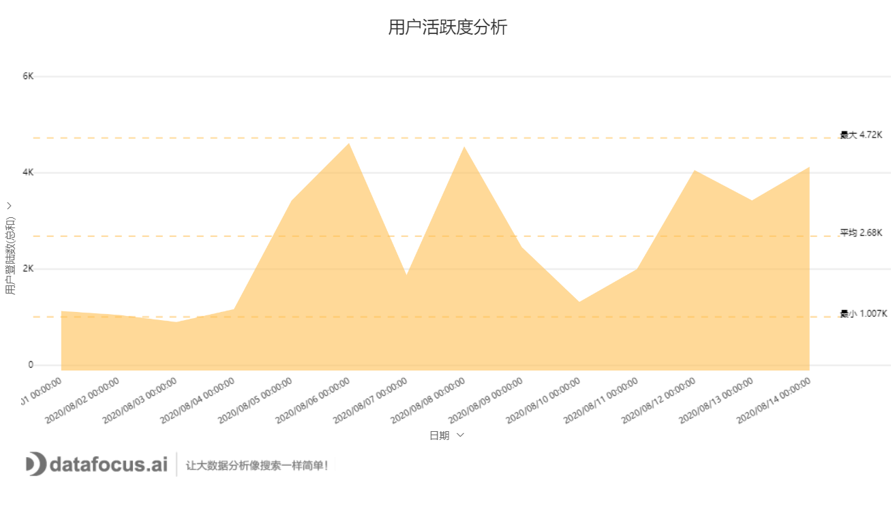
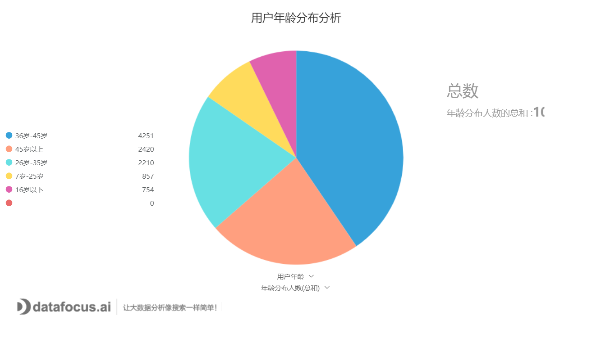
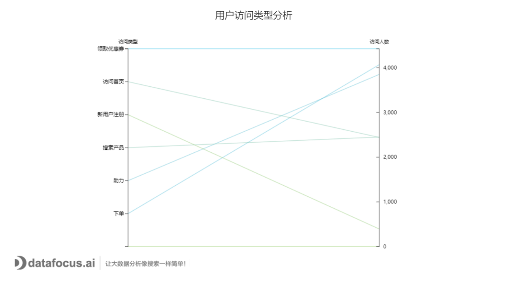

拼多多数据分析指的是对这个产品进行数据分析，还是说拼多多的商家，要进行数据分析。

以前者为例，可以进行以下分析：

①渠道分析

通过词云图展现何种广告投放渠道的效果比较好，通过比较对广告投放策略进行优化调整，进一步降低获客成本以及提高渠道ROI。

②用户活跃分析

 反应APP用户的活跃度，作为策略调整的参考。例如改变了营销策略，活跃度是否有大幅度提升来判断营销策略的实施效果，进一步优化。

③用户属性分析

常见的从用户的性别、年龄的分布进行分析，还可以具体分析用户的资产水平等，可以参看RFM模型分析，给用户进行分群，更精准地获得目标客户。

④访问类型分析

以上图为例，可以分析用户具体访问行为。比如采取的优惠券策略是否能真正提高APP的转化率，还是仅仅只停留在领取了优惠券但是并没有下单行为。

PS:数据为模拟数据，分析工具为DataFocus。
