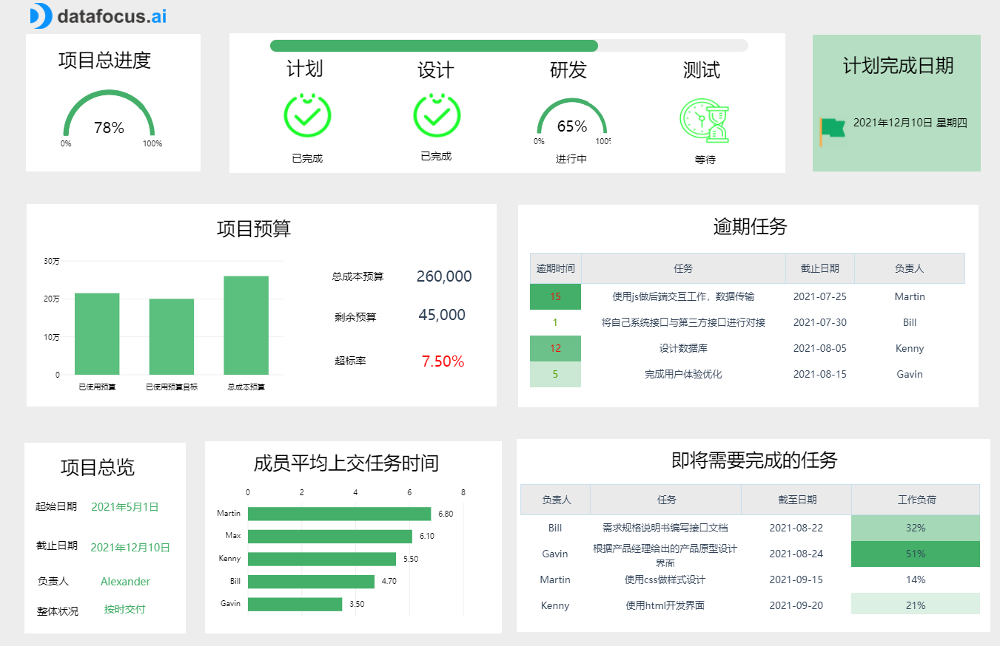
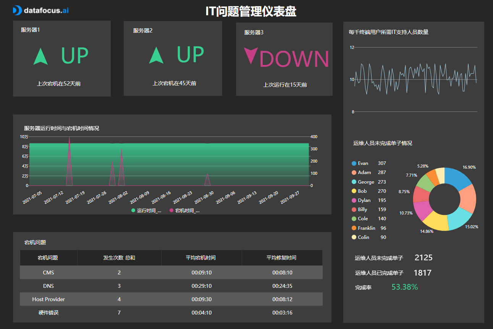

推荐3个IT部门必备的可视化大屏！（建议收藏）

IT技术团队的绩效考核长久以来都是一个让人头疼的问题。但从管理角度出发，技术团队又必须要有绩效管理机制。

通过绩效管理，你可以激发技术人员的潜能，给技术团队一个发力的方向，从而让团队达成一致的目标。

如何建立IT团队绩效机制？而工作绩效又该如何量化呢？

IT 仪表板便是跟踪IT部门KPI的有效工具。它可帮助 IT 专业人员掌握其 IT 项目并及时达到重要节点，有效地管理票证和问题，并详细跟踪所有相关的 IT 成本。 无论哪个行业，如果首席信息官 （CIO）、首席技术官 （CTO）、项目经理或是其它 IT 专业人员希望提供更多价值并产生更大的影响，他们必须与公司的战略重点保持一致。为此，IT仪表板是一个很好的工具。通过使用专业的[仪表板创建者](https://www.datafocus.ai)，团队不仅可以控制其数据、项目和视觉效果，还可以配备现代解决方案来简单直接地监视、分析和优化 IT KPI。借助功能强大的软件，IT分析将使团队能够及早发现问题并迅速做出反应。 接下来我们将详细介绍3个专注于不同信息技术领域的专业 IT 仪表板示例：

## IT 项目管理仪表板

第一个IT仪表板与项目管理相关，并跟踪执行项目所需的每个步骤和任务。顶部的横幅跟踪项目的演变和进度，从规划到交付。该团队目前正处于第三阶段，开发产品，该阶段的65%现已完成。所有的标识都是绿色的，因为它们按照最初的计划准时，在2021年12月10日交付他们的项目。

IT管理仪表板的第二部分分为四个KPI（关键绩效指标）。首先是预算，显示分配给项目的总预算、此阶段的当前目标值以及当前使用的金额。跟踪此 KPI 可以了解您是否能够在您拥有的资源内交付项目。我们在这里可以看到，它已经被超支了7.5%。是由于规划不周还是预估错误？是否发生了很多意外事件？通常，预算和时间是一种权衡，为了按时交付项目，超出预算可能并不少见。同样，如果预算计算非常紧张，交付往往会延迟。

IT 仪表板模板上的第二个 KPI 是逾期任务。跟踪您计划的每个任务对于按时交付项目至关重要。为他们每个人分配一个截止日期，以便整个计划可以有效地运行，其余的任务也可以开始。

在上面的示例中，我们看到了四个逾期的任务，其中最关键的是延迟了15天的后端交互工作。按照上面预算超支的例子，您应该调查这种逾期的原因，并解决员工面临的潜在问题：他们手中是否没有足够的资源？处理任务的时间是否被低估了？他们一次有太多的截止日期，这会自动延迟时间？

找到逾期任务背后的原因可能会发现更深层次的问题，这些问题可能会阻碍项目的良好运作和管理，也可能会阻碍团队的良好运作和管理。

同时每个员工肩上的工作量将不可避免地影响他们的工作，并最终影响他们在截止日期前的能力。在这里，Gavin 的工作负载最高，为 51%。了解清楚背后的问题是什么，也许将他的一项任务分配给其他人，以确保项目取得更好的进展，这将是有用的。

最后，该IT仪表板模板上的最后一个KPI也与上个KPI相关，因为它显示了每个员工即将需要完成任务的截止日期以及相对于特定任务的截止日期。该指标还将帮助项目经理深入了解其团队的工作量和能否按时交付的能力。

## IT 问题管理仪表板

第二个IT仪表板专注于更多技术出现问题的管理。作为贵公司的 IT 领导者，拥有 CIO 仪表板模板至关重要。在这种情况下，跟踪查看问题的系统指标可以让您的员工知道它们发生的频率和数量，这有助于保持强大的系统性能。

此 IT 仪表板示例查看三台服务器的性能并实时跟踪其活动。我们看到其中一个目前处于关闭状态。实际上，服务器停机时间并不总是由于意外问题造成的，因为它也可以计划地进行一些维护。规划维护、更新和重新启动的停机时间对于系统的正常运行至关重要。然而，计划外时，这可能会变得棘手并引发许多其他问题：这就是为什么在意外停机和要遵循的步骤的情况下就已经考虑好计划非常重要，以便快速有效地回答。正常运行时间超过99.9%是实现正常运行的基础设施的目标，而我们的IT仪表板模板显示正常运行时间超过此目标。

跟踪问题的数量和类型是另一个需要执行的重要行动。注意反复出现的问题可以揭示一个更大的问题，即源于系统的问题。因此，了解它们是什么以及它们发生的频率对于改善这些问题的总体管理是健康和有用的。了解停机时间有多长，也可以了解您的团队在解决问题方面的速度和效率。最后，它也可以成为您希望随着时间的推移减少的目标时间。

IT问题管理仪表板示例右侧的第二部分更侧重于团队成员及其解决提交给他们的问题的能力。顶部的图表显示了每千名终端用户的 IT 支持员工数量及其随时间推移的演变情况。

此外，我们还可以看到每个工人在他们收到的工单上的表现。调查如此低的分数背后的原因可以揭示应该解决的潜在问题：运维人员是否缺乏培训？是他正在努力解决某个特定问题？尝试找出每个人分数背后的原因可以帮助您提高他们未来的表现。

## IT 成本仪表板

最后一个 IT 仪表板示例侧重于近年的成本管理，并仔细研究了2021年12月，并将其分为四个不同的 KPI。首先，他们比较了两年来投资回报率（ROI）的演变情况。１２月份地投资回报率为145.11%：这意味着每投资一美元，您将获得2.45美元的回报，这是一个极高的投资回报率。

期望目标是随着时间的推移增加，即使ROI不能总是在上升：有时需要做大量的投资，但你不会在几个月前收获成果。与此同时，您的投资回报率将很低，但之后或许会改变。

此 IT 仪表板的第二个指标将一年中的 IT 支出与 IT 预算进行比较。与初始预算相比，监控您的成本可以让您大致了解您在控制费用和预算方面的表现。总会有一些意想不到的事件和需求导致更高的支出，但在制定预算时应考虑到这些特殊性。尽可能保持在一开始的限制内，您可以留出一些预算来应对未来的预算超额。

该IT仪表板模板上显示的第三个KPI，将这次的IT成本与产生的收入进行比较。它评估您的IT活动的结果及其成功与它们的成本相对。它讲述了一个关于您的绩效的故事，无论收入如何发展，理想情况下，该百分比都保持在目标范围内。

当然还有很重要的最后一个元素是IT成本明细，关键在于要知道你在哪里分配你的钱，以及它最终是如何使用的：通过显示不同的单位（硬件、人员、软件等）及其组件（基础设施、维护等），你可以更容易地识别主要的成本驱动因素和改进机会。

归根结底，每个经理和决策者都必须决定什么有助于他们的组织，什么将推动它向前发展。依靠通过可理解的实时IT仪表板实时显示的准确数据，将为您提供所需的一切，以便为您的业务做出最佳的数据驱动型决策。

我们已经展示了数据可视化在IT绩效、监控和分析中的强大功能。无论您是需要构建自己的IT仪表板，选择并组合自己的KPI和策略，还是只是拥有合适的展示和监控流程，都可以完全免费试用我们的软件DataFocus进行14天试用！
