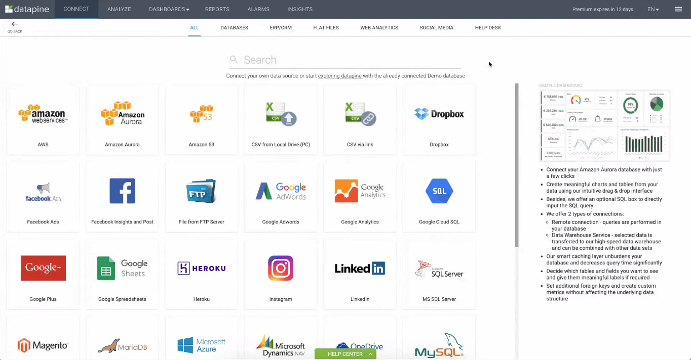
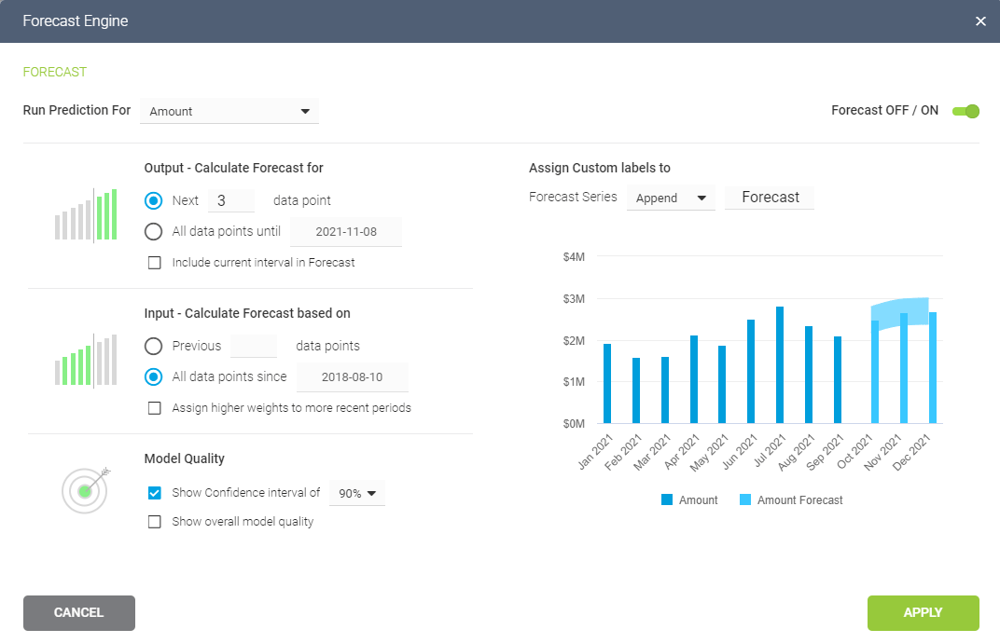

几年来，商业智能 (BI) 已帮助公司以一种有效的方式收集、分析、监控和展示他们的数据，以提取可操作的洞察力，从而确保可持续增长。随着该行业在过去十年中蓬勃发展，提供不同功能的新解决方案的数量呈指数级增长，使市场与以往一样具有竞争力。

事实上，预计到 2025 年，BI 市场将增长到333 亿美元，同时到 2023 年，33% 的大型企业将实施决策智能。不仅如此，还有 COVID-19 和远程工作现在作为一种永久性的商业实践，对促进团队合作更直观的平台的需求变得至关重要。

考虑到所有这些因素，不可能忽视企业将[BI 工具](https://www.datafocus.ai/infos/best-bi-tools-software-review-list)实施到其数据管理流程中所带来的好处。如果您想进入 BI 软件世界，但不知道在投资之前应该寻找哪些功能，这篇文章将介绍商业智能的主要功能和优势，以帮助您做出明智的决定。

让我们开始吧！

## 商业智能软件的好处

为了更好地了解 BI 软件的强大功能，让我们看看您的公司可以从使用这些解决方案中获得的一些主要好处。

- **改进决策：**基于数据而非人类直觉做出决策，可以定义为 BI 软件的核心优势。通过从您自己的数据中提取的强大洞察力优化每个部门和业务领域，您将确保您的业务长期取得成功。数据分析不再针对技术用户，商业智能软件是自助服务，使组织中的每个人都可以使用数据进行决策。
- **加强沟通：**在当今快节奏的世界中，人们可以在全球各地工作，找到有效的沟通方式是成功的关键。商业智能工具为您提供交互式[BI 仪表板](https://www.datafocus.ai/infos/bi-dashboard-best-practices)，作为强大的沟通工具来保持团队的参与和联系。通过强大的数据可视化，管理人员和团队成员可以更全面地了解他们的绩效，以优化他们的流程，确保健康的项目开发。
- **减少瓶颈：**如前所述，您可以从投资专业 BI 软件中获得的主要好处之一是获得对您的业务绩效的相关洞察，否则这些洞察将未被开发。借助这些解决方案提供的实时数据，您可以发现潜在问题并在它们成为更大的危机之前加以解决。无论您的数据集有多大，BI 工具都可以让您在几秒钟内提取新的见解，从而促进分析过程。
- **节省时间和资源：**虽然传统的数据管理实践鼓励使用电子表格和静态报告，但现代[BI 解决方案](https://www.datafocus.ai/infos/business-intelligence-bi-solutions)提供了一些特性来自动化分析过程，并使其更具交互性和效率。例如，您可以在几秒钟内将所有数据源添加到一个访问点，该工具将自动更新它们，无需手动工作，从而节省大量时间用于其他任务。此外，这些工具将为您的公司节省大量资金，修改没有数据支持的错误策略，优化您的服务以增加收入，并找到有利可图的机会。

## 商业智能工具的 17 个主要功能

既然我们已经简要讨论了在您的业务中使用 BI 软件的好处，现在是时候列出您在投资其中一个软件时应该考虑的主要功能了。在这里，我们将介绍 17 个 最重要的BI 功能，将它们数据分析过程的 4 个主要步骤划分：连接数据、分析数据、可视化数据和报告结果。让我们开始吧！

## 1) 连接

此商业智能软件主要功能列表的第一部分旨在介绍数据分析过程的初始阶段。无论企业规模大小，公司都会从多个来源收集数据。这些数据通常保存在不同的数据库、外部应用程序或不定数量的 Excel 工作表中，这使得几乎不可能合并不同的数据集并及时更新每个来源。BI 工具旨在通过提供以下功能使数据集成变得简单：

### a) 数据连接器

我们的第一个商业智能功能是数据分析过程中最早的一步，它指的是能够将所有内部和外部数据源连接到一个单一的访问点。必须手动处理来自不同渠道的所有数据是一项耗费大量时间的痛苦任务。借助现代[数据连接器](https://www.datafocus.ai/infos/data-connectors)，数据集成变得前所未有的简单。只需单击几下，即可连接数据库、平面文件、社交媒体数据、API、CRM 数据和其他几个来源。一旦数据源连接后，您就不需要担心手动更新它们，因为软件会自动向您显示可用的最新数据。下图仅显示了DataFocus提供的几种数据连接。

### b) 灵活的数据集成

在为您的企业投资 BI 软件时，拥有灵活的数据集成是您应该考虑的另一个重要功能。您选择的工具应该为您的数据提供不同的存储选项，例如远程连接或存储在数据仓库中。一方面，远程连接允许您将所有数据保存在服务器上并远程访问它，这意味着您在查询数据时，将依赖自己服务器的速度和容量；另一方面，将您的数据保存在工具的仓库中意味着您的分析数据将被软件克隆和存储，软件将自动更新数据以获得新的业务洞察力。软件内部数据仓库的好处是，他们创建了专门的解决方案，这些解决方案创建了更快、更有效的服务器来支持大量的信息。

### c) 加入数据源

与连接数据相关的最后一项商业智能功能是能够加入数据源。这意味着，您可以轻松地统一来自多个来源的数据，以运行跨数据库查询并提取高级业务洞察。拥有匹配和统一来自多个来源的数据的技术，对于获得必要的洞察力以使您的业获得成功至关重要。现代 BI 工具应该为您提供这种功能，只需单击几下即可定义各个来源之间的关系，例如通过设置外键。

## 2) 分析

一旦将所有数据集中到一个地方，就该开始理解它了。这是该过程的分析部分开始的地方。随着现代[自助式 BI](https://www.datafocus.ai/infos/self-service-bi-tools)工具的兴起，您不再需要成为数据科学家来了解您的业务信息。这组 BI 功能旨在使分析过程用户友好、省时且易于访问，同时仍执行高级分析以将您的数据提升到一个新的水平。

### a) 拖拽

传统上，报告和分析仅供 IT 专家执行，从而使流程对非技术用户进行隔离。自助式 BI 工具的基础是易用性和可访问性。这使得直观的拖放界面成为分析过程中最关键的 BI 功能之一。本质上，拖放功能使您或您组织中的任何人都可以查询和可视化数据，而无需编写 SQL 代码。只需从数据源中选择字段、将它们拖到 y 轴和 x 轴，以及为图表定义一些其他条件（例如维度或过滤器）。在几秒钟内，您就可以将最重要的绩效指标可视化，而不是等待 IT 部门数小时或数天来交付报告。

### b) 自定义字段和表达式

自定义字段是商业智能的重要组成部分，因为它们允许您清理数据对其执行高级分析。您选择投资的工具应该使您能够通过使用现有表达式以及创建数据库中不存在的自定义表达式来计算最复杂的业务指标。自定义字段的使用允许您在各种联合类型的帮助下将多个维度组合成一个合并字段，以及从不同的数据源创建单独的计算字段。因此，您将能够为任何数据分析场景创建公式，从而更好地控制数据管理。现代[在线数据分析工具](https://www.datafocus.ai/infos/data-analysis-tools)（例如 DataFocus）使您能够通过公式轻松生成自定义字段。

### c) 交叉查询

接下来是在不同数据源之间生成交叉查询的业务智能功能。我们已经在本文的连接器部分介绍了这个概念，交叉查询功能使您能够使用来自不同数据集的信息，通过直观的界面创建图表和图形。交叉查询功能的真正价值在于：您可以将所有可用数据集中到一个地方，使您能够在不遗漏任何重要信息的情况下做出完全明智的决策。唯一的要求是，您希望合并的所有数据源都需要位于工具的仓库中。

### d) 趋势分析

趋势分析是商业智能的另一个重要功能，顾名思义，它使您能够立即识别数据中的趋势，因此您将始终领先于您的策略。您可以将多种趋势线添加到图表中的数据点，以可视化各种趋势类型。其中包括：

- **指数：**这条趋势线是一条曲线，主要用于显示数据值何时以越来越高的速率上升或下降。
- **线性：**顾名思义，这条趋势线是一条用于简单线性数据集的直线。它通常表示数据的稳定增长或下降。
- **对数：**此趋势线是最佳拟合曲线，主要用于当一个单位数据之间的变化率迅速增加或减少，然后趋于稳定的情况。它可用于显示正值或负值。
- **多项式：**这是一种用于显示数据波动的线性回归形式。在分析较大数据集的收益和损失，调整趋势以适应波动时，它特别有用。

在其中一些趋势线类型中，DataFocus等商业智能软件提供了最适合的功能，可以分析您的数据场景并为您提供更适合您需求的趋势线类型。

### e) 人工智能警报

人工智能技术是任何BI 软件的必备功能。人工智能在商业智能行业的一个常见用途是通过智能[数据警报](https://www.datafocus.ai/infos/business-intelligence-data-alerts)，将省去用户手动检查数据是否发生变化的繁琐任务。通过使用神经网络、模式识别和机器学习算法，该软件可以了解数据中的不同趋势和模式，并在达到目标或发生任何异常时立即通知您。您需要做的就是设置预定义的参数，如果需要检查某些内容，就会激活一个警报。这些基于人工智能的算法不仅消除了手动检查数据的痛苦，使企业的生活变得更轻松，而且还帮助他们提前应对可能长期影响性能的潜在问题。

### f) 预测分析

预测分析是 BI 系统中越来越受欢迎的功能之一，因为它可以在帮助企业优化运营和潜在发展方面发挥重要作用。顾名思义，预测分析功能旨在生成有关未来绩效的预测。它通过使用数学模型分析当前和历史数据，并找到关系、趋势和模式来实现这一点，从而准确预测特定数据集的未来发展。

尽管这听起来像是一项高级 BI 功能，但越来越多的软件开发人员将其包含在他们的自助服务解决方案中，从而使任何级别的用户都可以轻松管理它们。您需要做的就是插入所需的点，软件将根据您的指令自动计算预测，无需高级数学计算或任何手动工作。使用预测性解决方案可以使企业通过准确了解未来，为潜在问题做好准备、规划生产并优化整体绩效。

## 3) 仪表板

众所周知，人脑处理视觉信息的速度比数字或文本快。出于这个原因，交互式仪表板形式的可视化分析对于企业提升绩效变得不可或缺。专业的仪表板将您所有最相关的 KPI 收集到一个直观的可视化中，这将帮助您监控和分析您的数据，并提取可行的见解，以确保持续改进。在这里，您将找到一些与仪表板管理相关的主要 BI 工具功能：

### a) 内置仪表板模板

遵循可访问性和可用性原则，BI 软件的另一个重要功能是仪表板模板。相反，您希望快速生成[销售报告](https://www.datafocus.ai/infos/sales-report-kpi-examples-for-daily-reports)或跟踪营销活动的表现，触手可及的交互式仪表板模板可以让您的生活更轻松。对于那些还不习惯从头开始生成自己的仪表板的用户或者愿意需要花费更多时间分析数据而不是构建仪表板的普通用户，模板特别有用。

DataFocus为不同的行业、平台和功能提供了多个专业的[业务仪表板](https://www.datafocus.ai/infos/dashboard-examples-and-templates)模板，以确保分析过程尽可能高效。以下面的销售仪表板为例。

### b) 跨设备可访问性

在我们对 BI 平台功能的概述中，接下来一点与以最有效的方式监控您的数据有关。跨设备可访问功能使您可以从任何您需要的设备上的任何位置访问您的仪表板。交互式[在线仪表板](https://www.datafocus.ai/infos/online-dashboard)包括实时数据，可让您随时了解业务中发生的任何事情，一旦您的来源连接，您不再需要担心手动更新它们，因为该工具会在新信息出现后立即为您提供新的见解可用。

您创建的仪表板和报告将随时可供您使用，无论您是在办公室外还是在更大的屏幕上展示它们以支持商务会议。只需一个简单的互联网连接，您就可以从台式机、平板电脑、笔记本电脑、智能手机或您需要的任何其他设备上访问您的数据。

### c) 交互式仪表板功能

用于[在线报告](https://www.datafocus.ai/infos/online-reporting)的 BI 仪表板的价值在于它的交互性，这使得整个分析过程更加高效和可访问。牢记这一原则，您选择投资的 BI 软件应提供多种交互功能，例如过滤选项，允许您从不同角度可视化数据。这将帮助您避免在同一个仪表板中多次显示相同的信息，从而使您的分析过程更加高效。一些最有用的[交互式仪表板](https://www.datafocus.ai/infos/interactive-dashboard-features)功能包括：

- **向下钻取：**此功能使您可以向图表添加更多变量。只需单击可视化，您就可以深入到轴的较低级别，以获得对数据的不同、更详细的见解。例如，如果您按国家/地区查看社交渠道的表现，您只需键向下取，整个图表将根据该渠道在国家/地区的特定表现进行过滤。
- **点击过滤：一个**结构良好的仪表板应该让您能够在一个屏幕上轻松浏览数据。单击过滤器选项通过将仪表板图表的维度用作临时过滤器来帮助您做到这一点。您需要做的就是单击所需的值或图表，整个仪表板将根据它进行筛选，并在几秒钟内显示新的信息。例如，如果您有一个地图图表，则可以单击特定国家或地区以获取有关它的更多详细信息。
- **时间间隔小部件：**此交互式仪表板功能允许您在仪表板中的不同图表上增强各个时间刻度。它基本上让您可以选择图表中显示的数据时间间隔，可以是日期或时间。这使您能够就不同的时间范围进行咨询以支持讨论，而无需过滤整个仪表板。

### d) 定制设计

为了让您完全控制仪表板，全局样式选项是商业智能工具的一项宝贵功能。全局样式选项允许您通过更改颜色、字体、背景、图表、文本、符号等来自定义仪表板，以便它们与您的品牌企业形象保持一致。此外，您可以使用与您的数据故事相关的预定义仪表板主题或生成您自己的主题。DataFocus工具为您提供了40多种图表类型供您选择，以便用最佳方式可视化您的数据，您还可以浏览我们的图标库并选择最适合您的数据故事的图标。

## 4) 报告

我们关于 BI 软件功能列表的最后一部分集中在数据分析过程的报告部分。高效报告的目标是通过提供高效的解决方案来生成交互式报告，从而使企业工作更轻松。传统的报告方式非常耗时，因为它们需要大量的手工工作。出于这个原因，在为您的公司投资 BI 软件时，您需要确保您选择的工具能够让您摆脱过去手动报告的痛苦，让您有足够的时间来分析和提取可操作的见解以提高您的业务绩效. 用于报告的一些主要 BI 功能包括：

### a) 共享选项

共享您的报告是商业智能最重要的功能之一。现代报告解决方案的主要目的是通过让每个人即使没有技术技能也能使用数据来增强团队之间的沟通。标准共享选项包括手动导出和电子邮件报告，但是，自助式 BI 工具的云性质通过提供其他非常有用的选项（例如发送给具有特定过滤器的自定义收件人或组的自动报告）使共享体验更进一步。例如，特定地区的销售数据。

商业智能工具提供的其他方便的共享选项包括通过受密码保护的实时 URL 共享您的仪表板，以提高安全性。对于跨学科项目来说，这是一个特别有用的功能，在这些项目中，团队需要在世界各地共同工作，因为他们可以轻松访问数据，从而显著增强协作。最后，如果您需要打印每周或[每月报告](https://www.datafocus.ai/infos/monthly-reports-templates)以在会议中实际共享它们，它们可以轻松适应任何导出格式，例如 PDF、PNG、Excel 等，而不会破坏任何图表或图形。

### b) 嵌入能力

嵌入分析是 2021 年的[BI 趋势](https://www.datafocus.ai/infos/business-intelligence-trends)之一，并将在 2022 年继续增长。简单地说，嵌入分析是一种商业智能功能，使您能够将分析软件及其所有属性集成到您自己的系统中。DataFocus等工具使您能够将交互式仪表板嵌入到您自己的应用程序中，这样您就可以获得[BI 报告工具](https://www.datafocus.ai/infos/bi-reporting)的所有好处，而无需花费和手动创建自己的仪表板。像这样，您可以完全控制从监控到可视化和提取可操作见解的分析过程。

在您的业务中实施[嵌入分析](https://www.datafocus.ai/infos/embedded-dashboards)可以帮助您为您的员工、投资者、合作伙伴、客户或任何其他利益相关者提供出色的报告体验，并更好地洞察相关数据。

### c) 客户报告

能够自动生成外部客户报告是您应该考虑的商业智能的另一个重要功能。如前所述，传统的报告方式可能需要几个小时甚至几天的时间，几乎没有时间执行分析或其他任务，例如规划和实施策略。现代 BI 报告工具为您提供自动化功能以生成专业的[客户仪表板](https://www.datafocus.ai/infos/client-dashboard-report-examples)。您只需安排在特定时间范围内生成报告并发送给选定的收件人。此外，仪表板带有标签，这意味着它们可以根据客户的颜色、徽标和字体进行定制，以获得更加专业的外观。这将使您能够提供优质服务，同时优化内部流程以实现高效的工作流程。

### d) 查看权限

最后，数据的安全性和完整性是商业智能的关键特征之一。您的报告包含大量有关贵公司的敏感数据，这些数据需要加以保护，因为泄漏可能会带来不良后果。DataFocus等工具为您提供不同的查看权限，因此您可以确定特定用户将以何种方式查看和交互您的信息。通过这种方式，您可以完全控制数据的管理方式，并增加分析过程中的保护。在某些情况下，您需要与内部和外部利益相关者共享您的报告，这里有 4 个级别的查看权限，可以使共享仪表板更安全、更高效：

- **系统管理员：**系统管理员是最强大的角色，它允许您不受任何限制地管理您的报表，能够添加其他用户，分配角色到用户活岗位，并且可以访问所有 BI 软件功能。
- **部门管理员：**管理自身所在直接部门的组织架构,可以分配自己拥有的角色给管理的组织架构(分配，去分配)。
- **资源管理员：**与管理员角色类似，资源管理员可以管理所有资源，赋予数据权限。
- **开发者**：新增资源,管理拥有权限的资源。
- **日志管理者：**审计日志。

## 商业智能功能的关键要点

在这篇关于商业智能最重要特征的文章结尾，我们希望您已经更好地了解这些类型的解决方案可以为您的业务分析带来什么好处。我们为您提供了有关该市场在接下来几年将如何保持增长的一些重要数据，为您提供了一些一般好处，并且完整列出了在为您的企业投资 BI 工具时应该寻找的 17 个最具竞争力的功能。

最重要的是，要了解处理数据不再是一项孤立的任务。考虑到74% 的员工表示在处理数据时感到不知所措，因此能够提供可访问的解决方案，使每个人都能够以直观和可访问的方式处理数据，这是一个无可争辩的好处。从长远来看，您的整个业务将成为数据驱动的，使您从竞争对手中脱颖而出。

总而言之，以下是您应该了解的商业智能的 17 大功能：

1. 数据连接器
2. 灵活的数据集成
3. 加入数据源
4. 拖拽
5. 自定义字段和表达式
6. 交叉查询
7. 趋势分析
8. 人工智能警报
9. 预测分析
10. 内置仪表板模板
11. 跨设备可访问性
12. 交互式仪表板功能
13. 定制设计
14. 共享选项
15. 嵌入能力
16. 客户报告
17. 查看权限

现在是时候将您获得的所有知识付诸实践，[免费试用我们的专业商业智能软件30天](https://www.datafocus.ai/console/)！
