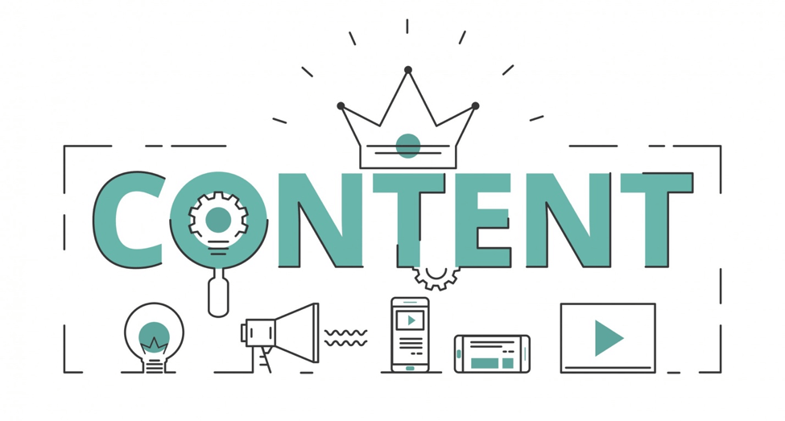

内容营销是公司在营销中使用的技术，用于创建和分发吸引客户参与其业务的内容。它包括创建和共享在线材料，如文章、视频、教程、播客等，为读者提供有价值的信息，同时不直接宣传他们的产品和服务。下面为大家提供一些制定有效的内容营销策略的建议。

## 你应该知道的内容营销技巧

1. **信息图表的使用**

这些是为传递某些信息而准备的信息和数据集的可视化表示。企业可以将有关其产品和服务的信息以及其他有价值的信息放入统计图形中，这将有助于有意了解企业的个人通过查看数据来获取信息。信息图表的工作原理是总结业务的主要功能，客户应该使用他们的认知来解释所呈现的信息，以确保没有冗余，数据应该流畅且易于理解。

企业应确保在使用图片作为营销来源的网站上推广此信息，您可以使用博主和媒体分享新闻。

1. **网页**

网页的使用一直是企业营销其内容的有效方式之一，改善网站流量的想法围绕着搜索引擎优化的使用。众所周知，搜索引擎优化的工作方式是，如果浏览互联网的人搜索与您的企业提供的产品或服务相关的产品或服务，那么您的企业网站就会作为结果之一出现。所使用的技术是识别在搜索引擎中作为算法排序的特定关键字，充分利用搜索引擎优化，以确保您网站的流量效率。

1. **播客**

播客是一种在网站上录制并上传的数字音频形式，人们可以下载和收听。作为一家企业，您可以在该平台通过提交有关您的产品和服务的信息来营销您的内容，或者在有新功能的情况下，您可以将它们上传到包含音频产品的网站。在繁忙的世界中，客户可能没有时间进去做演示。他们可能需要您的产品或服务，但是当在播客上进行展示时，他们可以在方便时收听，如果需要更多信息，他们可以联系公司。

1. **视频**

视频在内容营销中也占有重要地位。视频恰好是营销业务的最便宜的方式之一，因为您不必购买摄像机来录制材料，您可以通过手机进行操作，特别是现在手机正在开发高精度摄像机。这种形式的内容营销创造了价值，因为它捕获了您希望观众了解的关于业务的大部分（如果不是全部）细节。例如，如果您的业务是汽车，您可以拍摄驾驶测试视频或拆开发动机，向潜在客户展示他们将获得什么价值，这样您将吸引更多客户。

1. **图书**

主要将这些视为手册，一些潜在客户不属于上述四类，但他们很欣赏这是一种涵盖该细分市场的方式，因为所有客户都是有价值的。

这些内容营销示例的秘诀是增加价值。很有可能您的竞争对手也采用了相同的促销方法，使您的企业在竞争中脱颖而出的原因就是使您的产品与众不同的原因。客户需要在下次选择您的公司时获得价值。

## 如何实施内容营销策略

仅仅制定我上面提到的策略并期望利润开始慢慢流入是不够的，业务需要的是一种实施策略，以确保无论应用何种技术，都可以对其进行衡量，以衡量其效率。

1. **设定一个目标**

如果没有明确的目的地，那么一艘船可以去任何地方，但旅程仍然可以称为成功。营销策略需要与目标或特定结果联系起来，这样，在使用各种技术一段时间后，您可以查看状态并改进有效的部分、管理无效的部分。目标非常重要，因为它们与投资回报息息相关，如果策略不是积极的，那么投资回报率就会很低。

目标被用作确定在特定环境中应做出哪些决定的标准。

1. **研究和了解受众**

在选择营销策略时，人口统计数据很重要。企业应确保他们对客户进行研究，确定他们的需求和偏好，然后定制您的服务以满足需求。在内容营销中，心理图表也很重要，您需要了解他们的价值体系和信念，以便您决定实施的策略必须与它们相关联。确保您在研究中获胜的主要方法是吸引潜在客户，让他们有机会提供反馈，您会对他们提供的有关建议的内容感到惊讶。显示客户的评论和 USP，以展示您的服务如何对其他人有益，例如Youi 网站上展示的内容。

1. **拥有内容营销团队**

对于企业来说，拥有一个专门处理内容管理的小组也很重要。他们的工作是跟进并审核哪些技术有效，哪些无效。由于内容营销领域高度不稳定，并且作为一家企业，如果您希望推动销售，您就不能依赖旧方法，因此团队还可以负责提出关于新参数的创新想法以供利用。

1. **报告和改进**

在建立足够的内容覆盖范围后，广泛分享结果，大多数潜在客户都希望得到其他用户欣赏您的产品的社会证明。报告可用于确定可根据投资回报来衡量的影响。由于业务是一个永无止境的循环，因此重新审视目标并重新开始工作。就像任何活动一样，你需要事先设置衡量你所付出努力的指标，以确保您与您的策略保持一致，并看看这是否值得。选择一些适合您需求的[营销 KPI](https://www.datafocus.ai/infos/kpi-examples-and-templates-marketing)，并通过仪表板将其可视化，这将有助于理解。有很多[在线数据可视化工具](https://www.datafocus.ai/infos/data-visualization-tools)可以帮助你解决这个问题。结果可能如下，您的所有在线数据都在一个概览中进行监控，从而为您提供全局信息：

_\*\*点击放大\*\*_

为了更进一步，我们邀请您查看我们关于如何创建[数据驱动的内容营销策略](https://www.datafocus.ai/infos/data-driven-content-marketing-strategy)的文章，以更深入地了解如何充分利用您的数据！
