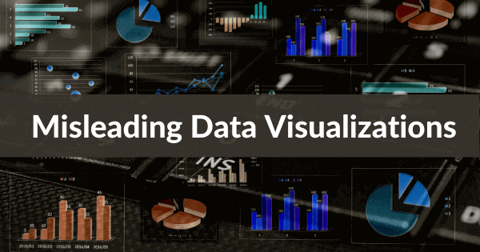
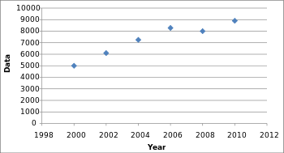

没有人喜欢以任何方式、形状或形式被操纵的感觉。但尽管情况如此，但人们可能每天都被数据可视化所欺骗。

从政治问题到体育统计数据，再到您最近收到的关于公司博客投资回报率的报告，互联网以及信息报告中充斥着误导性数据可视化的示例。

糟糕的数据可视化有多种形式，其中一些形式比其他的更明显。但是，通过知道要寻找什么，您可以避免与会引导您的组织走上错误道路的指标联系起来。

防止错误信息的最佳方法是使用适合技术的[在线分析数据可视化工具](https://www.datafocus.ai/infos/data-visualization-tools)和评估技能武装自己，这些工具将暴露过度简化或恶意的数据可视化。

在这里，我们将展示最常见的视觉数据错误表示的组合，以及在展示数据时如何避免失败的实用技巧。

学习如何发现用于操作数据的常见技巧，以及如何避免您自己的视觉效果的陷阱。

让我们开始吧。

## 误导性数据可视化示例

在开始我们的旅程前，我们要看看数字世界中最具误导性的数据可视化现实示例。

每一个不道德的数据可视化示例都有可能破坏您的战略努力，并让您陷入信息死胡同。注意这些排列不当的视觉效果，您将确切地知道在分析您的企业最宝贵的数据时要寻找什么。

### 1.截断Y轴

截断的 y 轴因其在政治中的滥用而臭名昭著，是一种经典的视觉误导方式。看看上面的图表，比较有工作的人和领福利的人。乍一看，图表的视觉动态表明，领取福利的人数是有工作的人数的四倍。然而，数字不会说谎，当分析时，它们指出的事实远没有数据可视化所暗示的那么耸人听闻。

当图表的制作者忽略约定并操纵 y 轴时，就会出现这种类型的错误信息。传统的排列 y 轴的方法是从 0 开始，然后上升到集合中的最高数据点。如果不将 y 轴的原点设置为零，微小的差异就会变得夸张，从而更多地利用人们的偏见而不是他们的理性。请注意下面这个由Gizmodo共享的图，当截断 y 轴时，差异看起来大了多少。

专注于使用具有零基线 y 轴的数据创建数据可视化，并注意截断轴。有时，这些扭曲是故意误导读者的，但有时，它们只是不知道无意使用非零基线会如何扭曲数据的结果。

### 2\. 省略数据

既然可以省略，为什么还要撒谎？通过省略某些数据点，可以轻松创造出实际并不存在的趋势，而一些现有的亮点可能会被忽视。这是因为通过省略一些数据，我们错过了上下文。忽略变量会影响您对数据的解读以及你从中得出的结论。因此，每当您研究一个变量及其关系时，请仔细考虑该变量存在的环境，并有意寻找可能影响您正在研究的变量的其他变量。

举个例子，当你省略一些数据时会发生什么，可能是因为你故意想要创建一个误导性的数据可视化，或者你只是想让你的工作更容易，看看下面的散点图。通过省略一些数据点，这个通常会充满下降和上涨的图表看起来更加平滑和稳定。这些图表最初由Cogent Legal发布。

VS

通过每两年而不是每年绘制一次图表，该图表似乎有一个稳定的增长，而实际数据则更加不稳定。公司可以利用这一点，忽略销售额发生重大变化的年份，模拟收入，使其看起来稳定且可预测，从而掩盖市场的真实波动。在评估数据可视化时，请确保所有数据都可以访问。

### 3.关联因果关系

任何高中数学课都应该讲过相关性并不意味着因果关系。但是看看最流行的互联网文章的标题（“X 会导致 Y 吗？”）和政治声明很容易被遗忘。本质上，相性和因果关系的假设是，因为两个变量同时发生变化，一个导致另一个。正如我们在下面的示例中所见，这表明了冰淇淋销量增长与谋杀之间的关系。通过大数据分析，我们开始看到越来越多的相关的因果关系。数据科学家正在寻找数据中的统计模式，有时他们更关心相关性而不是因果关系，因为找出相关性更容易。

也就是说，相关性并不总是意味着因果关系，主要有两个原因。第一个是科学家所说的“混淆变量”或第三个变量。意思是“不可见”或不确定的变量，它可以影响其他两个变量，并使它们看起来具有因果关系。这样做的问题是，第三个变量可能永远不会被发现，因此无法确认因果关系。

另一种难以证明相关性和因果关系的场景是方向性。这意味着两个变量可能是由彼此引起的，但无法证明是哪一个导致了另一个。无论有意与否，相关性和因果关系问题主要发生在媒体、广告和政治领域，但在分析人员已经意识到这些威胁的科学论文中不太可能发生这种情况。

这是我们最喜欢的相关因果关系数据可视化，但要了解更多信息，请查看 Buzzfeed 的：10 个最奇怪的相关性。

### 4\. 择优选择

“择优选择”是一种数据为导向的欺骗形式，即在调查、研究、图表或图形中省略某些集合、来源或信息。精心挑选视觉效果的主要原因是旨在提供干净、可预测的结果，以适应整洁的趋势、模式或框。“择优选择”的问题在于，它没有描绘出诚实、客观的画面，提供的结果不准确，或遗漏了重要的知识部分。

这种视觉效果特别具有欺骗性，因为线条被夸大了。除此之外，虽然结果似乎是以百分比表示的，但并非每个结果的总和都为 100。因此，这种视觉效果是不成比例的，并且不能准确表示手头的数据。

一小部分信息可以完全改变认知，并最终改变从 KPI 或指标得出的结果，这意味着精心挑选的视觉效果不仅没什么价值，而且会做出损害您业务的决定。

**请记住：**您从数字图表和图形中分析的数据应该是完全客观的。如果您的信息来自精心挑选的来源，您将永远无法推动组织向前发展。

### 5\. 双轴数据

虽然双轴图表通常被证明在比较两个在压力下不共享统一比例的相关信息集时非常有效，但当特定标记设置不正确或完全缺失时，它们可能会成为误导性的视觉效果。

上面的示例来自2015年国会关于计划生育的听证会，我们可以看到明确的结果表明堕胎率上升，而与癌症相关的医疗服务下降。这种视觉效果具有欺骗性，因为它在其轴内不包含任何值，只是显示了没有任何真实背景的松散趋势或模式。因此，数据的真实含义是有偏差的，使其不平衡并可能有潜在的危害。当您使用没有清除标记值的二元数据时，它们本质上没有意义，并且可以被操纵以显示不代表事实的结果 - 不惜一切代价避免这个错误。

### 6.误导饼图

当谈到糟糕的数据可视化示例时，误导性饼图无疑是最常见的一种。饼图本质上是成比例的，因此显示的值通常为 100%（或整个饼图部分）。但是，当您面对多种选择或变量，而被调查者可以选择多个答案时，结果可能会令人感到困惑或具有欺骗性。

上面的例子准确地显示了 合计为100% 的结果。但是，在案例中，如果 100 名受访者能够根据特定问题选择多个地理区域（例如，“为了经济利益，你会搬迁到哪里？”），饼图会立即变为不准确，因为许多受访者可能同时选择了北美和大洋洲。在这种情况下，您不会看到事物的真实面貌——为了避免这种程度的不准确，使用维恩图将是更好的选择。

### 7\. 使用错误的图表类型

一个困扰各行业商业智能 (BI) 的误导性数据可视化问题是做出错误的图表选择。

正如从上面的示例中看到的那样，从这些使用DataFocus[在线数据分析工具](https://www.datafocus.ai/infos/data-analysis-tools)生成的图表中，饼图是一个糟糕的选择，因为视觉效果不能以最佳或最准确的格式表示数字。通常，饼图应该等于一个整体（百分比为100）——但在这种情况下并非如此。如您所见，整洁、平衡的条形图是最佳选择，因为它以最真实、最容易理解的形式呈现信息。

选择错误的图表类型通常可以归结为人为错误或缺乏分析经验，而不是人们为了个人利益而操纵数据。虽然您的指标和见解可能 100% 可靠且准确的，但做出糟糕的视觉选择可能会稀释您的结果，或提供可能导致您得出错误结论的结果。

糟糕的图表或图表选择可能对组织结果产生负面影响的另一种方式是，在这些情况下，结果有时根本没有意义。结果，时间被浪费，资源被消耗，您的数据变得多余。在您做出选择之前，请确保您进行了充分的研究，并确保您的图表能够以最理想的方式代表您的信息。

这些是视觉误导的一些常见方式，与此同时，数据的滥用也是媒体、政治和其他行业的常见做法。如果您想更深入地了解这个话题，请查看我们的[误导性统计](https://www.datafocus.ai/infos/misleading-statistics-and-data)博客文章。

## 如何避免误导性数据的陷阱

如果您希望您的数据说出全部真相，并且只说真相，请实施这些做法以避免产生误导性的数据可视化。

### 1.遵守约定

通过使用可视化模型的标准模型，您可以避免误导您的读者。如果你的高中数学老师会因为你的数据表示方法而给你的考试打低分，那你就得三思了。

将你的 y 轴从 0 开始，以避免使小的差异看起来很大。这种做法的例外情况是，如果这些微小的差异实际上意味着一些重要的事情。例如，在全球气候变化数据中，全球平均气温每年上升 1 度往往会产生可怕的后果。因此，温度的小幅上升很重要，需要强调。但是，当查看小变化与大影响无关的事物时，请将 y 轴从 0 开始。

遵循惯例也适用于饼图。人们习惯于将饼图视为 100% 的数据；不要只给他们一小部分数据来误导人们。

### 2\. 让您的数据可视化清晰易懂

这一点应该是显而易见的，但在一个充斥着华而不实、错综复杂的图表的世界里，它经常被忽视。下面是绘制出相同数据的两个图表。正如您所看到的，第二张图更容易识别趋势，也更美观。不要让草率的视觉效果否定您来之不易的数据的可信度。

**_数据可视化不清晰_**

**_改进的数据可视化_**

可视化大师 Edward Tufte 解释说，“统计图形的卓越之处，在于以清晰、精确和高效的方式传达复杂的想法”。每次坐下来创建数据可视化时，都要把它变成你的口头禅。

### 3\. 放弃 PowerPoint

PowerPoint 已经过时了。现在仪表板出现了。新的[仪表板软件](https://www.datafocus.ai/infos/dashboard-software)提供实时数据，只需单击几下即可将数字转换为视觉效果。另一方面，在 PowerPoint 中执行 SQL 查询，并在将结果导入幻灯片之前导出结果以创建图表可能需要很长时间。有了额外的花里胡哨——五颜六色的标题、文字、图像——这个过程可能需要更多的时间。通过易于使用的 SQL 查询、拖放和度量，数据可视化工具可以在几分钟内生成结果。创建数据可视化所花费的时间越少，您需要了解数据的时间就越多。

### 4.做出更明智的颜色选择

在检查具有误导性的可视化示例时，人们通常会忽略更复杂的设计细节。但是，当涉及到以准确、可靠和易于理解的格式表示基于视觉的指标时，做出明智的颜色选择至关重要。

为确保您使用的颜色不会影响核心信息并在逻辑上符合您的发现，以下是一些需要考虑的最佳实践：

- 避免使用太多颜色，因为这会混淆观众，使您的信息难以吸收
- 不要使用太相似或对比度太低的颜色，因为这可能会使您的结果看起来具有误导性或不太明确
- 尽量不要使用可能会使色盲人士感到混淆的色彩或色调

### 5\. 选择正确的图表类型

早些时候，当我们检查误导性数据可视化的示例时，我们谈到了选择错误图表类型的负面影响。为了避免这种信息灾难，您应该确定您的见解是定量的还是定性的——这样做将帮助您做出明智的视觉决策。

如果您使用定性信息，您应该（描述或分类），您可以选择饼图、维恩图或环图，如果您的发现是定量的（直接可测量的见解），那么折线图、趋势图或直方图通常更适合。真正深入了解您的指标以及它们在现实环境中的含义，您就能找到正确的图表类型。[BI 仪表板软件](https://www.datafocus.ai/infos/bi-dashboard-tools)（如 DataFocus）提供多种图表选项和模板，可帮助您在视觉效果方面做出正确决策。

### 6.不要提供太多数据

误导图表、图形或 KPI 的另一个重要因素是将太多信息塞进一个狭小的空间。当您以视觉方式展示您的见解时，核心思想是创建一个叙述并讲述一个故事。当您添加太多来源或变量时，您会使结果看起来很混乱，从而稀释了过程中的信息。

在您开始收集和展示您的见解之前，重要的是要考虑如何用[数据讲故事](https://www.datafocus.ai/infos/data-storytelling-examples-with-data-visualization)，并仅选择与您的目标直接相关的变量。如果你发现自己有太多变数或太多信息，那就要无情了。回到绘图板并修剪信息，直到您拥有清晰、简洁的数据，并且您知道将产生高质量、准确和有影响力的可视化。

### 7\. 为自己思考，质疑权威

凭借您嗅出错误数据和误导性信息的新技能，请务必在展示之前以怀疑的眼光检查每个数据可视化。

更重要的是，不要让您的数据被这些廉价的技巧所感染。在您的公司中创建一个有益的[仪表板文化](https://www.datafocus.ai/infos/create-dashboard-culture)，以确保每条数据和每个可视化在公开之前都经过仔细审查。

## 不良数据可视化的影响

既然我们已经探索了基于视觉的误导性指标的常见实例，并考虑了如何避免犯这些常见错误，我们将研究使用不道德信息或做出错误选择的影响。

**支离破碎的故事**

信息化叙事是成功的 BI 策略的最大组成部分之一。人们在处理视觉信息时犯的最大错误之一是处理图像，或者图像只绘制整个图像的一部分。

当这种情况发生时，关键的见解和发现就会被遗漏。除了数据变得不那么有说服力之外，它还将叙述分解成不合逻辑的部分，这反过来又会使您的 BI 工作变得多余。发生这种情况时，您将遭受投资回报率 (ROI) 持续低迷的困扰，同时在整个组织中造成效率低下。

**决策失误**

无论您是在谈论错误的比例、糟糕的图表选择还是糟糕的设计，使用误导性指标通常会导致糟糕的决策。

当您的洞察力不真实时，您将做出不明智的决定，这些决定本质上会：

- 耗尽您的时间和预算
- 导致无效的销售和营销活动
- 给您的内部流程带来压力
- 降低员工敬业度和忠诚度
- 阻碍您的组织发展

**运营和财务效率低下**

使用不准确或具有误导性的见解也会导致运营和财务效率低下。

如果没有具体的视觉洞察力来准确地告诉您哪些有效，哪些无效，您就不可能触及到削弱预算或降低生产力的问题的核心。因此，您的运营和财务流程会变得很糟糕，您将无法实现组织的关键目标或里程碑。

## 关于误导性视觉的关键要点

我们探索了最具误导性的数据可视化示例，并就如何在数字时代实现一致的信息启发提供了实用建议。现在交给你了。

为了确保您获得最佳的业务可视化指标，并在残酷的商业世界中享受持续的组织发展，请开始您的30[天免费DataFocus试用](https://www.datafocus.ai/console/)。我们将帮助您提升公司的分析策略，使其免于误导性可视化的风险。
