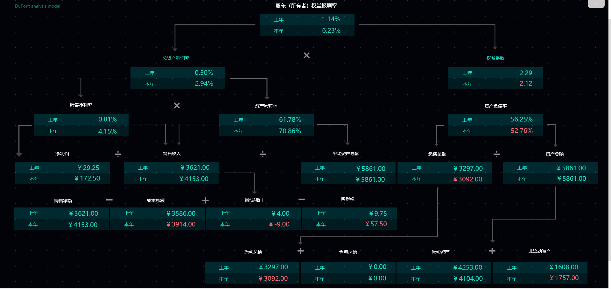

现如今，数据可视化发展迅速，市场上有五花八门的可视化工具，有支持英文的，有支持中文的，有支持其他语言的，也有支持中英双语的，但是有些支持双语的需要下载另外的汉化包等，也比较麻烦。今天我给大家分享的一款支持中英双语的可视化工具，是不需要额外复杂的操作，直接在系统中就可进行中英文切换，而且随时可以切换，够简单吧！

这款可视化工具虽然是个英文名，叫DataFocus，但确确实实是国内的软件，它能很好地支持中文以及英文，且在系统内可随时地自由切换。如下图，可直接在系统页面右上角点击“中文”或者“English”，就可进行语言切换。

中文界面

 英文界面

DataFocus中，中文环境和英文环境在使用上有什么区别吗？

因为DataFocus是创新的搜索式分析展示，故在DataFocus的搜索框内会输入一系列的关键语句，在中文环境和英文环境中，这些语句是不一样的，中文环境下只支持中文关键语句，英文环境下只支持英文关键语句，因此同一个关键句式，会有中文版和英文版（具体有哪些中英文句式，如果有兴趣可以去他们官网的用户手册上查看），例如下图中，同样是搜索销售金额最高的前8个产品，但是在中文环境和英文环境下，需要分别输入：排名前8的销售金额的总和 产品名称，top 8 sum 销售金额 产品名称。

中文搜索

英文搜索

在DataFocus中，不管是中文环境还是英文环境，其操作都十分简单，只需要搜索不同的语句，即可实时得到结果。
