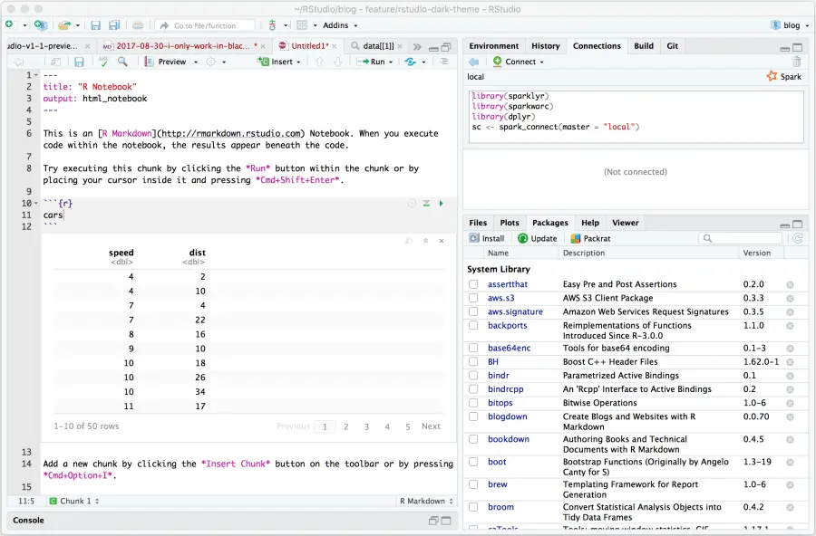
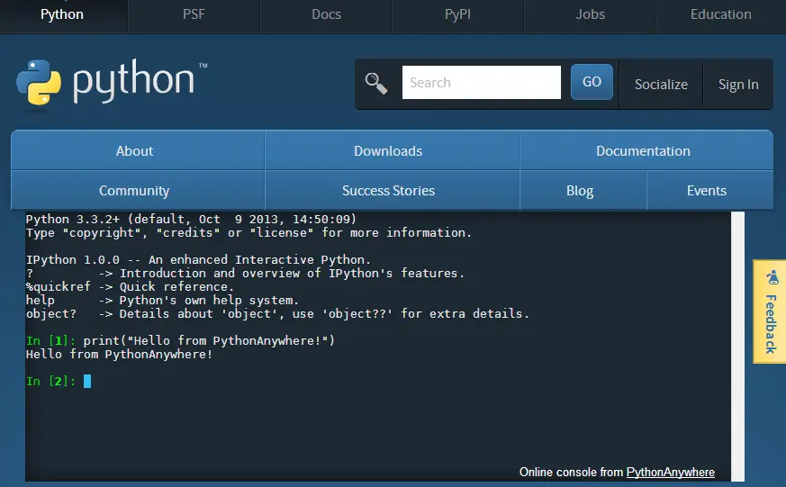
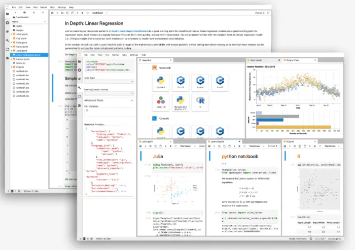
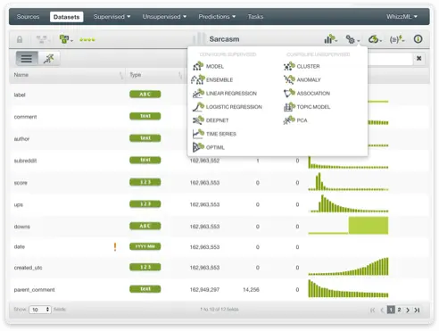
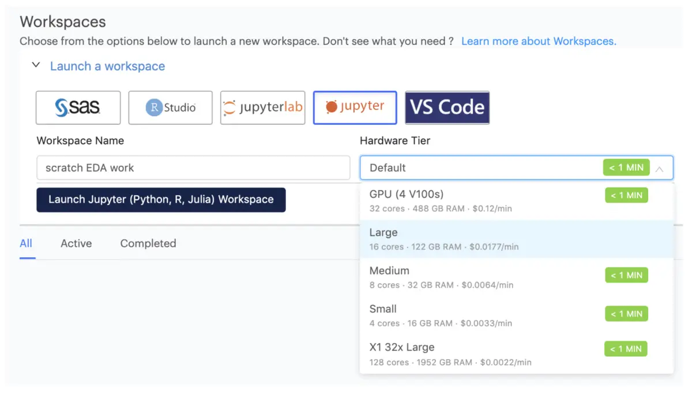
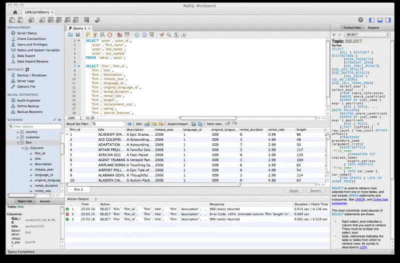
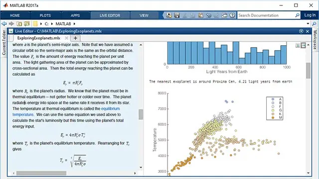
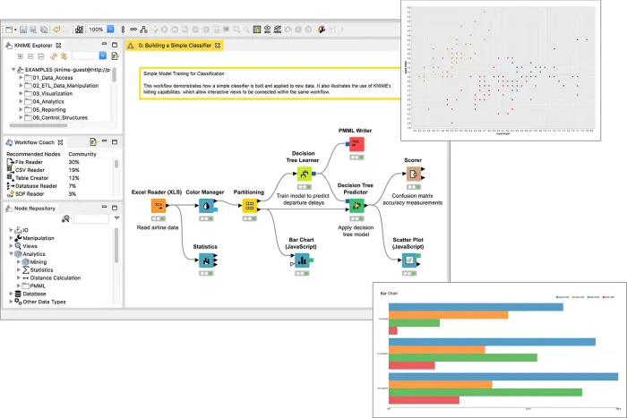

对于有兴趣从大量数据中提取、操作和生成见解的人来说，数据科学已成为一种非常有益的职业选择。为了充分利用数据科学的力量，科学家通常需要获得数据库、统计编程工具和[在线数据可视化](https://www.datafocus.ai/infos/data-visualization-tools)方面的技能。公司需要数据科学家来帮助他们增强分析流程，构建基于数字的战略以提高他们的底线，并确保将大量数据转化为可操作的见解 - 进入数据科学工具的世界。

但是，做一个对数据好奇的福尔摩斯并不是一件容易的事。市场上有许多工具，知道选择哪一种来提高性能可能很耗时，而且经常令人困惑。不要忘记从学术界到IT公司的各个数据科学家领域。

但我们不会关注他们对行业的选择，相反，我们将仔细研究这些工具的基本定义，并考虑市场上最流行的数据科学工具和软件，以最大限度地提高科学家在组织和/或公司中的作用。最后，我们将阐述数据科学可视化工具，这些工具通过使用现代仪表板[创建器](https://www.datafocus.ai/infos/dashboard-creator)创建功能强大的交互式仪表板。

 

让我们开始吧。

## 什么是数据科学工具？

数据科学工具用于通过提取、处理和分析结构化或非结构化数据来深入了解复杂数据，以有效地生成有用的信息，同时结合计算机科学、统计学、预测分析和深度学习。

过去，数据科学家不得不依靠功能强大的计算机来管理大量数据。由于现代[在线数据分析](https://www.datafocus.ai/infos/data-analysis-tools)流程，如今的成本降低了，因为所有数据存储在云中，最终加快了做出更好业务决策的过程。

使用现代和复杂的工具的目标是使数据科学更快、更深入、更有效，同时将数百个例程混合在一起，为您实现数据的标准化和清理。因此，有许多数据科学工具和技术可以为科学家提供更简单、更易于消化的工作流程和强大的结果。要了解有关不同分析可能性的更多信息，您可以浏览我们关于[自助式分析工具](https://www.datafocus.ai/infos/self-service-analytics)的资源。

在这里，我们列出了各个行业使用的最佳数据科学工具和软件，并仔细研究了每个工具和软件的关键功能和用法，以便您更容易、更轻松地选择使用此类解决方案。

## 数据科学家使用哪些软件和工具？

数据科学工具使科学家和分析师在[数据质量管理和](https://www.datafocus.ai/infos/data-quality-management-and-metrics)控制过程中受益。但它们不仅限于此，因此，我们将提到数据科学家用来深入研究数据并提取可操作见解的顶级工具。让我们从 RStudio 和 R 编程语言开始。

### 1\. R（和RStudio）

我们从R和RStudio开始我们的顶级数据科学工具列表。正如大多数数据科学家可能听说过的那样，RStudio 是一种开源解决方案，允许清理、操作和分析数据。它有助于自动化，并使 R 编程统计语言的使用更容易、更有效。R 用户通常来自科学、教育和其他各种需要统计计算和设计流程的行业。在分析操作中使用R的大公司，如谷歌，Facebook和LinkedIn，通常是金融和分析驱动的，因为R已被证明是数据分析，统计和机器学习的顶级机制。

\*\*来源：RStudio

R 与平台无关，这意味着它可以轻松地应用于每个操作系统。该数据科学工具提供的主要功能是能够进行广泛的数据探索，并与其他语言（如C++，Java或Python）集成。许多用户还报告了它在内置功能和库、数据操作和报告方面的强大功能。无论公司需要全面的[财务分析](https://www.datafocus.ai/infos/finance-analytics)策略还是流程，R都已成为探索和管理数据最常用的数据科学工具之一。

主要功能和用途：

- 可用于开源和商业用途
- 为用户提供可视化、代码编辑器和调试
- 非常适合统计计算和设计

### 2\. Python

我们继续列出Python的顶级数据科学家工具。与R一起，这种编程语言使数据科学工具和技术成为最先进的技术。在一个理想的世界里，同时学习两者将是一个完美的解决方案，但我们不会过多地关注这一点。

相反，我们将讨论Python如何使数据科学家开始他们进入这个令人兴奋的领域的旅程，但也希望探索编程世界，因为Python主要是作为编程语言开发的。它提供了广泛的库，对程序员和数据科学家都有吸引力，如seaborn或TensorFlow。但它在数据科学中的流行也是基于清理、操作和分析数据的可能性，就像 R 一样。它们确实存在差异，用户必须最终决定哪一个更适合他们处理数据的需求，但Python已成为最突出的数据科学家工具之一。事实上，有许多使用Python构建或与Python连接的工具，例如SciPy，Dask，HPAT和Cython等，这使得这种编程语言成为希望在该领域成长的数据科学家的首选。

\*\*来源：python.org

业界喜欢Python，因为科学家们通常正在寻找能够使他们获得简单编程体验的工具，而没有太多麻烦和潜在的复杂性。它是一种通用编程语言，55% 在该领域工作不到 5 年的数据科学家更喜欢它。这只能证实Python是我们列表中的顶级数据科学软件之一。

但不仅如此，TIOBE指数证实了Python的受欢迎程度正在增加。事实上，Python 被宣布为2020 年最受欢迎的 3 种语言之一，并且在未来肯定会增长。

主要功能和用途：

- 提供广泛的图书馆;与许多其他工具连接
- 用于清理、操作和分析数据
- 近一半在该行业工作不到 5 年的数据科学家的首选

### 3\. 商业智能工具和应用程序

对于寻求智能数据分析、预测未来以及利用[BI 工具](https://www.datafocus.ai/infos/best-bi-tools-software-review-list)生成可操作见解的公司来说，商业智能已发展成为最强大的解决方案之一。商业智能和数据科学之间存在许多差异，但随着BI工具的最新发展，两者变得紧密相连并相互依赖。

使用机器学习、预测分析和各种[数据连接器](https://www.datafocus.ai/infos/data-connectors)，使用户能够处理大量数据库、平面文件、营销分析、CRM 等，只需单击几下即可共享它们，同时所有信息都存储在云上，使数据科学家能够利用虚拟化来发挥自己的优势，并利用他们选择的数据科学软件，而不仅仅是一个强大的工具， 还可以作为工作环境来处理可扩展解决方案上的数据。还有许多[商业智能示例](https://www.datafocus.ai/infos/analytics-and-business-intelligence-examples)说明了它可以为业务底线带来什么样的价值。为了正确看待这一点，让我们看一个例子：

上面的示例向我们展示了在[DataFocus](https://www.datafocus.ai/infos)中创建的拖放界面的视觉效果。

您的机会：[想利用专业的BI软件吗？](https://www.datafocus.ai/console/)探索我们最先进的 BI 软件 14 天，完全免费！

事实上，公司已经变得更加数据驱动，需要对信息的深度依赖，但需要一个能够拥有管理其数据的过程的人，通常也具有明智的性质。商业智能解决方案不仅提供了操作数据的可能性，而且还提供了创建功能强大的仪表板和报告，将数据科学家的工作转化为受高安全级别保护的真实业务场景。这些数据科学工具在处理信息方面提供了其他方面。他们可能会实施[MySQL 报表生成器](https://www.datafocus.ai/infos/mysql-report-builder)，以减轻 IT 部门执行 SQL 查询的负担，从而节省大量资源并创建具有成本效益的业务环境。

商业智能的可能性是无穷无尽的，通过使用BI软件形式的现代数据科学可视化工具，科学家可以成为成功业务战略的支柱。

主要功能和用途：

- 云数据存储;可用性 24/7/365
- 可根据用户需求进行扩展和调整
- 连接数据源并预测未来结果

### 4\. Jupyter

Jupyter，被称为计算笔记本，是开源数据科学工具之一，诞生于2014年的Python项目，从那时起，它就以其组合软件代码，支持所有编程语言（如Python，Julia，R和Fortran）的科学计算的可能性而闻名，其中包括数十种（超过40种， 确切地说）。关于Jupyter的一个有趣的事实是，它将用于天文学，每晚为大型综合巡天望远镜（LSST）项目处理TB级数据。这个概念肯定证实了该工具的数据迁移能力是不可否认的。

\*\*来源：jupyter.org

如前所述，该工具用作计算笔记本，其中包含实时代码、方程式、可视化和文本。它由选择的语言、共享笔记本、交互式输出（如图像、视频、HTML 或自定义 MIME 类型）以及与其他[数据分析工具](https://www.datafocus.ai/infos/data-analyst-tools-software)和大数据解决方案（如 Apache Spark）的集成组成。它们还为可插拔身份验证、集中部署和容器友好功能提供了一个中心，因此看到 IBM、Google 或 Soundcloud 等巨头目前正在使用它并不罕见。

主要功能和用途：

- 支持40多种编程语言
- 基于计算内核的交互式计算功能
- 与其他大数据解决方案（如Apache Spark）集成

### 5\. 大机器学习

如果没有机器学习 （ML），我们的数据科学工具和技术列表将是不完整的，因此，您可能需要考虑 BigML。它是一个可扩展的机器学习平台，使用户能够解决和自动化回归、分类、聚类分析、异常检测和时间序列预测等突出功能。他们的理念是让机器学习变得简单，如果你想把它用于教育目的，你可以获得一个免费帐户（他们目前为全球 600 多所大学提供服务）。此外，您可以注册一个 Prime 帐户，该帐户将使您能够与团队成员协作处理项目。

\*\*来源：bigml.com

该产品可以用作在线数据科学工具，也可以在本地使用，嵌入到应用程序中，它是一个全面的ML平台，用于监督和无监督学习（从逻辑回归，深度网络到主题建模和主成分分析）。该工具中的所有预测模型都带有交互式可视化和可解释性功能。这样，您可以轻松地解释视觉效果，例如部分依赖图，而BigML模型可以通过JSON PML轻松导出并插入Google Sheets，Amazon Echo或Zapier等。

借助 BigML，您可以使用其项目管理和精细的团队功能共享您的机器学习资源，而可用于多种流行语言（如 Python、Java、Swifts 或 Ruby）的库将使您能够随时轻松编程和跟踪您的工作流程。

主要功能和用途：

- 专注于机器学习功能
- 提供监督学习：分类、回归（线性回归、树等）和时间序列预测
- 还提供无监督学习：关联发现、聚类分析、异常检测等。

### 6\. Domino Data Lab

Domino Data Lab 是一个数据科学平台，使用户能够构建和实现模型，在具有高达 2 TB RAM 的机器上运行，或者在专门的 GPU 上运行以进行深度学习，而无需成为 DevOps 专家。他们的可重复性引擎自动跟踪和组织每个进行的数据实验的所有结果，而用于研究的预配置计算堆栈，包括流行语言，如R，SAS，Jupyter，Tensorflow或Python，将使您能够利用全面管理的数据科学平台来实现各种行业功能和目标。

\*\*来源：dominodatalab.com

您还可以构建自己的自定义环境并与您的同事共享，还可以借助上述重现性引擎重建实验和结果。它们还支持多种交付模式，这意味着您可以将模型放入现有工作流、发送计划报表或使用自助式 Web 表单。它可以在云、本地和混合环境中运行，是数据科学家倾向于消除 DevOps 任务的工具之一。

您可以将您的工作部署到他们的 Kubernetes 计算网格中，在那里您可以监控模型性能，并发布在 Shiny 或 Flask 中构建的交互式应用程序。此外，他们的控制中心将使您能够检查团队的绩效，更有效地分配任务，并全面了解团队的工作。教程和预构建的环境还可以帮助更快地入职，因此任何团队成员都可以从其他人中断的地方继续工作 - 项目的工件和历史记录随时可用。

主要功能和用途：

- 包括模型管理和云数据科学等解决方案
- 重现性引擎重建实验和结果
- 倾向于消除开发运营任务

### 7.SQL 控制台

如果没有 SQL 控制台（如 MySQL Workbench），数据科学家列表的工具将是不完整的，我们将重点关注 - 这种语言用于数据库管理、查询和分析。事实上，MySQL Workbench是一个可视化工具，根据MySQL网站上的产品列表，它提供了“用于服务器配置，备份等的数据建模，SQL开发和管理工具”。它具有许多功能，例如创建和查看数据库，执行和优化SQL查询，查看服务器状态，执行备份和[恢复等等。](https://database.guide/what-is-mysql-workbench)

这是为开源和商业用途提供的最著名的数据科学可视化工具之一。该数据库管理工具提供了多种可能性来保持数据驱动的应用程序平稳运行，这对于需要数据库干净有效的组织至关重要。

\*\*来源：mysql.com

该字段需要以可访问且简单的方式存储数据;因此，这种语言是数据科学家可以使用的最方便的方法。此外，如果您想了解有关该主题的更多详细信息并拓宽您的知识，您可以阅读我们关于[SQL 报告工具](https://www.datafocus.ai/infos/sql-reporting)的资源。

主要功能和用途：

- 数据库管理、分析、查询
- 执行备份和恢复
- 提供开源和商业用途

### 8\. MATLAB

我们使用 MATLAB 完成了最佳数据科学软件工具的列表。它仍然用于大多数学术领域，特别是在（科学）研究中。计算数学是这种语言的核心，通常用于算法开发、建模和模拟、科学和工程图形、数据分析和探索。它提供了许多统计和机器学习功能，例如用于未来预测的预测模型。

\*\*来源：mathworks.com

这是数据科学家的工具之一，它通过提供对实时格式（传感器、图像、视频、二进制等）的本机支持来利用物理世界数据。它还为财务建模、图像和视频处理、控制系统设计等提供了数千种预构建算法。对于那些想要从事（学术）研究职业的人来说，学习 MATLAB 是一个很好的奖励。

主要功能和用途：

- 主要用于学术界，重点关注计算数学
- 提供许多统计和机器学习能力
- 数以千计的预构建算法

### 9\. KNIME分析平台

KNIME Analytics是一个可用于企业数据科学的平台，也是通过2个主要产品实现的开源解决方案：KNIME Platform和KNIME Server。在这里，我们将重点介绍具有可视化工作流的平台，从 2000 多个节点（包括本机节点和来自不同域的节点）中进行选择，以及使用公开可用的工作流或工作流教练的可能性。借助该平台，您可以组合文本格式，非结构化或时间序列数据，并连接到大量数据库和数据仓库以集成您的数据，包括Oracle，Apache Hive，Load Avro，Parquet等。

\*\*来源：knime.com

您可以通过派生统计数据（包括平均值、分位数和标准差）或应用统计检验以及集成降维和相关分析来塑造数据。排序、筛选和联接数据可以在本地计算机或分布式大数据环境中完成，同时可以通过规范化、数据类型转换和缺失值处理来清理数据。

如果要更进一步，可以使用深度学习等高级算法构建用于分类、回归、降维或聚类的机器学习模型。例如，您还可以使用经典条形图和散点图可视化数据，并将其导出为.pdf或 PowerPoint 演示文稿。

主要功能和用途：

- 超过 2000 个节点（本机节点和来自不同域的节点）可供选择
- 您可以推导出统计数据，集成降维和相关性分析
- 提供使用深度学习构建机器学习模型的可能性

### 10\. 微软Excel

我们完成了对数据科学家工具的综述，Excel是当今仍然存在于众多分析过程中的传统解决方案之一，它是一种相当经典的工具，用于通过电子表格分析，操作，计算和可视化您的工作。各种公式、筛选器、切片器和表格将使您能够自定义分析工作并探索数据，但与我们列表中的其他数据科学家软件（如 DataFocus 或 Python）相比，规模较小。这是特定于业务的数据科学工具之一，因为它可以适合需要创建[采购报告](https://www.datafocus.ai/infos/procurement-report-examples-and-templates)流程的部门，例如，在电子表格中显示其数字，该电子表格可以通过使用列和行轻松共享或操作。

\*\*来源：microsoft.com

也就是说，它在电子表格计算中非常受欢迎，数据科学家可以使用它来清理，因为它在编辑二维数据（本质上是表格）方面相当简单。Excel 通常被视为高级数据科学家和普通业务用户之间的桥梁，它能够提供一组可以同时容纳两者的功能和可能性，尤其是在您刚刚开始进行数据操作和分析过程时。Excel也被认为是您可以与其他工具结合使用的工具之一，它无疑为我们提供了一个理由，即自90年代出版以来，它一直生存并蓬勃发展。

无论您是需要构建[销售图表](https://www.datafocus.ai/infos/sales-graphs-and-charts-for-managers)还是只是计算无穷无尽的行和列，Excel 都会为您提供一些您可以从中开始的基本功能，然后您可以决定是否要使用我们列表中的更高级工具。

主要功能和用途：

- 适合分析和清理二维数据
- 使用历史数据，在较小范围内进行分析
- 适合初学者，因为大多数人都熟悉 Excel

您的机会：[想利用专业的BI软件吗？](https://www.datafocus.ai/console/)探索我们最先进的 BI 软件 14 天，完全免费！

我们列出了可用于各个领域的最佳数据科学软件工具，无论是[小型企业分析](https://www.datafocus.ai/infos/business-intelligence-for-small-business)还是科学研究。它包含如此多的领域，这个列表可以继续下去，但最终，这一切都取决于数据科学家的重点领域是什么，以及他的分析需要有多先进。

现代分析策略的成功，无论是学术、商业还是工业，都取决于数据。利用正确的数据科学软件和工具对于开发项目的实用价值至关重要，但数据存在的环境完全取决于数据科学家。我们希望这份数据科学最佳软件列表能够让您很好地了解每种软件的可能性，并使您的选择更加容易，无论您是需要[企业软件](https://www.datafocus.ai/infos/enterprise-software-applications-tools)解决方案还是更简单和开源的软件。

如果您想获得数据和科学的实践经验，了解分析数据、开发实用见解、监控和提取发现的各种方法，然后尝试像 DataFocus 这样的现代商业智能软件进行[14 天的试用](https://www.datafocus.ai/console/)，完全免费！
