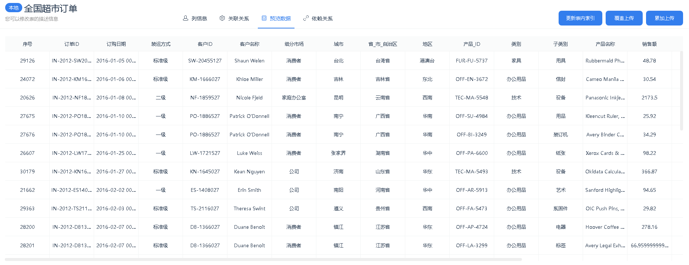
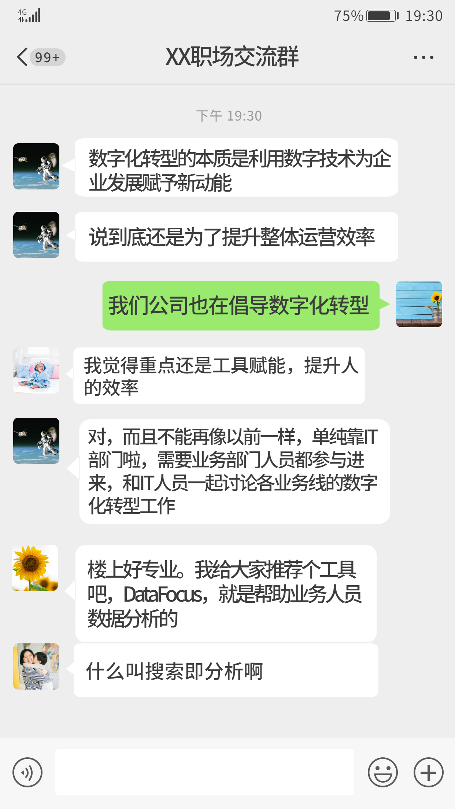
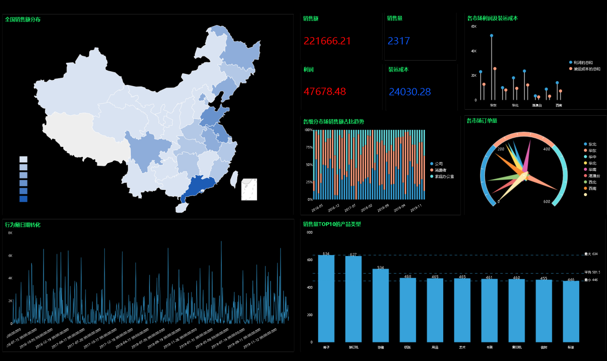

**我是小雨，一家互联网电商企业的HR**

**主要负责运营团队的招聘工作，最近我很苦恼**

**懂电商还精通数据运营的人才，太难找了**

**这不.....5分钟前，我又又又收到了运营大大的微信**

**面对孙总的问候，瞬间我慌了，扶额！**

我当然知道，懂数据分析的运营对企业有多重要。现在是精细化运营的时代，海量的数据随时在变化，公司业务发展加快，产品的品类也越来越复杂。**各个业务部门都需要数据来指导决策。**孙总的着急我也很理解，想帮他解决这个难题。但是，理想很美好，现实很残忍……

看看市面上给出的薪资条件，我们企业真是甘拜下风，抢人大战我认输.....

**薪资预算有限，人员要求变高，该怎么办？**

下班之后，看到职场交流群里的消息，没想到，不止我一个人有这样的烦恼。

大家从招聘到**公司吐槽**，再聊到了现在的数字化转型趋势。看到了群里有人分享了一个工具，说是做数据分析用的。

**“搜索即分析”？**

**“让数据分析像搜索一样简单”？**

**什么意思？**

抱着试一试的态度

我决定自己先试用一下

还真是像百度搜索一样的页面

我们企业虽然有自己的报表系统，但也仅仅满足报表功能，业务人员都是使用Excel做数据分析。不过大家的水平参差不齐，一时半会很难提升，每次做月度报告都费时费力。这也是孙总想要急招懂SQL、懂数据分析的运营的原因了。

跟着用户引导操作了一下，真的是**搜索式分析**啊，输入问题就可以了，图表是系统自动呈现的。

还可以把图表做成这样的可视化大屏，大屏还是动态的！

**这么看来，这产品确实是个“宝藏”**

我赶紧推荐给孙总

让他研究研究

对于运营的数据分析需求，他可比我在行

第二天，孙总眉开眼笑跟我说

**我们不需要招聘会SQL、懂Python的数据运营了**

**有这个产品就够了**

我们公司之前数据分布在不同数据库里

通过这个软件可以汇总起来

还能够实现自动更新

不需要找报表开发工程师手动导出了

还有，一个业务人员做好的图表和数据看板

可以分享给其他用户

实现部门内、跨部门、上下级实时沟通

**这才是高效协作！**

**没想到人才招不到的问题，通过工具解决了**

**到这里，突然明白了群友讨论的数字化转型**

**说到底是为了帮助企业提升效率高效协作啊**

**就算招到了一个懂数据分析的运营人员**

**也只能发挥一个人员的力量**

**但是有了数据分析工具，却可以让团队人人都成为数据精英**

**这才是我们要倡导的“数字化转型”啊！**

有了DataFocus，大概再也不用高薪招聘数据分析师

也不怕孙总@我了

我和孙总都很满意

如果你与小雨一样烦恼过

不如试用一下这款神器吧，或许这就是数字化转型之路的开始~
