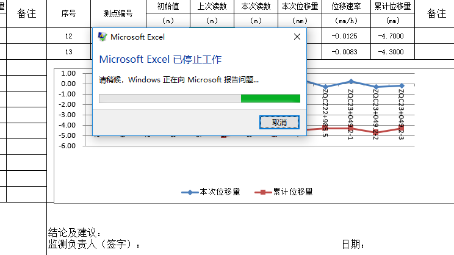
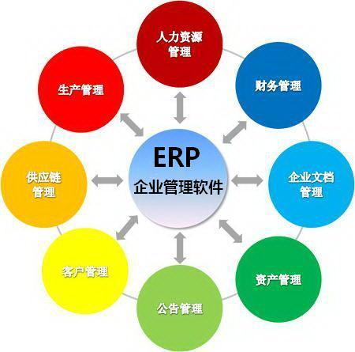
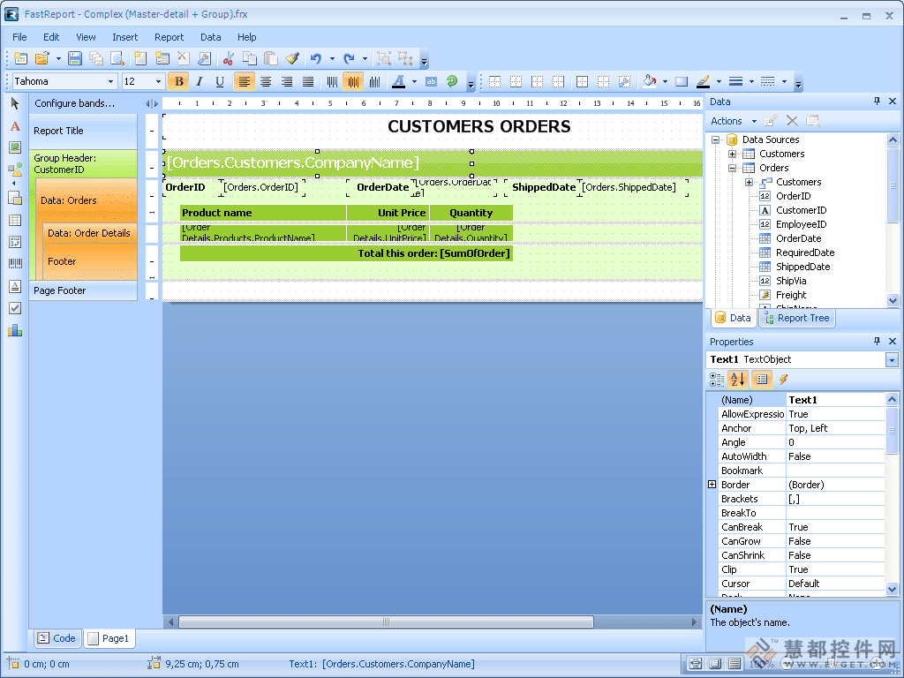

生活中有一些很有趣的成本现象，不知道大家有没有注意到。

比如说，15年前笔记本电脑的价格要1万多元，而理发不到5元；现在笔记本电脑只需要2000元，理发却要50元！

有的东西变得越来越贵，有的东西却越来越便宜。今天，我们发现冰箱、空调、洗衣机、手机和汽车的价格越来越便宜；与此同时，听一场音乐会、看一场电影的价格却越来越高。

这其中有什么原因呢？

**01、什么叫“鲍莫尔病”**

**在经济学理论中，这种现象叫作“鲍莫尔病”，也叫“成本疾病”。**美国经济学家威廉·鲍莫尔早在1967年一篇研究经济增长的论文中，就提出并解释了这一问题。

他建立了一个两部门宏观经济增长模型，其中一个部门是“进步部门”（progressive sector），另外一个部门是“停滞部门”（stagnant sector），**进步部门的生产率相对快速增长，却导致停滞部门出现相对成本的不断上升。**

换句话说，如果一个部门仍然是人力成分较高的劳动密集型，就一定会产生成本疾病的现象。

图1：威廉·鲍莫尔

 

**02、Digital GTS战略**

而华为集团董事、质量流程IT总裁陶景文在华为上海全连接大会·数字化华为峰会上也提到，**华为需要警惕鲍莫尔成本病，借助数字化转型结构性地提升服务效率**。

图2：华为数字化转型实践PPT（部分）

如何治愈它，对于像华为这样全球化运营的公司而言至关重要。而华为GTS（全球技术服务部）就在利用Digital GTS战略，与鲍莫尔病不断抗争。

2020年12月3日，华为举办首届技术服务伙伴大会。华为全球技术服务部总裁汤启兵透露，回看2016年，彼时华为GTS承担了公司大量的交付与服务作业，而每年还有10%以上的增加，加上新技术不断涌现。**“如果按照这个速度发展下去，华为GTS的人力成本需要持续上涨，会有很大的问题。”**

就在那个时候，汤启兵痛下决心，要推动华为GTS进行一场变革，一场名为“Digital GTS”的变革。华为GTS要用这场变革，去拥抱数字化、拥抱平台化、拥抱软件使能一切，用自动化、数字化的技术来改变这个行业，改变这个世界。

华为全球技术服务部(GTS)拥有30000多名员工，承担着对全球运营商客户的网络进行维护、交付、优化工作，2016年该部门的业务规模就已经超过了一百亿美元。多年来，华为GTS与全球运营商一起奋斗在支撑各行各业数字化转型的最前沿，所积累的经验和体会无疑是最珍贵的。**因此，Digital GTS战略就是要将这些珍贵的数据资源沉淀下来，并发挥出数据资产的价值。**

Digital GTS战略分为两步，**第一步通过云、大数据和自动化等数字技术和数字化平台的持续构建，使能自身数字化转型；第二步将已验证的平台和业务能力开放，联合伙伴，助力运营商使能行业数字化转型。**目前GTS已经成功完成了第一步工作，打造了数字化平台GDE (General Digital Engine)。**GDE是一个支持共平台、可线性扩展、支持微服务，能够满足持续不断变化的服务和产品需求的平台和生态系统。**

图3：华为数字化转型实践PPT（部分）

**03、让速度更快一点儿**

可是，在Digital GTS战略实施过程中，仍然感受到了效率的局限性。为了对全球运营商的运营状态进行监控，GTS的技术人员需要创建大量的图表并制作成可视化大屏。但是业务增长迅速，可视化工具制作效率仍然不能满足日益增长的业务需要。

在这个过程中，华为使用了许多数据化可视工具，但都不够满意，一句话，速度还不够快，效率还不够高。

**GTS终于发现了DataFocus。DataFocus的特点是用搜索式进行数据分析，改变了Tableau创造的拖拽式操作方式，据说可以将效率提升10倍以上。**

抱着试一试的态度，GTS部门开始试用DataFocus，**把DataFocus的智能搜索分析技术集成到了自有的GDE中。**这种搜索式的操作方式，很符合用户的使用习惯，就像用百度、谷歌搜索一样，业务人员一般只需自行熟悉之后就能使用，不需要培训，节省了不少时间。

图4：最成功的组织都采用DataFocus

在使用过程中，华为GTS也和DataFocus的研发团队进行了紧密沟通，提出了在可视化方面的要求，双方不断打磨一款效率高、速度快、美观、灵活的数据可视化工具。

从2019年合作至今，华为GTS的大量技术人员已经离不开这款工具了。每天都在使用DataFocus创建数据可视化看板，监控全球的运营状态。**整体的制作效率从原来的1-2周缩减到了现在的1-2天。**

GTS的数据分析不再是人力成分高、劳动密集型的操作业务，DataFocus让每一位业务人员都能够随时快速开始数据分析。

访问datafocus.ai，注册即可免费试用14天商业分析师版，还可在公众号菜单栏点击“申请试用”，联系客服获取企业共享版试用机会。

应对“成本疾病”，和华为一样，选择一款显著提升人员效率的工具，一起开启数字化转型之路吧~
