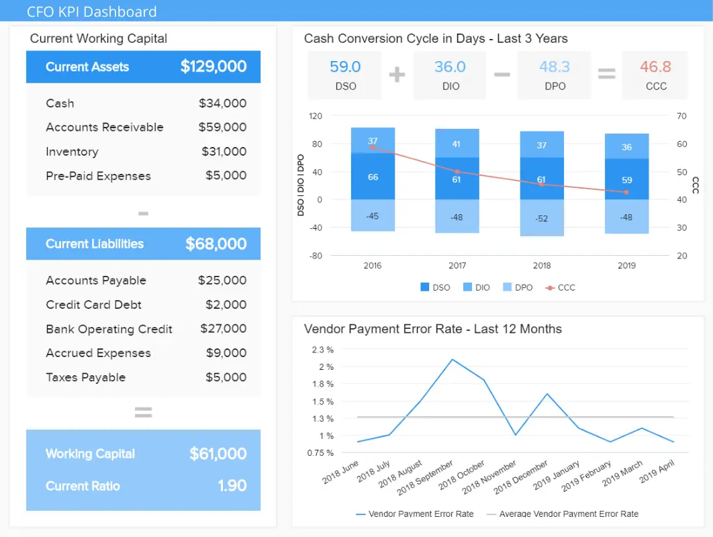
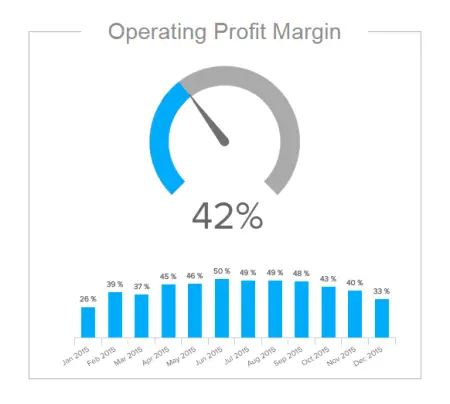
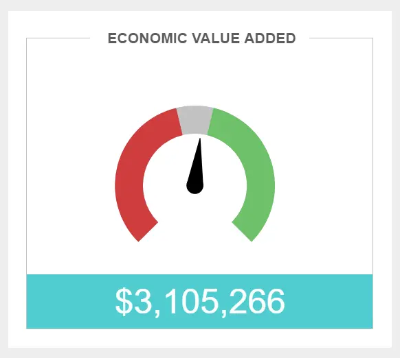
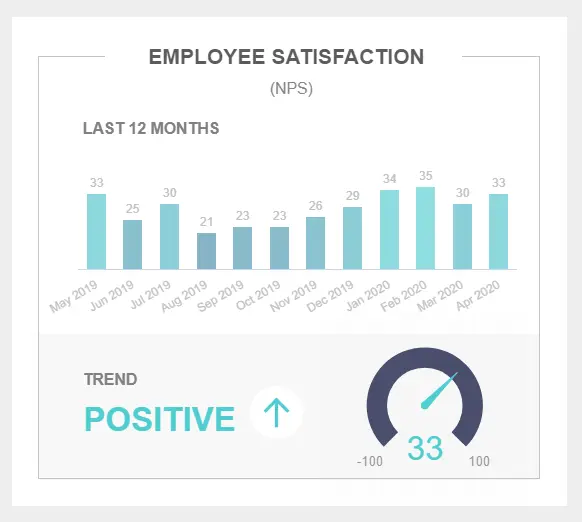
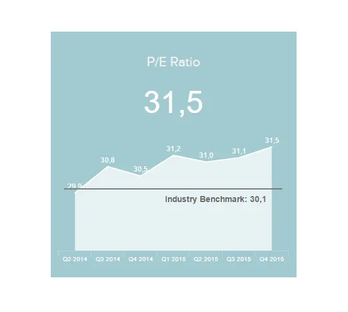
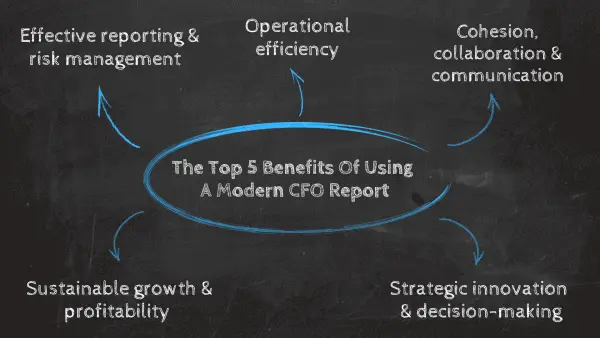

目录

[1） 什么是首席财务官仪表板？](https://www.datafocus.ai/infos/your-introduction-to-cfo-dashboards-reports-in-the-digital-age#definition-cfo-dashboards)

[2） 什么是首席财务官报告？](https://www.datafocus.ai/infos/your-introduction-to-cfo-dashboards-reports-in-the-digital-age#definition-cfo-reports)

[3） 首席财务官仪表板报告示例](https://www.datafocus.ai/infos/your-introduction-to-cfo-dashboards-reports-in-the-digital-age#examples)

[4） 首席财务官仪表板 KPI 和指标](https://www.datafocus.ai/infos/your-introduction-to-cfo-dashboards-reports-in-the-digital-age#cfo-kpis)

[5） 使用首席财务官报告的好处](https://www.datafocus.ai/infos/your-introduction-to-cfo-dashboards-reports-in-the-digital-age#benefits)

[6） 首席财务官仪表板应关注什么](https://www.datafocus.ai/infos/your-introduction-to-cfo-dashboards-reports-in-the-digital-age#how-to)

作为首席财务官 （CFO），您公司的财务状况很可能落在您的肩上。至少可以说，这是一个很大的压力。您不仅要负责组织的持续财务战略，而且可能需要向各种利益相关者提供及时、准确的报告。

由于责任如此之多，时间如此之少，财务数据分析并非易事。但是，虽然有效地处理财政数据曾经是一个巨大的挑战，但我们生活在数字时代，并且拥有令人难以置信的解决方案。

首席财务官仪表板的存在是为了增强与业务的每个财务方面相关的战略和分析工作。

 

首席财务官报告将增强您的财务计划。在这里，我们将探讨 CFO 报告的动态，考虑 CFO 报告的业务提升能力，查看 CFO 报告工具，并考虑 CFO 仪表板和报告的真实示例。

让我们开始吧。

您的机会：[想要完全免费构建自己的CFO仪表板吗？](https://www.datafocus.ai/console/)我们提供 14 天免费试用。受益于专业的首席财务官报告！

## 什么是首席财务官仪表板？

作为大量基本财务信息的中央交互式中心，CFO 仪表板托管动态[财务 KPI](https://www.datafocus.ai/infos/kpi-examples-and-templates-finance)和直观的分析工具，并以易于理解的方式整合数据并改进决策过程。

CFO 仪表板工具提供了雄心勃勃的现代 CFO 尽其所能完成工作所需的所有信息的全景视图。它还通过强大的[财务仪表板](https://www.datafocus.ai/infos/dashboard-examples-and-templates-finance)为首席执行官提供基本报告。从本质上讲，CFO 仪表板是您所有最宝贵的财务数据的分析神经中枢。

## 什么是首席财务官报告？

首席财务官报告提供了一系列可视化 KPI，旨在帮助财务人员根据各种核心财务活动做出自信、明智的决策。报表通常通过仪表板、公共 URL 共享或嵌入到现有应用程序中。

如果您将 CFO 仪表板用于[金融商业智能](https://www.datafocus.ai/infos/business-intelligence-finance)，它们将提供详细的分析报告，这些报告提供了过去、预测性和实时见解的组合。

如果 CFO KPI 仪表板是分析框架，那么报告就是您的分析眼睛。使用正确的 CFO 报告模板，您可以访问无价的财务信息，这些信息将帮助您简化货币活动、增强策略、帮助您确定目标基准，并改进与内部和外部利益相关者沟通重要见解的方式。让我们通过一个例子来了解这一点。

## 首席财务官仪表板报告示例

既然您知道报告中应包含哪些内容以及为什么需要它们来提高财务成功，那么是时候看一个真实的 CFO 仪表板示例了 — 准确地说，是我们以 CFO 为中心的专业仪表板报告。

### 1\. 首席财务官驾驶舱仪表板

\*\*点击放大\*\*

主要关键绩效指标：

- 薪资员工人数比率
- 经济增加值
- 浆果比例
- 员工满意度

这个最重要的 CFO 仪表板示例深入探讨了与现代首席财务官最相关的四个关键财务领域：成本、销售目标、毛利润以及员工和[客户满意度指标](https://www.datafocus.ai/infos/customer-satisfaction-metrics-effort-score-nps-csat/)。

这个功能强大的 CFO 仪表板示例允许您在其框架内轻松连接另一个仪表板，同时集成其他见解，包括市场指标、消费者分析、投资者关系、货币管理等。这个尖端的 CFO 报告模板左上角的关键指标包括毛利润、息税前利润、运营费用和净收入——这是一场完美的财务信息风暴。

### 2\. 首席财务官关键绩效指标仪表板

\*\*点击放大\*\*

主要关键绩效指标：

- 营运资金
- 速溶比率/酸性测试
- 现金转换周期
- 供应商付款错误率
- 预算差异

我们的下一个首席财务官报告示例是任何财务决策者必不可少的报告和分析工具。

我们的首席财务官 KPI 仪表板配备了一系列有凝聚力的可视化指标，旨在帮助您快速浏览做出明智的顶级财务决策。这个强大的 CFO KPI 仪表板提供了对基本财务方面的深入见解，包括现金转换周期、营运资金和预算差异。

这场由首席财务官 KPI 组成的完美风暴将有助于制定促进业务的财务战略，将不必要的运营成本降至最低，并简化流程以实现最佳的财务成功。

### 3\. 投资者关系首席财务官仪表板

\*\*点击放大\*\*

主要关键绩效指标：

- 资产回报率
- 股本回报率
- 市盈率

作为财务经理，维护投资者关系无疑是重中之重。这份 CFO 报告旨在提供有关资产、股权和业务估值的见解，是一个视觉平衡的投资者关系仪表板，是任何 CFO 或高级财务决策者的另一个强大工具。

通过使用现代首席财务官绩效指标，每位首席财务官，无论哪个行业，都可以清楚地了解公司的财务状况和全面状况。

通过 CFO 分析，您可以根据特定基准查看您的表现，并准确衡量您的运营支出如何累积（无论您是步入正轨、超额完成目标还是需要削减成本）。

通过获得这些强大的以首席财务官为中心的见解，您将能够开始提出正确的问题，同时确定潜在的优势、劣势或趋势，最终将加速您的业务成功，同时提高许多关键领域的财务效率。

您的机会：[想要完全免费构建自己的CFO仪表板吗？](https://www.datafocus.ai/console/)我们提供 14 天免费试用。受益于专业的首席财务官报告！

## 前 12 名 CFO 仪表板 KPI 和指标解释

现在我们已经探索了最有效的首席财务官报告示例之一，我们将快速浏览其关键的 7 个[财务图表](https://www.datafocus.ai/infos/financial-graphs-and-charts-examples/)，从毛利率百分比开始。我们还包括满意度指标，因为如今，首席财务官不仅跟踪财务 KPI，还负责其他业务领域。让我们仔细看看我们的示例，看看这意味着什么。

1\. 毛利率百分比：

关键的首席财务官 KPI 之一，毛利率（以百分比表示）将告诉您在计算与生产过程（或交付的服务）相关的所有直接成本后，您保留了多少总销售收入。

这是需要监控的高级 CFO 指标之一，以便更全面地了解您的收入。从本质上讲，保证金越大，您可以保留的收入就越多。

2、营业利润率：

也称为利息和税前收益，此首席财务官 KPI 演示了支付所有运营成本后收入的剩余部分。

通过监控这一重要指标，您将能够快速确定数字是否在下降，从而立即采取行动。

3\. 营业费用率：

运营费用比率是一个指标，它将告知您的公司是否可扩展。例如，如果您可以在不增加运营费用的情况下增加销售额。

监控此 CFO 指标非常重要，因为它将向您显示运营效率水平，您可以随时提高并尝试降低费用。

4.浆果比例：

当您谈论向首席执行官提交的首席财务官报告或向董事会提交的首席财务官报告时，浆果比率是一个将证明非常有效的 KPI。

浆果比率是一个首席财务官 KPI，用于可视化和量化毛利润与运营费用的比率。通过定期跟踪和基准测试，您可以提供企业整体财务状况的准确快照 - 您需要无限期地保持这一点。

5\. 伊娃：

EVA或经济附加值是[财务报告](https://www.datafocus.ai/infos/daily-weekly-monthly-financial-report-examples/)的基本组成部分，因为它提供了对公司经济利润的精确估计，该利润超过了公司股东所需的回报。

EVA是一个指标，不仅提供了丰富的信息，而且可能是任何现代CFO的热门需求。

6\. 员工满意度：

员工满意度与客户满意度同样重要，对于首席财务官来说，最好的软件总是在组合中的某个地方包含这个首席财务官指标。

无论您是在谈论首席财务官的月度报告还是每日报告，员工满意度都是您必须密切监控的事情，因为它会影响绩效和生产力，进而对业务产生重大的财务影响。如前所述，满意度指标不是“硬”财务指标，但对于每个需要鸟瞰整个组织的现代首席财务官来说都很重要。

您的机会：[想要完全免费构建自己的CFO仪表板吗？](https://www.datafocus.ai/console/)我们提供 14 天免费试用。受益于专业的首席财务官报告！

7\. 客户满意度

我们的下一个示例是[客户服务 KPI](https://www.datafocus.ai/infos/kpi-examples-and-templates-customer-service)，旨在通过净推荐值监控满意度。客户是任何企业跳动的心脏，对首席财务官来说尤其重要，因为公司的财务状况完全依赖于客户。如果他们不满意，企业可能会遭受巨大的经济损失。

8\. 薪资员工比例

工资人数比率是识别和减少不必要的劳动力成本的有效方法，可以清楚地表明与您的员工总数相比，有多少工人参与工资单流程。通过保持较低的 CFO 分析仪表板，您将保持始终如一的高生产力水平，同时为您的人员配备工作赚取健康的投资回报率。

9\. 市盈率

作为最强大的投资者关系首席财务官 KPI 之一，市盈率提供了您的每股收益或公司估值的明确视图，与您所在行业的其他公司相比。当然，参数会根据您的行业或商业模式而有所不同，但通过定期跟踪此指标，您可以采取正确的战略措施来提高公司的可投资性。

10\. 营运资金

作为每个顶级财务领导者在其分析工具包中都应该具备的首席财务官仪表板 KPI 之一，营运资金是衡量企业整体财务状况的有力手段。这个最强大的 CFO 仪表板指标不是图表或比率，而是以合乎逻辑、易于理解的格式呈现主要财务数据。在这里，您可以看到成本和负债的明细，以及公司在任何给定时间的营运资金的快速计算。这是一种快速有效的方法来检查一般财务业绩，并在需要时采取适当的战略行动。

11\. 现金转换周期

CCC 指标旨在显示您的企业将其资源转化为利润或现金的速度，是任何有效的 CFO 仪表板的基本要素。使用这个强大的 KPI，您可以将您的绩效与以前的财政年度进行比较，准确衡量各种财务流程的效率。这里的目标是创造稳定的上升或收益，如果您看到CCC数字出现任何急剧的飙升或下降，请采取行动制定以现金流为中心的管理策略。

12\. 预算差异

预算差异是我们最实用的首席财务官财务指标之一，可让您客观地了解您的预算的实际和准确性，考虑从自然灾害和波动的业务条件到计划不周的预测、持续的劳动力成本等每一个运营变化。将实际成本与预计预算进行全面细分是一种非常有效的方法，可以调整或优化您的各种财务计划，以实现持续增长和一致的财务状况。

您的机会：[想要完全免费构建自己的CFO仪表板吗？](https://www.datafocus.ai/console/)我们提供 14 天免费试用。受益于专业的首席财务官报告！

## 使用现代 CFO 报告的 5 大好处

现在，我们已经深入研究了现代 CFO 仪表板 KPI 的内部工作原理，并探讨了这些动态财务报告工具的实际价值，现在是时候阐明其优势了。一起来看看吧。

1\. 有效的报告和风险管理

首先，现代首席财务官报告模板是有效财务报告和风险管理的强大可靠手段。

作为首席财务官，降低持续的财务风险是重中之重 - 这一责任可以成就或破坏业务。通过使用尖端[的业务仪表板](https://www.datafocus.ai/infos/dashboard-examples-and-templates)，做出快速、安全和明智的决策变得直观，而不是令人生畏。

CFO 仪表板示例和报告提供深入的过去、预测和实时数据的凝聚力组合，将帮助您轻松识别任何潜在问题或效率低下的问题，使您能够在它们损害业务财务健康之前将它们扼杀在萌芽状态。

2\. 运营效率

从某种意义上说，提高运营效率意味着降低运营成本。CFO[仪表板工具](https://www.datafocus.ai/infos/online-dashboard)提供的可视化数据范围之广，这意味着您可以准确处理整个企业中的每个核心财务流程。

能够快速将您的成功与前几个月或几年进行比较，同时绘制您在多个关键领域的绩效，您可以“削减脂肪”，摆脱与预算差异、资本、股票价值、报告、劳动力管理等相关的低效率。反过来，您将使业务更有利可图，年复一年地加速其财务增长。

3\. 凝聚力、协作与沟通

任何值得一提的首席财务官报告都是可定制的、交互式的，并以可访问的方式显示基本的财务指标。

此外，通过跨多个设备提供对仪表板数据的 24/7 全天候访问，[在线报告软件](https://www.datafocus.ai/infos/online-reporting)可以使财务决策者无论身在何处制定战略并监控指标。

这种对强大信息的普遍访问将改善协作和沟通，全面提高生产力。这是持续专业成长和发展的基石之一。

4\. 战略创新与决策

首席财务官必须做出重大决策，通常是当场做出。曾几何时，高级财务领导者不得不浏览成群结队的静态电子表格和财务数据，而今天，可以深入了解相关信息并一目了然地查看。

通过获取企业每个关键财务运营的全景快照，并与大量动态指标的可视化进行交互，可以完全自信地做出明智的实时决策。这些战略选择将有利于您的业务增长，同时避免潜在的财务灾难。

除了获得额外的愿景，使您更有效地担任首席财务官之外，节省时间和提高个人效率还将为您提供更多空间来制定创新举措和战略，以进一步促进企业的财务成功。

5\. 可持续增长和盈利能力

扩展我们的最后一点，获得对大量动态财务信息的未开发访问权限意味着您可以以极高的效率处理您的每一项首席财务官职责。

通过节省筛选数字和指标的时间，并使用使用专业[数据分析工具](https://www.datafocus.ai/infos/data-analyst-tools-software)获得的各种可基准见解，您将保持企业的财务状况，将冗余成本降至最低，同时发现提高收入和吸引有价值投资者的方法。

因此，您将确保可持续的业务增长，同时提高业务的盈利能力。

“将注意力集中在重要事情上的能力是智力的一个决定性特征，”——罗伯特·席勒，《非理性繁荣》

## 首席财务官仪表板或报告应关注的内容

以 CFO 为中心的仪表板和 CFO 报告模板协同工作，提供指标和见解，优化企业在各个领域的关键财务活动。为了确保您以可持续的方式从分析工作中获得最佳结果，您的 CFO 报告或仪表板应重点关注以下内容：

1\. 目标和成果

首先，您的首席财务官KPI仪表板或首席财务官仪表板工具应包含您的最终财务目的和目标。这些组织基准将构成您分析工作的基础，因此花时间详细考虑它们非常重要。在这种情况下，[财务分析软件](https://www.datafocus.ai/infos/finance-analytics)可能会有所帮助。

与您的财务人员或其他高级管理人员坐在协作环境中，讨论您希望通过 CFO KPI 仪表板实现的目标。

您想降低特定的运营成本吗？您想从外部投资中获得更好的投资回报吗？您是否需要更详细地监控您的工资单？花点时间做出这些决策，您将能够为商业智能定制您的 CFO 仪表板。

2\. 可操作的关键绩效指标

对于以 CFO 为中心的报告，使用正确的交互式 KPI 至关重要。一旦您设定了目标、目标和结果，您将能够选择 CFO 仪表板 KPI，以帮助您优化工作。

首席财务官 KPI 提供了最重要的内容的易于理解的可视化表示。通过将重点放在正确的关键绩效指标上，您将能够成倍地发展您的业务工作。

除了查看销售、成本和其他相关财务数据外，首席财务官还需要监控其他非财务领域的绩效，例如员工满意度，以确保企业的财务状况。出于这个原因，您的 CFO 仪表板应包含一系列可操作的 KPI，这些 KPI 将提供准确的图片并促进所有相关领域的决策。

3\. 以首席财务官为中心的设计

现代数据仪表板最好的事情之一是您可以根据自己的喜好定制它们。

通过自定义仪表板并专注于最佳设计实践，您将使您的数据流行起来，并确保企业内的每个人都可以从公司的财务数据中榨取最后一滴价值。

我们的[仪表板设计](https://www.datafocus.ai/infos/dashboard-design-principles-and-best-practices/)指南将引导您获得首席财务官报告成功。

4\. 尖端分析工具

要获得真正的分析成功，您必须专注于使用适合工作的工具。要使首席财务官报告成功，以下是您的[BI 报告工具](https://www.datafocus.ai/infos/bi-reporting)应具备的属性：

- 能够根据您的需求和偏好定制和自定义报告。
- 易于导航的功能可从一个中心位置访问。
- 可视化的动态 KPI，可帮助您制定长期战略并一目了然地做出决策。
- 24/7 全天候从多种设备（包括移动设备）访问。
- 优秀的用户帮助和支持。

通过专注于这些关键领域并使用正确的工具，您将确保您的首席财务官数据分析从一开始就取得成功。

您的机会：[想要完全免费构建自己的CFO仪表板吗？](https://www.datafocus.ai/console/)我们提供 14 天免费试用。受益于专业的首席财务官报告！

## 首席财务官仪表板的关键要点

我们已经探索了典型的首席财务官月度报告模板和首席财务官报告示例，浏览了一系列动态的首席财务官 KPI，浏览了现代业务报告的分析优势，不可否认：作为首席财务官，数字仪表板是您的朋友。

很明显，如果您想在加速业务增长的同时简化绩效，那么采用基于 CFO 的数据仪表板的无所不包的强大功能和无与伦比的分析能力不再是附加组件，而是必不可少的。

当您谈论公司的财务状况时，您不能错过任何一个节拍。你的未来取决于它。如果您使用最具创新性的工具来完成这项工作，您将以您从未想过的方式降低成本、提高利润并简化您的业务运营。未来就是现在，未来就是[执行仪表板](https://www.datafocus.ai/infos/executive-dashboards-and-reports/)——不要落后。

如果您已准备好接受现代分析的力量，并希望通过 DataFocus 等现代解决方案提升公司的财务管理计划，请注册我们的[14 天免费试用](https://www.datafocus.ai/console/)版，看看我们能为您做些什么。
