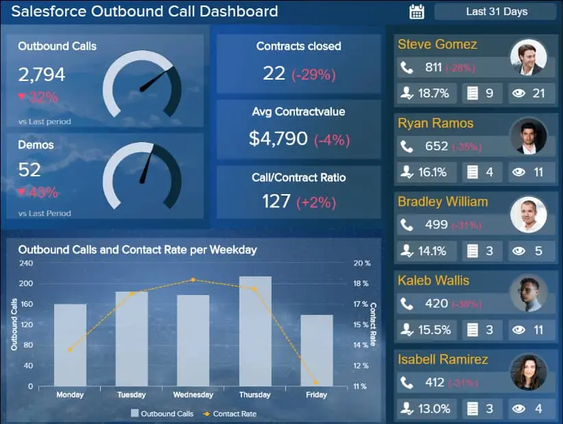

数据就在我们身边，它以多种方式改变了我们的生活：快节奏的商业世界也不例外。数字数据使各行各业的组织能够利用洞察力的力量改进其流程、计划和创新。但是，在当今高度互联的时代，有如此多的统计数据、事实和数字，知道使用哪些信息似乎是一个雷区。

进入数据仪表板：历史上最好的[商业智能](https://www.datafocus.ai/infos/bi-skills-for-business-intelligence-career)创新之一。

 

为了帮助您了解仪表板的业务提升能力，我们将探索明确的数据仪表板定义，解释仪表板数据的重要性，并查看一系列实际示例。

为了对本指南中概述的概念有一个有效的理解，我们必须首先从一个官方定义开始：

## 什么是数据仪表板？

数据仪表板是企业用来跟踪和监控具有高质量 KPI 的策略绩效的交互式分析工具。借助实时数据，这些工具使公司能够提取可操作的见解并确保持续增长。

它们为用户提供了公司各个内部部门、目标、计划、流程或项目的全面概述。这些是通过关键绩效指标 （KPI） 来衡量的，这些指标提供的见解将使您能够促进增长和改进。

[在线仪表板](https://www.datafocus.ai/infos/online-dashboard)提供对可操作分析的即时导航访问，这些分析能够通过持续的商业发展来提高您的底线。

要正确定义仪表板，您需要考虑这样一个事实，即如果没有仪表板和[仪表板报告](https://www.datafocus.ai/infos/dashboard-reporting)实践，企业将需要筛选大量非结构化信息，这既低效又耗时。或者，企业将不得不对其最关键的流程、项目和内部见解“在黑暗中射击”，这在当今世界远非理想。

为了进一步突出现代数据仪表板的纯信息效率，让我们快速浏览一下当今商业世界中使用的四种主要类型：

- 操作仪表板：操作仪表板旨在监视趋势和模式更改，同时帮助您处理特定的性能基准。这些仪表板响应迅速、动态且有效，可用于即时决策。
- 分析仪表板：分析仪表板通常由高级管理人员和决策者使用。这些类型的分析工具使用户能够深入挖掘到特定的信息口袋，并收集一定程度的情报，以帮助从顶层角度发现锋利的趋势。
- 战略仪表板：战略仪表板提供信息和可视化效果，使用户能够发现哪些计划效果最好，哪些计划效果最差。这些类型的分析工具是一个包含宝贵指标的大数据仪表板，有助于从各个角度评估 KPI，并最终制定跨部门的业务促进战略。
- 信息仪表板：信息仪表板通常专注于非常具体的流程或信息分支，对于获得有用的一目了然的数据或短期战略决策是有效的。

现在您已经了解了明确定义的仪表板含义，让我们继续讨论其主要功能：回答关键业务问题。

## 数据仪表板的目的是什么？

如前所述，智能数据仪表板能够根据您的特定目标、目的和策略回答大量与业务相关的问题。

通过从多个来源获取原始数据并在以量身定制的自定义可视化方式呈现之前对其进行整合，数据仪表板使您能够更深入地了解公司最有价值的信息，并使您能够为最紧迫的业务问题找到可行的答案。

通过与与您的业务目标一致的特定 KPI 链接，您可以深入了解特定信息，创建基准并持续衡量您的成功。

通过这样做，您的业务将是数据驱动的，并作为直接结果 - 更成功。要了解有关仪表板和关键绩效指标的更多信息，请探索我们不断扩展的各种业务促进[KPI 模板](https://www.datafocus.ai/infos/kpi-examples-and-templates)的集合。

您的机会：[想要免费构建自己的现代数据仪表板？](https://www.datafocus.ai/console/)试用我们的专业仪表板软件 14 天，完全免费！

## 我们的前 25 个数据仪表板示例和模板

现在是时候深入研究为许多不同的部门和行业量身定制的 25 个主要现实世界的数字仪表板了。

要更详细地了解，您可以查看 80 个或更多业务仪表板示例，这些示例适用于更广泛的[业务](https://www.datafocus.ai/infos/dashboard-examples-and-templates)职能（营销、销售、财务、管理等）和行业（医疗保健、零售、物流、制造等）。

现在，让我们探索一下我们的个人 25。准备好受到启发...

### 1） 管理关键绩效指标仪表板

我们的第一个数据仪表板模板是[管理仪表板](https://www.datafocus.ai/infos/dashboard-examples-and-templates-management)。对于 C 级高管来说，这是“更高级别”仪表板的一个很好的例子。您会注意到，此示例侧重于重要的[管理 KPI](https://www.datafocus.ai/infos/kpi-examples-and-templates-management)，例如：

- 与目标相比的新客户数量
- 每位客户的平均收入
- 获客成本
- 总收入、目标收入和去年的收入

上面的例子很好地保持了事情的专注，并通过自由使用空白避免了混乱。

### 2） 财务关键绩效指标仪表板

保持您的财务健康和效率对于您的业务的持续增长和发展至关重要。如果不保持您的财政流程无懈可击，您的组织将基本上成为一个漏水的水龙头，在您的眼皮底下耗尽您的预算。

作为我们使用最广泛的财务[数据分析工具](https://www.datafocus.ai/infos/finance-analytics)之一，我们的财务 KPI 仪表板将通过提供业务每个关键财务领域的可消化可视化，告诉您有关企业持续财务健康状况的所有信息。

在这里，您可以分析现金转换周期效率和供应商付款错误趋势，同时检查预算差异趋势并分解现有资产和负债。

通过仔细监控这个富有洞察力的仪表板，您将能够发现新兴趋势，在损害业务之前解决任何财务问题，并增强您的供应商关系。

当您可以“一目了然”地访问营运资本计算时，在任何一天、一周或一个月监控公司的整体财务状况将成为一个快速、简单的过程，让您有时间和空间来制定发展业务的计划。

### 3） 销售周期长度仪表板

下面的销售[仪表板是销售](https://www.datafocus.ai/infos/dashboard-examples-and-templates-sales)经理的梦想。此仪表板示例细分了客户在您的渠道中移动的平均时间。它通过显示不同的销售经理与其他销售经理相比的表现来扩展这一点。

最后，销售数据仪表板将这些[销售 KPI](https://www.datafocus.ai/infos/kpi-examples-and-templates-sales)分解为漏斗每个阶段的人数以及每个阶段平均持续多长时间，从而为您的信息提供了更详细的背景信息。

### 4） IT 项目管理仪表板

在许多方面，您的 IT 部门是您业务的支柱 - 它是保持业务运营的支柱。

大多数 IT 操作人员都捉襟见肘，承受着压力，但通过使用正确的可视化效果，您可以为您的部门提供工具，使其变得更智能、更高效、更具影响力。

我们的 IT 项目管理仪表板提供了丰富的一目了然的见解，旨在缩短项目周转时间，同时提高关键领域的效率，包括总工单与未结工单、按预算交付的项目和平均处理时间。

所有 KPI 相辅相成，揭示实时工作负载、逾期任务、预算趋势、即将到来的截止日期等。这种完美平衡的指标组合将帮助 IT 部门内的每个人平衡其个人工作量，同时获得将战略增强付诸行动并持续成功交付项目所需的洞察力。

通过将每个关键信息整合到一个中心位置，IT 团队的每个成员都可以在同一页面上，以最高效率协同工作以解决新出现的问题，同时帮助其他人完全自信地处理每个重要 IT 项目的各个阶段。

### 5） 采购数据分析仪表板

采购是一项战略职能，它将公司的需求与承包商、供应商、自由职业者或机构联系起来，例如，作为关键组件，需要最新的信息、简单的监控流程和先进的自动化功能，这将优化采购部门并节省无数的工作时间。

必须以最有效的方式跟踪供应商管理流程，否则，公司可能会丢失宝贵的信息，并在短期和长期业务运营中面临困难。这就是为什么采购仪表板可以帮助专业人士轻松理解大量数据并在几分钟内提取有意义的见解。

此示例侧重于供应商交付管理和有关绩效的统计信息。在顶部，我们可以看到缺陷率、准时供应、供应商可用性和交货时间（以天为单位）的快速概览。缺陷率应尽可能低，因为这是衡量有多少产品不符合产品规格但不符合质量标准的[采购 KPI](https://www.datafocus.ai/infos/kpi-examples-and-templates-procurement)之一。毕竟，产品的最终质量是供应商可靠性的重要指标，因为更多的缺陷意味着整个过程中的瓶颈更多。

每个供应商的缺陷率和缺陷类型的详细信息在左下角可视化，您可以在其中看到前 6 名供应商的表现如何。供应商编号 1 被认为是最可靠的，因为缺陷率非常低，并且缺陷类型对产品没有影响，因此在交付流程或付款中可能存在问题。

您还可以比较不同供应商之间的交货时间，看看是否有其他可能性来协商更快的交货。在这种情况下，您可以看到 4 号供应商从未迟到过，尽管与供应商编号 1 和 2 相比，它的提前交货次数较少。

在详细的监控流程的帮助下，每个行业专业人员或经理都可以构建和自动化全面的[采购报告](https://www.datafocus.ai/infos/procurement-report-examples-and-templates)，这将优化供应商交付机制并提高所有相关人员的生产力水平。

### 6） 网站分析仪表板

如果您在业务中大量使用数字营销，下面的[营销仪表板](https://www.datafocus.ai/infos/dashboard-examples-and-templates-marketing)将很快成为您最好的朋友。此示例侧重于 Web 分析，将为您提供大量的可视化效果，您可以深入挖掘和检查所有与 Web 相关的营销数据。

此营销数据仪表板模板一目了然地为您提供了许多有用的[营销 KPI](https://www.datafocus.ai/infos/kpi-examples-and-templates-marketing)，为您提供以下问题的答案：

- 有多少人访问您的网站？
- 他们在看多少页？
- 他们待多久？
- 有多少人在皈依？

此示例更进一步，分解了转化次数最多的渠道、广告系列和页面，并显示每个渠道的流量。

这种信息可以很容易地知道你应该在哪里优先考虑你的时间和精力。

### 7） 人力资源人才仪表板

人力资源正变得更加数据驱动，现代软件解决方案已进入人力资源领域，以确保招聘和人才管理运营更加有效，并专注于公正的质量。尤其是在今天，吸引和留住合适的人才已成为面临人才稀缺和激烈竞争的公司面临的艰巨挑战，尤其是在 IT 行业。事实上，43%的人力资源专业人士表示，由于来自其他雇主的竞争，他们在招聘过程中遇到了困难。即使他们雇用了合适的候选人，也经常会出现人才因为满意度低或竞争对手更好的报价而离开的情况。

正如我们在上面看到的，专注于人才管理的现代[人力资源仪表板](https://www.datafocus.ai/infos/dashboard-examples-and-templates-human-resources)通过分析专注于人才的重要指标来帮助专业人士识别问题和对业务的潜在负面影响。例如，人才流动率是一个[人力资源 KPI](https://www.datafocus.ai/infos/kpi-examples-and-templates-human-resources)，它将向您显示哪个部门在留住顶尖人才方面存在困难。在上面的示例中，您可以看到财务部门处理最高的自愿营业额，因此检查原因可能是有意义的。

人才满意度通过净推荐值 （NPS） 表示，很明显，最高的满意度是在 5 年的工作期后实现的，尽管第一年也非常接近结果。

人才评级由雇用期限和类别表示。定期进行反馈和会议对于发展沟通和人才能力至关重要。如果在评估过程中特别缺乏技能，明智的做法是投资于员工并提供额外的教育机会。这样，公司也可以获利。

您还可以查看招聘统计数据的快速概览，包括填补时间、培训成本、新员工和每次招聘成本。员工总数和月薪以及职位空缺将为您提供今年第一季度人才管理统计数据的概览。

此仪表板描述包括为专业人士、经理和副总裁开发现代[人力资源报告](https://www.datafocus.ai/infos/monthly-and-annual-hr-report-templates)所必需的所有重要信息，这些专业人士、经理和副总裁需要竞争以吸引最佳候选人并长期留住他们。

我们的下一个数据库仪表板示例之一显示了制造业的流程。

### 8） 制造生产仪表板

如果您的公司从事制造业务，[则生产仪表板](https://www.datafocus.ai/infos/dashboard-examples-and-templates-manufacturing)将证明是无价的，如以下示例所示：

通过针对总产量、销售收入、订购单位和性能最佳的机器的[制造 KPI](https://www.datafocus.ai/infos/kpi-examples-and-templates-manufacturing)，您可以掌握工厂的脉搏。

最后，按原因划分的退款项目图可作为制造缺陷的“预警信号”。

### 9） 营销绩效仪表板

这种以营销为中心的创新是一个充满洞察力的数据分析仪表板，是确保持续健康投资回报 （ROI） 的有效方法。

为了最大限度地提高促销活动和计划的价值，在正确的时间通过正确的接触点、渠道和媒介吸引受众至关重要。如果你不这样做，你只是在营销到虚空，把你的预算扔进深渊。

借助我们的[数字营销报告示例](https://www.datafocus.ai/infos/daily-weekly-monthly-marketing-report-examples)，您可以深入了解基本指标，包括点击率 （CTR）、每次点击费用 （CPC） 和每次获取费用 （CPA），从而全面细分广告系列的效果。

通过分析这些富有洞察力的 KPI 并从中心位置比较各种活动的效果，您可以在利用营销优势的同时查明任何效率低下的地方。这种深层次的视觉洞察力将帮助您了解客户如何与您的营销材料互动，同时引导您获得最佳结果的内容和策略。当你这样做时，你会看到收入和观众增长的显着增长。

### 10） 物流运输仪表板

这个特殊的仪表板显示了大数据和分析如何影响物流行业。在物流方面，每一刻都很重要，您希望尽可能多的交货准时。

此物流[仪表板](https://www.datafocus.ai/infos/dashboard-examples-and-templates-logistics)有助于调整车队绩效和整体运输绩效，因为交付状态、车队效率、平均装载时间和其他[物流 KPI](https://www.datafocus.ai/infos/kpi-examples-and-templates-logistics)将使您能够生成可操作的见解、检查各种细节并确定运输管理流程的趋势。

### 11） 现金管理仪表板

当然，您的现金流对于您业务的持续健康是不可或缺的。通过有效地管理您的收入、支出、流动性和财务关系，您将能够实现您的货币目标，获得更多的信贷渠道，并确保您的业务能够抵御任何不可预见的情况。

这个动态财务仪表板具有所有功能和 KPI，以保持您[财务](https://www.datafocus.ai/infos/dashboard-examples-and-templates-finance)的每个要素，帮助您优化财务活动以实现持续增长和成功。适用于各行各业组织的基本数据仪表板类型。

### 12） 客户支持 KPI 仪表板

撇开利基或行业不谈，为您的客户或客户提供卓越的客户支持不再是额外的奢侈品 - 它是必不可少的。没有例外。不妥协。如果不提供有价值的个人客户体验，您的业务将受到影响。利用正确的数据是避免落后于竞争对手的最有效方法。

我们的动态[客户服务仪表板](https://www.datafocus.ai/infos/dashboard-examples-and-templates-customer-service)提供了一场完美的视觉信息风暴，帮助面向消费者的角色（从支持代理和团队领导到高级经理、副总裁等）更好地履行职责。

菜单上有包括服务级别、支持成本与收入以及客户满意度在内的 KPI，这个全面的数据分析仪表板提供了降低服务成本、监控支持趋势和正面解决任何明显的面向客户的问题所需的每个指标。

通过定期跟踪此 KPI 仪表板，您将减少座席解决服务问题所需的时间，简化部门流程，并最终自信和一致地满足客户的需求。反过来，您将提高品牌声誉，增加收入并提高客户忠诚度 - 商业成功的三个关键要素。

### 13） 零售数据仪表板示例

简而言之，零售行业中的仪表板是报告和集中大量信息不可或缺的手段。无论公司规模如何，专为在线零售商设计的零售仪表板在优化在线流程和为所有[零售](https://www.datafocus.ai/infos/dashboard-examples-and-templates-retail)相关数据提供集中访问点方面都非常重要。

在线零售的成功在很大程度上取决于数据收集、管理、监控和优化流程，以提高生产力，从而提高收入。此外，客户比以往任何时候都更加了解情况和要求，这就是为什么将所有信息集中在一个中心位置至关重要的原因。这将使您能够迅速采取行动并确保高水平的客户满意度。

样本从退货原因开始，这是与回报率密切相关并影响质量评估的最重要的[零售 KPI](https://www.datafocus.ai/infos/kpi-examples-and-templates-retail)之一。完美的订单率和总订单数量在较长时间内更深入地挖掘统计数据。这样，您可以更仔细地调整[零售分析](https://www.datafocus.ai/infos/retail-analytics)策略并提高效率。

订单排名靠前的卖家会告诉您是否需要调整报价或投入更多资金来营销库存中表现最好的商品。

### 14） 销售人员数据仪表板

在当今竞争激烈的环境中，Salesforce 是管理和优化客户关系流程的关键工具之一。在专业的[Salesforce 仪表板](https://www.datafocus.ai/infos/dashboard-examples-and-templates-salesforce)的帮助下，监控和优化销售生命周期、与其他来源连接以及自动化报告流程比以往任何时候都快。

冷呼叫仍然是获得新客户的有效策略，出站呼叫仪表板有助于确定团队是否做得很好，或者是否需要其他帮助或开发更高效的销售环境。仪表板显示出站呼叫、演示、已关闭合同数量以及合同价值的概览。在右侧，您可以看到5个座席及其上个月的表现的概述，这可以帮助您创建详细的[销售队伍报告](https://www.datafocus.ai/infos/salesforce-reports-examples-and-templates)并进一步优化。

在底部，您可以查看每个工作日的通话和联系率，并注意周中的联系率如何上升。这样，您可以更有效地调整未来的计划和冷呼叫操作。

您的机会：[想要免费构建自己的现代数据仪表板？](https://www.datafocus.ai/console/)试用我们的专业仪表板软件 14 天，完全免费！

### 15） 医院 KPI 仪表板

医院是卫生部门跳动的心脏——没有它们，我们会在哪里？有如此多的活动要分析，有这么多的资源需要考虑，在医院中实施包含数据仪表板技术的[医疗保健分析软件](https://www.datafocus.ai/infos/healthcare-analytics)在当今时代至关重要。

该[医院仪表板](https://www.datafocus.ai/infos/dashboard-examples-and-templates-healthcare)涵盖治疗成本、财务效率和患者护理的各个关键方面，在提高日常运营效率方面发挥着关键作用。此外，通过从该仪表板中获得的见解，医院可以提高死亡率，更明智地投资，并确保整个机构的凝聚力沟通。

### 16） 员工绩效仪表板

无论您销售什么或提供什么，如果您的员工不快乐、没有动力并尽其所能，您的整个组织都会受到影响。这就是为什么我们为您带来另一个使用专业人力资源[分析软件](https://www.datafocus.ai/infos/business-intelligence-human-resources)创建的以人力资源为中心的示例。

员工绩效仪表板是一项以员工为中心的全面创新，深入到人员管理的每个主要方面，从缺勤率和加班时间到生产力水平和培训成本。此处的信息有助于在需要时提供支持和激励，提高员工敬业度并改进您的管理策略。

### 17） 能源管理仪表板

许多企业忽视了为日常运营提供动力的财务影响。但企业平均每年使用100至150千瓦时。对于拥有多个站点或分支机构的组织，这个数字可能至少翻了两番。

降低能源消耗不仅可以为您节省大量的年度成本，还可以使您的业务更环保、更可持续。

我们的能源管理平台是任何扩展业务的宝贵仪表板，提供能源和消耗的清晰可视化，同时允许您将使用情况与其他行业进行比较。

我们的[能源仪表板](https://www.datafocus.ai/infos/dashboard-examples-and-templates-energy)还根据您在一定时期内经历的任何停电情况显示可视化数据和趋势。这个富有洞察力的仪表板将让您更好地了解您的业务如何消耗能源，同时为您提供将任何低效率扼杀在萌芽状态所需的洞察力。您将节省资金并在此过程中保持运营顺畅。

这是一个重要的数据分析仪表板，用于巩固可持续的财务增长，同时始终如一地消除不必要的浪费。

### 18） IT 数据分析仪表板

在 IT 中，仪表板意味着极高的价值，它是确保项目按时交付、工单成功管理以及成本得到控制所需的工具之一。特别是对于首席技术官，他们需要对战略管理有一个概述，并根据业务目标和需求领导技术资源。

也就是说，集中多个接触点的 IT 仪表板对于公司[IT](https://www.datafocus.ai/infos/dashboard-examples-and-templates-it)进步的领导者和专业人士具有巨大的价值。让我们仔细看看如何阅读我们关于 IT 领导力的示例。

视觉对象分为 4 个主要部分，现代 CTO 需要监视和评估这些部分，以获得并保持积极的业务发展：学习、内部、财务/客户和用户。让我们快速浏览一下每个。

学习部分分为[IT KPI，](https://www.datafocus.ai/infos/kpi-examples-and-templates-it)这对于管理工单和错误以及团队的流失率至关重要。您可以立即发现问题集中的位置，在这种情况下，与上一个月相比，本月的恢复成功率略有下降。我们可以看到，其他指标（例如重新打开的工单）的开发更好，但也会在更长的时间范围内查看关键错误。

内部部分在指标方面存在更多问题，例如平均维修时间、可用性和估计的准确性。对于后者，这意味着团队没有正确估计他们的工作量，但谨慎的做法是检查原因和确切发生的事情。与上个月相比，其他 2 个指标（故障之间的平均时间和由于安全性导致的停机时间）显示出积极的发展。这向您展示了您需要更多地关注战略的哪些部分，以便在公司技术开发和管理的各个方面取得成功。

在底部，您可以看到财务和客户方面以及用户在 12 个月内的发展。这些方面在IT分析中至关重要，以实现可持续发展，因为成本通常是[IT](https://www.datafocus.ai/infos/business-intelligence-it)项目和支持费用中的一个问题。

要了解有关项目管理的更多信息，您可以浏览我们的[项目管理仪表板](https://www.datafocus.ai/infos/project-management-dashboards-examples-and-templates)指南。

### 19） 内容质量控制仪表板

在日益数字化的世界中，消费者期望从品牌和企业中获得大量价值。为了赢得消费者的忠诚度和信任，创建不仅能解决受众痛点，还能激发和参与的内容将使您领先一步。

我们的内容质量控制仪表板是一项信息创新，可详细细分您的文章和内容创建流程。在这里，您可以分析效果最佳的内容，探索故事创建过程的每个阶段需要多长时间，并了解内容的阅读难易程度。

通过使用此以内容为中心的仪表板的每个信息方面，您将确切地知道哪些类型的内容吸引了您的受众并获得最佳结果。因此，您可以调整和增强您的内容营销策略和文章创建流程，以实现持续的品牌知名度、商业增长和客户保留增长。

内容是任何业务战略中最重要的组成部分之一。如果不知道什么有效，什么无效，你不太可能充分发挥你的潜力。在内容创建方面，使用专业[媒体分析软件](https://www.datafocus.ai/infos/publishing-media-analytics)创建的此仪表板将帮助您到达需要的地方和其他地方。

### 20） 快速消费品关键绩效指标仪表板

精确地管理快速消费品 （FMCG） 流程将使您的供应链比以往任何时候都更强大、更顺畅、更高效。相反，如果你允许你的快速消费品计划减少，你的供应链就会分崩离析，你会赔钱。

我们的快速[消费品仪表板](https://www.datafocus.ai/infos/dashboard-examples-and-templates-fmcg)将帮助您牢牢掌握供应链中每个快速发展的部分，您可能知道这是一个真正的挑战。

通过使用这些交互式可视化来发挥您的优势，您将获得一个工作洞察力，了解您在新鲜期内销售商品的速度，实时检查快速消费品库存水平，检查特定时间范围内的库存周转率，并分析您销售特定类别商品的平均时间。

通过在一个中心位置访问每一个重要的快速消费品见解，您将能够消除任何明显的快速发展的供应链效率低下，同时以持续节省时间和金钱的方式管理您的库存和履行策略。

快速运输的货物需要在供应链的每个阶段小心处理，同时在正确的时间交付给正确的各方。这个高度直观的工具将帮助您避开任何损害品牌的履行灾难，同时让您的供应链从端到端保持流畅。反过来，您将看到业务底线的提升。

### 21\. 人力资源多元化仪表板

随着数字时代的不断发展，数据仪表板为寻求推动自己前进的企业开辟了越来越多的进步途径。我们的[人力资源分析](https://www.datafocus.ai/infos/workforce-people-hr-analytics)仪表板证明了这一概念。

工作场所的多样性不再是一个可选的附加组件或“很高兴拥有”——现在，它是必不可少的。这个充满活力的仪表板深入了解您员工的多样性，将高度可视化的信息片段分解为性别、种族和残疾人。

在这里，您可以查看特定时间范围内的招聘和离职率，并最终准确表示您的公司到底有多多样化。此外，这些宝贵的数据将帮助您了解员工对其角色的满意度。这是一个仪表板，将为您提供改善业务的工具，使其成为更快乐、更充实和更平等的工作场所。

### 22\. 制造 OOE 仪表板

这个动态信息工具是一种数据仪表板软件，可以深入了解您公司的整体运营效率。

该[制造仪表板](https://www.datafocus.ai/infos/dashboard-examples-and-templates-manufacturing)分为特定的机器，可让您在一个中心位置全面了解您的一次通过率、废品率和整个流程。通过定期监控这个强大的指标大熔炉，您可以精确地跟踪整体生产质量、机器产能和机器故障。

通过这样做，您将能够做出更迅速和准确的决策，从而节省资金，同时提高产量并确保您的生产过程保持在极高的标准。

### 23\. 挑选和包装记分卡

这个拣货和包装记分卡是合乎逻辑的，易于导航，并将使您能够无限期地升级您的物流策略。

此仪表板分为四个明确的部分（财务、有效性、利用率和质量），以全面了解您的拣选和包装活动。使用每个 KPI，您可以从日常战略中省略任何昂贵或耗时的流程，同时提高整体生产力。

除了提高效率和生产力外，这个信息量最大的数据分析仪表板示例还将帮助您监控是否有足够的设备来实现目标，同时提供深入的指标，从而提高拣选和包装工作的准确性。对于任何处理大量库存或库存的扩展业务来说，这是必不可少的工具。

### 24\. 脸书页面仪表板

尽管近年来新的社交媒体平台大幅崛起，但Facebook仍然是其中最受欢迎和参与度最高的平台之一。

撇开利基或行业不谈，为了扩大您的商业影响力、展示您的品牌权威并与新消费者建立联系，拥有可靠的社交媒体策略至关重要。这就是我们的[Facebook仪表板](https://www.datafocus.ai/infos/dashboard-examples-and-templates-facebook)的用武之地。

这个出色的仪表板示例可让您优化公司 Facebook 页面和个人资料的各个方面，在此过程中为您的社交媒体工作获得最佳投资回报 （ROI）。

在这里，您可以了解您的关注者人口统计数据，跟踪页面关注，检查页面互动，并从一个有凝聚力的神经中枢发现页面浏览来源。通过使用这个完美的指标风暴，您将了解哪种内容最能引起受众的共鸣，并在潜在客户最有可能参与的时候接触到他们。

### 25\. 优酷查看性能仪表板

最后但并非最不重要的一点是，在我们的示例摘要中，我们有[YouTube视频性能仪表板](https://www.datafocus.ai/infos/dashboard-examples-and-templates-youtube)。

毫无疑问，视频是当今消费者参与度最高的内容形式。最大限度地扩大 YouTube 内容的覆盖面和效果将有助于您吸引大量高度参与的新粉丝或客户。

借助基于视频观看次数、观看时长、参与度和观看者留存率的 KPI，您可以获得准确了解视频或 YouTube 观看者想要看到的内容所需的所有核心指标。反过来，您将快速了解色调、主题和主题，从而获得最佳参与度，从而提高您的投资回报率。

您的机会：[想要免费构建自己的现代数据仪表板？](https://www.datafocus.ai/console/)试用我们的专业仪表板软件 14 天，完全免费！

## 数据仪表板的十大优势

现在您至少对什么是数据仪表板以及它如何使您的公司受益有了基本的了解，让我们更深入地了解它的一些用途。

### 1\. 它们是可定制的

与传统电子表格相比，数据仪表板的最大优势之一是它们几乎可以无限定制和灵活。这在操作上是有意义的，因为公司中的不同人员以非常不同的方式使用相同的数据。

例如，假设您在电子表格中拥有过去一个季度的所有销售信息。虽然您可以浏览电子表格以获取详细信息，但您必须一次查看所有信息。这可能会影响您的专注能力。但是，使用使用仪表板创建的有效销售报告，您可以轻松地为特定[销售](https://www.datafocus.ai/infos/sales-report-kpi-examples-for-daily-reports)代表优化一个布局，显示他们的：

- 交易完成率
- 平均订单大小
- 客户已关闭的生命周期价值 （LTV）

销售经理可能会看到每个销售代表的每个数据集，而 C 级主管不会看到任何这些数据集。他们将看到LTV，订单大小和整体成交率的平均值，以及其他“更大的图片数据”。

### 2\. 它们是互动的

假设我们的销售主管想要更深入地挖掘有关有前途的新员工的数据。如果她使用的是仪表板软件，她只需点击仪表板上的几个按钮，即可获得类似于销售经理的视图。相反，如果销售经理（甚至销售代表）想要了解他们的工作角色如何适应整个公司，他们可以根据需要“缩小”。这种“焦点调整”是电子表格无法实现的。

在呈现数据和交流指标时，创建对话很重要——没有人喜欢在整个演示过程中被说教。借助[交互式仪表板功能](https://www.datafocus.ai/infos/interactive-dashboard-features)，让您的受众成为其中的一部分将更有效地传达您的信息。通过使用实时数据并实时操作，鼓励您的听众自己提出问题并深入了解信息，自行探索，他们将更多地参与讨论。在与不同受众的仪表板中，交互性特别有趣：新手可以轻松入职，而专家可以更深入地挖掘数据以获取更多情报。

### 3\. 它们允许实时监控

商业世界瞬息万变。

如果您仍在运行[分析报告](https://www.datafocus.ai/infos/analytical-report-example-and-template)，方法是将它们发送到您的 IT 部门，然后等待将其取回，那么您的公司就错过了敏捷性获胜的情况。如果您必须等待数天或数周才能获得有关情况的数据，则进行必要的更改可能为时已晚。

例如，通过实时监控，您可以看到电话外展活动在您即将推出的大型产品中如何进行。如果在广告系列开始一周后，您注意到通过仪表板没有获得任何结果，则可以进行快速干预并切换到数字广告、直邮或其他策略。

您在这里为自己节省了巨大的机会成本。

### 4.您的所有数据都在一个地方

使用仪表板时，您有一个集中位置，所有用户都可以在其中访问您的数据。

这与代表传统方法的无数电子表格、软件和数据库形成鲜明对比。虽然您的所有PPC数据都在Facebook上，但您的所有客户数据都在CRM软件中，损益表位于大型机中（在1980年代的软件上运行，需要IT人员进行操作）。不漂亮。

相反，借助像DataFocus这样的24/7/365仪表板解决方案，如果有人想在下一次员工会议上做出数据驱动的决策或演示，他们所要做的就是拿出平板电脑。

### 5\. 它们很直观

老实说，大多数人发现理解图表比冗长乏味的充满数字的Excel电子表格更容易。仪表板允许您“梳理”数据中的模式，这些模式可能不会以纯数字格式看到。

此外，人们具有不同程度的“技术精通”。一些用户可能会发现甚至 Excel 文档也很难使用。仪表板使所有内容都可访问。

### 6\. 他们让每个人都在同一页面上

为了拥有[仪表板文化](https://www.datafocus.ai/infos/create-dashboard-culture)，团队中的每个人都需要参与其中。如果某些员工无法像其他员工那样访问数据，无论是由于技术舒适度还是仅仅由于数据分散，这种情况都不会发生。

当你团队中的每个人都在看同一组数字时，他们可以以更切实的方式理解团队的使命。您可以指出销售数字，并真正将它们与未来的目标和预测联系起来。

这种联系是无价的。

### 7.他们迫使你集中注意力

也许使用仪表板来理解数据的最大原因是它们迫使您集中注意力。

创建令人惊叹的仪表板时要记住的关键点之一是，您不应该用太多的 KPI 来压倒它。从视觉和美学的角度来看，如果你在屏幕上放太多东西，事情就会变得混乱。从有效性的角度来看，你的大脑开始想知道什么是重要的。

因此，如果您以正确的方式使用仪表板，您的大脑始终知道哪些 KPI 很重要——屏幕上的 KPI。您甚至可以将更重要的 KPI 放大，进一步增强它们在您心目中的地位。

正如托尼·罗宾斯（Tony Robbins）所说，“焦点在哪里，能量就会流动。换句话说，你对你所关注的事情采取行动。仪表板有助于专注于真正重要的事情。

### 8.他们帮助您多任务处理

多任务处理是一项有用的技能，但在商业中，试图同时吸收太多信息或处理太多任务可能会被证明是有害的，项目变得复杂并犯错误。

但是，在数据分析方面，现代仪表板通过[数据连接器](https://www.datafocus.ai/infos/data-connectors)整合来自各种数据源的所有关键信息，并以动态可视化格式呈现它们。通过能够在一个中央空间中查看大量有组织的、视觉上可消化的信息，您可以一次快速提取多条信息，使您能够以更高的成功率和准确性快速完成项目。

### 9\. 它们是预测性的

仪表板不是通灵的，但它可以帮助您根据当前趋势、指标和情报预测业务的发展方向。如果您不喜欢业务的特定元素的发展方式，数字仪表板将为您提供所需的情报，以考虑增强功能，这将有助于巩固您未来的成功。

通过混合使用过去的见解、实时数据和详细模式，仪表板提供了您业务特定领域的全景概览。如果您觉得将来会花费不必要的投资，您将能够改善您的财务策略;如果您看到值得利用的内容，则可以围绕它创建广告系列或计划。

此外，由于现代数据仪表板将所有内容安全地存储在云中，因此一年 247 - 365 天都可以访问预测性见解。您所需要的只是一个网络连接，无论您身在何处，都可以随时开始制定策略。

### 10\. 它们可以帮助您用数据讲述故事

在与他人共享您的数据时，提示任何形式的渐进式行动都需要其他人理解您试图传达的信息。

为了帮助组织内的其他部门或外部合作伙伴了解数据驱动的见解，您需要用数据讲述一个故事。交互式数字仪表板将帮助您做到这一点。

通过无缝的数据可视化，仪表板可以帮助您使用通过 KPI 提供的信息创建叙述。在获得有效做到这一点的能力时，您将能够更加有凝聚力地朝着您的目标努力，并以指数方式加速您的业务成功。

## 数据仪表板的 5 个常见错误

现在我们已经查看了一系列鼓舞人心的模板和一系列好处，让我们看看在仪表板生成过程中应避免哪些内容，以确保分析过程成功。

### 1\. 使用过多的视觉效果

当谈到有效的仪表板时，尽可能专注于您的信息是游戏的名称 - 您的视觉效果也不例外。

使用过多的视觉对象将导致仪表板设计拥挤且难以导航。因此，提取重要信息将变得困难和混乱。

为了确保仪表板针对最佳用户体验进行了优化并提供最佳结果，应仅包含对特定需求或目标完全必要的视觉对象。作为一般经验法则，每个仪表板最多应使用大约六个视觉对象，以保持其平衡。

### 2\. 使用复杂的语言

另一个可能破坏分析工作的常见数据仪表板错误是使用行话或复杂的技术语言。

数据仪表板的主要优势之一是，在从数据中获得最大价值时，它们可以创建一定程度的可访问性。因此，组织中的每个人都应该能够使用这些强大的业务工具来发挥自己的优势。

也就是说，在构建或自定义仪表板时，应使用通俗易懂的语言，并以最简单、最简洁的方式解释数据概念。在查看您的语言时，考虑KISS（保持简单，愚蠢）模型将有助于指导您的努力。

### 3\. 不遵循设计最佳实践

为了确保您的仪表板完全实用且适合用途，遵循最佳设计实践至关重要。如果您不这样做，您的作品很可能会笨重，对眼睛造成磨蚀，并且浪费的时间多于节省的时间。

为了帮助您保持正轨，以下是您应该遵循的一些基本设计原则：

- 始终提供上下文
- 用数据讲述故事
- 与您的标签保持一致
- 使用交互功能
- 四舍五入您的数字
- 简单明了
- 确保您的颜色具有凝聚力和一致性

有关这些设计原则的更详细概述以及更多信息，请阅读我们的[仪表板设计](https://www.datafocus.ai/infos/dashboard-design-principles-and-best-practices)最佳实践完整指南。

### 4\. 只关注当前表现

如果您的仪表板只关注当前性能，则它们只会显示整体信息饼的一小部分。

若要充分利用数据仪表板，应使用 KPI 和视觉对象，以发现历史、当前和预测数据的平衡组合。通过这样做，您可以与通常难以发现的趋势和模式联系起来，制定策略以促进您的业务成功或防止潜在问题在此过程中导致公司范围的问题。这里的关键要点是：始终使用能够向您展示更大图景的数据。

### 5\. 使它们静态

在数据仪表板方面，静态 Excel 电子表格已成为过去。借助现代仪表板工具，您可以与数据交互并深入挖掘以提取流程见解。

因此，在使用数据样式仪表板时，应始终确保包含交互式筛选器和向下钻取功能等动态元素。

确保您的仪表板是动态的而不是静态的，将使您能够持续访问一定级别的智能，从而使您的业务尽可能具有凝聚力、协作性、创造性、前瞻性思维和内部效率。当这种情况发生时，您的公司将蓬勃发展。

现在，我们将讨论 BI 支持的仪表板的主要功能或优势，并简要介绍旧解决方案。

## 如何在 BI 中使用数据仪表板

现在我们已经问了“什么是仪表板？”这个问题，并查看了这些强大工具的主要功能，让我们在商业智能上下文中检查它们。

在商业智能方面，数据仪表板起着举足轻重的作用。

商业智能 （BI） 是一个与应用程序、基础架构、实践和工具相关的术语，这些应用程序、基础架构、实践和工具使企业能够访问广泛的分析数据，以进行改进、活动优化和增强决策，从而最大限度地提高性能。

数据仪表板是实现 BI 实践的容器或工具，可将复杂的业务数据转换、可视化和传达为有意义的、可操作的见解。

[BI 仪表板工具](https://www.datafocus.ai/infos/bi-dashboard-tools)使业务用户能够更深入地钻取分析数据，以利用优势、发现劣势并做出有利于其组织未来的更改。

数字仪表板基本上消除了筛选多种[报告工具](https://www.datafocus.ai/infos/online-reporting)的必要性;相反，他们通常实时访问动态见解。使用此类仪表板，用户还可以自定义设置、功能和 KPI，以优化其仪表板以满足其特定需求。

总而言之，在 BI 上下文中，数据仪表板用于：

- 深层次洞察：深入挖掘企业日常、每周和每月运营的关键方面，以制定提高效率的计划。
- 信息共享：促进最有价值的数据的[在线数据可视化](https://www.datafocus.ai/infos/data-visualization-tools)，以便您可以与组织内部和外部的其他利益相关者共享关键见解。
- 绩效衡量：通过使用交互式[KPI 仪表板](https://www.datafocus.ai/infos/best-kpi-dashboard-examples)，您可以设置特定的业务任务，衡量您的绩效，同时努力实现明确定义的里程碑，以提高业务成功。
- 预测：由于仪表板配备了预测分析，因此可以发现趋势和模式，从而帮助您制定计划并为未来的业务成功做好准备。

数据仪表板有助于 3 个关键业务要素：战略、规划和分析。正如我们对数据仪表板定义进行了阐述，向您展示了现实生活中的场景，现在我们将重点介绍遗留数据解决方案。

## 遗留数据解决方案

在使用仪表板之前，通过数据驱动的智能直观地掌握公司的绩效要困难得多。

由于公司的大型计算机中存在大量数据（特别是与利润、成本、收入等相关的数据），因此您通常需要 IT 专业人员为您准备数据报告。

为什么？嗯，这些大型计算机中的许多仍在运行 1970 年代或 1980 年代设计的遗留软件。这些创新不提供可滑动的屏幕或易于使用的界面。

这些是更多“命令行”类型的计算机，其他问题包括：

- 与请求报告相关的时间延迟
- 数据分布在许多数据库中
- 缺少不同的[数据可视化类型](https://www.datafocus.ai/infos/how-to-choose-the-right-data-visualization-types)

由于所有这些问题，开发了仪表板。他们帮助企业回答“我们如何利用我们拥有的关于公司和客户的所有数据，以便做出更明智的、[数据驱动的决策](https://www.datafocus.ai/infos/data-driven-decision-making-in-businesses)，从而带来更多的收入和利润？

在幕后，在[仪表板构建器](https://www.datafocus.ai/infos/dashboard-builder)的帮助下，您可以集成公司拥有的所有不同数据源所需的所有信息。但是，您（最终用户）看到的是简单的表格、图表和图形 - 所有这些都是实时的。

您的机会：[想要免费构建自己的现代数据仪表板？](https://www.datafocus.ai/console/)试用我们的专业仪表板软件 14 天，完全免费！

## 准备好开始使用数据了吗？

我们通过查看官方仪表板定义并深入研究数据仪表板软件的动态提出了“什么是数据仪表板？”的问题，有一件事是肯定的：如果您以正确的方式处理业务见解，您将推动您的业务达到新的高度。

现在您已经了解了数据仪表板无与伦比的强大功能，我们相信您渴望开始。好消息是，只需点击几下即可骚扰数据仪表板的力量。DataFocus 的创新仪表板直观、交互式且完全可定制，可在一个易于访问的位置实时显示所有最关键的数据。

要了解有关仪表板可以为您做什么的更多信息，请注册[14 天试用](https://www.datafocus.ai/console/)版，完全免费！
