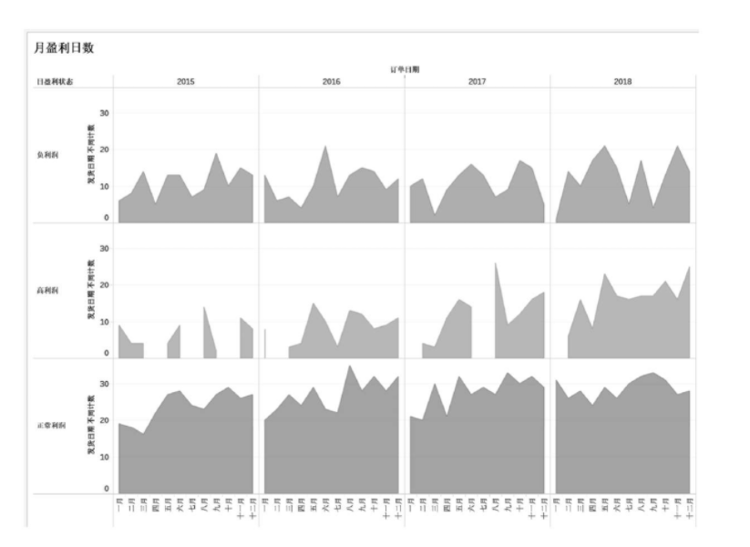
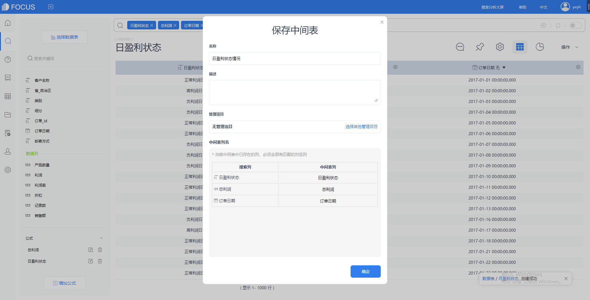

分类分析是指将不同的数值区间分别定义为不同的指标，例如将利润运营指标（KPI）定义为高盈利、中盈利亏损三种类型，通过计算公式，将销售订单归类，最终进行求和等分析。

分类分析分为两种：静态分类分析和动态分类分析。在静态分类分析中，分类的范围是写“死”的；在动态分类分析中，分类的范围通过参数是可以调整的。

> **静态分类分析**

> **商业场景**

在商业分析中，可以通过折线图加时间轴呈现数据的变化。但有的时候，分析师需要掌握更为细微的KPI。例如，将日盈利作为KPI，分为高利润、正常利润、负利润三种类型，并计算其在对应月中出现的次数。

> **可视化**

区域图（Area）。相比折线图，在区域图中通过对比面积更有利于帮助分析师分析数据，洞察其背后的变化规律。案例效果如图。

> **解题思路**

1. 按【订单日期】维度求出当日的利润汇总。（2）通过判断语句将销售日分为“高利润日”“正常利润日”和“负利润日”。

> **DataFocus实现步骤**

1. **导入数据表 超市数据**
2. **建立公式 sum(利润)，公式名为总利润**
3. **建立公式** 公式名为日盈利状态，公式内容为if 总利润>5000 then "高利润日" else if 总利润<0 then "负利润日"else "正常利润日"。

1. **搜索框输入 订单日期 总利润 日盈利状态**

得出日利润情况，以及将每日利润情况进行分成高利润日、负利润日、正常利润日三类。

1. **将其保存为中间表**

右上角点击保存为中间表，命名为日盈利状态情况。

保存为中间表的目的，是为了记录下日盈利状态这一列，日盈利状态这一列就是由原生维引申出来的派生维。接下来我们需要用这一列来进行分析。

1. 在搜索栏选择已经保存后的中间表
2. 建立公式 盈利状态天数

利用count计数公式来计算每种盈利状态分别有多少天。

公式为count(日盈利状态)。

1. 搜索栏输入日盈利状态、月盈利天数、每月
2. 可视化图表选择为面积图

x轴为订单日期每月，y轴为盈利状态天数，图例为日盈利状态。

最后的效果就是这样了。
