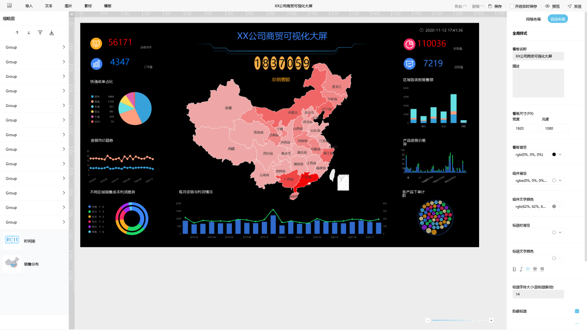
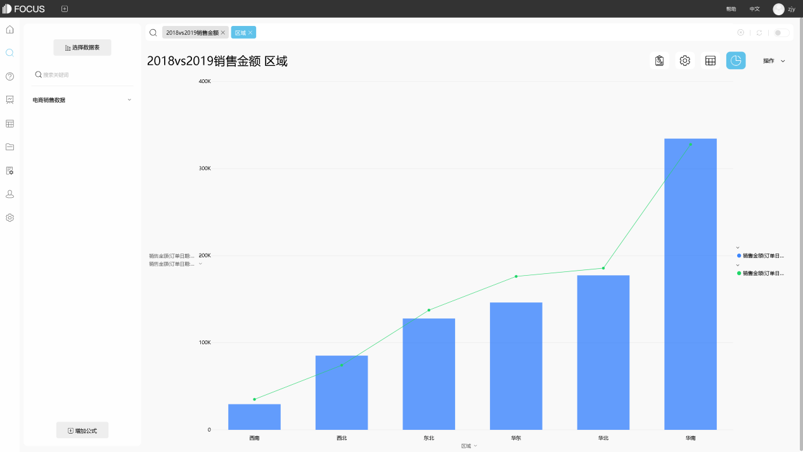
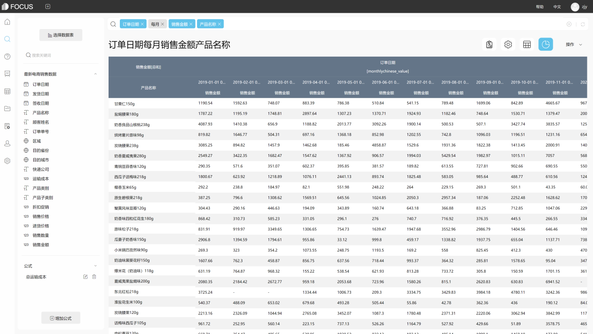

实施企业运营数据分析项目时，我们每天都在谈论数据指标，那么数据指标的用途是什么？建立数据指标的目的是什么？如何获得所需的数据指标？本文是第4篇从0开始构建自己的数据运算索引系统的文章。DataFocus将与您一起从数据指标的本质上谈谈数据指标的构建过程和逻辑。

数据指标的本质什么？“昨天，我的官方文章数量为6693，新关注者人数为89人，参加支票的人数为6人，净增加人数为83人。”每天我们都会看到各种数据指标，例如上面例子中的图形阅读量表示文章中的阅读次数，这在一定程度上反映了文章的受欢迎程度。新粉丝的数量代表了用户数量的增长，在一定程度上反映了用户的吸引力。 无论阅读量或新关注者的数量如何，都反映在通过数据量化某个业务问题的逻辑中。可以说，数据指标的本质是业务问题的量化过程，以及通过数据指标质量的客观响应。商业事实。

数据指标的分类与构建流程上面我们简单地弄清楚数据指标的性质。既然为了反映企业的发展水平，首先要了解企业的基本情况，确定数据指标。业务部门，业务流程和业务目标都是不可或缺的，我们构建数据指标的过程将从这三个部分开始。

通过最小的经济单位回应业务部门，通过业务流程模型反映业务逻辑，并通过运营目标反映业务方向。最低经济单位+运营目标将构建业务单位的基本数据指标，以量化业务单位的发展。例如，UV/PV等指标指的是业务部门。业务流程模型+运营目标构建业务关系度量，这些度量与业务开发过程中不同业务单位之间的数据更改相关。转换率等指标属于此类别。这些指标通常涉及多个业务部门并通过业务。该流程形成的数据指标可以反映业务单位之间不断变化的关系。此外，还有一个综合指标反映了业务发展的变化。这些指标通常是从业务单位指标的数学运算演变而来，例如普通用户增长率和每用户访问的平均页数（PV/UV）。

如何得到自己需要的数据指标？我提到了数据指标的分类和构建逻辑，但基于这些，我们无法获得所需的数据指标数据。那么数据来自哪里？作为数据运营商，我们需要根据数据指标询问数据。

在提取数据需求的过程中，您需要告诉数据工程师数据指标的定义。相应的业务部门是什么？数据指标的定义和计算公式是什么？与此数据指标对应的业务场景是什么？您定义的此数据指标的触发规则是什么？此外，它还涉及一些统计维度，现有数据指标的扩展，这些必须在数据对接需求中明确，因此最终形成数据需求形式。 开发人员在获得需求表时将评估数据要求。根据业务类型和数据源，数据开发人员将选择开发或购买外部第三方数据产品。这些产品或服务的最终反馈是相应的数据指标和相应的数据报告。

​数据指示器阶段仅完成数据收集问题。如果要完成数据指标的监控和优化，则需要在数据指标上构建框架来代表您的分析想法，您的业务重点和您的优化方向。

想咨询数据分析工具的，详情请移步DataFocus官网。
