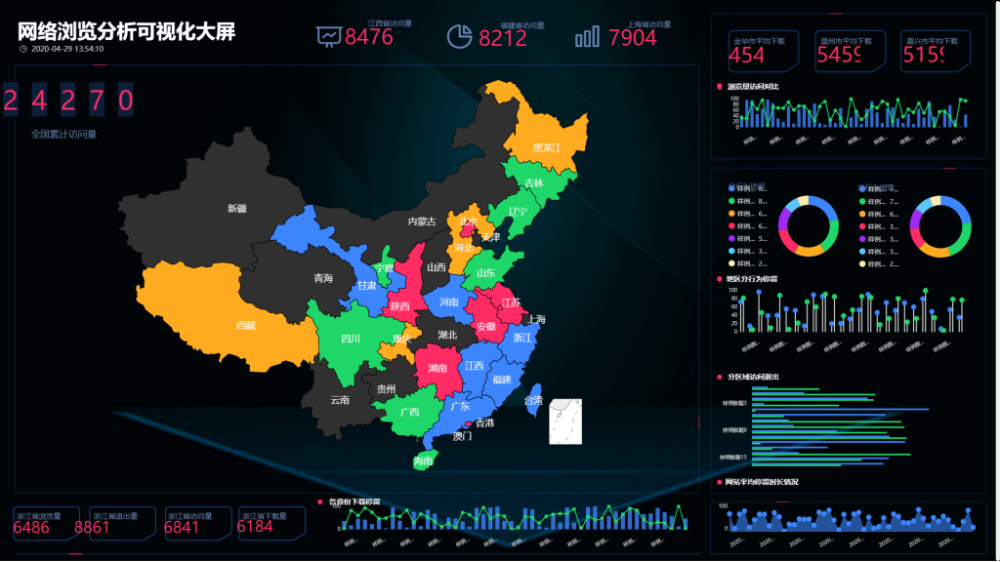
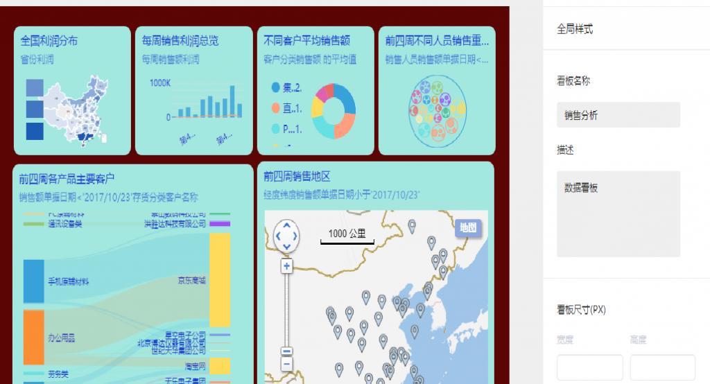

**在工业规模上智能使用大数据**

对全世界发展的洞察力得到了认可。“石器时代并没有因为缺乏石器而结束，但是石油时代在世界石油消失之前就结束了。"今天，我们生活在许多人所说的信息时代，绝对没有危险，尤其是当数据形式的信息被用尽的时候。人们普遍认为，我们被数据压垮了，使得存储、处理、分析、解释、使用和处理数据的能力成为优先关注的问题。对于大型跨国组织和受到严格监管的组织，如金融、医疗保健或涵盖多个垂直行业的行业，情况变得更加复杂，充满挑战。在互联网时代，大家愈来愈高度重视数据。在这个时期，数据的提高超出了传统式的数学计算。问题是，我们如何使用这些数据源并将其转换为可操作的信息？

**工业生产指数增长数据**

有许多来源预测到2020年及以后的数据呈指数增长。然而，他们都普遍认为，数字世界的规模至少每两年将翻一番，从2010年到2020年将增长50倍。人与机器生成的数据的总体增长速度是传统业务的10倍数据，而机器数据的增长速度甚至更快达到40倍。

**收集和分析数据，然后将其转化为可行的见解，这是一个复杂的工作流程**

它在无缝混合环境中超越了数据中心、边缘和云。利用边缘设备、原位计算和分析、集中存储和分析以及深度学习方法可以大规模加速数据处理，这需要新的技术方法。从历史上看，数据处理和分析系统具有用于业务分析和高性能计算工作负载的特殊功能。然而，随着大数据和基于x86的行业标准计算的出现，我们看到了大计算、大数据和用于分析的物联网的集成，这被归类为高性能数据分析。

**促进选用数据信息密集型测算的关键因素是必须在建立时迅速剖析可燃性的规模性信息量**

爆炸的一个重要后果是用户需要采用先进的数据分析技术，企业现在可以使用更便宜，更强大的计算平台，而Hadoop和Spark等现代分析软件可以针对各种用例进行实时分析，包括欺诈和异常检测，商业智能，亲和力营销，产品设计和开发，流程自动化。以及个性化医学。除了这些软件框架之外，它还可以增强数据流的存储容量和功能，并在本地进行分析。

**根据对最重要的数字化转型项目的调查**

受访者认为云转型/转变(66%)、互联网(32%)和大数据/认知解决方案(27%)是使用和开发大数据的主要衡量标准。云提供了可扩展性，而物联网构成了投资大数据和认知计算的基础。大数据分析预测，到2020年，50%的业务分析软件将集成基于认知计算技术的规范分析，高价值数据的数量将增加一倍，从而使60%提供给决策者的信息变得可行。

**数据增长挑战数据量的增长和速度的爆炸式增长带来了一些挑战：**

1、系统管理和集群日益复杂

2、数据中心电源、散热和占地空间限制

3、存储，数据移动和管理复杂性

4、缺乏对异构环境和加速器的支持

5、集成和管理大型数据生态系统的技能严重不足

6、基础设施推动改善

7、组织正在评估和实施基础结构以推动以下改进：

**管理大型数据基础设施的增长和运营成本**

1、提供弹性和弹性

2、确保各种工作负载的性能

3、快速部署和扩展基础架构

4、使用大数据即服务简化管理

我们的重点是工业化的大型数据基础设施——使数据生态系统具有成熟的操作能力，使在企业内部部署更加容易和更具成本效益，并将公司从概念验证（poc）转移到生产准备部署。

**关于工业规模大数据使用的本系列文章将涵盖以下其他主题：**

1、不断变化的数据格局

2、实现可扩展的数据湖

3、用以大数据分析的延展性服务平台

4、工作负载和密度优化系统

5、解决方案的五个组成部分
