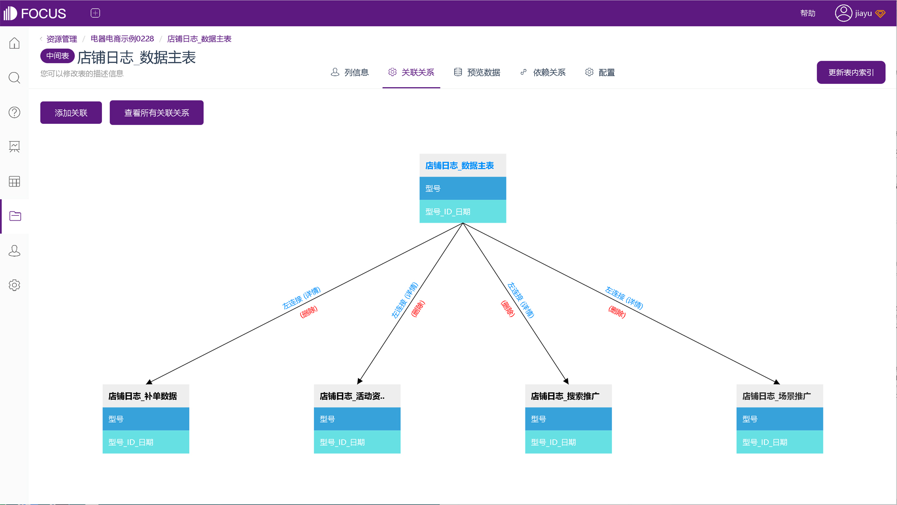
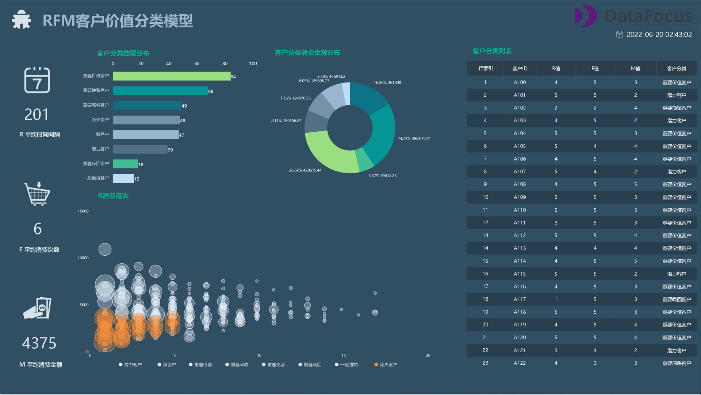

你了解数据建模么？你是否存在疑问：什么是数据建模？数据建模和数据模型有什么关系？

数据建模，通俗的说就是发现、分析和确定数据需求的过程。用数据模型的形式来表示和传递这些数据需求。

那么在数据分析领域中，数据建模和数据模型都有哪些含义？

## 1、**业务模型**

第一种含义，业务模型。该模型是指了解业务的整个过程，即业务是怎么发生的，就一家公司而言它是如何产生价值或者赚钱的。

以健身房为例，他的流量从哪里来？客户从哪里来？可以通过线上线下的广告推广来获取客户。他的客户如何转化？可以通过工作人员的服务、器械的试用来实现变现。如何才能做好流量与转化之间的承接？可以通过销售人员的邀约，带他们到店里亲身体验。

分析完成后，我们可以了解到一个简单的健身房业务模型，通过运营人员在线上或线下的广告投放获得客户，再经过销售人员的邀请实现客户到店，通过到店后的体验实现客户变现。

一个业务模型里，通常包含人、事、财、物四类。

## 2、**BI模型**

第二种，在数据库或BI工具中构建表关系或连接。将几个相关的表之间建立联系，使我们能更好地进行数据分析。

我们以BI工具DataFocus为例，在数据表详情页面，通过表中字段，可将多个渠道的店铺数据表进行关联，整合表中的数据以进行搜索分析。

 

表间的关联类型支持全关联、内关联、左连接和右连接。

BI工具是我们数据分析师建模时经常要用到的，但是数据库的表结构建模，一般都是数据仓库或管理数据库的同事来进行。

## 3、**数学模型**

第三种含义是数学模型，指可以按照一定规律进行计算的模型。像我们经常用到的评分模型，根据不同的维度进行打分，以得到综合评分；还有我们接触到的RFM模型、购物篮分析模型等等，都是通过计算来得到我们想要的结果。

这些模型计算出的结果能否解决业务问题，是我们需要重点关注的。

## 4、**算法模型**

第四种含义，是算法模型，比如我们在网购、浏览网页时，常常接触到的推荐系统，它会根据我们的行为，利用一系列算法，推荐给我们可能喜欢的内容。算法模型可能用到机器学习，也可能用到人工智能，但这些内容是数据挖掘工程师需要掌握的。

虽然数据挖掘也是基于业务，但数据分析师偏向于直接作用于业务，而数据挖掘是通过模型来间接作用于业务。

作为一名数据分析师，我们常用到前三种模型：业务模型、BI模型和数学模型。当然，如果你想往技术方面发展的话，也可以尝试数据挖掘，学习算法模型方面内容。
