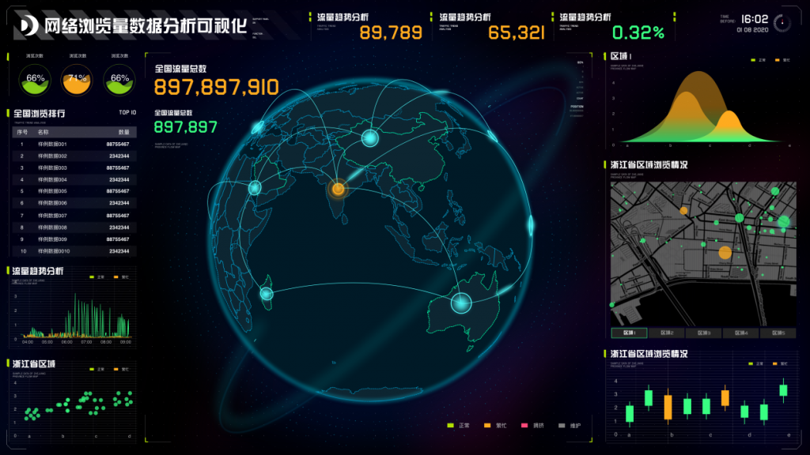

久而久之，就会产生更多的数据，并对其加以利用，大数据的应用范围将从简单的工程和软件开发领域逐渐扩大到其它领域，从而有助于我们简化过程、改进客户服务以及计算风险。

Peter Lyman和 HalR. Varian在2000年进行了一项史无前例的研究，使用计算机存储术语，他们的目的是要了解每年全球会产生多少原始数据。研究人员发现，1999年，世界范围内产生了约1.5 EB (约15亿 GB)的不重复原始数据。

十八年后的今天，我们正处在一个数据爆炸的时代。如今，只需一天产生的数据就能轻松超越这一数字。IBM称，目前每日产生25亿 GB的数据，而这一增长趋势并未显示出放缓的迹象。

各组织机构正以日益富有创造性的方式应对这种数据泛滥。最近，美国国家航空和宇宙航行局(NASA)宣布，它依靠其庞大的“经验教训”(Lessons Learned)数据库来计划未来的项目和太空探索。这一资料库收集了先前发射任务的经验。

这类“大”数据的这种依赖性在许多其他行业中也有表现。IBM对 WHO的数据进行了分析，以找出当地气候和温度对疟疾传播的影响； Mt. Hood Meadows滑雪场将追踪装置嵌入缆车系统，以帮助他们了解哪种缆车系统和滑雪场在哪一时段最受欢迎，从而减少排队等候时间。

所有这些还不包括消费者和企业每天不自觉地使用的许多算法，例如 Facebook上的社会媒体信息，以及众所周知的谷歌的莫测高深的排名算法。

这些关于数据的创新应用也引发了一个问题：大数据的前景如何？久而久之，就会产生更多的数据，并对其加以利用，大数据的应用范围将从简单的工程和软件开发领域逐渐扩大到其它领域，从而有助于我们简化过程、改进客户服务以及计算风险。

这里有一些大数据可以帮助你在将来提高与客户交流的几种形式。

**1.个性化**

当地的店主和杂货店老板还记得顾客来购物时的名字，并问候他们的家人，这在以前是很少见的。但是现在，由于企业和顾客之间的许多互动都是在网上进行的，所以零售客户可能会感觉不到这种人性化。

鉴于竞争如此激烈，缺乏人性将使企业难以吸引并留住顾客。个性化的目标营销，如果不能创造面对面的机会，则为建立数字化的人脉关系创造条件。Netflix就是这样一个成功的例子。它通过分析用户的观看习惯，为用户提供合理的观看建议，成功地发掘了大数据的潜能。

在个性化方面，我们可能会看到更多的大数据应用。最近几年来，我们看到越来越多的社交倾听工具(用于在社交媒体上进行相关的对话)被使用，这些工具使企业能够在一定程度上衡量消费者的行为，但仅凭它们的赞许、践踏和行为动机还不足以让企业真正了解其客户。

而且，大量的数据分析超越了这个限制，可以分析客户的全部数字足迹，让企业充分了解客户的兴趣、活动和未来行为。如今，先进的大数据和文本分析技术使得企业能够从非结构化数据中获得有价值的信息，弄清消费者喜欢什么，想要得到什么东西，想要与哪些人沟通，想要参与哪些活动。

公司不仅可以了解人们对体育的兴趣，还可以了解人们喜欢橄榄球，支持德克萨斯长角牛队，还有他们家的儿子即将毕业。与地毯式营销和人口统计学定向营销相比，这种方式能够更有效地帮助企业进行个性化的营销宣传，为长期、可持续发展奠定基础。

**2.身份认证**

据联合国贸易和发展会议统计，2013年至2018年间，预计全球在线购物人数将增长5倍。伴随着网上购物活动的不断增加，人们也越来越需要严格的认证。网络游戏、零售、影视等行业纷纷对有年龄限制的产品进行销售，但许多企业并没有完善的认证程序。

LexisNexisRiskSolutions最近对200位电商主管进行的一项调查显示，超过61%的受访者选择了自证其功，并通过勾选框或输入生日作为验证年龄的依据。

对于许多行业而言，缺少严格的认证是一个实际问题。游戏业尤其受到年龄限制的影响。但是，要在易用和有效的认证过程之间实现平衡是非常困难的。可以想象的是，企业希望线上购买产品或注册服务的过程是非常简单和高效的。

那是使用大数据的地方。尽管用户可以轻松地创建虚假的电子邮件地址或帐户，但是几乎不可能伪造一个数字化的、活跃的和相互关联的完整存在。如今，许多消费者都有了自己的网络生活，企业也可以与消费者合作，从而更好地利用网络。利用大数据分析工具，企业可以评估客户的数据质量和数量，确保数据的一致性、无价之宝和真实性。对于大数据的这种应用，可以帮助验证客户的真实身份，而不需要在易用性上做任何让步。

**3.防止欺诈**

像零售业和游戏业一样，金融部门可以使用大数据分析工具来避免身份欺诈，同时使消费者的旅行更容易、更省心。通常情况下，通过认证避免欺诈的过程是非常耗时的，比如，申请贷款或开设银行账户，通常需要消费者提供水电费账单或公开个人资料。

从这个角度讲，大量的数据是有用的。与需要顾客自我证明的企业不同，企业使用大数据分析工具，为消费者提供便利，同时避免欺诈。该工具允许银行等企业分析在线的个人数据，并根据已知的欺诈邮件清单进行审计。所有内容都是在后台实时完成的，也就是说不会影响客户体验。

由于大型数据产业的发展，很可能会有更多的公司使用数字化足迹技术。因此，数据分析将在企业与消费者的更多互动中起到一定的作用。

工程学和医学领域不断涌现出大量的大数据创新技术，公司利用这些技术来加强与客户的关系似乎已成为理所当然。只有这样才能带来更有价值的互动，更高效的消费体验，以及更高的品牌忠诚度，这肯定是件好事。
