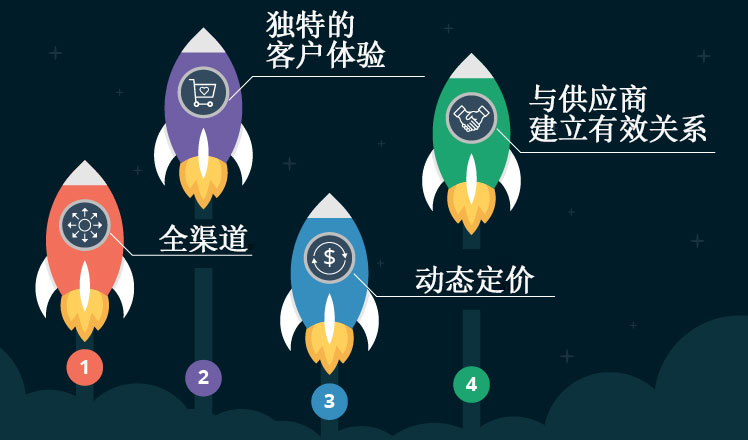

现在是四处看看和检查最新零售趋势的好时机。我们已经扫描了期望值，并选择了可能增值的想法。总结出还有另一个统一点：所有倡议都应得到数据分析的支持。让我们仔细看看所选的四个趋势。

## 1\. 走全渠道

零售业很久以前就开始超越实体店了。然而，许多零售商仍然考虑朝这个方向迈出第一步。如果您是其中之一，则需要适当的数据分析解决方案。

比方说，一家消费电子产品零售商同时经营实体店和在线商店。这家零售商的实体店销售业绩辉煌，而他们的网上商店则严重落后。当然，零售商对不带来销售的格式并不满意。然而，他们的电子商店真的没用吗？

在仔细查看了两个渠道的客户大数据后，零售商可能会发现以下情况：75% 的网站访问者正在在线目录上浏览，以比较产品功能并在其中一家实体商店完成购买。在这种情况下，如果零售商放弃网上商店，他们也可能失去大多数客户谁宁愿与另一个零售商购物的方式，他们认为方便。

## 2\. 创造独特的客户体验

客户在实体店和网上商店购物，参加忠诚度计划，创建购物清单，并在应用程序中下订单。总之，他们以不同的方式与零售商互动，并期望他们提供个性化的方法作为回报。作为零售商，您必须了解客户数据是多么珍贵，因此您应该努力通过有针对性的营销活动和产品优惠来回报客户。

假设你是药店零售商。您收集和分析客户数据以了解他们的行为和偏好。您的分析系统知道，客户 A 过去每月访问您的商店一次，购买 3 包尿布、X 品牌洗衣粉和 Y 品牌洗碗液。但本月，客户A没有出现。为了鼓励他或她参观您的商店，您可以给他们寄一个5%的优惠券，他们最喜欢的洗衣粉品牌。

作为数据分析的实际例子，我们选择了诺德斯特伦与他们的倡议储备在线 - 尝试在商店。他们的应用程序用户可以选择项目，并预订他们在一个特定的商店和在方便的时间试用。诺德斯特伦走得更远：零售商可以识别顾客是否经过他们的商店，并亲切地邀请他们进来。当任何人收到消息时， 他们怎么能无动于衷：_你好， 来自诺德斯特伦。看起来你在附近，你的项目准备尝试！_总之，一旦顾客在商店里，他或她就会在试衣间的门上找到他们的名字。下面是个性化的操作方法。

## 3\. 动态定价以保持竞争力

曾经的竞争情报对实体零售商来说是一个挑战。当然，竞争对手不愿意分享任何信息，竞争对手商店的价格监控非常耗时，容易出错和疲惫不堪。在电子商务时代，零售商可以从竞争智能的新方法中受益。根据定义，网上商店是公开的，很多信息，如产品细节，促销优惠，价格和类别层次结构总是在手。当系统能够实时扫描竞争对手的价格时，这一切都使动态定价成为可能，并且非常快速地运行复杂的分析，并根据定义的规则自动更改零售商的价格。现在，如果一家电子商务零售商希望比竞争对手便宜 5%，那么通过大数据分析，他们能够做到这一点。

实体零售商也可以依靠大数据分析，尽管前一段时间他们遇到了一些实施限制，因为商店员工不得不手动更换价格标签，这很费时。随着电子价格标签的发明，实体零售商也开始获得动态定价。系统无需在分析销售、库存、竞争对手价格、客户需求、保质期等方面进行价格变化。

## 4\. 与供应商建立有效关系

作为行业基准，沃尔玛制定了如何与供应商合作的规则。这项政策可以为沃尔玛增加10亿美元的收入。零售商已实施计分系统，根据_按时、全员_原则对供应商进行评估。简单地说，无论是交货迟到还是提前，供应商都应该支付罚款。如果供应商及时交付，但货物数量错误、质量差或包装损坏，则同样的情况也有效。

如果您要遵循沃尔玛的最佳实践，您也可以考虑调整您的数据分析系统，以区分战略和非战略供应商、关键产品类别和非关键产品类别。此外，您可以设置不同的阈值。例如，麻烦交货的临界数量可能是 10%。

有了这样的评分系统，零售商将很容易识别供应商是否可靠。此外，这种方法将有助于更有效地进行库存管理。因此，零售商因库存过剩和库存过剩而持续头痛的问题最终应该会消退。

## 总结一下

零售商的愿望不会随着时间而发生重大变化。更好地满足客户需求、超越竞争对手以及与供应商建立有效关系是每个零售商愿望清单中的重中之重。尽管零售行业不断发展，并出现了解决日常和战略挑战的新复杂方法，但这并不能保证每个零售商都能达到预期的效果。但是，通过[数据分析](https://www.datafocus.ai)支持这些计划可以带来改变。
