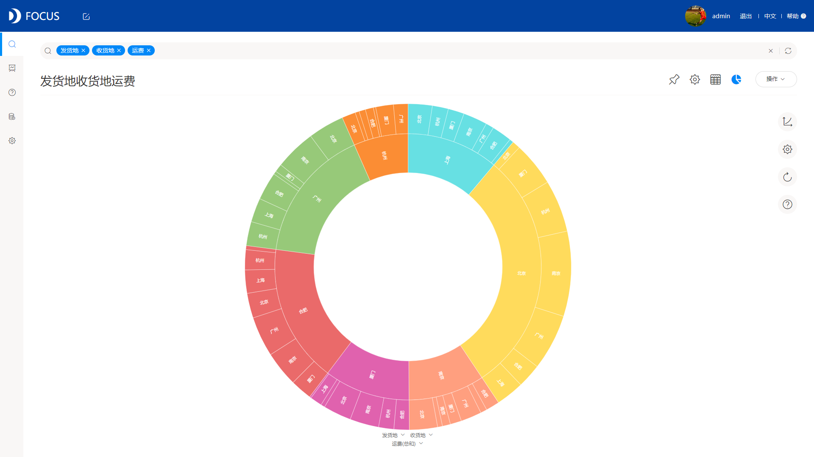
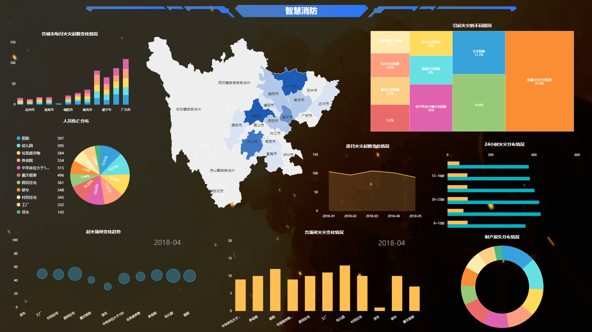

看到标题，有人就问了，数据分析也有艺术吗？如何理解数据分析的艺术呢？

数据分析的艺术，不是传统意义上大家所理解的艺术，而是关于数据的行为艺术，分析的行为艺术，以及数据可视化的艺术。那么什么是行为艺术，什么是可视化艺术呢？

数据行为艺术：

数据最关键的是什么？是准确性和严谨性。数据分析的数据来源于企业各个不同的业务系统，数据源繁多而复杂，可能会遇到各种问题，而数据的行为艺术，就是解决这些问题，通过统一数据格式，替代缺失值等方法。

分析行为艺术：

数据分析的关键在于工具的使用，一款好的数据分析工具，能辅助你做出更好地分析。分析的行为艺术，就是利用数据分析工具，对数据进行汇总分析的过程，而且要求过程简便高效新颖。DataFocus独有的搜索式分析，就是最好的例子。

可视化艺术：

说到可视化艺术，很多人可能觉得可视化的艺术在于“酷炫”，但其实可视化艺术是在于“人性化”而不是“酷炫”，为什么这么说？因为可视化主要是让用户能够更加清晰的知晓数据之间的规律逻辑，所以无论从图表的选择还是大屏中的展示位置以及图表的配色，都要以人为主，以人的视觉习惯为主，从而才能达到可视化的目的，这才是可视化的艺术。

如上图DataFocus做的可视化，配色美观，主题鲜明，能够直观地感受到数据之间的规律变化。

有时候，我们可以在专注于分析的过程中，也讲究下数据分析的艺术。
