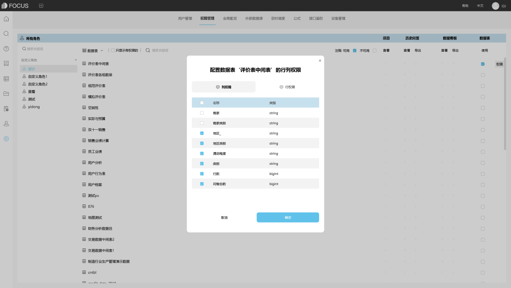

其实数据可视化 BI所呈现的就是数据分析的结果，在不考虑形式和表现方式的情况下，需要保证数据的精确性和可用性。其在进行数据分析时都会采用相应的工具，datafocus就是较都人所认可的。今天小编帮大家介绍一下有关数据可视化 BI的基本原则的总结。

1、知道数据可视化 BI的目的

数据可视化 BI的结果需要呈现的是什么样的数据，是针对一个活动的分析还是针对一个发展阶段的分析，想要看到什么样的问题，是用户的研究还是销量研究？这些是进行数据分析的过程以及数据可视化 BI结果的出发点。

2、注重数据的比较

想要数据反映出问题，就必须有比较，比较是一种相对的变化，不仅仅是在于量的呈现，比较可以看到问题的存在性，比较一般分为同比或者环比两种，是使用比较多的。

3、建立数据指标

在数据可视化 BI的过程中，建立数据指标才会有对比性，才知道标准的位置在哪里，也知道问题在哪里，数据指标的设置要结合自身的业务背景，科学的进行设置，不能凭空拍脑袋。因为受众可以根据现有的数据指标进行思考，而不是仅仅呈现一个数据形式。

4、展示的形式从总体到局部

数据可视化 BI的制作过程要有一个逻辑的思路，先从总体看变化，在从局部看变化，才会有问题的针对性解决办法。

5、也要注重听觉上的描述

在继续一个数据可视化 BI报告的时候，也是数据分析师个人对数据分析过程理解程度在哪里的时候，一般听取报告的人员都是数据的专业技术人员，所以在口头上能不能给听众很好的听觉描述也是一个很重要的过程，只有两者整合的比较好，才会产生更大的效果。

6、增加图形的可读性和生动性

在保证基础的数据标注你的基础上，可以让数据表格或者数据图形呈现的方式更加的多样化，让观看者的接受度更高，这一个方面就要在设计上多下功夫了。

其实作为数据分析师对数据可视化 BI的基础原则应该都是很了解的。数据可视化 BI其实就是数据分析之后的整个结果，不管是有图像还是图表都是可以的，所以大家对于以上这些知识都看看，如果还有什么不懂或者想要了解的，可咨询网站小编。
