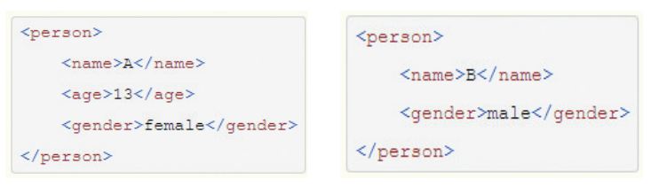
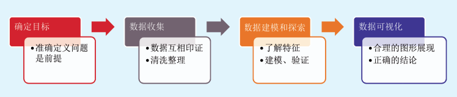

###  数据结构

（1）**结构化数据**

IT系统产生的数据，一般根据数据结构模型分为**结构化数据、半结构化数据和非结构化数据**。大部分关系型数据库中存储的数据，有着优良的存储结构，我们称之为结构化数据。

大部分结构化数据可以简单地用二维形式的表格存储。如表2-1，一般以行为单位，一行数据表示一个实体的信息，每一行数据的属性是相同的，它记录了人员的姓名、年龄、性别以及编号。

表2-1 二维表格示例

结构化数据的存储和排列是很有规律的，也便于查询、修改。但是，它的扩展性并不好。比如，表 2-1中，如果要临时增加一个身高的字段，就不能直接记录，必须先修改表格的结构才能办到。

（2）**半结构化数据**

半结构化数据是结构化数据的一种形式，它并不符合关系型数据库或其他数据表的形式关联起来的数据模型结构，但包含相关标记，可用来分隔语义元素以及对记录和字段进行分层。因此，它也被称为自描述的结构。半结构化数据，属于同一类实体可以有不同的属性，即使它们被组合在一起，这些属性的顺序也并不重要。

常见的半结构化数据有XML和JSON，图2-1为两个XML格式的数据记录。

图2-1 XML数据结构示例

从上面的例子中可以看到这些记录，其属性的顺序是不重要的，属性的个数也可以是不一样的。这些半结构化数据的结构类似树或者图。图2-1可以看出，<person> 标签是树的根节点，<name>和<gender>标签是子节点。通过这样的数据格式，可以自由地表达很多有用的信息，包括自我描述信息（元数据）。所以，半结构化数据的扩展性是很好的。

（3）**非结构化数据**

顾名思义，非结构化数据就是没有固定结构的数据。各种文档（如word、pdf、ppt）、图片（jpeg、png、gif等）、视频、音频等都属于非结构化数据，如图2-2。对于这类数据，我们一般采用二进制的数据格式直接整体进行存储。

图2-2 非结构化数据

非结构化数据分析起来难度大，也不那么直观，比如视频、音频数据，或一些文件、网页等等，这些数据一般存储在NoSQL数据库或者文件存储系统中。本书讨论的数据可视化，主要是指结构化数据的可视化。

### 结构化数据的类型

结构化数据的字段类型简单来分，可以分为**数值型（****Measure****）数据**和**非数值型（****Attribute****）数据**。其中，**数值型数据是可度量的数据**，比如记录的“学生成绩”或者“销售收入”，可以用来求和，计算平均值、最大值或最小值等。

**非数值型数据又称为属性数据**。可以细分为**字符串（****String）类型、日期时间（Timestamp****）**两大类。字符串一般用来表达多种类别，如“男”“女”；或者“广东省”“浙江省”等等。字符串类型的数据是不能进行求和（Sum）等计算的，但是可以用来计数（Count）或计算分布。日期时间是一种特殊的属性数据，有顺序和周期的特性。时间序列往往支持一些特殊的聚合操作，比如可以对日期时间数据按周、月、季度、年进行统计。

结构化数据的类型概念非常重要，在接下来的可视化分析章节中，我们将看到，DataFocus系统需要我们有效识别数据类型，才能合理地做出数据分析和可视化呈现。

### 数据科学及过程

和大多数数据分析业务一样，数据可视化也非常注重科学实践。好的数据分析方法往往能事半功倍。通常，要让数据可视化项目获得成功，分析人员必须分五个步骤（图2-3）进行：

**◎ 定义问题；**

**◎ 获取数据；**

**◎ 数据建模；**

**◎ 探索数据；**

**◎ 可视化和分享结果。**

其中，大部分人可能会认为第一步是最简单的一步，其实定义问题往往是最困难的部分，也是最重要的部分。定义问题决定了你的工作方向，因此多花点时间把定义问题弄清楚总是值得的。

一旦你确定了需要关注的问题，接下来就需要全力收集回答上述问题所需要的数据。数据可能来自多个数据源，唯有全面收集到所需要的数据，才能为解决问题奠定基础，所以这一步非常具有挑战性。

有了数据以后，应用我们所学的知识，将现有数据进行归类整理，将一些结构不规范、零散的数据进行清洗、关联，创建数据模型，为后续使用DataFocus进行分析创造条件。接下来，就是发挥分析师逻辑思考能力和想象力的时候了。对数据进行有效的探索，逐步揭示出事物运行的规律，找到解决问题的钥匙。探索分析过程往往需要大量尝试和重复操作，这个时候，高效的探索分析工具显得尤为重要。最后，将您的发现和成果有效进行展示和分享，这是传达整个数据分析项目价值的关键一步。分析结果也许看起来非常明显和简单，但将其总结为他人易于理解的形式比看起来困难得多，优美的可视化展示可以高效地传达数据信息，提高成果交付率。

图2-3数据可视化的关键步骤

### 小结

本章概述了数据结构的基本知识，介绍了结构化数据的具体类型：存储于二维表中的数值型数据和非数值型数据各自对应着不同的统计计算和数学操作，这是数据可视化的基础。
