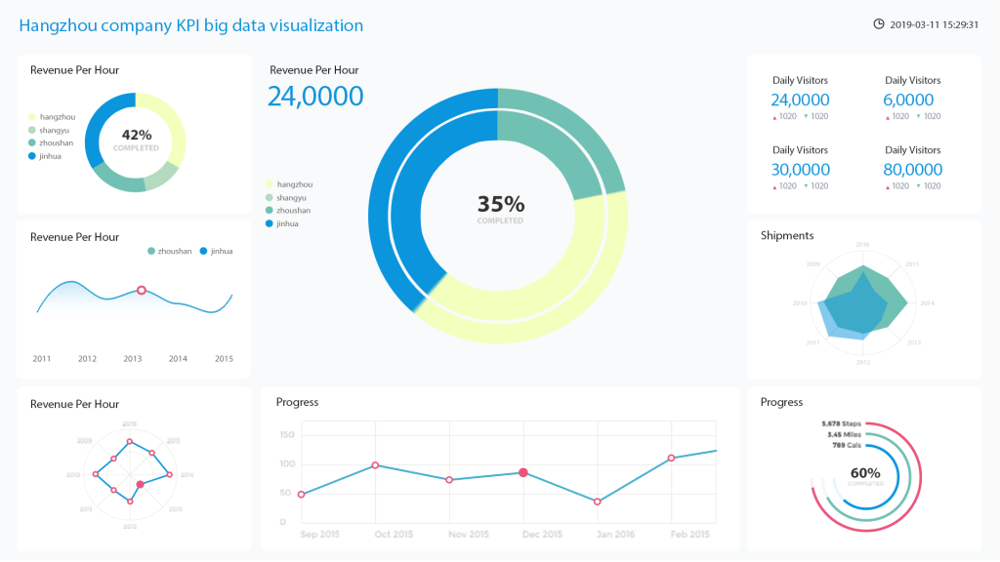

目前，说道数据可视化，这样的事项在很大程度上就体现的就是信息图形、信息可视化、科学可视化以及统计图形密切相关。当然，在研究、教学和开发领域，数据可视化乃是一个极为活跃而又关键的方面。对此datafocu企业该怎么诠释这样的概念和应用的范畴，一起来看看吧？

第一、数据可视化基本概念：

①数据空间：这也就是说该类型是由n维属性和m个元素组成的数据集所构成的多维信息空间；

②数据开发：是指利用一定的算法和工具对数据进行定量的推演和计算；

③数据分析：指对多维数据进行切片、块、旋转等动作剖析数据，从而能多角度多侧面观察数据；

④数据可视化：是指将大型数据集中的数据以图形图像形式表示，并利用数据分析和开发工具发现其中未知信息的处理过程。

第二、主要应用

其实，数据可视化分析就是根据报表类型，将JReport，Excel，水晶报表，FineReport，ActiveReports报表等融合在一起。完事大家采用BI分析工具，如Style Intelligence、BO，BIEE,Yonghong Z-Suite等。目前国内的数据可视化工具，有datafocus商业数据平台-个人版，大数据魔镜，数据观，等等领先指导。

以上，就是关于数据可视化基本概念和一些应用的范畴去诠释的一种话题，但是不管怎么说，大家都应该知道datafocus企业对此付出了很多的心血。
