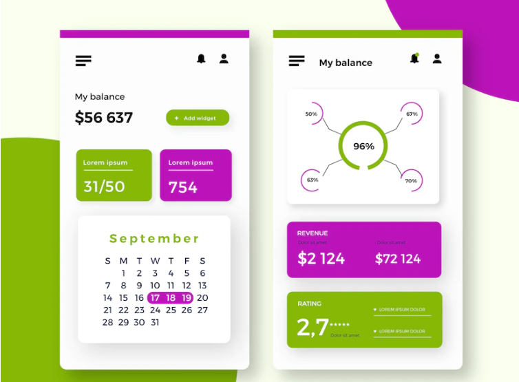
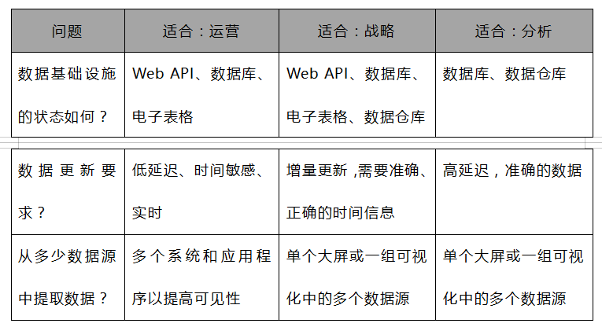
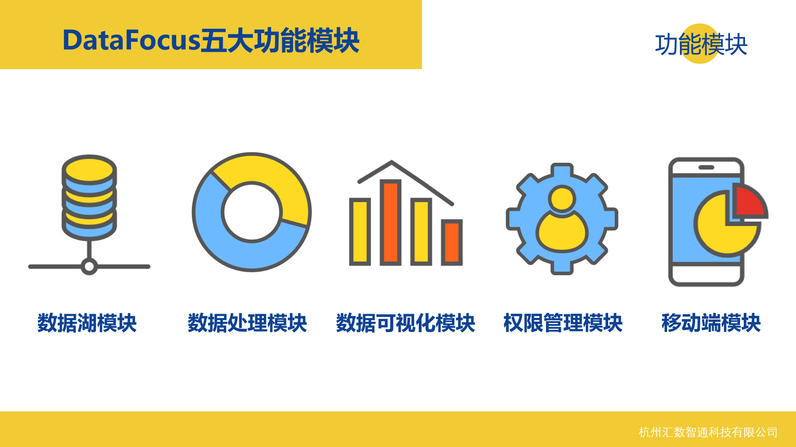

数据大屏、数字大屏、可视化大屏、仪表盘、数据看板......

它有很多名字！它们无处不在！！

我们日常生活中，每天都会被各种不同的数据大屏所包围，从汽车仪表盘到手机APP上的可视化大屏再到数字电视上循环播放的数据大屏，数据和可视化于我们触手可及。

我是一个狂热的数据分析爱好者。市面上常见的数据分析工具我都有所涉猎，不能说我是最了解数据大屏的，但我希望能和大家分享我对数据大屏的理解和经验，希望今天的内容能加速您的业务增长。

让我们开始吧！

## **什么是数据大屏？**

数字大屏是一种信息管理工具，可用于跟踪与业务、部门或特定流程相关的KPI、指标和关键数据点。举例说明，DataFocus工具整合多个来源的数据，如数据库、本地文件等，通过图表将聚合结果进行展示，整合多个图表问答制作出一个数据看板。这个数据看板可以显示表达数据趋势、筛选联动并且实时监控企业业务绩效。这就是数据大屏是整体制作流程。

对于企业而言，每一步操作都可能会影响到最终的收入绩效。而随着数据的日渐积累，管理并从中提取有价值的信息变得越来越难，通过数据大屏简化数据分析，并帮助企业依据数据更科学、更智能、更快更好的制定决策。

### **数据大屏和数据报告的差异**

虽然这俩名字听起来十分相似，但其实两者之间存在一些重要的区别。

先来看看相似之处：

- 提供历史数据
- 整合多个指标

不同之处在于：

- 报告是**静态**的，数据大屏与实时、动态更新的数据**交互**
- 报告的宗旨是**共享**已知兴趣领域或目标的信息
- 数据大屏则是**监控**已知兴趣领域或目标的信息
- 一般情况下，报告制作完毕后不再进行修改，而数据大屏则是可以通过筛选联动等功能对展示结果进行灵活加工

### **可视化图表选择**

为数据大屏选择正确的数据可视化是大屏设计的关键要素。选择标准是，首先必须遵循数据变化趋势，其次才是美观。例如，查看与时间序列相关的变化趋势，一遍建议用折线图；分析两个数值之间的相关性，会用到散点图或气泡图。这些都是非常基础的常识，在遵循这些准则的基础上，调整美化图表，最终帮助用户在图表中轻松找到数据变化趋势。

这里提醒一点，如果你实在不知道如何选择图表，可以在数据分析时，借助一些智能工具，比如说DataFocus，DataFocus会自动根据输入搜索框内的字段属性看，选择最恰当的图表类型进行可视化，免除你的后顾之忧。

## **数据大屏的类型**

数据大屏主要可以归纳为三种类型：运营、战略和分析。用一句话概况的话：

- 操作大屏告诉您现在发生了什么
- 战略大屏跟踪关键绩效指标
- 分析大屏处理数据以识别趋势

### **什么是操作大屏？**

“现在正在发生什么？”

操作大屏可以回答这个问题。一般来说，操作大屏的数据可以设置为实时更新，监控关键指标和KPI数据。操作大屏旨在集成到日常工作流程中，通过上下文信息，探索数据并将其用于决策。

可以在操作大屏上跟踪的指标：

- 社交媒体中内容的平均展现和点击率
- 社交媒体的内容参与情况，点赞、评论、转发等

_DataFocus操作大屏示例_

### **什么是战略大屏？**

管理人员使用战略大屏来监控KPI的状态，辅助高层制定公司战略。战略大屏数据更新频率可以低于操作仪表板，选择每天更新一次，并且总结一段时间（日/周/月/季度/年）的绩效。

可以在操作大屏上跟踪的指标：

- 每月、每季度或每年的财务业绩
- 客户流失和MRR增长

_DataFocus战略大屏示例_

### **什么是分析大屏？**

分析大屏主要通过大量数据的分析，总结趋势、预测结果、发现洞察力并根据对历史数据的洞察力建立目标。

一直以来，分析大屏主要是由数据分析师开发和设计的，但近年来，像DataFocus这一类无代码分析工具的兴起，大到经理高管，小到普通销售人员，没有代码基础的普通员工也具备了自己上手操作数据分析的能力。分析大屏也不在 那么高不可攀。

可以在分析大屏上跟踪的指标：

- 总结问卷调研结果，用户画像等
- 衡量用户行为分析
- 了解一段时间内每日活跃用户的增长情况

 

_DataFocus分析大屏示例_

## **选择合适的仪表板**

### **根据业务报告要求选择正确大屏**

下面这张表可以帮助企业判断最适合业务目标的数据大屏类型。通过确认需处理的问题或想要实现的目标，确定使用的数据大屏类型；基于大屏受众，对看板内容进行个性化定制等。

### **根据技术报告要求选择正确大屏**

这里提出的是一些以技术为中心的问题帮助进一步定位数据大屏的类型。这里强调一点，大多数情况下，这三种类型的数据大屏也不是单打独斗的，可以混合所有三种仪表板类型以获得最终成功。

## **帮助入门的3个看板设计技巧**

希望您在构建和共享数据看板时可以谨记以下3个小tips。

**1.在设计看板时考虑到您的受众**

有效的数据看板需要做到传达清晰信息。毕竟，数据看板是一种交流工具！有效沟通的第一条规则是定义你的受众。

设计之初，就必须了解谁将使用以及将如何使用你的数据看板。根据定义的受众，可能需要在电脑端、手机端或者电视上查看数据看板。必须提前考虑这些问题。

**2.确定您的关键指标**

“我想解决什么问题？”

数据看板的内容取决于您要跟踪的指标和KPI。如果首先确定重要的指标，那么对看板最终的呈现结果也会有一个基础的把握。

**3.测试、评估和调整**

在制作或使用完数据看板后，团队可以征求一些反馈和建议来改进看板的实用性。用户生成的反馈使看板能够做出有益于整个团队或组织的调整，使其更有效并继续满足受众的目标。不要害怕寻求反馈！它将使您成为更好的数据看板设计师。

## **为什么需要业务大屏？**

数据大屏很重要，它降低了数据分析的难度，使数据分析更具可操作性。使用数据大屏，可以帮助分析师们节省时间，提高工作效率，节约部门之间的沟通成本，还大大提高了数据分析的性能。

如果正确使用，数据大屏可以显着影响业务绩效。以下是业务大屏的三个常见用例。

**1.从数据中获取更多价值**

数据是企业拥有的最有价值的资产之一。但如果不能加以使用，那可能只是一堆数据垃圾。

精心设计的数据看板是一种强大的工具，可以通知和实现跨职能协作，同时为核心业务指标提供生命线。团队中的每个人都可以使用数据大屏并收集有意义的见解，这些见解可能会影响您的业务或决策方式。

**2.整合和自动化多个数据点**

通过可视化工具，摆脱了数据孤岛，将多种来源的数据整合到一起，加强了数据的联动性，也大大节约了分析所需的时间和精力。

**3.调整团队和部门**

数据不会说谎。在跨职能协作方面，数据大屏提供了当前绩效的客观视图，可以作为进一步讨论的共同基础。数据大屏以相互理解的方式显示与每个团队相关的指标。

此外，使用电视大屏等工具，可以将数据大屏投射到办公室的屏幕上，使数据更有透明度，同时方便所有团队始终可以查看和访问最重要的指标。

以上就是对数据可视化大屏的介绍，包括其类型及意义，以及一些需要注意的要点。数据大屏并不仅仅是为高管们准备的，运营团队、销售团队甚至普通的基层员工，都可以从数据看板中受益。

希望这篇文章的内容对你有所帮助，欢迎订阅关注~
