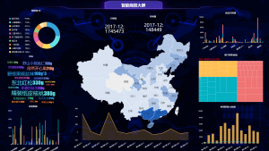
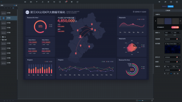

数据可视化就是把相对比较复杂、极为抽象的数据通过人们极容易理解的方式展现出来。在当前datafocus数据分析系统的支持下，可做到交流和互动。而今天小编要介绍的内容就是数据可视化大屏，而它的设计原则是怎么样的呢？不要着急，咱们接着往下看。

数据可视化大屏：拥有“大面积、炫酷动效、丰富色彩”，大屏是很容易在观感上给人留下震撼印象，还便于营造出一些较为独特的氛围，和打造出仪式感。而且利用面积大、可展示信息多等的特点，通过把关键信息通过大屏共享的方式，来方便团队讨论和决策。而大屏也常用来做数据分析监测使用。数据可视化大屏目前主要有信息展示、数据分析及监控预警三大类。

1、设计服务需求

大屏设计时一定要避免因为展示而展示，其排版布局、图表选用等都应该服务于业务，所以设计大屏是在充分了解业务的需求基础上才进行的。所谓业务需求就是需要解决的问题或者是达成的目标。而设计师通过设计的手段帮助相关人员达成这个目标，是数据可视化大屏的价值所在。

2、先总览后细节

大屏因为大，承载数据多，所以为了避免观者迷失，大屏信息的呈现需要有焦点和主次。可通过对比，先把核心数据抛给用户，在用户理解了大屏主要内容和展示逻辑之后，再进行逐级浏览二三级的内容。而部分细节数据可先暂时隐藏，在用户需要时可通过鼠标点击等交互方式来唤起。

以上就是有关数据可视化大屏设计原则的总结，我们深知，数据对于每一个企业来说都是很重要的，而datafocus品牌下的数据可视化大屏在数据分析和呈现阶段就能提供很好的帮助。
