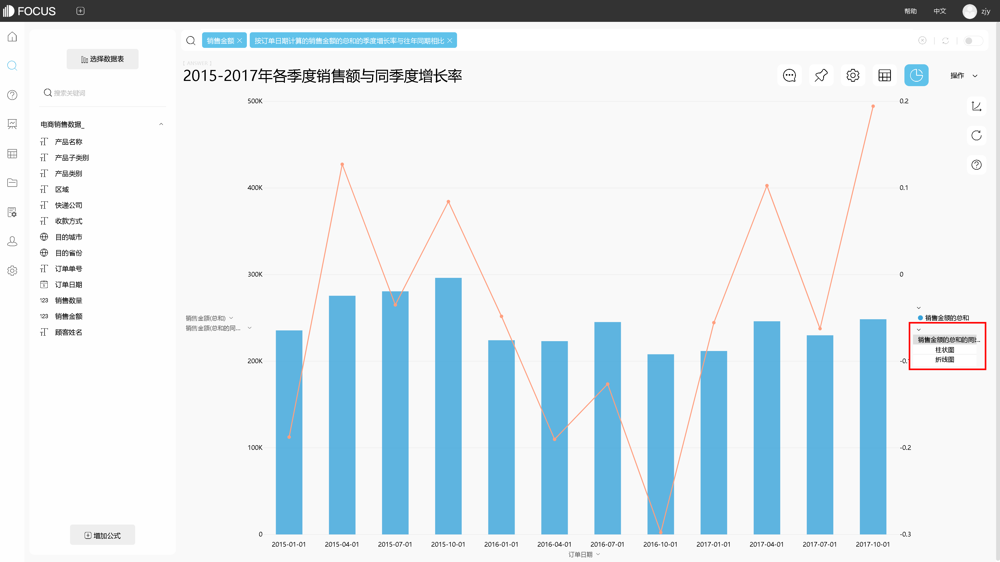
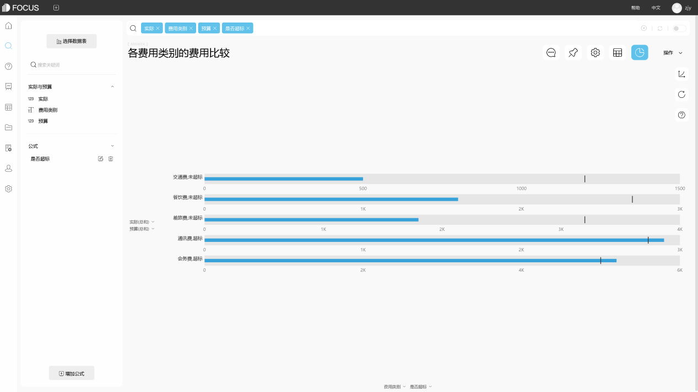
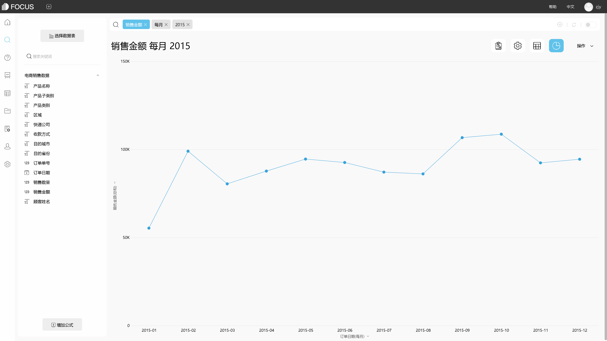

数据时代已经到来。数据可视化工具的使用已成为企业和机构迅速取胜的法宝。良好的数据可视化工具可以在企业的数据运作中发挥重要作用，可以提高分析效率，降低分析成本。今天，我将向您详细介绍数据可视化工具的特性。

1.有许多种数据可视化学品，可以说是无穷无尽的。基本上，每种语言都有自己的可视化库。一些传统的数据分析和软件也扩展了某些可视化功能。数据可视化工具具有完美的信息和改进数据价值的作用。

2.数据可视化工具具有很强的实用性。这是一个爆炸性的需求，可以适应当前大数据时代不断增长的数据量。它可以快速收集分析数据，并可以实时更新数据信息。

3.操作非常简单方便。该数据可视化工具具有操作方便的特点，能够满足快速发展的特点，能够对网络信息的瞬时变化做出及时，准确的响应。

它的表现更丰富。数据可视化工具可以满足数据表示的多维要求，并支持多种数据集成方法，数据源不仅限于数据库，支持数据和文本、数据仓库，团队协作等。

可以看出，数据可视化工具在一定程度上是互联网和数据发展的产物。它的出现提高了企业的效率，企业做了大量无用的工作。使用时，它可以通过非编程和编程。两个工具用于实现从艺术角度创建的数据的可视化。它是艺术家提供的编程语言，可用于数据分析或图形处理。DataFocus作为新生代的数据分析工具，有着最新的分析方式——基于自然语言分析的搜索式分析，以及严谨细致的行列粒度数据权限管控和安全的私有化部署方式，助力与您的企业构建数据分析系统。

