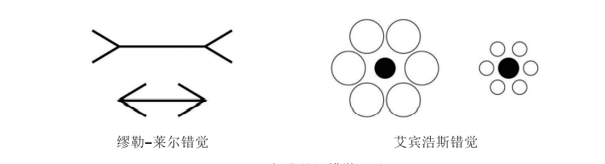

### 1   人类视觉感知的特点

我们可以用眼睛、耳朵、鼻子等各种感官来接触、感受、理解这个世界。科学研究表明，进入大脑的信息有75%来自视觉，进入或离开中枢神经系统的纤维细胞占 38%。而视网膜上有 1亿个传感器，但只有 500万个能够将信息从视网膜传递到大脑。这表明，实际上眼睛处理的信息要多于大脑处理的信息，可以说眼睛过滤了信息。

也许人类最有价值的器官就是眼睛。正是因为人类具备了优良的视力，所以才能在狩猎或采集活动中保持较高的效率，判断环境的风险，很好地躲避猛兽的袭击。人类对于信息摄取的速度，视觉器官是占绝对主导地位的。因此我们可以充分利用人类最为高效的信息获取器官——眼睛，来快速吸收、加工和处理信息。在越来越强调效率的今天，与其听长篇大论的汇报，还不如亲自看看来得快。

_“视觉感知并非是记录刺激物质的被动过程，而是大脑的主动关注，视觉是选择性的工作，对外形的感知包括对形式分类的应用，因其简单性和一般性又被称为视觉概念。”_

_——奥恩海姆《视觉思维》_

人类的视觉同样存在诸多缺陷。比如，人们在已有的认知或经验的基础上，视觉系统对客观事物进行了某种最合理、最可能的解释，但在特定条件下，这种解释往往容易产生偏差，就形成了错觉。举个例子（图3-1）：缪勒\-莱尔错觉（Maller-Lyer Illusion）发现末端加上向外的两条斜线的线段比末端加上向内的两条斜线的线段看起来长一些。而著名的艾宾浩斯错觉（Ebbinghause Illusion）则表明人类对圆形大小的感知极易受参照物的影响。诸如此类人类认知的视错觉还有很多。

图3-1 经典的视错觉图形

### 2   视觉可视化的基本原则

那么同样是运用视觉，什么样的数据可视化才最有价值呢？人类经过漫长的进化，视觉系统接受和加工信息已经形成了一些独特的规律，我们正是要充分理解这些视觉特点，将数据信息加工成适合人类快速接受的方式，同时规避一些人类视觉的缺陷（比如一些错觉），使得信息以不容易造成偏差的方式高效组织，并向人类传递。

数据可视化方式多种多样，每种不同的展示方法都从特定的视角表达了信息。好的数据可视化设计原则，可以很好地向读者展示数据的内在规律，能够快速抓住读者的眼球，同时避免传递错误信息。我们把结构化数据分为数值型数据和非数值型数据两大类型。而人类可以从数据中观察到的模式则包括局部与整体、趋势、偏离、分布、相关性、可比性等等。

通常用来进行数据可视化的基本图形包括柱状图、饼状图、折线图、散点图和地理位置图等，由这些基本图形又可以衍生出更多，比如DataFocus中就包括近60种可视化图表类型。在进行可视化设计时，请谨记十大原则：

- 一个类别只用一种颜色表示；
- 排序和分类要符合逻辑，比如从大到小等；
- 使用标注突出重点信息；
- 展示多种数据时尽量用可对比的方式进行；
- 减少不必要的标签；
- 不要使用高对比度颜色组合，如红色/绿色或蓝色/黄色
- 尽量不要使用三维图表，避免错觉；
- 尽量减少阴影和装饰，避免分散注意力；
- 单个图形颜色不要超过6种；
- •不要用分散注意力的字体或元素（如粗体、斜体或下画线）。

### 3   沟通：信息传播与交流

沟通无处不在，无论是我们与身边的朋友聊天、和讨厌的人吵架，还是通过键盘鼠标浏览新闻、通过智能手机的触屏围观抖音小视频，我们都在传播或接受信息。事实上，天才科学家香农和他的合作者韦弗很早就发现了这个秘密，他们为信息传播的方式建立了一个简单的数学模型，如图3-2。

图3-2 香农\-韦弗信息沟通模型

从模型中我们可以看出信息传播（沟通）包含了信源、编码、信道、解码和信宿5个步骤，以及过程中存在影响的环节，比如对信道的干扰，通过信宿反馈以获得更新的信源。用通俗的语言来讲，信源就是讲话者想表达的意思，经过语言编码通过嘴巴说出去，这些话的声音（信道）被接收者的耳朵听到（解码），转变成了接收者的理解。

根据我们的经验可以知道，如果对话者具有相同的知识背景，沟通一般比较顺畅，否则就会出现鸡同鸭讲的尴尬场景。比如，假设你和朋友正在聊关于 2019年 NBA总决赛第5场发生的事情。你对朋友说：“嘿，你知道吗，杜兰特又受伤了，他这个伤搞不好整个赛季都要报销，离开勇士队也可能泡汤了。”如果你和你的朋友都是NBA联赛勇士队的球迷，这次沟通会非常成功，你的朋友一定会和你很好地讨论一番；假如你的朋友对篮球一无所知，他一定对你的讲话一脸茫然，毫无反应。人与 AI之间的交流也是如此。本书要讲到的用户与 DataFocus系统的沟通同样适用于信息沟通模型。用户将头脑中想查询的问题（信源）输入DataFocus搜索框中（问题编码），DataFocus系统将搜索框中的信息翻译成数据库可执行的程序（解码），并将查询的结果进行可视化编码后返回给用户，如图3-3。由此可以看出，这是个双向的沟通过程，用户与DataFocus既充当信源又充当信宿。

图3-3 用户与DataFocus沟通模型

### 4   高效沟通基本原则

我们运用DataFocus探索、分析和可视化数据，这些最终的分析结果和可视化成果，都需要有效地传达给它们的受众（数据分析、可视化结果的接收者）。同样地，要与您的受众高效沟通，也需要一些技巧。下面给出了六大原则：

#### **原则****1****：定义正确的问题。**

任何沟通都不是无意义的闲聊，因此准确地了解你的沟通目标是首要任务。后续所做的一系列工作都是由此展开的，宁肯多花点儿时间把目标搞清楚，再开始选择信息、收集数据。你可以通过提前回答几个关键问题来清楚地表达这个目标（图3-4）：

- 你的目标受众是谁？
- 你想让他们知道什么？
- 你期待什么样的沟通效果？

图3-4 沟通目标三要素

 

对于不同的数据分析工作，这些问题的答案可能非常不同。比如一个致力于突发事件分析的数据记者和一个在公司工作的商业情报分析员的目标就不一样。他们可能会以截然不同的方式向他们的目标受众阐释数据，尽管方式大相径庭，然而对他们来说却是完全合适的。

最重要的部分是阐明你的目标，确保您能写出刚刚列出的三个问题的答案。在这三个问题得到圆满回答之前，不要急于进行下一步工作，因为那有可能导致错误的结果。

#### **原则****2****：使用正确的数据。**

要得到正确的答案，必须向合适的人提问。同样的道理，要想得到准确的数据见解，必须与正确的数据沟通。在这个数据大爆炸时代，获取数据的渠道正变得越来越多，这给数据准备带来了另一个挑战，有时候我们必须在纷繁复杂的数据中抽取、清洗、提炼，通过多个数据集之间的互相印证，才能获得正确的分析基础。

保证优良的数据谱系。清晰可溯源的数据，是数据分析工作的可靠基础，这可以保证数据分析结果的透明性。企业的数据一般来源于其业务系统的数据记录，这些数据相对可靠，很少有人为修改；还有一些数据来源于内部填报或收集的数据，这些数据有时候并不可靠；还有一些分析基于互联网上用爬虫爬取的数据，这些数据质量一般不高，往往需要大量的清洗和提炼工作。如果能够为你的分析结果精确地标示数据来源，并给出可信度，当你向CEO或其他观众介绍你基于数据分析的结果时，他们如果提问：“得出这些结论的数据是哪里来的，可信吗？”你就可以很清楚地展示这些数据的可信度，从而对你的结论给出有力的佐证。

运用统计学原则，拒绝零假设。更多时候，数据分析工作都是在数据并不充分的基础上进行的。比如进行产品质量分析时，出于成本原因，不可能做到将所有产品的检测数据收集起来分析；进行用户调查时，往往只能得到部分用户的反馈信息。这种数据分析都是基于样本数据进行的，这个时候就需要运用统计学知识，比如T检验或者F检验，弄清楚样本数据是否能正确代表整体。

聚焦你的问题。很多时候，数据的来源渠道多种多样，有些数据也会存在一定的关联关系。常用的原则是，少即是多，一般情况下，针对你的目标，运用直接相关的数据源进行分析，比使用更多间接相关的数据进行分析有效得多。

#### **原则****3****：选择合适的可视化效果。**

一旦准备好用于佐证你的观点的数据，下一步就是决定如何对它进行可视化编码。编码数据意味着将数据值本身转换为抽象的图形表示，如大小、颜色或形状。

数据可视化是一种将数据构造成可视化结构的编码方式。可视化编码分成平面编码、视网膜编码等等。将图形分割成X、Y的平面都是最简单的平面编码；有时候为了用3个或更多变量表示数据，这时候会引入尺寸、纹理、形状、方向，如颜色渐变和颜色色调等，这些就是视网膜编码，需要视神经进行解码。研究表明，人们最容易理解的视觉编码是简单的平面编码，如位置（Y轴，X轴），其次是长度、角度和坡度、面积、体积，最后是颜色和密度等。因此，当一些可视化图形引入了动态效果时，如延时、比例变化等等，则需要经过大脑思考和加工才能理解其中的含义，不建议频繁使用。

可视化图形多种多样，除了常见的折线图、柱状图、饼图之外，还有多达数十种各类不同的图形。不同的可视化图形适用于不同的数据结果，正确的可视化应该选取合适的图形类型。通常情况下，DataFocus的自动可视化引擎会默认选择相应的图表进行数据展示，但有时候也不够精确，用户可以根据自己的设计思路进行图形切换，表3-1提供了常用的选择参考。

表3-1 可视化图表选择

<table id="kAgWg" class="ne-table aligncenter" style="height: 404px;" width="763"><tbody><tr><td style="width: 373.5px;">
可视化类型
</td><td style="width: 373.5px;">
图形类别
</td></tr><tr><td style="width: 373.5px;">
时间序列，一段时间内持续记录的随时间变化的数据集
</td><td style="width: 373.5px;">
折线图、面积图、极坐标图、水流图等
</td></tr><tr><td style="width: 373.5px;">
比较类型，用于比较数据集中数值的大小
</td><td style="width: 373.5px;">
柱状图、饼图等
</td></tr><tr><td style="width: 373.5px;">
文字类型，用于展示数据中类别的频率
</td><td style="width: 373.5px;">
词云图等
</td></tr><tr><td style="width: 373.5px;">
地理位置类型用于按地区展示数据
</td><td style="width: 373.5px;">
位置图、经纬图、等高线图等
</td></tr><tr><td style="width: 373.5px;">
网状或分层结构，用于展示数据之间的层次关系
</td><td style="width: 373.5px;">
树形图、打包图、桑吉图、平行图、引力图等
</td></tr></tbody></table>

此外，要避免使用扭曲的图形。由于可视化传递的介质绝大多数是平面的，比如通过纸张、网页、PPT或其他的文档形式。而三维图形展示在二维平面上时，将导致图形扭曲，观察角度的不同甚至会导致获得错误的信息，因此为了准确地表达信息，应该避免使用3D图形。另外还有一种典型的可视化错误，就是柱状图（或类似的其他图形）的X轴不从零开始，这有时候会很显著地放大数据的微小差异。

#### **原则****4****：美学设计。**

爱美之心人皆有之，如果你的可视化作品兼具美感，那一定能更好地打动人。但是图表的美化存在许多误区，这里需要遵循的原则就是美学设计必须以不对正确的数据信息沟通产生干扰为前提。首要的一点是，尽量保持简单。简单也是美学设计的一种，数据可视化作品要直抒胸臆，不能附带过多无用信息，从而影响信息传递。

一个有效的保持简洁的方式是尽量提高Data/ink Ratio（数据像素比），这是可视化专家爱德华·塔夫塔（Edward Tufte）提出来的概念。他用来量化图表的信息传达效率，比率越高，说明传递单位数据信息消耗的像素越少，换句话说，可视化图表更简洁；相反，比率越低，则意味着可视化图表中的冗余信息越多。其公式定义为：

从公式中可以看出，这只是一个定性的指标，并没有标准的度量值来评价每个可视化作品的Data/Ink Ratio，基于这一原则，通常有一些经验可借鉴，如：不要在一个仪表板中放置太多图表；简单的图形更容易让人聚焦；复杂的图形，具备太多元素，容易分散人的注意力。保持简约的设计，目标是清除所有对传递消息没有帮助的混乱，诸如：分类数据的颜色过多；频繁使用特殊效果，引入 3D图形和阴影；太多的标签；各种花哨的图片和网格线；等等。因为这些都会显著降低数据看板的信息传递效率，应该尽量避免。

#### **原则****5****：选择有效的媒介和渠道。**

现实世界中有许多优秀的数据可视化案例，都向它们的目标受众准确、高效地传达了信息。从 1854年英国约翰·斯诺（John Snow）医生的霍乱地图，到 1861年法国工程师查尔斯·约瑟夫·米纳德（Charles Joseph Minard）绘制的拿破仑远征图（图3-5），以及汉斯·罗斯林教授通过Gapminder网站展示的令人震撼的全球经济、医疗等数据，都带有无可辩驳的说服力。这些可视化作品广为传播，汉斯甚至在 2006年2月通过TED上的著名演讲进行了全球范围的宣传，这为他的慈善基金吸引了很多关注，算得上是通过数据可视化沟通的成功典范。

图3-5 拿破仑远征图：低温是造成拿破仑远征俄罗斯失利的主要元凶

无论读者是希望通过一项可视化项目进行宣传，或是打算运用翔实的数据向领导层展示你的思考，促成决策，还是仅仅希望通过可视化的分析结果说服你的同事关注某项工作，你都应该通过合适的媒介或渠道开展这项交流，因此你需要注意可视化工作的表现形式：

- 独立图形还是旁白？
- 静态、交互式、动画或组合图形？
- 如果叙述过：录音、实况还是两者兼有？
- 如果是现场：远程、亲自或两者兼有？
- 在所有情况下：广播、定向还是两者兼有？

如果你是在企业从事数据分析和可视化工作，那么创建令人印象深刻的数据看板，或者通过数据可视化图表填充你的汇报演示PPT，是常用的沟通渠道。运用DataFocus系统可以很方便地完成这些工作。

如果是从事媒体宣传、咨询研究等面向大众群体的数据可视化工作，一般通过公众号等自媒体平台作为信息传播渠道，这类工作可以运用DataFocus的自定义数据看板功能制作数据分析报告，定期更新数据可获得最新的数据报告；或者将可视化图表嵌入网页中作为可更新的数据向公众传达。

#### **原则****6****：检查结果。**

每次项目结束，进行一次认真的检查和复盘，将发现的问题进行及时的反馈是一个好习惯，这些反馈循环和检查点可以帮助你衡量是否达到了预期的结果。这在未实现目标的情况下进行及时的项目迭代或调整非常有效。检查结果时常问以下几个问题：

- 受众收到你的信息了吗？谁收到了，谁没有？
- 他们是否以您期望的方式正确地解读了数据信息？
- 他们的反应是否如你所希望的那样？提出这些问题将有助于你更好地检验你的沟通效果，同时也可以通过你的受众反馈，获得有价值的改进意见。

### 小结

数据可视化的最终目的是向你的沟通对象传播信息，因此了解人类的视觉系统有助于更好地设计可视化图形。前两节讲述了人类视觉系统的视错觉缺陷，以及有效规避这些问题的十大原则；后两节则讲述了人类沟通交流的基本原理，并且讲述了高效沟通的六大原则。我们在今后的可视化项目中遵循这些原则，可以使得可视化成果能够以更高效的方式，毫不扭曲地传达数据含义。
