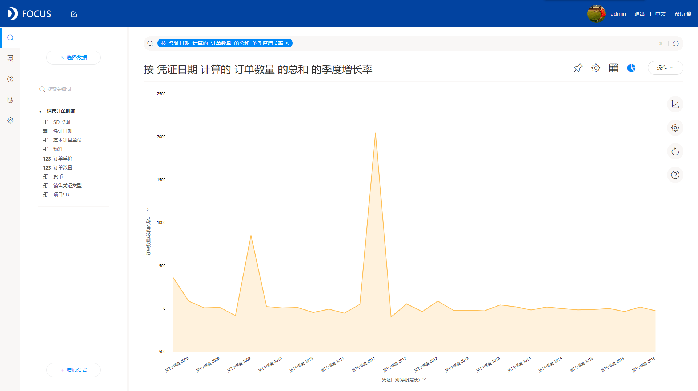

**数据小白如何快速成为数据分析师？**

数据分析这几年一直都是个高频词，很多人都开始纷纷转行到这个领域，也有不少人开始跃跃欲试，想找准时机进到数据分析领域。如今数据分析火爆，处处都是时机，我们要做的，就是抓住机会。

“快速”成为数据分析师这句话不知道大家是怎么理解的，在我看来，这句话就代表着如何在最短的时间内高效率的成为数据分析师，但优秀的数据分析师是不能速成的，不过零经验也有零经验的捷径。

如何入门，如何找到捷径，这是我们今天的主题。本文，我将以过来人的身份分享一些经验。

要想成为数据分析师，当然首先你需要了解什么是数据，什么是分析，其次，你需要专业数据分析工具的辅助，而其中最关键的就是，找到实用性强操作简单功能齐全的数据分析工具，一款好的数据分析工具，能大大降低数据分析的难度吗，让普通人也能学会数据分析。

那有没有这样的工具？肯定有，就我现在自己在用的一款数据分析工具，我就觉得很好用很实用性价比很高。它是一款创新型的数据分析工具，拥有独特的交互方式，是国内第一个使用自然语言进行搜索式分析的工具。我最初也是被这种新颖的搜索分析吸引了，后来实际使用过后，发现这种搜索式分析真的大大降低了数据分析的门槛，使数据分析不再难以入手。

DataFocus，它就是我说的数据分析工具，是一款搜索式分析工具，如同百度搜索一样，非常简单，不需要使用的人有IT基础，即使对于数据分析零基础的普通业务人员，也可以很快上手。

有了一款好的数据分析工具的帮助，那就离成为数据分析师不远了。
