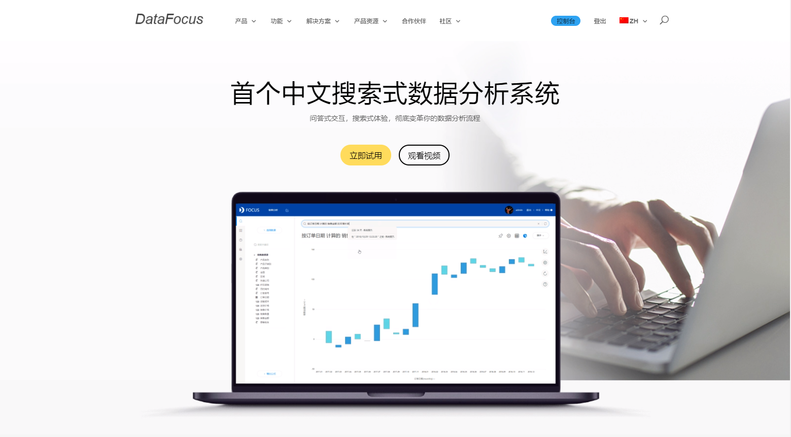

在这个大数据时代，很多企业都利用数据开始做精准性营销，有些企业做的很成功，而有些企业却反响平平。其实说到底就是因为，做的成功的企业有着自己的一套数据挖掘系统或方法，而有些企业只是为了做而坐，或依赖平台、或依赖服务商等，尤其是一些新零售企业或是科技企业。DataFocus曾经遇到不少客户，都因为数据营销没有效果而发愁，一方面是因为数据分析的结果不对，这个在DataFocus的搜索关键词相关文章中说过，还有就是从数据源头本身就有问题，没有进行很好的采集和挖掘提炼。

比如说，很多公司开始做数据营销都是以自己的想法为中心的，自己想怎么做，就武断的取哪些数据进行分析。但其实应该深挖下去，怎么做，其实可以先利用身边的一些资源。比如销售、代理商、客户、同类历史客户、网站等收集数据。第二步就是利用这些数据挖掘线索了。但是像我们以前说的那样，决定数据价值的并不是工具，而是人脑本身。

所以我们其实可以思考一些问题来更好的优化数据的应用，比如客户为什么要上这个项目（向销售、代理商收集数据）、客户单位最近有什么事件（收集客户单位宣传板，网上事件等数据）、客户最烦恼的事情是什么（问客户）、客户通常会烦恼什么（以往客户案例数据总结）、客户自己觉得需要怎样做（问客户）等等。这些问题想明白，那么取什么样的数据，怎么分析，怎么可视化就会比较的清楚。

当然，这些还是不够的，只是很好的采集了数据或是选择了数据，我们还需要做的是挖掘和提炼数据，收敛出直接的需求或方案。比如DataFocus的某零食客户挖掘出女性客户喜欢吃甜的，这个并不是直接需求，直接需求是比如这些客户喜欢吃我们的ABC甜点，是具体的。但是这样并没有结束，这不是真正的数据营销，真正的数据营销还应挖掘出他们背后的需求，比如喜欢吃清淡的，背后是想减肥，那么这个时候就可以扩列你的产品，这才是真正的数据营销，不是1块钱对应1个需求，而是1个需求可以让商家有大于1元的盈利。
