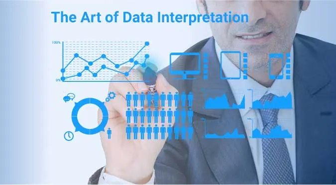
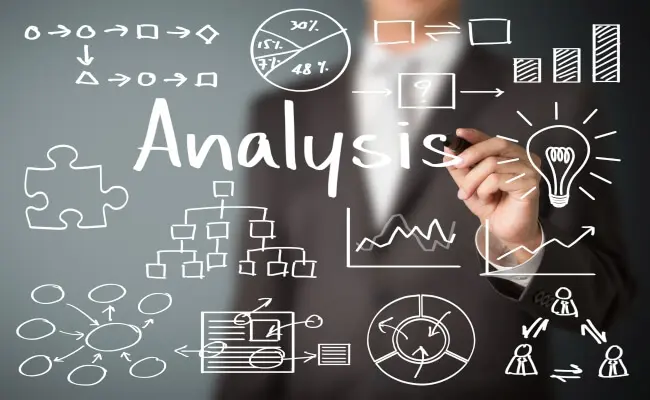
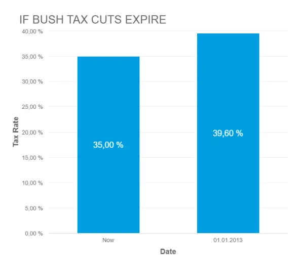
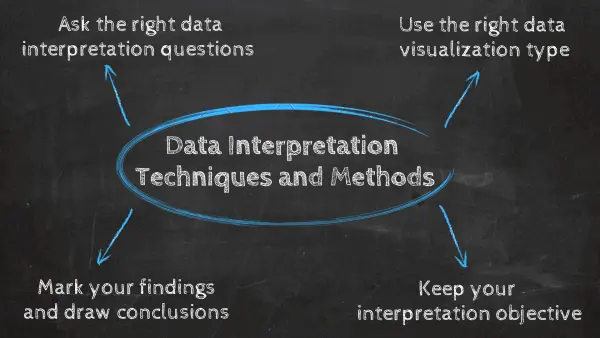

随着数字时代的到来，数据分析和解释现在已成为中心舞台......庞大的数据量可能令人恐惧。事实上，数字宇宙的一项研究发现，2012年的总数据供应量为2.8万亿千兆字节！仅基于这些数据量，很明显，当今全球化世界中任何成功企业的名片都是分析复杂数据、产生可操作的见解和适应新市场需求的能力......一切都以思维的速度进行。

[业务仪表板](https://www.datafocus.ai/infos/dashboard-examples-and-templates)是大数据的数字时代工具。它们能够显示用于定量和定性数据分析的关键绩效指标 （KPI），非常适合做出快节奏和数据驱动的市场决策，推动当今行业领导者取得可持续成功。通过简化的视觉通信艺术，数据仪表板允许企业参与实时和明智的决策，并且是数据解释的关键工具。首先，让我们找到一个定义来理解数据解释含义背后的含义。

 

您的机会：[想要测试功能强大的数据分析软件吗？](https://www.datafocus.ai/console/)使用我们的 14 天免费试用版并开始从您的数据中提取见解！

## 什么是数据解释？

数据解释是指使用多种分析方法审查数据并得出相关结论的过程。数据的解释有助于研究人员对信息进行分类、操作和总结，以回答关键问题。

数据解释的重要性是显而易见的，这就是为什么需要正确完成它的原因。数据很可能来自多个来源，并且倾向于以随意排序进入分析过程。数据分析往往是极其主观的。也就是说，解释的性质和目标因企业而异，可能与所分析的数据类型相关。虽然有几种不同类型的过程是基于个人数据性质实施的，但两个最广泛和最常见的类别是“定量分析”和“定性分析”。

然而，在开始任何严肃的数据解释调查之前，应该理解的是，除非就测量规模做出合理的决定，否则数据结果的视觉呈现是无关紧要的。在开始任何严肃的数据分析之前，必须确定数据的测量规模，因为这将对数据解释的投资回报率产生长期影响。不同的规模包括：

- 名义比例：无法进行定量排名或比较的非数字类别。变量是排他性的和详尽的。
- 序数刻度：排他性和详尽性但具有逻辑顺序的排他性类别。质量评级和协议评级是序数量表的示例（即，良好、非常好、一般等，或同意、强烈同意、不同意等）。
- 间隔：一种测量尺度，其中数据按类别分组，类别之间距离有序且相等。总是有一个任意的零点。
- 比率：包含所有三个功能。

有关测量尺度的更深入回顾，请阅读我们关于[数据分析问题](https://www.datafocus.ai/infos/data-analysis-questions)的文章。一旦选择了测量尺度，就该选择两个广泛的解释过程中哪一个最适合您的数据需求了。让我们仔细看看那些具体的数据解释方法和可能的数据解释问题。

## 如何解释数据？

在解释数据时，分析师必须尝试辨别相关性、因果关系和巧合之间的差异，以及许多其他偏差——但他还必须考虑可能导致结果的所有因素。可以使用各种数据解释方法。

数据的解释旨在帮助人们理解已收集、分析和呈现的数字数据。拥有用于解释数据的基线方法（或多种方法）将为您的分析师团队提供结构和一致的基础。事实上，如果几个部门有不同的方法来解释相同的数据，同时共享相同的目标，则可能会导致一些不匹配的目标。不同的方法将导致重复的工作、不一致的解决方案、浪费的能源，以及不可避免的时间和金钱。在这一部分中，我们将研究两种主要的数据分析解释方法：定性和定量分析。

### 定性数据解释

定性数据分析可以用一个词来概括——分类。通过定性分析，数据不是通过数值或模式来描述的，而是通过使用描述性上下文（即文本）来描述的。通常，叙述数据是通过采用各种人对人技术来收集的。这些技术包括：

- 观察：详细说明观察组中发生的行为模式。这些模式可以是在活动中花费的时间、活动类型和采用的通信方法。
- 焦点小组：将人们分组并向他们提出相关问题，以产生有关研究主题的协作讨论。
- 二次研究：就像如何观察行为模式一样，不同类型的文档资源可以根据它们所包含的材料类型进行编码和划分。
- 访谈：叙事数据的最佳收集方法之一。查询响应可以按主题、主题或类别分组。访谈方法允许高度集中的数据细分。

定性和定量分析之间的关键区别在解释阶段很明显。定性数据可以广泛解释，因此必须“编码”，以便于将数据分组和标记成可识别的主题。由于人与人之间的数据收集技术经常会导致与正确分析有关的争议，因此定性数据分析通常通过三个基本原则来概括：注意事物，收集事物，思考事物。

### 定量数据解读

如果定量数据解释可以用一个词来概括（它真的不能），那么这个词就是“数字”。在数据分析方面几乎没有确定性，但您可以确定，如果您从事的研究不涉及数字，则不是定量研究。定量分析是指分析数值数据的一组过程。通常，它涉及使用统计建模，例如标准差，平均值和中位数。让我们快速回顾一下最常见的统计术语：

- 平均值：平均值表示一组响应的数值平均值。在处理数据集（或多个数据集）时，平均值将表示一组特定数字的中心值。它是值的总和除以数据集中的值数。可用于描述该概念的其他术语是算术平均值、平均值和数学期望。
- 标准偏差：这是定量分析中常见的另一个统计术语。标准差揭示了响应在均值周围的分布。它描述了答复中的一致性程度;与平均值一起，它提供了对数据集的见解。
- 频率分布：这是一种测量数据集中响应出现率的测量值。例如，当使用调查时，频率分布能够确定特定序数尺度响应出现的次数（即同意、强烈同意、不同意等）。频率分布在确定数据点之间的共识程度方面非常敏锐。

通常，定量数据是通过直观地呈现两个或多个显著变量之间的相关性检验来测量的。不同的过程可以一起使用，也可以单独使用，并且可以进行比较以最终得出结论。定量数据的其他签名解释过程包括：

- 回归分析：从本质上讲，回归分析使用历史数据来了解因变量与一个或多个自变量之间的关系。了解哪些变量是相关的以及它们在过去是如何发展的，可以让您预测可能的结果并做出更好的决策。例如，如果您想预测下个月的销售额，您可以使用回归分析来了解哪些因素会影响它们，例如销售的产品、新广告系列的启动等。

- 同期群分析：此方法可识别在特定时间段内具有共同特征的用户组。在业务场景中，同期群分析通常用于了解不同的客户行为。例如，同类群组可以是在给定日期注册免费试用的所有用户。将进行分析以查看这些用户的行为方式、他们执行的操作以及他们的行为与其他用户组有何不同。

- 预测分析：顾名思义，预测分析方法旨在通过分析历史和当前数据来预测未来的发展。在人工智能和机器学习等技术的支持下，预测分析实践使企业能够发现趋势或潜在问题，并提前规划明智的策略。

- 规范性分析：同样由预测提供支持，规范性分析方法使用图分析、复杂事件处理、神经网络等技术，试图解开未来决策将产生的影响，以便在实际做出之前进行调整。这有助于企业制定响应迅速、实用的业务战略。

- 联合分析：联合分析通常应用于调查分析，用于分析个人如何评估产品或服务的不同属性。这有助于研究人员和企业定义定价、产品功能、包装和许多其他属性。一种常见的用途是基于菜单的联合分析，其中个人被赋予一个选项的“菜单”，从中他们可以构建他们的理想概念或产品。像这样，分析师可以了解他们会选择哪些属性高于其他人并得出结论。

- 聚类分析：最后但并非最不重要的一点是，聚类分析是一种用于将对象分组的方法。由于使用聚类分析时没有目标变量，因此它是查找数据中隐藏的趋势和模式的有用方法。在业务环境中，聚类用于受众细分以创建有针对性的体验，而在市场研究中，它通常用于识别年龄组、地理信息、收入等。

现在我们已经了解了如何解释数据，让我们继续问自己一些问题：数据解释有哪些好处？为什么所有行业都从事数据研究和分析？这些都是基本问题，但它们往往没有得到足够的重视。

## 为什么数据解释很重要

收集和解释的目的是获取有用和可用的信息，并做出最明智的决定。从企业到研究第一个家的新婚夫妇，数据收集和解释为广泛的机构和个人提供了无限的好处。

数据分析和解释，无论方法和定性/定量状态如何，都可能包括以下特征：

- 数据识别和解释
- 数据的比较和对比
- 识别数据异常值
- 未来预测

最终，数据分析和解释有助于改进流程并发现问题。如果没有至少最少的数据收集和解释，就很难发展和进行可靠的改进。关键词是什么？可靠。所有机构和行业都存在关于绩效提升的模糊想法。然而，如果没有适当的研究和分析，一个想法可能会永远处于停滞状态（即最小增长）。所以。。。数字时代数据分析和解释有哪些商业优势？一起来看看吧！

1）明智的决策：决策的好坏取决于形成它的知识。明智的数据决策有可能使行业领导者与其他市场竞争者区分开来。研究表明，在实施明智的数据决策流程时，其行业前三分之一的公司平均生产率提高 5%，盈利能力提高 6%。只有在确定问题或确定目标后，才会采取最果断的行动。数据分析应包括识别、论文开发和数据收集，然后是数据通信。

如果机构只遵循这个简单的顺序，我们都应该熟悉小学科学博览会，那么他们将能够实时解决问题。知情决策倾向于周期性。这意味着真的没有尽头，最终，在这个过程中出现了需要进一步研究的新问题和条件。对数据结果的监控将不可避免地以新的数据和景点使过程回到起点。

2）通过趋势识别预测需求：数据洞察提供知识，知识就是力量。从市场和消费者数据分析中获得的见解能够为类似细分市场中的同行设定趋势。数据分析如何影响趋势预测的一个完美例子可以在音乐识别应用程序Shazam中得到证明。该应用程序允许用户上传他们喜欢的歌曲的音频剪辑，但似乎无法识别。用户每天进行 1500 万首歌曲识别。有了这些数据，Shazam在预测未来的流行艺术家方面发挥了重要作用。

当行业趋势被识别出来时，它们就可以服务于更大的行业目的。例如，Shazam 监控的见解不仅有助于 Shazam 了解如何满足消费者需求，而且让音乐高管和唱片公司深入了解当今的流行文化场景。数据收集和解释过程可以允许全行业的气候预测，并在整个市场上带来更大的收入来源。因此，所有机构都应遵循收集、解释、决策和监测的基本数据周期。

3）成本效益：正确实施数据分析流程可以为企业在其行业内提供深远的成本优势。德勤最近进行的一项数据研究生动地证明了这一点，发现数据分析的投资回报率是由有效的成本降低驱动的。通常，这种好处被忽视了，因为赚钱通常被认为比省钱“更性感”。然而，健全的数据分析能够提醒管理层注意降低成本的机会，而无需人力资本付出任何重大努力。

通过数据分析实现成本效益潜力的一个很好的例子是英特尔。在2012年之前，英特尔将对其芯片进行超过19，000次制造功能测试，然后才能被认为可以发布。为了 削减 成本 并 缩短 测试 时间， 英特尔 实施 了 预测 性 数据 分析。通过使用历史和当前数据，英特尔现在通过专注于特定和单个芯片测试来避免对每个芯片进行测试 19，000 次。在 2012 年实施后，英特尔节省了超过 300 万美元的制造成本。降低成本可能不像数据利润那样“性感”，但正如英特尔所证明的那样，这是数据分析的一个不容忽视的好处。

4）清晰的远见：收集和分析其数据的公司可以更好地了解自己，流程和绩效。他们可以在出现性能挑战时识别它们，并采取措施克服这些挑战。通过可视化表示进行数据解释，使他们能够更快地处理他们的发现，并对公司的未来做出更明智的决策。

您的机会：[想要测试功能强大的数据分析软件吗？](https://www.datafocus.ai/console/)使用我们的 14 天免费试用版并开始从您的数据中提取见解！

## 常见的数据分析和解释问题

那些担心数字时代数据进步的人经常重复的口头禅是“大数据等于大麻烦”。虽然这种说法并不准确，但可以肯定地说，某些数据解释问题或“陷阱”存在，并且在分析数据时可能会出现，尤其是在思维速度下。让我们确定一些最常见的数据误解风险，并阐明如何避免它们：

1）相关性被误认为是因果关系：我们对数据的第一个误解是指数据分析师倾向于将现象的原因与相关性混合在一起。假设因为两个动作一起发生，一个导致另一个。这是不准确的，因为如果没有因果关系，动作可以一起发生。

- 数字时代示例：假设收入增加是社交媒体关注者增加的结果......两者之间可能存在明确的相关性，尤其是在当今的多渠道购买体验中。但是，这并不意味着追随者的增加是收入增加的直接原因。既有共同的原因，也可能有间接的因果关系。
- 补救措施：尝试消除您认为导致该现象的变量。

2）确认偏差：我们的第二个数据解释问题发生在你心中有一个理论或假设，但只打算发现支持它的数据模式，而拒绝那些没有支持它的数据模式。

- 数字时代示例：您的老板要求您分析最近的多平台社交媒体营销活动的成功。在分析来自活动的潜在数据变量（您运行并认为效果良好的变量）时，您会发现Facebook帖子的分享率很高，而Twitter推文的分享率则不然。仅使用Facebook帖子来证明您的假设，即该活动是成功的，这将是确认偏见的完美体现。
- 补救措施：由于这种陷阱通常基于主观愿望，因此一种补救措施是与客观个人团队一起分析数据。如果这是不可能的，另一种解决方案是抵制在数据探索完成之前得出结论的冲动。记住总是试图反驳一个假设，而不是证明它。

3）不相关的数据：第三个数据误解陷阱在数字时代尤为重要。由于大数据不再集中存储，并且随着它继续以思维速度进行分析，分析师将不可避免地关注与他们试图纠正的问题无关的数据。

- 数字时代示例：在尝试衡量电子邮件潜在客户生成活动的成功时，您注意到活动直接产生的主页浏览量增加了，但每月新闻通讯订阅者的数量没有增加。根据主页浏览量，您认为该活动是成功的，而实际上它产生的潜在客户为零。
- 补救措施：在进行数据审查之前，主动且清楚地制定任何数据分析变量和 KPI。如果您用于衡量潜在客户生成活动成功的指标是时事通讯订阅者，则无需查看主页访问次数。请务必关注回答您的问题或解决您的问题的数据变量，而不是不相关的数据。

4） 截断轴：在创建图表以开始解释分析结果时，保持轴的真实性并避免产生误导性的可视化非常重要。在不能描绘数据实际真相的值中启动轴可能会导致错误的结论。

- 数字时代示例：在下图中，我们可以看到福克斯新闻的图表，其中 Y 轴从 34% 开始，这使得 35% 和 39.6% 之间的差异似乎比实际要高得多。这可能导致对税率变化的误解。

\*来源： www.venngage.com\*

- 补救措施：小心数据的可视化方式。使用轴保持尊重和现实，以避免误解您的数据。请参阅下面的福克斯新闻图表在使用正确的轴值时的外观。该图表是使用DataFocus的现代[在线数据可视化](https://www.datafocus.ai/infos/data-visualization-tools)工具创建的。

5）（小）样本量：另一个常见的数据分析和解释问题是使用小样本量。从逻辑上讲，样本量越大，结果就越准确和可靠。然而，这也取决于研究效果的大小。例如，关于教育质量的调查中的样本量将与在特定地区进行户外运动的人的样本量不同。

- 数字时代示例：假设您向 30 个人提出一个问题，其中 29 人回答“是”，结果占总数的 95%。现在想象一下，你向 1000 人提出同样的问题，其中 950 人回答“是”，这又是 95%。虽然这些百分比可能看起来相同，但它们肯定不是一回事，因为 30 人的样本量对于建立真实结论来说不是一个重要的数字。
- 补救措施：研究人员表示，为了确定正确的样本量以获得真实和有意义的结果，有必要定义一个误差幅度，该误差幅度将代表他们希望结果偏离统计平均值的最大数量。与此配对，他们需要定义一个介于 90% 到 99% 之间的置信水平。有了这两个值，研究人员就可以为他们的研究计算出准确的样本量。

6）可靠性，主观性和普遍性：在进行定性分析时，研究人员在解释数据时必须考虑实践和理论限制。在某些情况下，定性研究可以被认为是不可靠的，因为不受控制的因素可能会影响也可能不会影响结果。这与研究人员在解释过程中具有主要作用的事实相结合，这意味着他或她决定什么是相关的，什么是不相关的，正如我们所知，解释可能非常主观。

泛化性也是研究人员在处理定性分析时面临的一个问题。正如关于小样本量的观点所述，很难得出100%具有代表性的结论，因为结果可能有偏差或不代表更广泛的人群。

虽然这些因素主要存在于定性研究中，但它们也会影响定量分析。例如，在选择要描绘哪些 KPI 以及如何描绘它们时，分析师也可能有偏见，并以有利于其分析的方式表示它们。

- 数字时代的例子：调查中的偏见问题是可靠性和主观性问题的一个很好的例子。想象一下，您正在向您的客户发送一份调查问卷，以了解他们对您的客户服务的满意度：“您对我们的客户服务团队的体验有多棒？在这里我们可以看到，这个问题显然是通过在上面加上“惊人”这个词来影响个人的反应。
- 补救措施：避免这些问题的解决方案是保持您的研究诚实和中立。保持问题的措辞尽可能客观。例如：“在 1-10 的范围内，您对我们的客户服务团队的满意度如何”。这不会引导受访者找到任何具体答案，这意味着您的调查结果将是可靠的。

您的机会：[想要测试功能强大的数据分析软件吗？](https://www.datafocus.ai/console/)使用我们的 14 天免费试用版并开始从您的数据中提取见解！

## 数据解释技术和方法

数据分析和解释对于得出合理的结论和做出更明智的决策至关重要。正如我们在这篇文章中看到的，数据的解释是一门艺术和科学。为了帮助您实现此目的，我们将列出一些相关的数据解释技术、方法和技巧，您可以实现成功的数据管理过程。

如本文开头所述，成功解释数据的第一步是确定您将执行的分析类型并分别应用这些方法。明确区分定性分析（观察、记录和采访通知、收集和思考事物）和定量分析（您领导研究，通过各种统计方法分析大量数值数据）。

### 1） 提出正确的数据解释问题

第一种数据解释技术是为您的工作定义一个明确的基线。这可以通过回答一些关键问题来完成，这些问题将作为有用的开始指南。其中一些包括：我的分析中的目标和目的是什么？我将使用哪种类型的数据解释方法？将来谁将使用这些数据？最重要的是，我想回答什么一般性问题？

定义所有这些信息后，您就可以收集数据了。如文章开头所述，您的数据收集方法将根据您使用的分析类型（定性或定量）而有所不同。掌握了所有需要的信息后，您就可以开始解释过程了，但首先，您需要可视化数据。

### 2） 使用正确的数据可视化类型

[业务图形](https://www.datafocus.ai/infos/financial-graphs-and-charts-examples)、图表和表格等数据可视化是成功解释数据的基础。这是因为通过交互式图表和图形可视化数据使信息更易于理解和访问。您可能知道，您可以使用不同类型的可视化，但并非所有可视化都适用于任何分析目的。使用错误的图形可能会导致对数据的误解，因此仔细选择正确的视觉对象非常重要。让我们看一下常见数据可视化的一些用例。

- 条形图：最常用的图表类型之一，条形图使用矩形条形来显示 2 个或多个变量之间的关系。有不同类型的条形图用于不同的解释，包括水平条形图、柱形图和堆积条形图。
- 折线图：折线图最常用于显示趋势、加速或减速以及波动性，旨在显示数据在一段时间内的变化情况，例如一年内的销售额。使此图表准备好进行解释的一些提示是不要使用许多可能使图形过度拥挤的变量，并使轴刻度接近最高数据点，以避免使信息难以阅读。
- 饼图：尽管由于其简单性，它在分析方面没有做很多事情，但饼图被广泛用于显示变量的比例组成。从视觉上讲，在条形图中显示百分比比在饼图中显示百分比要复杂得多。但是，这也取决于您要比较的变量数量。如果您的饼图需要分为 10 个部分，那么最好使用条形图。
- 表格：虽然它们不是一种特定类型的图表，但在解释数据时广泛使用表格。当您希望以原始格式描绘数据时，表格特别有用。它们使您可以自由地轻松查找或比较单个值，同时还显示总计。

随着数据可视化的使用对于企业分析的成功变得越来越重要，出现了许多工具来帮助用户以有凝聚力和交互的方式可视化他们的数据。最受欢迎的之一是使用[BI 仪表板](https://www.datafocus.ai/infos/bi-dashboard-best-practices)。这些可视化工具提供了各种图形和图表的集中视图，这些图形和图表描绘了有关主题的更大图景。我们将在本文的下一部分详细讨论仪表板在高效数据解释实践方面的强大功能。如果您想了解有关[不同类型的数据可视化](https://www.datafocus.ai/infos/how-to-choose-the-right-data-visualization-types)的更多信息，请查看我们关于该主题的完整指南。

### 3） 保持口译目标

如上所述，保持口译目标是该过程的基本部分。作为最接近调查的人，在数据中寻找答案时很容易变得主观。保持客观的一些好方法是向与研究相关的其他人展示信息，例如，研究合作伙伴，甚至是完成后将使用您的发现的人。这有助于避免确认偏差和解释中的任何可靠性问题。

### 4）标记您的发现并得出结论

结果是从数据中提取的观测值。这些事实将帮助您对研究得出更深入的结论。例如，结果可以是您在解释过程中发现的趋势和模式。为了正确看待您的发现，您可以将它们与使用类似方法的其他资源进行比较，并将其用作基准。

反思自己的思维和推理，并意识到数据分析和解释带来的许多陷阱。相关性与因果关系、主观偏见、虚假信息和不准确的数据等。一旦你对数据的解释感到满意，你就可以得出结论，看看你最初的问题是否得到了回答，并根据它们提出建议。

## 数据解读：使用仪表板弥合差距

正如我们所看到的，定量和定性方法是不同类型的数据分析。两者都在数据调查、测试和决策方面提供不同程度的投资回报 （ROI）。由于它们的差异，了解如何实施仪表板以弥合定量和定性信息差距非常重要。数字数据仪表板解决方案如何在合并数据断开方面发挥关键作用？以下是一些方法：

1）连接和混合数据。随着当今的创新步伐，将大量数据集中定位已不再可行（也不可取）。随着企业继续全球化和边界不断消散，企业拥有在没有位置限制的情况下进行各种数据分析的能力将变得越来越重要。数据仪表板在混合定量和定性数据的同时，在不影响必要思维速度的情况下分散数据。无论您是想衡量客户趋势还是组织绩效，您现在都能够做到这两点，而无需单一的选择。

2）移动数据。与“连接和混合数据”的概念相关的是移动数据。在当今的数字世界中，员工在办公桌前花费的时间越来越少，同时提高了产量。这是因为分析工具的移动解决方案不再是独立的。如今，移动分析应用程序与日常业务工具无缝集成。反过来，定量和定性数据现在都可以在需要时按需提供，何时需要，以及如何通过交互式[在线仪表板](https://www.datafocus.ai/infos/online-dashboard)进行。

3）可视化。数据仪表板正在通过可视化科学合并定性和定量数据解释方法之间的[数据](https://www.datafocus.ai/infos/data-dashboards-definition-examples-templates)差距。仪表板解决方案“开箱即用”，设备齐全，可以创建易于理解的数据演示。现代在线数据可视化工具提供各种颜色和滤镜模式，鼓励用户交互，旨在帮助增强未来趋势的可预测性。所有这些视觉特征都有助于在数据方法之间轻松转换 - 您只需要找到正确的数据可视化类型，以最佳方式讲述您的数据故事。

为了让您了解市场研究仪表板如何满足连接定量和定性分析的需求，并有助于理解如何通过可视化解释研究中的数据，请查看以下内容。它汇集了经过知识分析的定性和定量数据，并以每个人都能理解的有意义的方式将其可视化，从而使任何观众都能解释它：

\*\*点击放大\*\*

要查看更多数据分析和解释示例，请访问我们的[业务仪表板](https://www.datafocus.ai/infos/dashboard-examples-and-templates)库。

您的机会：[想要测试功能强大的数据分析软件吗？](https://www.datafocus.ai/console/)使用我们的 14 天免费试用版并开始从您的数据中提取见解！

## 总结...

当我们到达这篇关于数据解释和分析的有见地的文章的结尾时，我们希望您对这个主题有一个清晰的理解。我们已经介绍了数据解释定义，并给出了一些示例和方法来执行成功的解释过程。

数据解释的重要性是不可否认的。仪表板不仅可以弥合传统数据解释方法和技术之间的信息鸿沟，还可以帮助补救和防止解释的主要陷阱。作为数字时代的解决方案，它们结合了过去和现在的优点，以便做出明智的决策，并实现最大的数据解释投资回报率。

要开始以有意义且可操作的方式可视化您的见解，请通过我们的[14 天试用](https://www.datafocus.ai/console/)版免费测试[我们的在线报告软件](https://www.datafocus.ai/infos/online-reporting)！
