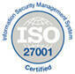
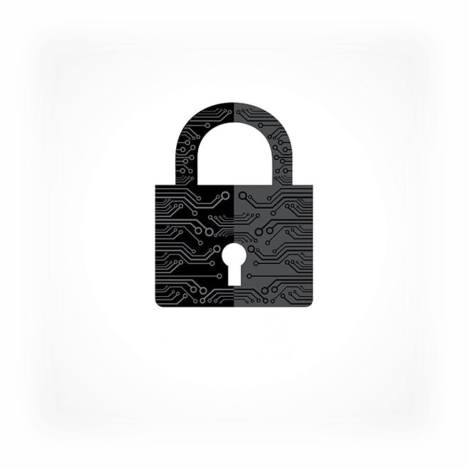

DATAFOCUS 与最新的企业级安全框架配合使用

保护您的数据是我们的首要任务！您数据的机密性、隐私性和安全性对我们至关重要。我们使用多种保护措施来保护您的信息，从核心银行应用程序开始，我们一直在监控和改进我们的企业级安全层。

 

### 中国数据安全法

作为一家中国公司，我们遵守世界上最严格的数据安全和隐私法。在任何时候，我们的客户仍然是其数据的唯一所有者，并且只有您帐户中经过身份验证的用户才能访问您的信息。

### 人身安全

我们的数据中心受到电子访问控制、视频监控和警报系统的保护。即使是我们 DataFocus 也无权在没有正当合法理由的情况下进入受保护的数据中心。

**安全传输和会话处理**

我们通过 SSL 和 SSH 协议传输关键数据，将虚拟入侵者拒之门外。

**访问控制**

DataFocus 具有对您的数据源的只读访问权限和额外的安全层，可防止有害的数据库查询通过（SQL 注入）。

### 我们的服务器

我们将我们的应用程序和您的数据托管在中国顶级托管服务提供商的专用服务器上。我们绝不会使用云托管解决方案。只有在您特别许可的情况下，我们才会存储您的数据，我们不会复制，也没有任何后门。如果您决定使用远程数据库连接，我们会在您的服务器上运行所有查询，而不存储或传输您的任何原始数据。

### 测试和监控

我们在每次发布之前测试所有代码部分的安全漏洞，并定期扫描我们的网络和系统是否存在漏洞。我们的执行包括：

- 应用程序漏洞威胁评估
- 选择渗透测试和代码审查
- 安全控制框架审查和测试

为了识别和管理威胁，我们的团队还监控来自各种来源的通知和来自我们内部系统的警报。
