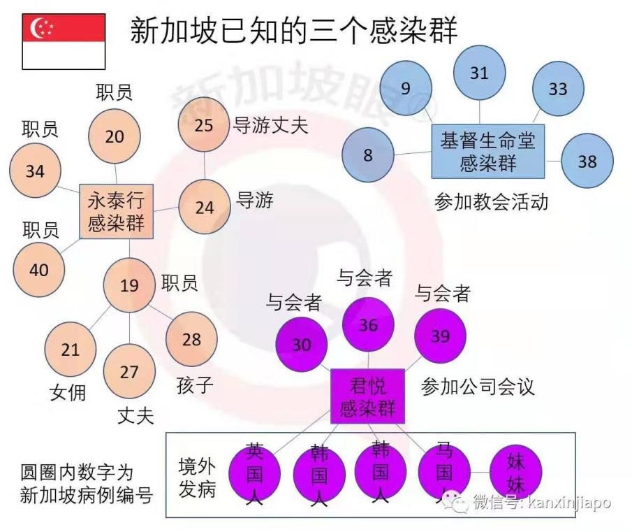
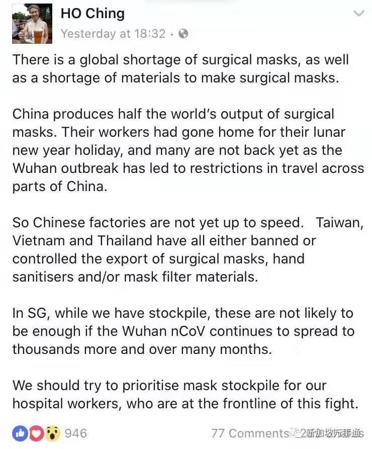

_随着疫情扩散，这场抗疫战争早已不只是中国的战斗，更是波及到全世界人民福祉的重大事件。今天，我们把眼光投放到中国以外的地区，分析下海外的疫情发展形势。_

1. **海外数据增长概况**

根据WHO（世界卫生组织）的官方报道披露，1月22日，日本、韩国和泰国是最先出现2019-nCoV的海外国家，分别确证病例1人、1人和2人。如下图1所示，截止2月1日，疫情从3个国家蔓延至23个国家，影响范围逐渐扩大；进入2月以后，增幅大大降低，国家数量基本保持稳定。

从图2来看地域分布，虽然波及的范围较广，但是大多数国家的病例数量还较少。**病例数较多的国家基本是分布于中国周边的东亚国家，国土范围小，疫情压力还是比较大的。**

图1：有疫情存在的国家数量

图2：疫情分布地图（除中国外，截止2月10日）

下图3具体展示了各个国家的确诊人数。可以看出，截止2月10日，已存在疫情的海外国家的平均确诊人数约为12.76人。

图3：各国确诊人数图（截止2月10日）

结合下图4，我们可以看出不同国家确诊人数的标准差差异较大。大致可以分为3大梯队，第一梯队的标准差在10人以上，第二梯队的标准差在6人左右，第三梯队的标准差在4人及以下。整体数据呈现“20%离散值高的国家，80%处于平均值左右的国家”的态势。

图4：各国确诊人数的离散值

接下来，我们先筛选出第一梯队的国家进行分析。这些国家确诊人数从26人到70人不等，属于海外国家中的疫情“重灾区”。虽然下面展示了5列数据，但事实上主要涉及了4个国家。其中排名第一的国际邮轮“钻石公主号”目前停靠于日本横滨岛，且船上一半左右的游客是日本人，目前该船上的疫情排查工作也由日本政府承担；因此可将此船上的疫情笼统地归于日本。

所以，目前海外疫情的四大重灾区分别为：日本（96例）、新加坡（43例）、泰国（32例）和韩国（27例）。

图5：确诊人数排名前5的国家

我们首先来看下日本的确诊人数日增长情况。如下图5所示，除去邮轮事件的影响，日本每日新增在0人-4人这个区间；其中1月25日到2月4日期间，日增相对较高，而最近几日基本没有新增人数。**因此日本目前的疫情控制度较好。**

这里要说明下，2月5日和6日出现了两个异常值，小编推测是WHO的报告笔误了（将2月5日的总确诊人数23人错写成33人），因此在这里不作分析。

图5：日本确诊人数日增量（除邮轮外）

再来看下日本邮轮的情况。虽然近日的日增数据有所下降，但真实情况还是比较严重的。据新浪财经报道，截止2月11日，实际确诊病例已达135例（WHO最新报告只记载了70例）。船上空间密闭性强、采取措施为时已晚、大量的中老年游客，这些情况都令我们觉得“钻石公主号”可能成为病毒爆发点。

图6：邮轮“钻石公主号”确诊人数日增量

在图7中，我们对于另外3个国家的确诊人数日增长情况作了分析。可以看出，这三个国家的日新增人数在0-9人不等，波动较大，都出现了多个高峰。

韩国（图7绿线）的日新增在1月31日达到最高峰7人后，呈现逐渐下降的趋势。

泰国（图7橘线）的日新增在1月28日达到最高峰9人后，先下降后又呈现逐渐爬升的趋势。

新加坡（图7蓝线）的日新增一路攀升，高峰频创新高，目前的最高峰是2月9日的新增7人。

**从趋势来看，新加坡的情况最为不妙，泰国次之，韩国最好；然而，从绝对数量来看，这三个国家近一周的日新增都较高，形势并不乐观。**

图7：新加坡，泰国，韩国的确诊人数日增量

2019-nCoV是存在人际传播的传染性疾病，因此人群感染率会是很重要的参考数字。日、新、泰、韩都是国土面积较小、人口总数低的国家，我们来看下感染率的情况。下图8展示了这四个国家的每百万人感染率，显然较之其它三国，新加坡的情况是比较严重的了。

每百万人确诊7.62人大概是什么概念呢？和下图9我国百万人感染率排名前20位的地级市进行对比，虽说“7.62”距离第20名的“19”也还有些差距，但量级相同、差异并不大。小编粗略估计下，**新加坡的每百万人感染数据大概和我国排名第40位的地级市差不多。**

图8：日、新、泰、韩每百万人感染率

图9：中国每百万人感染率前20的地级市（除湖北外，数据截止2020年2月11日，图片来源：公众号“数据化管理”）

1. **新加坡疫情将暴涨？**

根据第一部分的分析，从发展趋势、绝对数量和百万人感染率这三个角度来看，新加坡的形势都比较严峻。针对新加坡的现状和发展趋势，和大家一样，小编也有着许多疑问。

首先，新加坡的疫情形势走向如何，是爆发式增长的可能性更大？还是将日趋平稳，得到有效控制呢？

从之前我们分析过的图6来看，数据显示，新加坡目前还处于波动式增速加快的阶段，似乎有着爆发的可能性。但是光看数据是不够的，根据我国在这20天防疫抗战中的经验显示——只要“强制隔离”的手段足够强硬，那么平台期甚至下降期终将来临。

那么，针对此次疫情，新加坡政府采取了怎样的措施呢？直到2020年2月7日，新加坡政府才将警戒级别从“黄色”升级到“橙色”；在此之前，所有的集体性聚会照常举办，并且市民戴口罩防护的意识也不强。2月5日，新加坡出现了第一例非中国地区的输入性病例，次日大量市民开始恐慌、出现抢购市场资源的行为。

如下图10所显示，自2月5日起，非中国输入病例数量增长趋势（橘色线）和总确诊人数增长趋势（蓝色线）十分接近。这说明，**即使严格把控中国入境的人口，新加坡本国内也已出现二次甚至多次传染，增长势头很猛。**

图10：确诊人数&非中国输入病例趋势对比图

根据微信公众号“新加坡眼”整理的资料来看，新加坡已出现多起聚集性感染事件（下图11），每起事件波及人数都不在少数。

图11：新加坡已知的感染群（截止2020年2月9日，来源：公众号“新加坡眼”）

这些情形与20天前的武汉何其相似。当然，武汉的情况比新加坡的更为严重。武汉的第一例病例确诊于2019年12月，而封城发生在2020年1月23日，中间隔了3个礼拜有余。而新加坡第一例病例确诊与2020年1月22日，升级防控措施于2020年2月7日，间隔16天。因此，用湖北省内武汉周边地级市的疫情数据来做对比，似乎更科学一些。如下图12所示，由于地级市规模、与武汉的地理距离、医疗水平等因素的差异，各地级市确诊人数差异显著。计算总趋势可得，从1月23日的54人暴涨至2月10日的13274人，暴涨了约246倍！

图12：武汉周边地级市疫情数据（截止2020年2月10日）

1. **资源是否充足？**

在疫情已经有所扩散的背景下，除了坚决的隔离措施，充足的医疗资源是最重要的。在隔离方面，新加坡在近几日已开始颁布大量行政政策。

在医疗资源方面，虽然小编还未对新加坡的医院数量和可容纳人数等数据进行精确统计，但从几则社交媒体的推送中，我们可以侧面分析下情况。

一则是李显龙总理在2月7日的公开讲话。李总理提到，“如果确诊病例持续增加，我们必须重新审视当前的策略。如果病毒已经扩散，追踪密切接触者的作用微乎其微。**如果我们继续让所有可疑病例住院隔离，医院肯定无力支撑。**”

从这段话中，我们明显可以看到，新加坡目前的医疗资源已有捉襟见肘之势，更不要说面对更大的疫情冲击了。

另一则是李显龙的夫人何晶发布在社交平台上的推文，如下图13所示，文中清楚地表达了“新加坡的口罩等医疗防护资源**主要依赖于中国、越南和柬埔寨地区的进口**，然而现在这些国家的出口都大大紧缩，如果疫情继续蔓延，**新加坡的医疗防护资源即将告急**”

图13：何晶推文（图片来源：公众号“新加坡万事通”）

综合以上分析，我们可以判断，随着新加坡疫情局势的升级，其将面临一系列的资源紧缺和考验。

我们衷心希望新加坡可以度过这个难关。同时，新加坡地处热带，年平均气温为23至34摄氏度，希望这样的高温天气能抑制病毒传播，切莫让新加坡成为第二个武汉！
