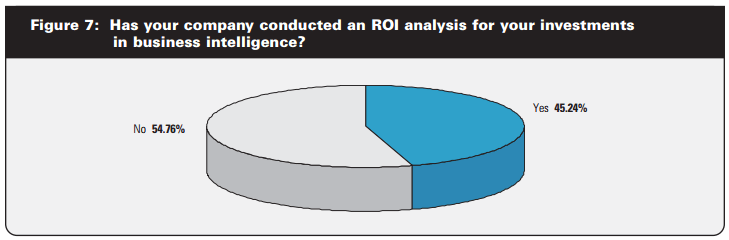
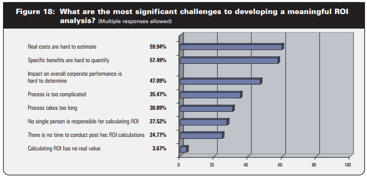
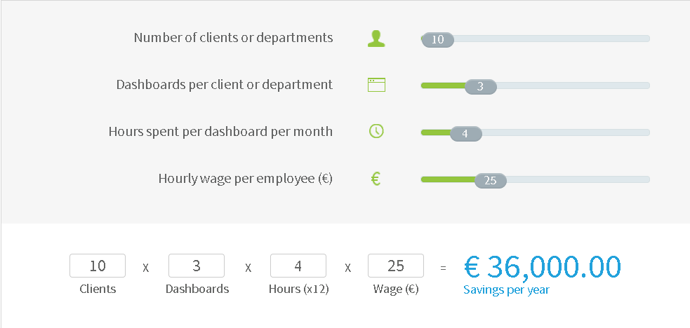
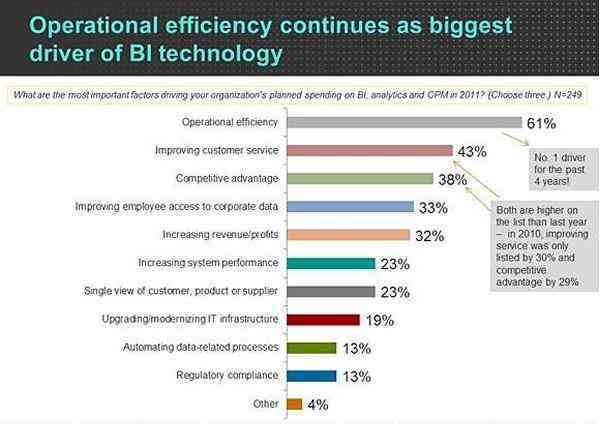

在Gartner 进行的一项研究中，他们分析了现代 BI 平台对公司的影响及其带来的好处，并为领导者提供了建议：商业智能对您的公司来说是一项巨大的投资。但它们不是福音真理，当涉及到实现公司变革时，能够展示你的行动的投资回报 (ROI) 可能是非常强大和需要的。

例如，假设您正试图让公司中的其他人相信[商业智能软件](https://www.datafocus.ai/infos/best-bi-tools-software-review-list) 至关重要，并且您需要开始采用它们。给出几个理由是一回事——不管它们有多大的意义，说“这是我们可以从这个项目中获得的商业智能投资回报率”又是另一回事。然后，您可以演示一个清晰的商业智能工具的财务案例。然而，这就引出了一个问题——商业智能到底能给你带来多少投资回报率？

在这篇文章中，我们将研究与该问题相关的挑战，以及您可以考虑这个问题的一些方式。在这篇文章的结尾，您将“武装”一些说服点，您可以用来说服公司中的其他人开始使用商业智能工具。

## 有多少公司实际进行商业智能的ROI分析？

一般来说，计算公司所做的任何大型项目的投资回报率都是很好的做法。这具有良好的商业意义——您需要确保您投资的Q能够为您带来更多的Q。这是成为一家盈利公司的本质。许多公司_确实让_他们的 IT 部门计算项目的投资回报率，如Noetix 白皮书 《为商业智能实现确定ROI的关键指标》中的这张图所示：

_图片来源：Noetix_

这份白皮书通过 Noetix 进行的网络调查，从 415 名受访者那里获得了数据。受访者有各种各样的角色，但大多数是 IT 角色的员工（最常见的角色是 IT 主管和系统分析师）。如图所示，大约 11% 的公司_从不_进行 ROI 分析，而大约 27% 的公司对每个项目都进行ROI分析。大多数公司处于中间位置。

但是，此数据适用于_任何_ 类型的 IT 相关项目。在商业智能方面，事情的衡量标准更少，如下图所示：

_图片来源：Noetix_

如上图所示，约 55%的公司_尚未_对其 BI 相关投资进行 ROI 分析。这是为什么呢？

## 定义商业智能ROI的挑战

对于初学者来说，不论项目如何，进行任何类型的 ROI 相关的分析都是具有挑战性的。

正如 Noetix 在他们的白皮书中所说，ROI研究可能是很复杂的。在IT方面投资有很多不同的费用（直接的、间接的和相关的），这使得收益和回报的计算具有挑战性。新 IT 项目的好处总是有形的和无形的，其中许多好处很难从财务上评估。但衡量商业智能的投资回报率甚至比 IT 投资更具挑战性。

至于为什么 BI 项目的投资回报率特别困难，有多种原因。你必须处理：

- 实际成本难以估计
- 收益可能很难用货币价值来衡量
- 一个复杂而漫长的投资回报过程

一般来说，计算 BI 应用程序的 ROI 是一个模糊、困难且耗时的过程——这就是为什么许多公司不这样做的原因。

_图片来源：Noetix_

然而，这里一个潜在的“游戏规则改变者”是，商业智能的许多的好处是无形的。

例如，假设您有一个[数据分析工具](https://www.datafocus.ai/infos/data-analyst-tools-software) ，可以让您看到未来几个月您的现金流可能会紧张。此信息可帮助您决定，在有更多的流动现金储备可用前，推迟资本巨额支出。

你如何计算这类信息的投资回报率？这是极具挑战性的。这就是 BI 的一个有点简单应用！当涉及到更微妙的决定时，事情会变得更加困难。

这就是为什么大多数受访者表示，他们认为 BI 的无形部分（也就是为了 实现ROI 而难以量化的部分）比有形收益更重要。

您可以在此处以图表形式查看该信息：

_图片来源：Noetix_

53.8% 的受访者同意 BI 的无形收益比有形的、可衡量的收益更重要，而只有 15.8% 的受访者不同意。

正如 Noetix 所说，公司没有对商业智能 ROI 进行分析，部分原因可能是大多数人认为无形收益比有形收益更重要，因为有形收益更容易衡量。

## 没有 BI 解决方案的成本

那么现在，我们在寻找商业智能ROI方面进展如何?

好吧，虽然可能很难直接计算 BI 的好处，但我们可以通过“扭转局面”为拥有 BI 解决方案提供强有力的理由。我们可以不考虑使用BI的好处，而是考虑没有BI解决方案的成本。

_没有_ BI的成本：

- 您的数据分布在不同的数据系统、数据库、部门和访问点上，难以轻松访问
- IT 人员忙于处理大量的可操作数据请求
- 由于 IT 中的这一瓶颈，决策所需的数据往往来得太晚或“事后”
- 受薪员工浪费大量时间准备 Excel 报告和进行可以自动化的手动数据输入
- 如果提出数据请求的人与准备数据的 IT 人员之间的沟通出现任何错误，就会浪费大量时间

现在，让我们看看，如果您拥有[SaaS BI 工具](https://www.datafocus.ai/infos/saas-bi)，您的生活会是怎样的：

- 您的所有数据都可以在一个地方轻松访问
- 您的团队无需任何特殊培训即可访问报告
- 没有人会在 BI 数据输入上浪费时间（以及公司的资金）
- 您可以在需要时获取准确的数据，从而做出更好的决策

您需要一些确切的数字来了解 BI 解决方案可以为您节省多少钱。好吧，我们有适合你的东西。[举个例子，如果您的公司有 10 个客户，每个客户有 3 个业务仪表板](https://www.datafocus.ai/infos/dashboard-examples-and-templates)，每个月花费 4 小时准备每个仪表板，那么您可以节省多少钱：

要自己尝试，请[在此处计算](https://www.datafocus.ai/infos/business-reporting-software)您的公司从传统的电子表格 BI 解决方案切换到基于云的解决方案可以节省多少钱。

但总的来说，我们也不是唯一发表此信息的人。正如Matillion 的一篇文章 所述，根据 Nucleus Research（一家总部位于波士顿的专门衡量技术价值的公司）的数据，报告自动化产生的平均投资回报率为 188%。报告自动化包括减少手动报告生成、节省时间和减少错误。

现在您已经深入研究了计算商业智能 ROI 的困难，以及使用传统 BI 解决方案的成本，那么让我们进行一些研究，展示具有数据驱动文化的公司如何在市场上具有竞争（和财务）优势。

## 商业智能的竞争优势

虽然很难准确地量化商业智能的ROI，但这并不意味着商业智能没有巨大的优势。

为了支持这一说法，经济学人智库对来自世界各地的公司的 530 名高管进行了一项关于培养数据驱动文化的调查，此外还对其中少数高管进行了深入访谈。

这些数据引出了一些有趣的见解，例如运营效率是高管投资 BI 技术的最大动力：

_资料来源：__TechTarget__.__com_

此外，请考虑来自《经济学家》杂志的研究数据：

- 76% 的来自顶级公司高管认为数据收集对数据文化“非常重要”。相比之下，在落后于同行的公司中，只有42%的公司认为这是必不可少的
- 三分之一的受访者表示，制定措施以提高员工对数据的熟练程度“非常重要”。在表现优于同行的公司中，有一半的受访者表示他们有这样的举措。

最后，进行商业分析案例研究的 Nucleus Research发现， “分析的平均回报率一直在上升，从 2011 年的 10.66 美元到 2014 年达到 13.01 美元。”

## 商业智能投资回报率：难以计算，但真实存在

在这篇文章中，我们分解了：

1. 对商业智能投资回报率分析的需求
2. 目前有多少公司在做这样的分析
3. 与此相关的一些挑战
4. 存在哪些数据显示 BI 的投资回报率
5. 与_没有_ BI 解决方案相关的成本

希望您现在对商业智能环境有了更好的了解，因为它与证明此类项目的成本合理性有关。虽然商业智能投资回报率可能难以准确确定，但所有可用数据都表明您获得了可观的投资回报。

要从中受益，您可以开始为期30 [天的免费试用](https://www.datafocus.ai/console/)并测试 datapine 的自助式商业智能软件！
