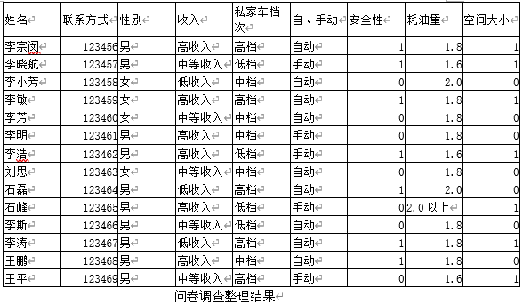
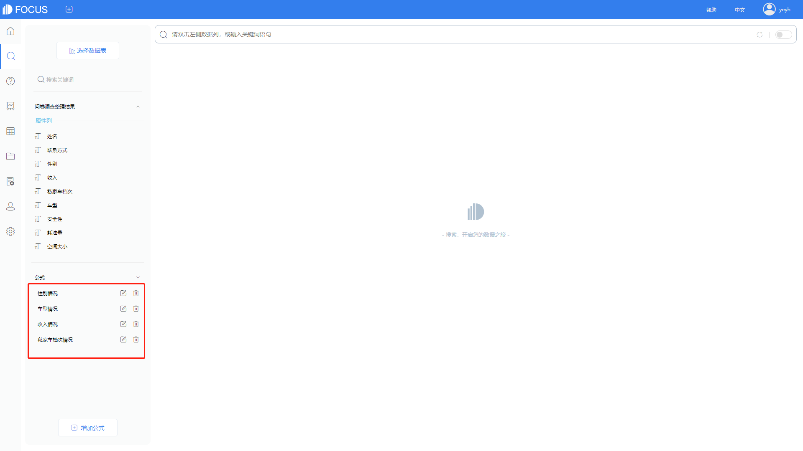

**智能商务专题 | 市场调查问卷的设计、整理与分析实例**

市场调查问卷是市场调查中非常重要的内容，也是决定市场决策效果好坏的关键环节。市场问卷调查的整理主要包括资料的编辑验证、分类与汇总。市场调查的分析包括表格与图示化分析。

这里我们以某汽车销售公司想对用户购买私家车而做调查问卷为例，调查内容包括收入、性别、购买汽车档次、自动与手动档、安全性、排量与空间大小等方面。

**市场调查问卷设计**

首先，我们根据已确定的调查内容及调查目标，可以先把收入进行分层，年收入20万以上为高收入，10万-20万之间为中收入，年收入10万以下为低收入。再把购买汽车档次进行划分，20万以上为高档，10万-20万之间为中档，10万以下为低档。安全性如果考虑设置为1，不考虑设置为0；空间大小同安全性。排量设计为1.6、1.8、2.0和2.0以上。

根据以上设计思路，制作调查问卷。

**私家车购买调查问卷**

**市场调查问卷整理与分析**

假设我们已经收集到很多份的调查问卷，并且已经得到了汇总。

如图是所有问卷调查汇总的表格。

现在我们需要进行数据分类和汇总。

**进行性别、车型、收入、自手动档等基本信息的统计**

将数据表导入DataFocus中。

导入的时候可以对数据列名称更改，可以把自、手动改成车型。

我们可以在搜索界面看到导入后的数据表。

下面我们要了解这些基本信息情况，这里我们可以通过建立公式来实现。

建立公式 性别情况 count(性别)

建立公式 车型情况 count(车型)

建立公式 收入情况 count(收入)

建立公式 私家车档次情况 count(私家车档次)

设置完成后我们可以看到界面左下角出现这些设置完成的公式。

**调查问卷性别、收入、车型、车档次结构分析**

性别结构

车型结构

收入结构

私家车档次结构

**按私家车档次、性别、收入高低进行分类与汇总。**

搜索框直接搜索性别、收入、私家车档次、私家车档次情况，即可得到以下表格。

再把图表选择为堆积柱状图，即可看到各个情况。

**按性别与车型、安全性、空间大小分类汇总分析**

和上述同理，搜索框输入性别与车型、安全性、空间大小，即可得到下述表格。

再把图表选择为堆积柱状图，即可看到可视化情况。

**按性别与收入、耗油量分类整理**

同理，搜索框输入性别、收入、耗油量、收入情况，即可得出下列表格。

表格可以按收入、耗油量降序排列，展示更清晰。

再把数值表转换为柱状堆积图，得到下图。

通过DataFocus直接对图表可视化分析，并且通过各种数据列的组合可以发现不同因素之间的影响。

马上使用一份调查问卷汇总信息实战一下吧！
