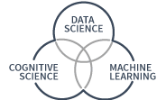
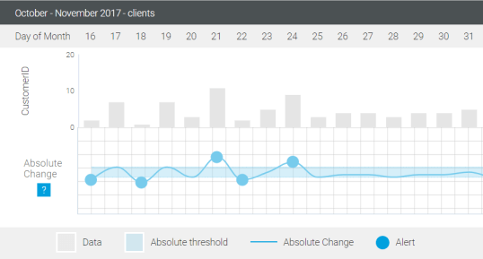
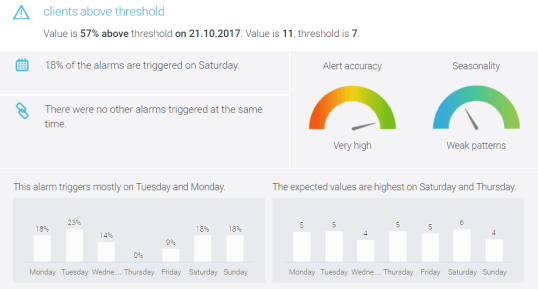
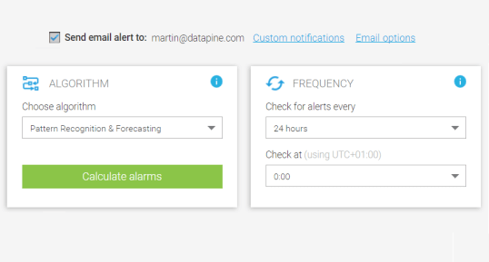

**设置自定义数据警报以轻松监控您的业务绩效**

当您监控大量 KPI 并管理大量仪表板时，很容易忘记真正重要的事情。DataFocus 的业务警报可以帮助您解决这个问题：一旦达到预定义的目标，或者每当发生意外事件时，您都会收到通知并完全控制推动您业务的因素。基于人工智能，我们的数据警报从趋势和模式中学习，并在发生重要事件时立即通知您。

神经网络警报 - 从人工智能中受益

我们的第一个数据警报基于人工智能算法，使用最先进的神经网络进行异常检测。它模拟了新皮质的一些结构和算法特性。它结合并扩展了各种方法，如贝叶斯网络、稀疏分布内存和空间和时间聚类算法中使用的方法。它适用于神经网络的常见树形节点层次结构。得益于这样的模型，我们专业的 BI 软件可以使用历史模式预测下一个值，并评估预测值与下一个值之间的差异。因此，异常程度与预测值和实际值之间的偏差成正比。此外，这些数据警报还为您提供波动幅度，衡量输出的置信度，

模式识别警报——利用机器学习

我们的模式识别警报是一种机器学习算法，旨在预测数据系列的下一个预期值。它使用历史数据来预测下一个时期的价值，并将其与实际的实际结果进行比较。在基础数据中找到强大的模式有助于生成更准确和有用的预测。如果观察到预期值与实际数字之间存在显着偏差，则可能表示意外行为，因为它不符合实际模式。通过定义与预测值的允许偏差范围，您可以调整算法的灵敏度，从而调整您将收到的 BI 警报的数量。

阈值警报 - 手动定义您的目标范围

阈值警报是基本的 BI 警报，可让您定义两种类型的范围（绝对或相对），您跟踪的指标可以在其中波动而不会实际触发警报。但是，如果它超过预定义的值，您将立即收到通知。我们的两种阈值如下。绝对值警报：当值低于或高于预设的绝对值时激活。当您想在每次达到某个目标时收到通知时，它很有用，例如一周的销售配额。相对值警报：使用观察值与其先前值的一定百分比差异。当百分比差异低于或超过定义的范围时，立即触发警报。

► 想深入了解我们的警报功能吗？[_查看_详细的警报功能](https://www.datafocus.ai/infos/business-intelligence-data-alerts#)

利用我们的智能数据警报[立即开始我的免费试用](https://www.datafocus.ai/console/)

## 识别趋势和模式

为了在正确的时间采取正确的行动，您的公司需要知道业务状况何时发生变化。由于我们的警报，一旦出现任何异常情况，您就可以迅速采取行动，以领先于可能影响您业务底线的潜在问题。在 DataFocus，我们设计我们的业务警报，以便它们帮助您完全控制您的关键成功因素。将它们与创新的业务仪表板相结合，您就有机会摆脱耗时的数据挖掘过程以发现趋势和模式，并在需要干预时立即获得警报。

## 及时抓住机会

从商业智能到人工智能：越来越需要探索组织内的未来潜力。您不再只想回答“发生了什么以及为什么”的问题，而是想继续了解“接下来会发生什么”。时刻注意季节性影响或日间影响，即使不影响底线，也会大幅改变您的数据。我们为您提供保障。我们开发了由人工智能驱动的警报，可以密切关注对您的业务真正重要的事情，并让您判断该采取或不采取什么行动。通过 DataFocus 的业务警报保持领先地位，并预测任何波动和变化。

## 只需单击几下即可设置警报

设置即时业务警报以跟踪您的活动。神经网络、阈值警报或模式识别，您可以随时监控重要事项，并在重要变化时立即收到通知。设置我们的数据警报只需点击几下，您就可以直接在您创建的仪表板上监控它们。使用 DataFocus，您可以轻松地将描述性和诊断性分析替换为自动分析，从而突出重要的事实和假设。受益于商业智能警报，让您了解数据中发生的任何事情并避免潜在的不良意外。控制是口号。

## 随时随地获取警报

我们的商业智能软件允许您从任何设备访问您的数据并对其进行处理，只要它具有互联网连接 - BI 警报也是如此。一旦您的数据出现问题，您将随时在手机上收到通知：我们的业务警报会发送自动电子邮件，让您了解重要的业务发展。它们会自动以 PNG 格式包含在您收到的所有受影响 KPI 的电子邮件中，这意味着您甚至无需登录即可查看它们。此外，您可以为每个警报自定义特定的发送列表，并随时添加或删除收件人。
