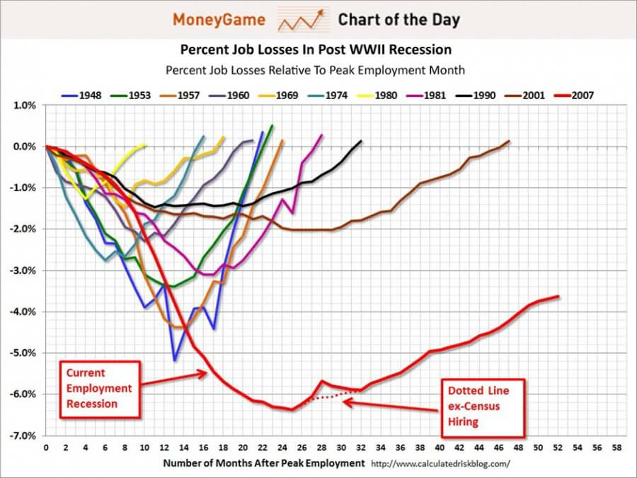

由于企业正在努力应对不断增长的数据量，可视化是使这些数据量可访问的唯一方法。无论您身在何处，都应根据可立即访问的数据做出业务决策。决策往往需要迅速做出，根本没有时间委托人进行离线分析 - 您必须现在就拥有数据。使用[数据可视化工具](https://www.datafocus.ai/infos/data-visualization-tools)，您可以生成令人惊叹的视觉效果，准确显示与给定查询相关的数据，而不会受到任何其他干扰。

数据可视化不仅可以帮助您进行决策，还可以帮助您提供引人注目的PPT文稿。不同类型的图表使您的受众更容易理解数据，并且不仅仅将其视为对事实的枯燥描述，而且将其视为一个故事，这将激励他们采取行动。康奈尔大学的研究人员已经证明了这一事实——包括一张图表可以显著提高读者的说服力。在他们的研究中，只有 68% 的参与者相信没有图表的科学声明，高达 97% 的参与者在包含图表时相信相同的声明。将他们的结论延伸到提供非科学数据上并不是一件容易的事。您的观众将数据可视化与科学联系起来，这种效果使您的演示文稿更加可靠和有说服力。

对数据可视化的支持是有充分理由的，因此，难怪它现在是一个商业大趋势。然而，数据可视化的数量并不能转化为质量。我们列出了 5 个最常见的数据可视化错误以及如何避免这些错误的技巧。

## 计算逻辑错误

这种类型的数据可视化错误在将构成整体的视觉元素组合而成的图表上最为明显。就像在馅饼或堆叠条中一样，数字加起来应该等于 100。这是非常显而易见的，但是在下面的图表中，你会惊讶地发现人们选择了多次。并不是说这些数字不能加起来——这个错误背后的原因是在调查的性质中找到。在大多数情况下，受访者被允许可以选择多个选项，因此结果不能像下面的示例中那样加起来为 100。在这种情况下，饼图并不是反映数据的正确选择。

为避免此错误，请仔细检查您的数字并确保使用标准的数据可视化工具，这类工具不允许您设置包含逻辑错误的图表。

## 选择错误的可视化

这是最常见的数据可视化错误之一——根据您的审美品味而不是数据的特征来[选择图表类型。](https://www.datafocus.ai/infos/how-to-choose-the-right-data-visualization-types)每种类型的数据都需要不同的数据可视化。例如，如果要展示最近 5 年的销售增长对比，最好使用条形图，可以一目了然地显示差异；另一方面，如果您想显示两个指标之间的关系，散点图将是一个更好的主意。下面的气泡图未能显示用于治疗特定疾病的捐款金额与该疾病造成的死亡人数之间的关系。注释方法也相当有问题。一个简单易用的条形图会做得更好。

避免所有这些错误的最好方法是首先说明可视化的目标。你有多少数据？数字之间有什么关系？不要害怕尝试，测试不同类型的图表，找出最能强调您想要获得的数据洞察力的图表。

## 显示太多数据

塞满数字的 Excel 文件和清晰的数据可视化之间的区别通常在于前者的不可穿透性和后者的可访问性。这就是数据可视化的目的——简化和结构化大量数据。然而，一些数据呈现者似乎忘记了数据可视化的基本原则，展示他们收集的每一个可能的数据项，并用混乱的图表提供无法忍受、毫无意义的展示。过度复杂化是一种数据可视化错误，肯定会让大多数观众感到沮丧，因为它使观众无法弄清楚该关注什么地方和什么内容。下面的图表应该能说明失业人数相对于就业高峰月份的百分比，但很难单独跟踪这两条线，更不用说相互比较了。

您通过可视化数据来提供具体、相关和快速的答案，因此首先使用您的良好的判断力筛选数据，只选择您的受众感兴趣的点并提供有意义的见解。

## 努力创新

信息图表和数据的图形表示变得如此流行的原因之一是，大多数人以相同的方式阅读图表，无论他们来自何种文化。这样做的原因是，他们已经习惯了通常显示数据之间某些特定类型关系的标准方式。他们的脑海中已经有了图表分析的模式，这意味着任何偏离它的行为，只会让阅读图表更加累人，信息也更难解读。所以把你的图表颠倒过来并不是最好的主意。

遵守约定。大多数奇异的图形类型很少见，因为它们不能很好地工作。绝大多数可视化需求都可以通过条形图和折线图、散点图和饼图得到很好的解决。试图改变一种行之有效的方法将抵消数据可视化所代表的简单性。

## 让读者做更多的工作

正如我们已经提到的，数据可视化可以帮助查看者轻松地理解数据。但是有一些琐碎的做法或失误可能对每个数据用户造成伤害。例如，忘记注释图表的元素。有时，仅靠视觉效果是不够的，您需要在图表中添加限定文本或数字，使其更有意义。通过添加一些图形元素有助于读者理解数据。例如，将趋势线添加到散点图中以突出显示趋势。另一个常见的数据可视化错误是非直观地排列数据。以合乎逻辑的方式展示您的内容，并通过按字母顺序或值排序的类别引导读者阅读数据。下面展示的 3D 条形图不仅使观看者难以将视觉效果与数值联系起来，而且，它还模糊了一些数据项。这是对数据可视化目的的否定。请记住，尽管您可能已经分析过这些数据，并且牢记在心，但您的听众可能是第一次看到它们。

## 如何避免数据可视化错误？

避免所有这些错误的最好方法是首先专注于你的目标。在考虑你的可视化外观之前，先考虑它们应该传达的内容。您的数据应该用于什么目的？您需要告知哪些决定？哪个数据点对您的受众来说最重要？考虑数据字段之间的关键关系，以及您选择的图表类型是否呈现这些关系。按类别对数据进行逻辑分组，然后按时间、大小、重要性或字母顺序对数据进行排序。使用颜色作为类别，而不是大小；您可以使用亮度或饱和度来说标注重要性。不要忘记标签和注释，但要保持谦虚，以吸引注意力而不会造成混乱。

失败的数据可视化甚至会使最好的数据变得毫无用处。准备好图表后，再次检查我们列出的错误。您可能必须做出改变。这是一件好事。测试不同的方法来获得以用户为导向的设计，以准确突出您想要表达的观点。
