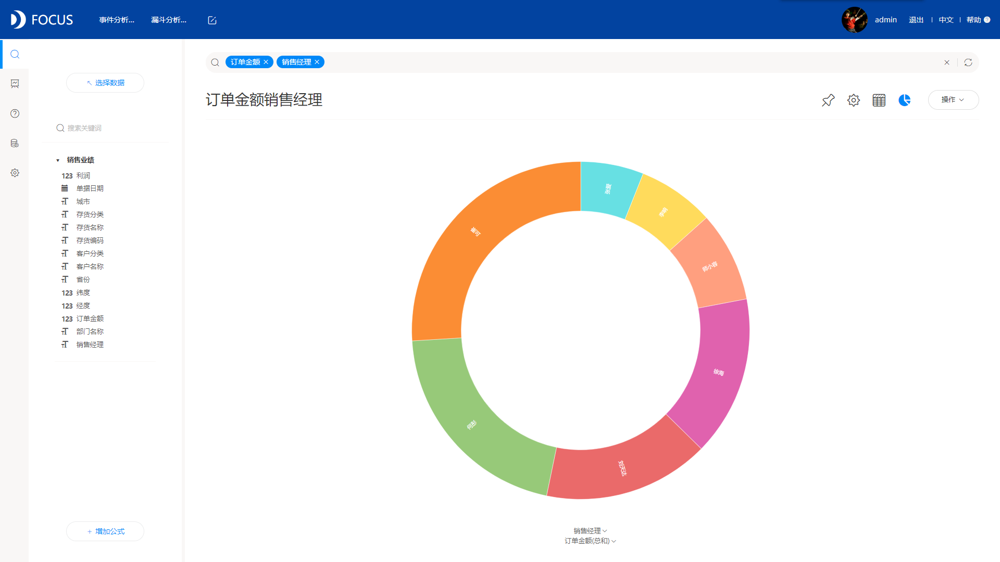
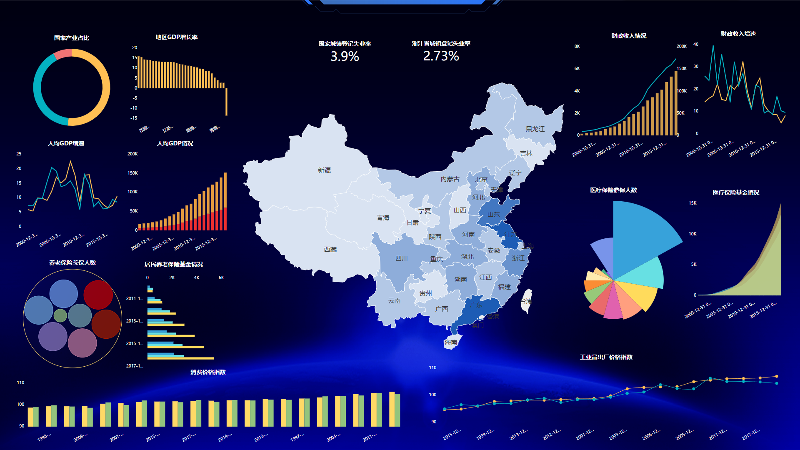

大数据发展迅速，企业日积月累的数据推动了数据分析的发展，企业也越来越重视数据分析给业务决策带来的有效成果。说到数据分析，就不得不提数据可视化，因为可视化是数据分析结果呈现的一个重要步骤，不能忽视。

如何做好数据可视化？今天本文主要给大家介绍一款实用好用的可视化工具。

DataFocus，是国内第一个使用自然语言搜索的数据分析工具。其独有的搜索式分析，极大地降低了数据分析的门槛。DataFocus不仅在数据分析上进行了创新，它的可视化功能同样出众。

DataFocus支持多源数据，可以用电子表格导入数据，也支持从数据库中直接抽取数据，而后自动构建模型，无需用户多余的操作。之后进行搜索分析，系统智能适配图表显示搜索结果，图表样式丰富，用户可自行转换图表，其可视化功能基本满足企业的所有需求。

在搜索分析，图表展现的过程中，你无需编写任何代码，也不需要任何IT知识，只要进行搜索，就跟谷歌搜索一样简单，系统就会自动出图，会告诉你搜索出的结果最适合什么样的图形，你只需等待几秒即可。

搜索出图（旭日图）

在DataFocus中，创建的一个个图表还可以添加进可视化大屏，大屏可以按照自己的喜好进行个性化配置，图表中的数据可以定时更新，无需重复制图。

总结来说，DataFocus的一大特点，就是操作简单，学会制作上图一样的酷炫大屏，只需20分钟即可，10分钟学习，10分钟制作大屏。学会DataFocus之后，数据可视化不再是难题。
