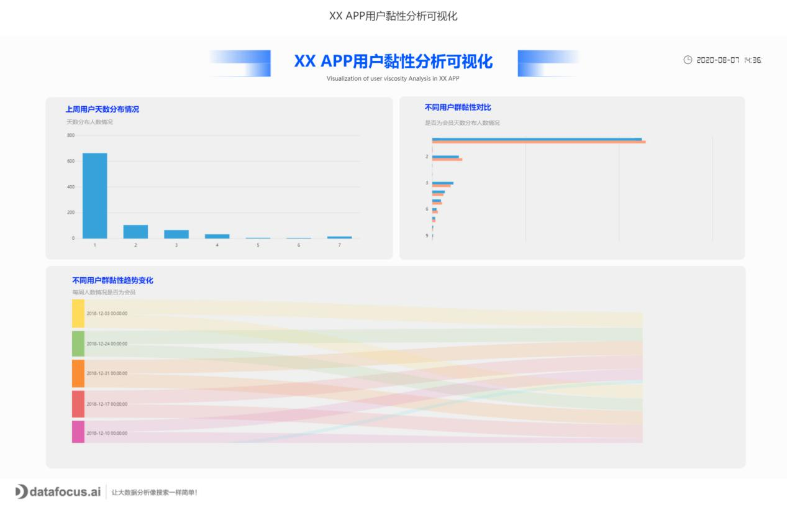

**[DataFocus](https://www.datafocus.ai/" \t "https://www.zhihu.com/question/_blank)**

1.数据搜索引擎

多数据源整合，支持大部 分主流数据库，如HANA、 Oracle、MySQL等；

支持数据表关联配置，目 前支持Left Join、Inner Join、Right Join等；

数据整合后，支持跨业务 系统、跨表搜索查询；

支持从源表生成中间表， 提供更多分析灵活性；

2.语义解析引擎

支持中文、英文双语解析；

自动搜索建议功能，猜想用户的下一 次输入，提高输入效率；

学习用户使用习惯，可给出个性化查询建议；

支持自定义数据习惯用语，如“薪水”、“薪酬”、“工资”可以表示 同一个数据列，适应不同用户习惯；

支持公式搜索，包含数学、逻辑、文本、值转换等复杂处理，提供更多搜索灵活性。

3.可视化引擎

根据返回数据自适应数据类型，目前支持柱状图、折线图、条形图、 饼图等常用图表类型，好包括一些矩形树状图、桑基图、经纬气泡图等复杂图形；

支持图表缩放、坐标轴自定义选择、 数据标签读取、自定义颜色等图表个性化编辑；

查询结果可自定义过滤条件，进行各种维度的二次过滤筛选；

支持保存历史问答、自定义数据看板，包括图形位置、大小、类型调整、下钻等功能；

支持图表超链接功能，搜索问题返回图表可直接保存为超链接，可嵌入第三方系统。

