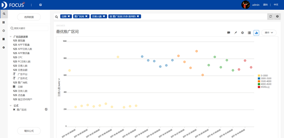

摘要 ：网络广告在过去的几年中发展事态良好，取得了骄人的成绩。此次案例分析的数据为2017年10月1日到2017年10月31日这一个月内某APP在不同广告平台投放的不同形式的广告数据。通过对广告消耗的推广区间进行分类，发现最优的推广区间基本在3000-3500左右，采用图片的广告形式较为划算，而最优的广告平台是易传媒。通过对下载转化率的计算，发现展现量到APP下载量的转化率较低，可以着重考虑如何提升展现量到APP下载量的转化率。因此广告宣传内容上可以着重宣传本企业产品不同于其他同类产品的某一特性。

关键词：网络广告；推广区间；转化率

一、案例背景

广告作为一种营销传播手段，虽然整体投入较大，但通过大众传媒的刊播，传播范围大，受众人数多，平均到达每个目标消费者身上的成本远远低于人员推销等传播手段。从这个角度而言，广告非但没有提高还有助于降低营销成本。

此次案例分析的数据为2017年10月1日到2017年10月31日这一个月内某APP在不同广告平台投放的不同形式的广告的数据。主要分析的内容是分析有无广告对于该APP的影响，最优的推广区间，广告形式、广告平台对于广告投放的效果影响和下载转化率的情况。

二、案例问题

在互联网高速发展的现在，提升自己品牌的知名度，使更多的用户使用自己公司生产的APP对于每个APP开发商来说都极为重要。但对于APP开发商来说，用户信息数据更新的太快，用EXCEL来处理完全跟不上，使用datafocus产品就可以快速处理数据，极大的减少做报告的时间。

三、案例分析

首先将需要分析的"广告投放效果"csv文件导入Focus系统。

1.有无广告投放的效果

为了科学的了解2017年10月1日至2017年10月31日这一个月内某APP的广告投放效果，首先通过面积图了解每日的广告推广消耗及注册人数的变化。

图 1 有无广告投放的效果

从图中可以看出2017年10月10日之前，该APP没有广告投入，注册的人数在200左右；从11日起，该APP开始增加广告的推广消耗，可以看到注册人数有明显的上升。

2.最优推广区间

在简单了解广告对于该APP的宣传效果后，为了挑选出最优的推广消耗区间，通过散点图对各个推广区间的注册人数进行观察。

添加公式：if 推广消耗 <=3000 then '0-3000' else (if 推广消耗 <=3500 then '3000-3500' else (if 推广消耗 <=4000 then '3500-4000' else (if 推广消耗 <=4500 then '4000-4500' else '4500以上')))。

图 2最优推广区间

散点图反映的是各个推广区间所对应的注册人数，从图中可以看出除了3000以下的区间，各推广区间的注册人数不存在较大差异，且各区间皆不太稳定。在这种情况下，通过观察对比发现3000-3500这一推广消耗的区间相对比较优异。

3.投资回报率

投资回报率就是利润除以推广消耗加上CPC，是计算该广告投资收益的最佳指标。

图 3投资回报率

投资回报率在1以上则代表有收益，在1以下则代表无收益。从图中可以看出，有广告投入后，该APP的投资回报率都在1以上，都是存在收益的，投资回报率的平均值为1.5，投资回报率最高的2017年10月16日，回报率高达2.35。

4.广告形式的影响

观察图3的回报率，可以发现2017年10月16日的投资回报率较别的日期偏高，是什么原因导致可能出现这类异常值。接着通过条形图研究广告形式对于注册人数是否有影响。

图 4广告形式对注册人数的影响

从图中可以看出，图片加上文字形式的广告推广消耗是最大的，但同样的注册人数也最多，文字链接的广告推广消耗最小，但注册人数也少。而图片形式广告推广消耗低于图片加上文字，但注册人数仅略低于图片加上文字。因此可以初步判断采用图片形式的广告较为划算。

5.广告平台的影响

同样的，广告平台的差异也可能导致注册人数存在差异。

图 5广告平台对注册人数的影响

从图中可以看出，注册人数最多的平台是易传媒，但易传媒的推广消耗处于中流水平，因此可以初步判断易传媒的广告效果较好。

6.扫码下载转化率

通过计算转化率，可以更加有效的发现人员流失的主要原因。

亮黄色的代表展现量到下载量的转化率，黄色的代表下载量到激活量的转化率，橙色的代表激活量到注册量的转化率。从图中可以看出展现量到下载量的转化率比其余两个转化率低很多。因此可以着重考虑如何提升展现量转化为APP下载量的转化率。

（二）数据看板

最后将这6个结果图导入"广告投放效果"数据看板中，为了使数据看板更为美观，对看板进行了以下布局操作：

进行全局样式设置：将界面背景设置为颜色，选择黑色；将组件背景设置为颜色——全透明；将标题栏设置为颜色——全透明；组件文字设置为白色；标题文字设置为白色并居中。

选择"自由布局"，拉长第5,6个图填满整个数据看板。

操作结果如下：

图 6数据看板

四、结论

综上所述，该APP开始在开始增加广告的推广消耗后，注册人数有明显的上升。最优的推广区间基本在3000-3500左右，采用图片的广告形式较为划算，易传媒传媒的广告效果优于其余几家传媒公司。

有广告投入后，该APP的投资回报率在1以上，是存在收益的，投资回报率的平均值为1.5，投资回报率最高的2017年10月16日，回报率高达2.35。

展现量转化为APP下载量的转化率较低，因此可以着重考虑如何提升展现量转化为APP下载量的转化率。

五、对策建议

1.内部定位策略。即为使本企业产品在同类产品市场占有一个适当的位置，而在广告宣传内容上着重宣传本企业产品不同于其他同类产品的某一特性。

2.理解用户的正式需求，包装正确的广告宣传点。

3.增加广告投放的次数，包括重复内容的投放，长时间的投放，广告核心关键点重复。
