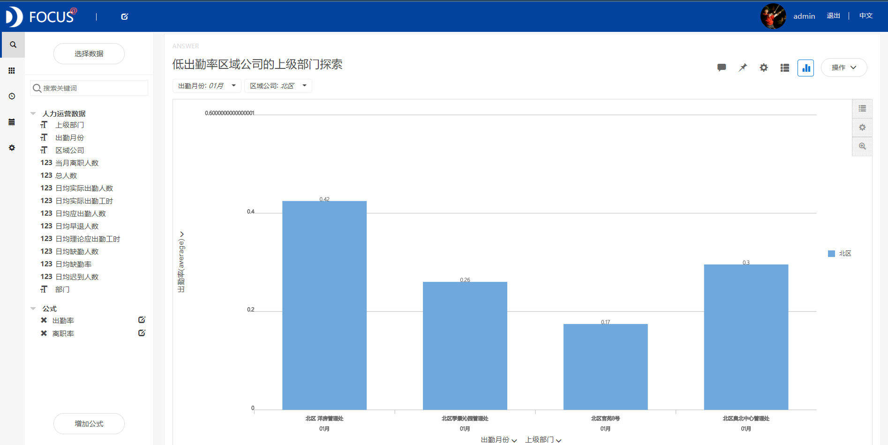

摘要 ：在科学技术突飞猛进的今天，各类行业企业之间的竞争 ，归根到底都是人才的竞争。本报告使用datafocus系统，对某公司2015年1月至12月的人力运营数据大数据进行分析。从出勤率较低的月份出发，对区域公司、上级部门、部门、迟到早退情况进行深入探索，结果发现：出勤率整体状况佳，但是1月份的出勤率低；北区宫苑8号、北区奥北中心管理处、北区季景园管理处的所在下级部门的出勤率低等结论。在年末和年初时行政人员应严格考勤；北区宫苑8号、北区奥北中心管理处、北区季景园管理处应完善考勤制度等措施能提高员工的积极性，为公司取得人力保障。

关键词：datafocus；人力运营；出勤率；迟到早退

一、案例背景

随着人民的生活水平不断提高，购房需求不断增长，房地产业得到飞速发展，取得了令人瞩目的成就。理性的房地产投资的优势是活跃房地产交易，增加市场需求，促进房地产市场的发展，提供房地产租赁市场上的房源，满足市场上的租房需求。某公司想要通过2015年本公司的人员考勤和流动数据来了解本企业的人员管理现状，从而发现问题，解决问题。

二、案例问题

由于需要分析一年间所有区域所有部门每月的人员考勤和流动数据，共计约为3000条，如果将这些数据用可视化的方式简单明了的展现出来，用EXCEL来进行操作会略显麻烦，使用datafocus产品就可以快速处理大量数据，因此可以极大的减少人力和物力。

三、案例分析

进入datafocus 产品系统，从数据管理页面中导入数据源"人力运营数据"，并在数据看板页面创建新的数据看板，命名为"某公司人力运营分析"。

1.按月出勤率及离职率的情况

首先我们需要了解该公司的出勤率和离职率的总体情况。利用折线图方便对比每月出勤率和离职率。 

图 1按月出勤率及离职率情况

由上图1可以看到，出勤率整体状况佳，但是在1月份只为57%；离职率在3月份达到顶峰。

2、低出勤率月份区域公司探索

由于1月出勤率不理想，接下来需要对这个月的出勤率进行区域探索，找出是哪个区域出现的问题。条形图可以直观展现各区域公司出勤率情况。

图 2低出勤率月份区域公司探索

如上图2所示，探索结果为：北区出勤率相对其他地区更低。

3\. 低出勤率区域公司的上级部门探索

在上述基础上，再对北区公司进行上级部门的探索，找出在哪个上级部门管理下的出勤率出现了问题。本次统计图选择使用柱状图进行探索结果的呈现。

图 3低出勤率区域公司的上级部门探索

从图3中可以看到，北区宫苑8号、北区奥北中心管理处、北区季景园管理处的所在下级部门的出勤率仅仅为17%。

4\. 低出勤率部门探索

已经找到上级部门，然后对所在部门进行出勤率探索，此次统计图选择面积图。

图 4低出勤率部门探索

如上图4所示，可以看到北区8号秩序管理部、北区8号保洁管理处、北区季景沁园管理处管理类三个部门的考勤率最低。

5.低出勤率部门的迟到早退情况探索

最后我们对低出勤率部门进行了迟到早退情况进行探索，选择使用气泡图。

图 5低出勤率部门的迟到早退情况探索

由上图5可知，低出勤率部门除了8号保洁管理部，其余都存在一定的迟到早退情况，其中季景沁园管理处管理类的迟到率和早退率最为严重。

将这8个结果图导入"财务项目收益"数据看板中，为了使看板具有美观性，对看板进行了布局操作，操作结果如下：

数据看板：

图 6数据看板

四、结论

出勤率整体状况佳，但是在1月份的出勤率仅为57%；1月份北区出勤率相对其他地区更低；北区宫苑8号、北区奥北中心管理处、北区季景园管理处的所在下级部门的出勤率仅仅为17%；北区8号秩序管理部、北区8号保洁管理处、北区季景沁园管理处管理类三个部门的考勤率最低；低出勤率部门除了8号保洁管理部，其余都存在一定的迟到早退情况，其中季景沁园管理处管理类的迟到率和早退率最为严重；离职率在3月份达到顶峰。

五、对策与建议

1.在年末和年初时行政人员应严格考勤。

2\. 北区宫苑8号、北区奥北中心管理处、北区季景园管理处应严加监督管理下级部门；北区8号秩序管理部、北区8号保洁管理处、北区季景沁园管理处管理类的考勤考核，下发相关文件通知，让员工了解公司考勤制度并落实到位。

3.在离职率高峰期组织开展公司内部趣味沙龙活动，增进员工与管理层之间的互动，建立彼此的信任；实时关心员工状态，一起打造更强的公司品牌。
