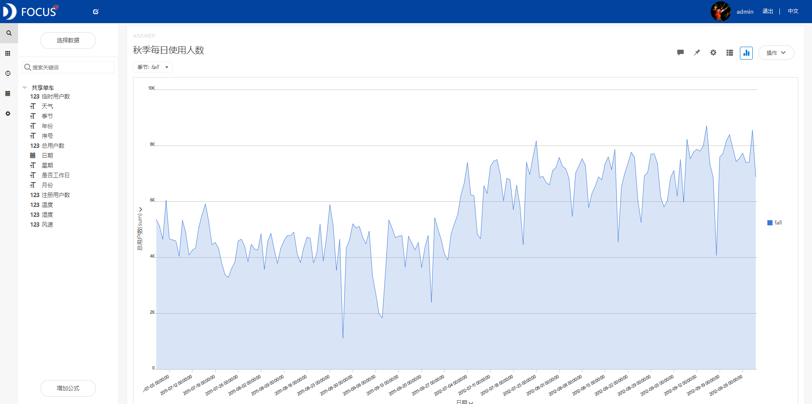
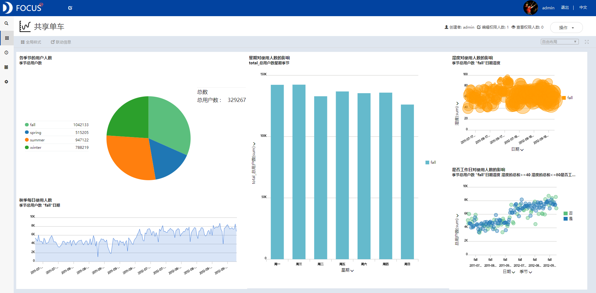

目的：研究如何提高共享单车的使用人数。

摘要：共享经济正逐步兴起，骑共享单车出行逐渐成为一种社会潮流，正慢慢改变人们的出行习惯。此次案例分析主要研究影响某品牌共享单车使用人数的部分影响因素。通过此次研究发现，共享单车的出现受到了越来越多的肯定和支持，且秋季是共享单车的使用高峰季节，大家都偏向在湿度范围在40-80左右时骑车出行，一周内的周一和周三则是骑车的高峰时间。

关键词：共享单车；影响因素；湿度范围；高峰

# 一、案例背景

共享单车具有时尚靓丽的外形且符合互联网发展，易被大学生和白领接受。骑单车出行满足了人们的出行需求，绿色环保，同时也是一种健康的锻炼方式。

共享单车的出现和国家的"生态文明"建设理念相吻合，有利于减少城市环境污染，符合绿色环保、健康出行的理念。中国城市人口多且密度大，交通拥堵，很多城市实施车辆限行、车牌限购的政策。共享单车的出现满足了用户"最后1公里"的需求，有利于缓解城市交通压力，优化路面交通资源配置。

此次案例分析的数据为2011年1月1日到2012年12月31日两年内某品牌共享单车的影响数据。主要内容包括研究最适合骑行的季节，同一季节条件下月份、工作日、天气、湿度等因素对于共享单车的总用户人数的影响。

# 二、案例问题

共享单车的用户人数会受到各种因素的影响，如月份、工作日、天气、湿度等等。本文将着重讨论分析影响共享单车使用人数的主要因素。由于共享单车数据信息量巨大，数据随时间变化频繁，用EXCEL来进行操作会略显麻烦，使用Datafocus产品就可以快速处理大量数据，分析的准确性也高。

# 三、案例分析

## （一）影响因素分析

1.四个季节的用户人数统计

为了研究如何提高共享单车的使用人数，首先通过饼图观察季节对于共享单车总使用人数的影响。

图 1 各季节的用户人数

从图中可以看到，总用户人数最多的季节是秋季，其次是夏季，冬季，人数最少的是春季。由此我们可以简单判断，秋季是共享单车使用的高峰季节，可以在秋季适当增加共享单车的数量。

2.秋季每日使用人数情况

在发现秋季的共享单车使用人数最多后，将其筛选出来，绘制折线图可以看到秋季每日的共享单车使用人数变化。

图 2 秋季每日使用人数

从图中可以看到，2012年的共享单车使用人数明显高于2011年，说明共享单车的出现受到了更多人的肯定和支持。且从图中可以看出，共享单车的使用人数存在一个周期，这个周期大致为一周左右。

3.秋季空气湿度的影响

环境是影响使用人数较为重要的因素之一。因此通过气泡图观察湿度对共享单车使用人数的影响。

图 3 湿度对使用人数的影响

从图中可以看到，气泡的大小代表使用人数的多少，当湿度偏高或者偏低时，使用人数都较少；当湿度范围在40-80之间，共享单车的使用人数是最多的。

4.工作日对用户的影响

在确定了湿度影响范围的情况下，再对工作日的影响进行分析，通过散点图观察是否为工作日的情况下享单车使用人数的变化。

图 4 是否工作日对使用人数的影响

从图中可以明显地看到，工作日使用共享单车的人数多于非工作日，数据排列也较为密集。因此可以推断上班族是使用共享单车的主力，并且越来越多的上班人士选择共享单车作为一项上班的交通工具。

5.星期对用户的影响

再将是否为工作日进行仔细划分，具体划分为星期，观察使用共享单车的人数。

图 5 星期对使用人数的影响

从图中可以观察到，一周内周一和周三的共享单车使用人数是最多的，周六和周日则是最少的。因此可以适当增加周一和周三的车辆或者增加这段时间内的车辆运输。

## （二）数据看板

最后将这5个结果图导入"共享单车"数据看板中，为了使数据看板更为美观，在全局样式中选择第三个预设样本，选择"自由布局"。操作结果如下：

图 6 数据看板

# 四、结论

综上所述，我们可以得到秋季是共享单车使用的高峰季节，可以在秋季适当增加共享单车的数量。共享单车的出现受到了越来越多的肯定和支持，但共享单车的使用人数的变化存在一个周期，大致为一周左右。

共享单车使用人数回收环境的影响，当湿度偏高或者偏低时，使用人数都较少；当湿度范围在40-80之间，共享单车的使用人数是最多的。

一周的时间内，周一和周三的共享单车使用人数是最多的，周六和周日则是最少的。因此可以适当增加周一和周三的车辆或者增加这段时间内的车辆运输。

# 五、对策建议

1、可以在秋季适当增加共享单车的数量，减少春季的单车数量

2、当天气预报湿度范围在40-80之间时，可以适当增加单车数量。

3、可以适当增加周一和周三的车辆或者增加这段时间内的车辆运输。
