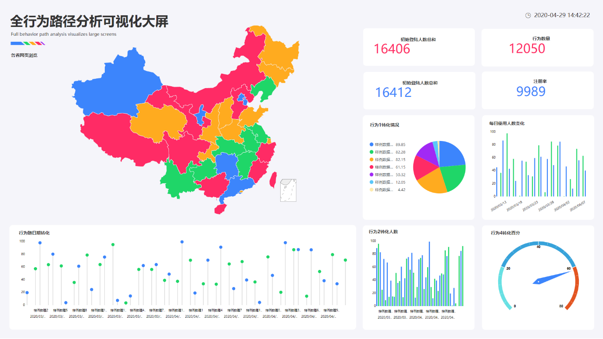
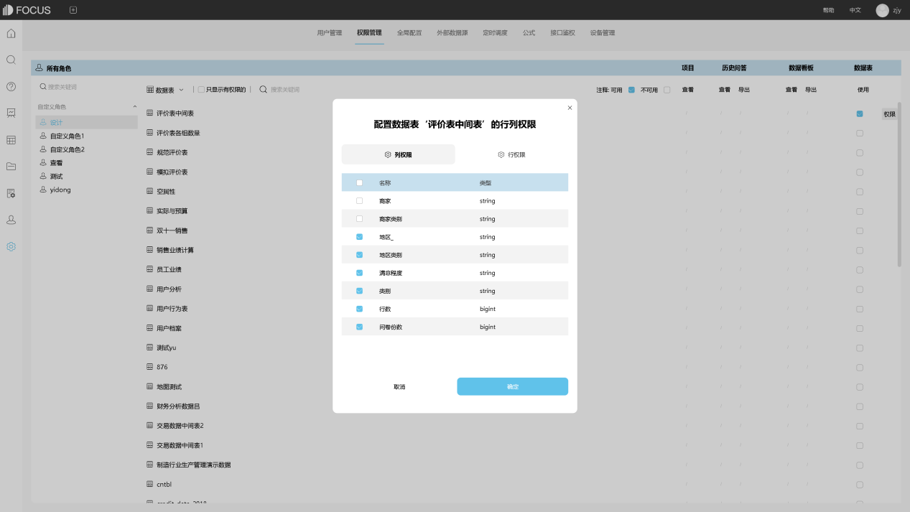
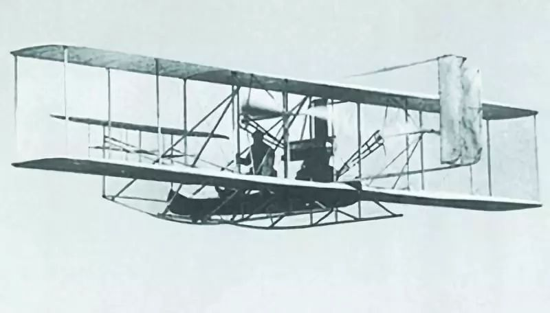
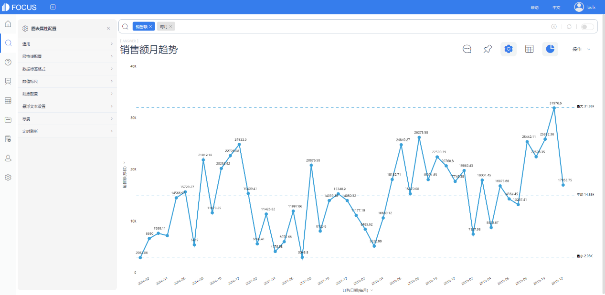

据美国航天局NASA介绍，“毅力”号火星车于美国东部时间18日15时48分进入火星大气层，在7分钟内在火星赤道以北的耶泽罗陨石坑着陆。随后，任务团队在社交媒体上公布了“毅力”号登陆火星后拍摄并传回地球的第一张照片。

图1 ：火星表面发回的照片（来源：NASA）

这一消息让很多火星迷、太空迷兴奋不已。这可能是人类离解开“火星生命之谜命”最近的一次。

任何事物都是有个发展过程的。从马车到汽车，从火箭到火星探测器，科技总是在不断加速发展进程。

独轮手推车，也许是人类发明最早的有轮子的交通工具，它的构造相对简单，使用也很方便，以致于在文明高度发达的今天，在乡村也在使用。

图2：独轮手推车（来源：网络）

大约公元600年前，人类发明了可载多人的四轮马车。马路的名字也是由此而来。当时在伦敦、纽约这些大城市，最先进的交通工具就是“马车”。然而马太多了，问题很快就来了，马尿、马粪…当时有很多大城市陷入“马粪危机”。

图3 ：街头的马车（来源：网络）

汽车的出现，让马粪危机得到了解决。随着福特T型车的发明，汽车进入美国普通家庭。因为汽车的普及，美国还曾被称为“车轮上的国家”。

图4 ：福特T型车（来源：网络）

1903年12月17日，美国莱特兄弟首次试飞了世界上第一架飞机！人类开始“飞翔”。

图5 ：莱特兄弟的飞机（来源：网络）

1961年4月12日，加加林乘坐的飞船搭乘火箭起飞，绕地飞行一圈后重返大气层，安全降落到地面，铸就了人类进入太空的丰碑！

图6 ：加加林乘坐“东方1号”个人飞船（来源：网络）

在人类历史上，每一次交通工具的升级都推动着社会的巨变，让人热血沸腾。**而在数据分析领域，同样存在着从独轮车到火箭的变革，科技带来了改变，而我们不应该在火箭时代“驾马车”，让自己企业的成长速度与别人越来越大！**

**“独轮车式”数据分析**

用Excel收集和管理业务数据，手工操作耗时费力。不同部门之间的数据不互通，是割裂的，不可直接拿来相互比较和计算的。积累了一段时间之后，独轮车再也跑不动了......

图7 :“崩溃”的Excel （来源：网络）

**“马车式”数据分析**

依赖ERP等企业管理系统的报表模块收集数据，但是各系统的数据形成孤岛，数据维度固定，只能按部就班，各自负责一个模块，无法对企业全局经营状况进行把握，就像行驶不灵活的马车......

图8 ：企业ERP系统（来源：网络）

**“汽车式”数据分析**

企业拥有了专门的报表软件，但需要依赖数据工程师进行图表开发；大量的需求堆积，导致IT人员不堪重负，而响应速度慢又导致业务人员不满，影响对业务的决策速度。

图9：传统报表系统（来源：网络）

**“飞机式”数据分析**

更先进一点的企业终于选择部署了BI软件，看起来速度分析速度提升了不少。但是拖拽式操作仍然不够快，加上维度固化，要派生维度需要复杂操作，自然无法形成以业务为中心的数据驱动组织。

图10：BI软件（来源：网络）

**“火箭式”数据分析**

创新的搜索式数据分析技术，所思即所见，火箭般的速度，助力企业效率10倍、百倍提升！

图11：DataFocus（来源：网络）

科技的进步，带来方方面面的革新。企业的运作效率提升，本质上是“更好的工具”的结果。直接选择一款“火箭”般的产品，和时代最快的速度一起~
