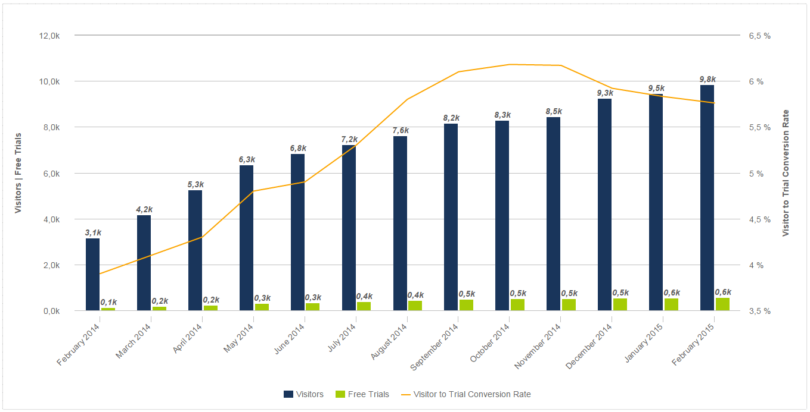
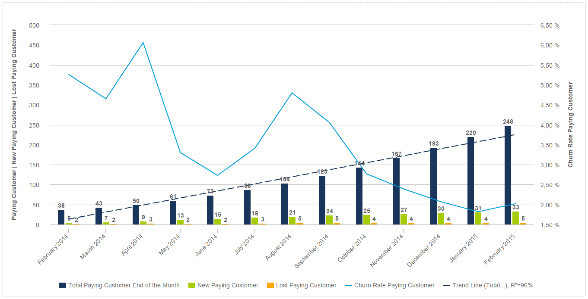
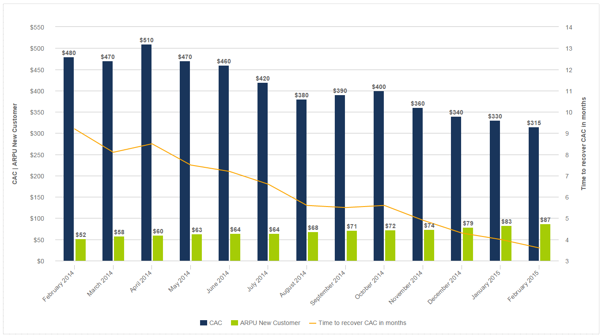
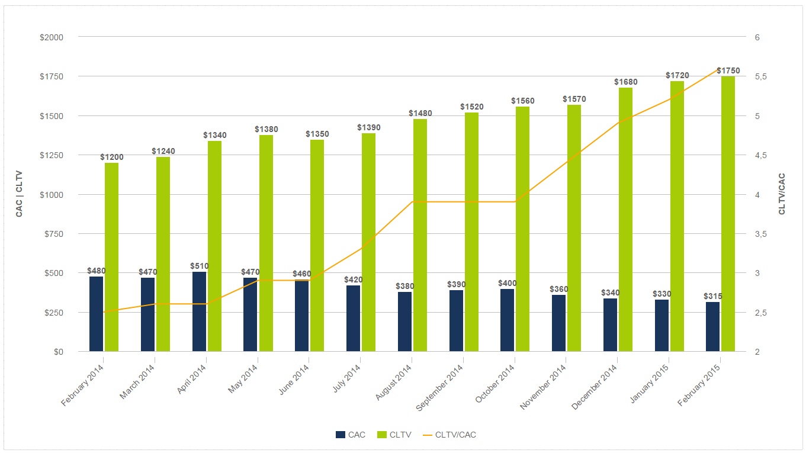
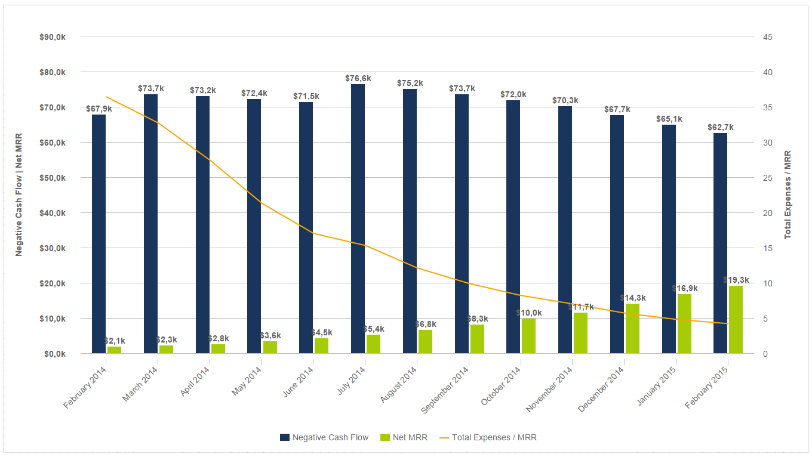

外面有这么多数据。如果您在 SaaS 初创公司工作，情况尤其如此，我们在DataFocus的目标是帮助您了解所有数据源。出于这个原因，这篇文章致力于帮助数据驱动的人领导他们的业务。为清楚起见，对于精通 SaaS 指标的读者来说，有部分内容可能听起来有些多余，但我们会尽最大努力为这一领域的每个人创造价值。

首先，软件即服务（software -as-a- service，简称 SaaS ）是一种流行的访问和支付软件的方式。SaaS 公司不需要在您自己的服务器上安装软件，而是让您租用托管的软件，通常是按月或按年缴纳订阅费用。就像健身房会员一样，您无需一次性花一大笔钱购买跑步机和一套举重器材，您只需支付更少的费用即可在当地健身房使用这些器材。

越来越多的 CRM、营销、金融和商业智能工具使用 SaaS 技术，甚至 Adob​​e 的 Creative Suite 也采用了这种模式。总的来说，这个概念相对还是较新的。

第一次这种软件分发模式是在 2000 年的一份内部文件中，到目前为止， SaaS 市场的规模预计将增长到210 亿美元以上。与20世纪90年代的应用程序服务提供商相反，它变得非常受欢迎，因为它降低了运营成本，并且可以一次性推出所有改进。对于用户来说，由于实现成本较低，用户的风险要有限得多；而对于供应商来说，由于业务模型的可伸缩性，供应商的风险要小得多。

SaaS 公司与传统企业有很大的不同，尤其是在重要的指标方面。大多数情况下，他们必须在前期投入大量资金来获取客户，但要在很长一段时间内从该投资中收回利润。有一些关键的 SaaS KPI，例如 CAC、流失率和 MRR，它们将决定您的公司成败。

在这篇文章中，我们将看看每个 SaaS 公司需要跟踪的前五个 KPI。这些指标对您的业务成功至关重要，并且可以使用我们的[数据分析软件](https://www.datafocus.ai/infos/data-analysis-software)轻松监控。本文中使用的所有图表都是基于一个成功的、早期 SaaS 初创公司样本数据。

## 1) 访客和注册（免费试用）

通常，SaaS 公司提供一个免费试用期，作为销售周期的第一步。这就是为什么您需要使用转化漏斗来跟踪有多少人转化为试用用户和付费客户。获取渠道的第一部分是有多少人访问您的网站，第二部分是有多少人注册免费试用。

目标应该是增加免费试用的数量，从而吸引付费客户（第二步）。这个目标可以通过增加访客数来实现，从而带来更多试用，或者通过以最好的方式展示您的产品并提供明确的独特销售主张 (USP) 来提高转化率。

**访客和注册（免费试用**）

在上面的图表中，您可以看到访问者、免费试用以及最重要的转化率的稳步增长。拥有这些数字的公司通过有效的在线营销策略瞄准了正确的受众。 在我们最近的一篇博文中详细介绍了更多关于最重要的[网站 KPI](https://www.datafocus.ai/infos/kpi-examples-and-templates-google-analytics) 的信息。

## 2）付费用户和流失率

理想情况下，您希望免费试用的数量、付费用户数量和转化率都能稳步增加，如下图所示。那么如何才能达到这种状态呢？

进入采集漏斗的第二部分。在大多数情况下，漏斗的这一部分掌握在[销售](https://www.datafocus.ai/infos/kpi-examples-and-templates-sales)团队手中，当然还有产品本身（价值真的符合承诺的 USP 吗？）。这可能是漏斗的一个棘手部分。人们喜欢注册免费的东西，但他们是否会使用你的产品并为此付费呢？

**免费试用和新增付费用户**

众所周知，活跃的免费试用用户更有可能续费。因此，重点应该放在您需要采取的步骤上，以确保您的试用用户进入该活跃的类别。使用教程、问答、现场演示和网络研讨会来加强您的产品熟悉过程。

首先，您必须弄清楚SaaS 大师林肯·墨菲（Lincoln Murphy）所说的“通用转化活动（简称CCA）”是什么，他将其定义为“所有或大多数付费用户在试用期间所做的事情”。如果您观察那些从试用用户转化为付费用户的每个人，你会发现他们在转化之前到底做了什么？

Twitter 是 CCA 如何改变他们的入职流程的一个很好的例子。Twitter 发现“一旦用户关注了 30 个人，他们就会或多或少地永远活跃。” 有了这些知识，他们改变了他们的入职流程，因此现在，当您注册帐户时，您必须在注册流程完成之前关注一定数量的人。

**总付费客户 | 新付费用户 | 流失的付费用户和流失率**

这张图表更进一步，详细描述了新客户、流失客户和流失率。您的流失率是指您的客户取消订阅的比率。

在这个示例图表中，一切都很顺利。付费用户显著增加，趋势拟合为 0.96（这在统计上意味着具有高度显著性），新付费客户也在增加，而流失率正在下降。 健康的基准流失率是每年 5-7%，也就是每月 0.42 - 0.58%，但在开始时，7-10% 的月流失率并不少见。在上面的示例中，您可以看到客户流失率稳步下降，然后在7月和8 月再次上升。这可能是一个令许多客户不满意的新版本，表明需要进行修正。

## 3) 每月经常性收入 (MRR)

[每月经常性收入 (MRR)](https://www.datafocus.ai/infos/monthly-recurring-revenue)是您每月订阅收入的计算。如果您的客户按年付款，您只需将年收入金额除以 12。这可能是最关键的 SaaS KPI。在创建公司时，有许多关键指标需要监控，但在您关注客户流失率或客户的生命周期价值之前，您首先需要每月收入。

**净MRR | 来自新客户和账户扩张的 MRR |损失的 MRR**

上图通过将 MRR 拆分为新客户MRR和账户扩张MRR，从而对 MRR 进行了更深入的研究。帐户扩张始终是一个很好的增长途径，并且可能意味着您的客户的需求正在增长（例如他们需要添加更多用户）或者您拥有新的附加功能作为一种追加销售的方式。该图表还查看了损失的 MRR。我们的目标是让 MRR 损失尽可能小，甚至是负 MRR 流失率。如果您丢失的 MRR 很高，这意味着可能是时候看看你的产品和你的原始USP了。

## 4）CAC和ARPU

CAC 代表客户获取成本。CAC 的计算方法是查看分配给获取新客户的所有成本，包括营销和销售费用，然后将该数字除以您在同一时期获得的客户总数。

ARPU 是平均每用户平均收入的缩写。要计算这个 KPI，您只需计算所有付费客户的平均 MRR。ARPU 使您能够计算恢复 CAC 所需的时间。按月跟踪这个数据是有意义的。。

**CAC 和新客户的 ARPU + 几个月内恢复 CAC 的时间**

通常 SaaS 公司必须在前期投入大量资金来获取客户，并在很长一段时间内收回利润。上图是恢复 CAC 所需时间的理想化表示 - 从 9 个月降至不到 4 个月。实际上，由于最初几年的积极推广，较年轻的公司通常具有较高的 CAC。然而，我们的目标应该是通过签署更大的交易和追加销售功能来增加 ARPU。

**每月开发 CAC 和 CLTV**

客户终身价值 (CLV) 是您希望在整个生命周期内从客户那里赚取的金额减去您的 CAC。LTV 与 CAC 的比率越高越好，但在大多数成功的 SaaS 业务中，该比率应该高于 3。上图是一个理想的例子，随着时间的推移 ，CLTV 增加而 CAC 减少。

## 5）现金状况和跑道

最后一组 SaaS KPI 对于经常有负现金流的外部资助的年轻初创公司特别有用。通过这些 KPI，您可以跟踪您的整体现金流、在当前的烧钱率下，您可以用当前可用资金生存多长时间，以及总支出与 MRR 之间的关系是如何发展的。

**几个月的银行账户余额和跑道**

这个现金概览和月盈余图示例显示了月底的银行账户余额，按月计算当前的总现金差额（此处为负现金流），以便查看您的跑道（在当前燃烧的月盈余下你能存活多久）。在此示例中，该图表令人担忧，因为该公司将在两个月内耗尽资金。现在让我们看看他们未来投资的机会。

**（负）现金流和净 MRR 的发展**

这张图表对潜在投资者来说会很有趣，因为它比较了总费用、净 MRR 并跟踪了几个月来现金流的发展情况。通过显示负现金流和净 MRR 之间的差距缩小，以及总费用/MRR 趋势线的下降，投资的可能性相当大。您还可以使用这些 KPI 进行预测，根据过去 12 个月的发展情况，估计您何时会进入正现金流阶段。

您是否有兴趣通过跟踪这些关键的 SaaS KPI 来提高公司的绩效？注册我们的30 [天免费试用](https://www.datafocus.ai/console/)，几分钟之内，您就能构建有如本文中一样有意义的图表。
