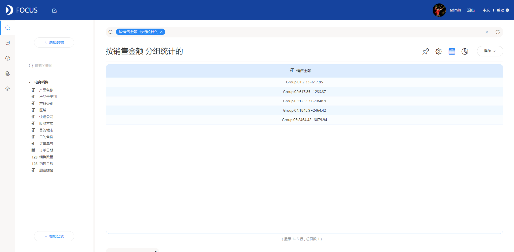
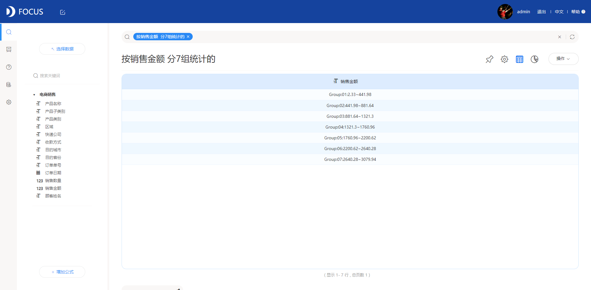
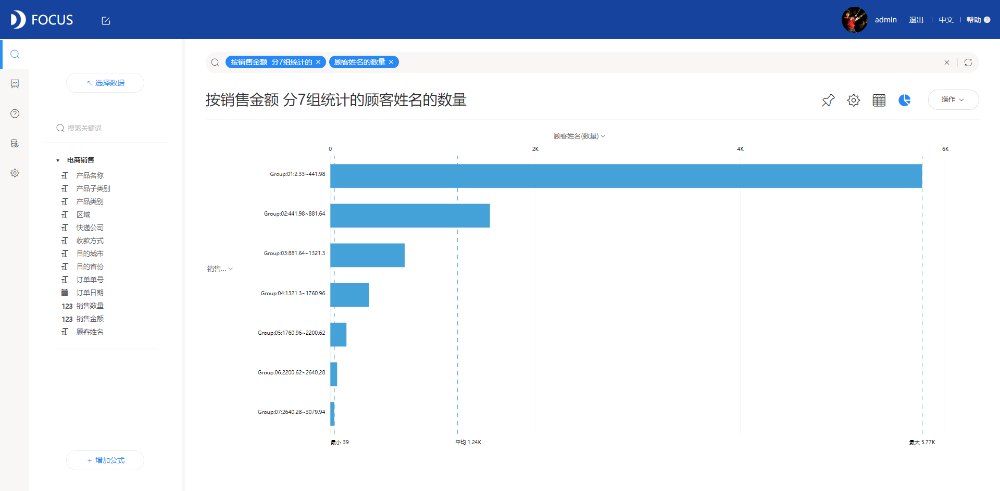
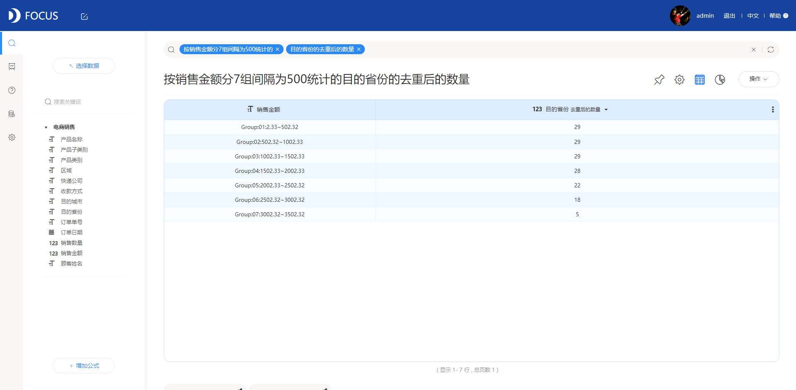

在数据分析中，同样的数据场景采用不同的图表会带来很大的信息差距。正确的匹配数据与图表不仅要有对数据结构的理解、业务的理解，还需要对图形语言学的一定了解和实际可视化项目中的经验，每一个元素背后都有着很深的学问，这里总结了一些常用图表的特性，可以帮助用户更高效的选择合适的图表类型。

数据场景千千万，每个不同的场景都有不同的数据结构、数据记录数和业务需求，这里先不论具体的业务要求，单说不同的数据结构和数据量，大致能够分为四类数据场景：对比/结构分析/分布/关联。

今天先来说一说对比。

对比的数据场景常常基于不同类别或者时间，从单一的维度或者两到三个维度结合区分析比较数据的变化，有时也会结合排序、分组等方法进行分析，常用于“哪个门店的销售额更高”“今年和去年的净利润相比如何”等场景，接下来细致的介绍一些不同数据情况下的比较型图表的使用：

1、数量比较

- 柱状图是一种广泛使用的图形，阐述了分类的属性变量和数值变量的关系，但是常常用于条目较少（即数据结果较少）的情况，柱状图一般需要排序：如果分类属性变量是有序的，按照它本身的顺序排列即可；如果分类属性变量无序，那么则根据数值变量的大小进行排序，使柱状图的高度单调变化。

- 在针对地域类分类属性变量时，还衍生出特殊的地图类型图表来用色块深浅进行比较。

- 当条目较多也可以使用条形图来显示，但数据量不宜超过30，否则图形会比较拥挤，反而阻碍了用户对数据的识别和信息摄取。

2、趋势比较——折线图

连续变化的X轴且注重数值的变化趋势时，折线图无疑是最适合的选择，且对数据量没有过多的限制。

2、占比比较

- 说到占比，首先想到的应该就是饼图/环图这中巧妙运用圆角度来进行占比分析的图表。饼图的本质仍是柱状图，只不过饼图一般用来表示各个类别的比例，而不是绝对的数值，用角度来映射大小。这里要注意的是，因为一个圆饼只有360度，如果类别太多了，这个饼会被切割得非常细，不利于阅读；这种情况下老老实实地用柱状图。

- 饼图中有一类比较特殊的模式，叫玫瑰图。同样本质还是柱状图，只不过把直角坐标系映射成极坐标系，看起来更美观。由于扇形的半径和面积是平方的关系，玫瑰图会将数值之间的差异放大，适合对比大小相近的数值。它不适合对比差异较大的数值，因为数值过小的类目会难以观察。此外，因为圆有周期性，玫瑰图也适于表示周期/时间概念，比如星期、月份。依然建议数据量不超过30条，超出可考虑条形图。

- 而环图的本质就是饼图，只不过把实心圆换成了空心的圆环；如果看板中饼图数量过多觉得单调，可以换个环形图。

3、目标达成

在业务场景中，会出现一些指标类的数据，如销售数量，预期目标与实际达成之间的对比，简单的表达了这一指标的完成情况，设置一个既定的预期标准用来对比区分不同情况下的完成情况。可以用仪表图来表达。

4、多维性能

对于一些多维的性能数据，如综合评价，常用雷达图表示。指标得分接近圆心，说明处于较差状态，应分析改进；指标得分接近外边线，说明处于理想状态。很多游戏中的人物能力极向对比就是以雷达图表示的。柱状图一般是一个分类型变量不同类别间的比较，雷达图可以是多个数值不在同一个维度之下；更具体地说，柱状图一般是横向比较，雷达图既可以多个观测之间的纵向比较，也可以是一个观测在不同变量间的横向比较。要注意的是，雷达图如果用来横向比较，需先把各个数值变量作归一化处理。

