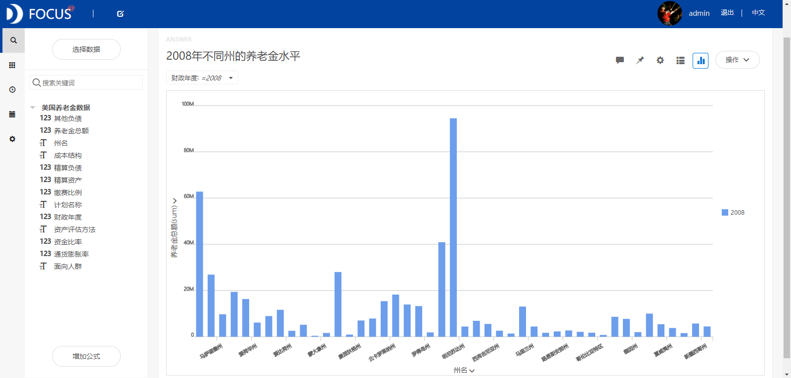
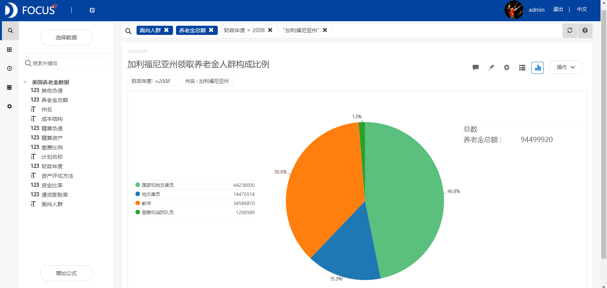
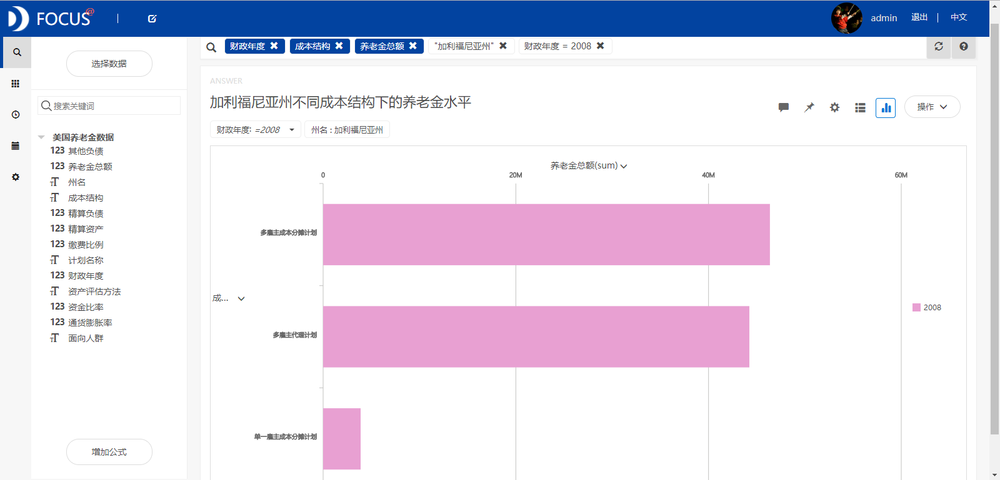
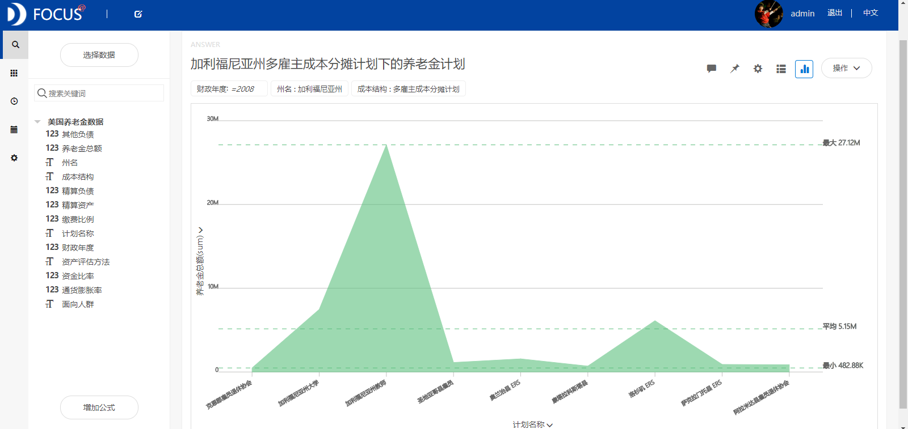

**目的：**研究导致美国养老金存在差异化的原因。

**摘要：**美国的社会福利在西方国家不是最好的，但其养老金体系却是全世界最大的。本文通过美国养老金的差异化分析主要得出了以下结论:2001-2008年期间养老金总额呈现逐年增加的趋势，2008之后又开始下降。养老金水平最高的一年是2008年。各个州的养老金水平存在很大的差距，其中加利福尼亚州的养老金水平最高。面向人群为国家和地方雇员的养老金最高，其次是教师。多雇主成本分摊计划和多雇主代理计划下的养老金水平较高，而单一雇主成本分摊计划下的养老金水平很低。

**关键词：**Datafocus,养老金,差异化分析

**一、案例背景**

美国的社会福利在西方国家不是最好的，但其养老金体系却是全世界最大的。每一个工作的人，只要工作到一定年限，在退休后每个月都可以从联邦政府领取到养老金。美国的养老金制度分为三个层次。第一层次是社会保障养老保险制度，由政府强制执行。第二层次是由雇主（包括公共部门和民间部门）自主出资的养老金计划。第三层次是个人储蓄养老金计划，即在个人自愿，联邦政府提供税收优惠的情况下，设立养老金账户。

**二、案例问题**

虽然美国整体的养老金福利比较好，但是不同年份下各个州的养老金水平还是存在较大的差异。本文首先基于美国2001-2016年的养老金数据，研究2001-2016年美国养老金的总体变化趋势以及养老金变化的原因。再基于某一年的数据，从缴费比例、成本结构和面向人群几个方面研究导致美国养老金存在差异化的原因。

**三、案例分析**

将分析的“美国养老金数据”CSV文件导入到Focus系统中。

**（一）养老金变化趋势分析**

为了分析不同年份的养老金差异情况，绘制出折线图如图1所示。从折线图中可以看出2001-2008年期间养老金总额呈现逐年增加的趋势，2008之后又开始下降，一直下降到2010年为止。养老金水平最高的一年是2008年。 

图1 2001-2016年养老金变化趋势

**1.通货膨胀分析**

通过对比2001-2016年间美国通货膨胀率与养老金的变化情况，研究通货膨胀率对养老金水平的影响。从图2中我们可以看出2008年之前，随着通货膨胀率的减小，养老金水平逐渐提高。2008年之后通货膨胀率与养老金变化之间的关系不太明显。因为养老金由政府发放，当存在通货膨胀时，政府为了抵消通货膨胀（物品涨价，钱不值钱）引起的价格上涨，可能会相应地增加养老金支出。 

图2 通货膨胀率与养老金的变化趋势

**2.政府资金比率分析**

政府资金比率是指精算资产与精算负债之比。它是衡量政府偿债能力的重要指标之一。精算资产通常是利用平滑的投资收益和损失产生的资产水平波动来计算的。精算负债是按GASB标准计算的应计负债。精算负债等于未来收益的现值，使用计划的长期投资回报贴现所得。从图3中我们可以发现2008年之前随着政府资金比率的下降，养老金逐年增加。2008年之后两者都处于水平波动的状态。这说明政府偿债能力较高的时候，养老金支出会比较低。 

图3 政府资金比率与养老金的变化趋势

**（二）2008年的养老金情况**

**1.不同州的差异化分析**

为了研究不同州的养老金水平差异，绘制出柱状图如图4所示。从柱状图中，我们可以看到，各个州的养老金水平存在很大的差距，其中加利福尼亚州的养老金水平最高，其次是纽约。****

图4 2008年不同州的养老金水平

**2.缴费比例分析**

缴费比例是指在上年社会平均工资的基础上由雇主缴费的比率。最低为全州城镇非私营单位在岗职工月平均工资（上年度社会平均工资）的60%，最高是上年度社会平均工资的3倍。从对雇主缴费比例的分析中得知，并非缴费比例越高的地区养老金水平也会越高。  图5 2008年不同州的缴费比例与养老金统计

**（三）加利福尼亚州的养老金情况**

由于加利福尼亚州的养老金比其他州的要高，故筛选出该地区的数据来研究不同面向人群和成本结构下的养老金差异。

**1.面向人群情况**

从图6中可以看出面向人群为国家和地方雇员的养老金最高，其次是教师。这说明美国对政府雇员和教师的养老金福利比较好。 ****图6 加利福尼亚州不同人群养老金构成比例

**2.成本结构分析**

通过分析不同成本结构下的养老金发现，多雇主成本分摊计划和多雇主代理计划下的养老金水平较高，而单一雇主成本分摊计划下的养老金水平很低。

****

图7 加利福尼亚州不同成本结构下的养老金水平

**3.多雇主成本分摊下的养老金计划**

筛选出养老金水平较高的成本结构——多雇主成本分摊计划下的养老金数据，研究该结构下不同养老金计划的养老金情况。从面积图（见图8）中可以看出计划名为加利福尼亚州教师的养老金福利最好。

图8 加利福尼亚州多雇主成本分摊下的养老金计划

**（四）数据看板**

最后将这6个结果图导入“美国养老金差异化分析”数据看板中，操作结果如下： 

图9 数据看板

**四、结论**

2001-2008年期间养老金总额呈现逐年增加的趋势，2008之后又开始下降，下降趋势一直到2010年为止。养老金水平最高的一年是2008年。各个州的养老金水平存在很大的差距，其中加利福尼亚州的养老金水平最高，其次是纽约。面向人群为国家和地方雇员的养老金最高，其次是教师。这说明美国对政府雇员和教师的养老金福利比较好。多雇主成本分摊计划和多雇主代理计划下的养老金水平较高，而单一雇主成本分摊计划下的养老金水平很低。

**五、对策建议**

由于各个州的养老金水平存在很大的差异，所以政府应该采取一定的措施来减小这种差距。通过分析养老金的面向人群发现，美国对警察和消防队员的养老金福利比较低，而美国又是一个恐怖势力比较嚣张的国家，警察和消防队员的重要性不言而喻，因此政府应该努力提高警察和消防队员的养老金水平。单一雇主成本分摊计划下的养老金水平很低，因此可以减少这种成本结构下的养老金项目。
