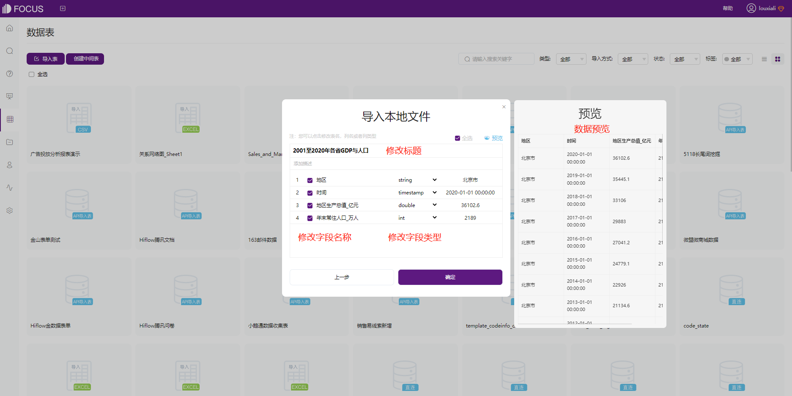
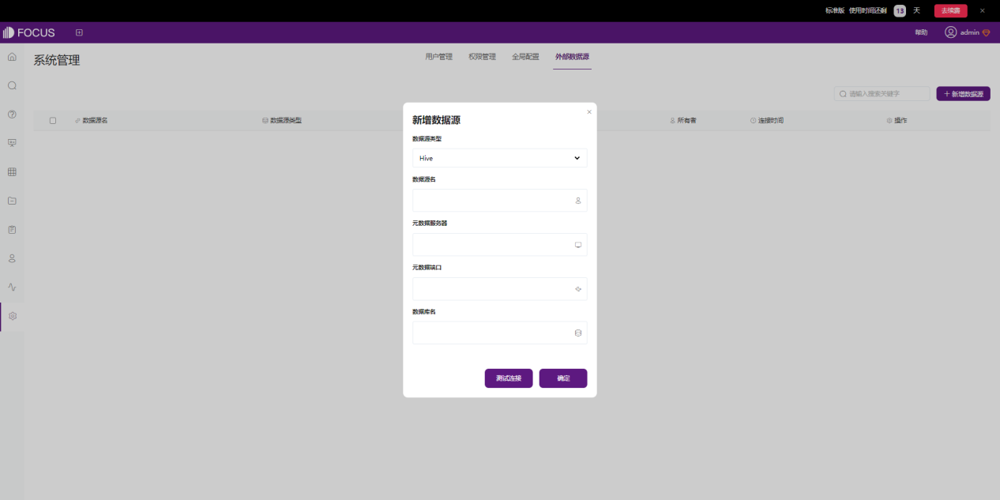
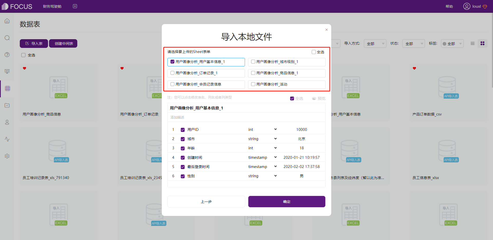
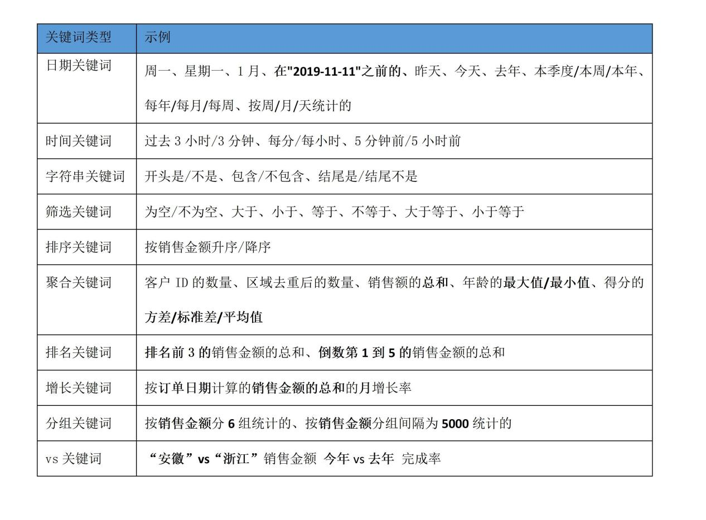
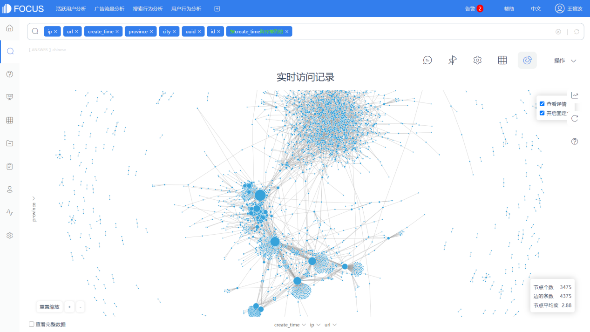
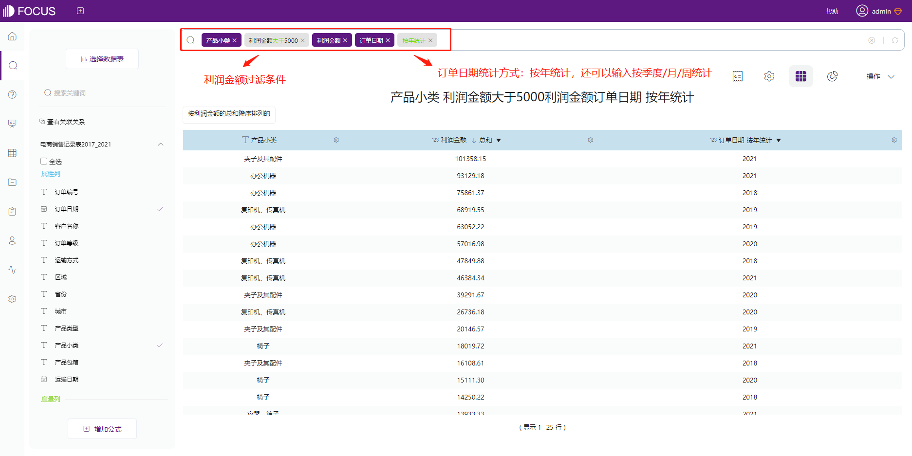
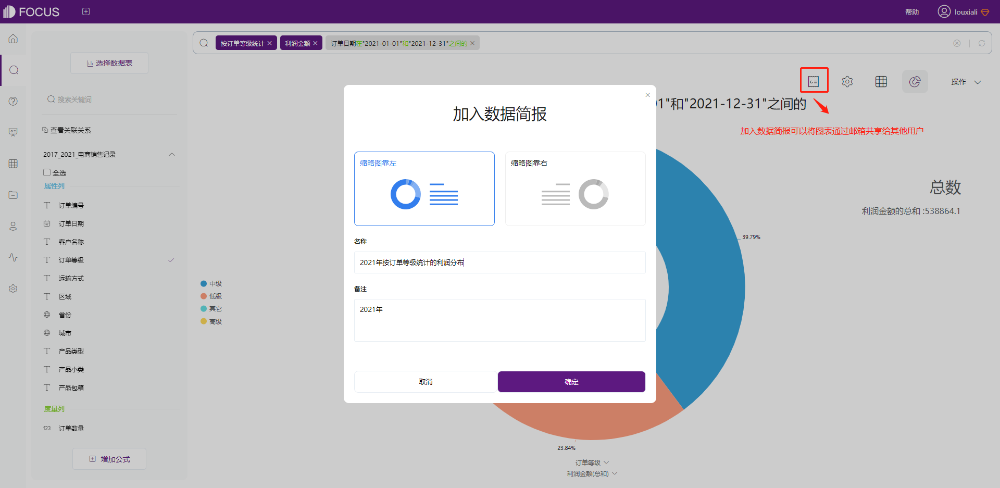
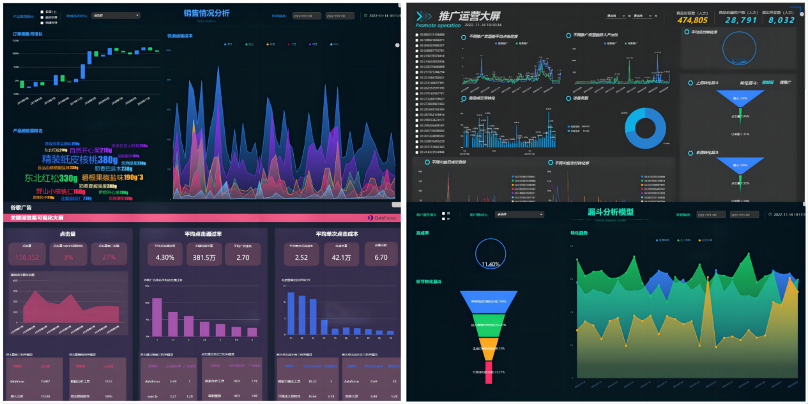
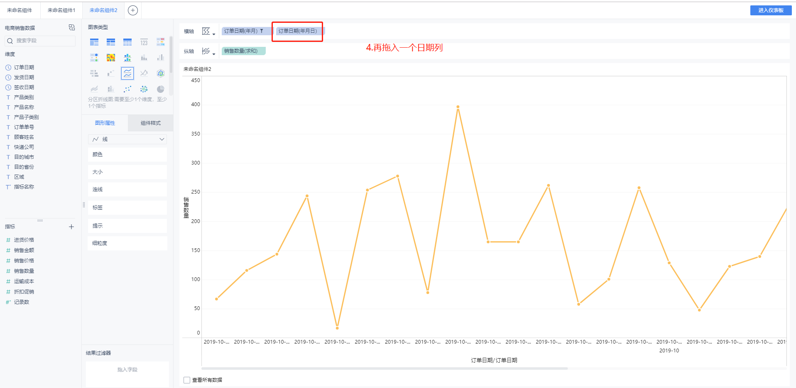

# 永洪BI vs DataFocus Cloud

## **一、产品简介**

永洪BI是集数据准备、探索式自助分析、深度分析、数据可视化为一体的一站式大数据分析平台，致力为各种规模的企业提供灵活易用的全业务链的大数据分析解决方案。

DataFocus Cloud（以下简称DFC）是一个基于搜索式分析的Saas数据分析平台，提供一站式云数据分析服务。DFC旨在利用创新的搜索式交互方式，帮助业务人员在没有技术背景的基础上也能完成高效、专业、快速的数据分析。

**二、数据连接**

永洪BI支持多种类型的数据源连接，包括文本数据、SQL数据源、多维数据源、其他数据源（NoSQL数据库或服务器请求等生成），一共支持49种数据库类型。

图2.1 永洪BI连接数据源

DFC同样支持本地文件上传，也支持导入数据库中的数据表或者直接连接数据库，实时更新数据、图表和可视化大屏。**除此之外，DFC还支持使用数据访问API对外部应用进行授权，允许外部用户通过调用API接口导入数据。**

图2.2 DFC本地数据导入

图2.3 DFC连接数据源

图2.4 DFC新增数据服务API

此外，DFC支持一个数据表中多sheet表导入，可以在一个页面中进行设置，而永洪BI不支持。

1. **数据问答与图表可视化**

永洪BI可以使用拖拽式操作来创建图表和制作报告。在拖拽式操作的基础上，也增加了自助分析工具-数据问答组件，让用户通过搜索的方式创建图表。使用流程是先在报告中添加数据问答组件，双击组件可以跳转到搜索和图表制作页面，制作完成后可以将图表添加到报告中。用户使用通用语言输入问题，针对提出的问题，系统以绘制的可视化图表进行展示，不再需要手动绑定数据列或了解数据结构的细微差别。永洪BI的数据问答组件支持以下特殊字段识别。

图3.1 永洪BI支持的特殊字段识别

DFC的核心功能之一就是搜索式分析，这也是DFC中唯一的图表制作方式，因为DFC有信心可以满足所有你想要的图表制作需求。DFC的**内置关键词库更丰富**，筛选操作的步骤都直接转化成关键词输入，比如X月、X季度、周一、具体日期之前/之后、大于/小于、等于/不等于、包含、vs、最大值/平均值/方差、同比/环比等。

下表展示了DFC系统提供的关键词类型，借助这些**关键词及其组合**，用户就可以自由地进行图表制作了。

图3.2 DFC支持的关键词

另外，DFC的搜索式分析支持所有内置的图表类型，多达50种。如桑基图、关系网络图、弦图、相关热力图等。

图3.3 桑基图

图3.4 关系网络图

图3.5 弦图

DFC还支持多种地图类型，包括3D地球散点图、轨迹图、位置经纬图、GIS位置图等。此外，用户还可以将自己的地图或地理数据导入到系统。

图3.6 地图可视化

下图演示了DFC搜索式分析使用关键词的操作。

图3.7 使用关键词年、月进行筛选

图3.8 使用关键词大于、按年统计进行筛选

图3.9 使用关键词排名前x的进行筛选

**四、数据洞察**

永洪BI的数据洞察用于发现业务数据增长、减少的原因，减少了过滤和图表分析的过程。目前以下9种图形组件支持数据洞察功能：柱图类、线图类、面积图类、饼图、环状图、南丁格尔玫瑰图、点图类、瀑布图、帕累托图。如下图，选择一个已绑定好数据，并支持数据洞察的图表组件，鼠标右键点击标记，出现数据洞察菜单。

图4.1永洪BI数据洞察

选择数据洞察，即会显示数据洞察分析报告。

图4.2 永洪BI数据洞察报告

DFC的智能洞察持对**数据表**或者**搜索后生成的图表**进行智能洞察。

在数据表中选择洞察列，配置洞察参数，系统会自动完成洞察并生成智能洞察看板，操作流程化，不需要掌握高难度的统计学知识，帮助用户了解数据规律，预测未来动向。目前支持的分析算法有离群分析、相关性分析、趋势分析。

支持将智能洞察看板中的图表添加到需要制作的分析报告中，或者可以跳转到搜索页面进行进一步分析。

图4.3智能洞察-选择洞察列

图4.4 智能洞察-配置洞察参数

图4.5 智能洞察-执行智能洞察任务

图4.6 查看智能洞察看板

**五、数据大屏**

永洪BI和DFC都支持创建数据可视化大屏。

在永洪BI中，图表直接在看板（报告）中创建。虽然图表可以复制和粘贴，但它们会根据数据集发生变化，因此可能会导致一些问题。

DFC先将图表保存为单个历史问答，因此可以将图表添加到任何仪表板而不会出现数据集问题。

DFC还支持将制作好的图表添加到数据简报中实时发送给邮箱用户进行查看，操作灵活，时效性高。

图5.1 加入数据简报实时分享

DFC 提供的仪表板模板可以直接用于制作新的看板。选择模板后，用户只需将图表替换到看板中，即可完成看板的制作。

图5.2 DFC看板模板

图5.3 DFC可视化大屏编辑页面

**六、结论**

DFC基于搜索分析并单独保存图表和看板。通过简洁的界面和全面的功能，用户可以轻松快速地创建炫酷的可视化，团队也可以更加方便地相互协作。

如果您准备提升自己的数据分析效率，创造出实时更新的可视化大屏。或者帮助你的企业选购一款高性能、高性价比、低学习成本的一站式数据分析工具，那么可以试用我们的[30天免费试用版](https://www.datafocus.ai/)，并从今天开始从高质量的数据可视化中受益！

