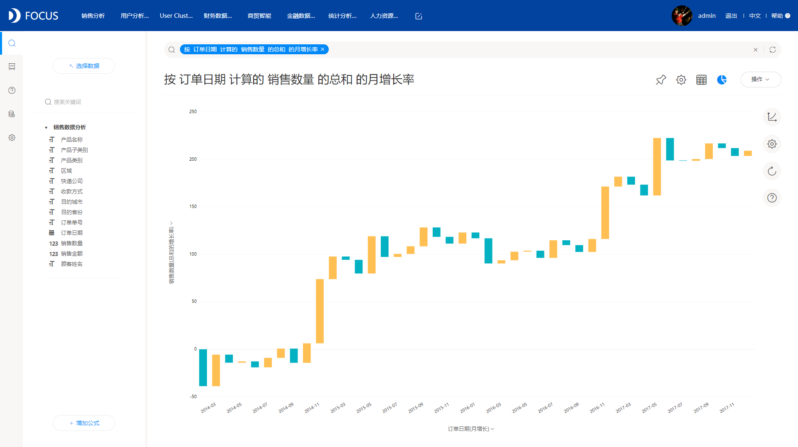
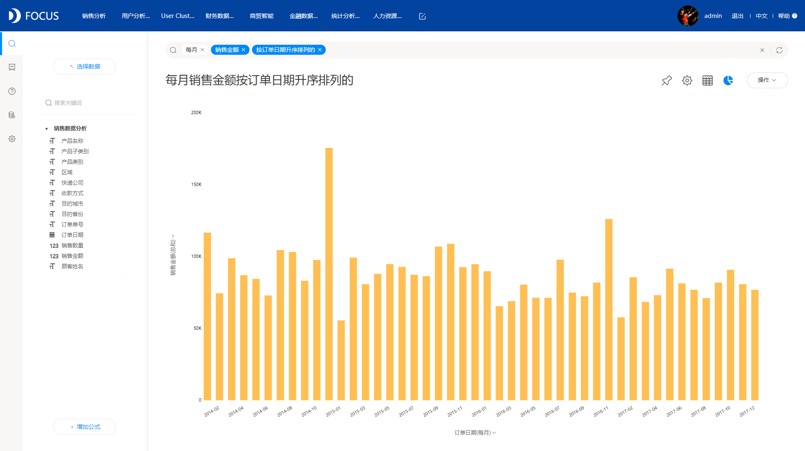

提到数据分析，大家的第一印象是什么？是想到了数据分析工具？还是想到了数据可视化展示，又或者想到了其他内容。我一看到数据分析，我的脑海中第一个浮现的就是数据分析工具。那对于数据分析工具，大家又会想到什么？很多人可能都想到了拖拽的这种交互方式，丰富的图表展现方式等等。而我，想到了与众不同的一款数据分析工具，其独特新颖的交互方式让我留下了很深的印象，这个与众不同的“大人物”就是DataFocus。

为什么说DataFocus与众不同？因为它是国内第一个采用搜索的方式进行数据分析的工具，这种方式打破了传统的拖拽式，将数据分析带入了一个新的阶段。而且也是因为这种搜索式，大大地降低了数据分析的难度，相信没有哪位企业员工是不会用百度搜索的，只要会用百度搜索，就会用DataFocus，同样地都是搜索提问，系统回答，不同的地方就在于DataFocus是以图表的形式来回答你的提问。

下面给大家实际展示下这种搜索式分析，体验其便捷性。

1、在日常分析工作中，同比以及环比是最常见的指标之一，DataFocus中，只需要在搜索框输入关键句式，系统就会实时返回月、周、季度、年环比或者月、周、季度、年同比，效果如下：

环比

同比

2、在做数据分析的时候，经常需要对某些数据划分不同的组别，例如对销售额划分不同的层次等级，类似高消费，中等消费，低消费等，在DataFocus中,上述场景实现同样非常简单，如下图所示：

分组统计

3、经常会有需要按照不同的时间序列来统计某些数值，比如统计每月/每年/每季度/每周的销售额，销售数量等，DataFocus的实现方式，如下图所示，非常简单：

通过上述几个例子，应该对DataFocus的搜索式分析有了更深的体会吧，是不是非常简单！
