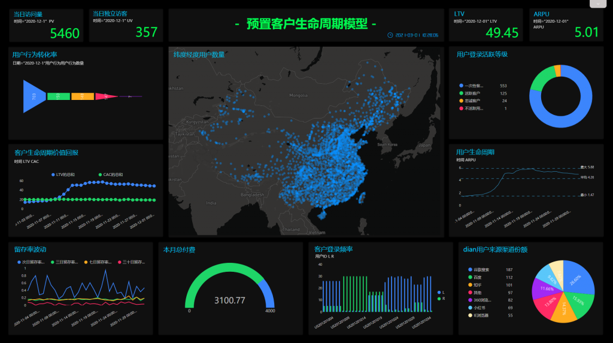

21世纪，数字经济将会成为社会经济中的新引擎，也会不断推动企业完成数字化转型。

随着消费者对于产品与服务的需求不断升级，用户使用场景以及产品延申服务也随着不断变化，云计算、大数据、AI等新技术又在不断推动产业变革。在这个大背景下，企业数字化转型势在必得。

那么具体是什么因素驱动着企业数字化转型呢？

**数字化大背景**

如今，数字技术已被中国消费者广泛接受，这迫使各行业在服务消费者时必须具备数字化能力，特别是电商、媒体和金融行业。

而贴近消费者的行业如汽车、教育、医药等也随之跟进，也已发展出了较高的数字化水平。但传统制造业由于行业特征、产品形态、商业模式等原因，数字化水平不足，仍有较大的发展空间。无论如何，数字技术的引入都会是不可阻挡的趋势。

企业数字化转型的根本动力还是来源于商业环境的变化，业务创新、中台技术、产业互联、生态运营是企业完成数字化转型的四大驱动力。

**业务创新**

业务创新是让企业在多变的商业环境中始终保持活力且不败的必备能力。

不仅是企业内部多变，比如市场份额下降、产品滞销、渠道成本提升等，还包括外部环境多变，比如消费者需求变化、竞争对手的出现打破市场格局等。这些因素都在不断逼迫企业必须具备创新能力。

比如原本企业活动的大体流程是，市场部经过市场调研做出策划案，找广告主进行广告推广，或找地推人员对商品进行地面推广，这些过程时间长则1个月，短则1个星期。而现在，企业可随时开启秒杀、团购等线上活动，而且还可以线上线下相结合，持续时间短则1分钟，长则1天，这些活动完全可以只靠1个运营人员通过数据监控。

这样一个简单的场景变化，就需要组织打破原有业务流程，实现业务创新，同时还需要技术、组织架构、产品等支持。

传统企业无法具备这类创新业务要求，必须依靠新的技术解决创新问题。

**中台技术**

中台是能力的枢纽和对能力的共享，是将企业的各种资源转化为易于前台使用的能力，为企业进行“以用户为中心”的数字化转型服务。

大量数据从业务系统中产生，而业务系统又需要数据分析的结果。数据中台用技术链接大数据计算存储能力，用业务连接数据应用场景能力。

数据在数据中台这个平台上按照标准模型进行规范加工处理后需要服务于多种场景，同时也需要我们提供标准的数据服务接口将数据与应用场景连接起来。

所以，连接是中台技术的根本能力，也是中台技术最大的价值。

**产业互联**

在用户流量红利正逐渐见顶的时候，消费互联网的格局和竞争态势日渐饱和，每个企业在跨过消费互联后，又在寻找下一个互联方向——产业互联，拓展企业的业务边界。

产业互联是促进企业内外互联互通，不仅是企业内部，还包括企业外部联系，重构传统产业的业务协作关系。

例如养殖企业，需要从养殖、搭建组织、安全管理、防控管理、营养管理全方位服务，这一切就需要产业互联平台，同时运用大数据先进技术，科学、规范化生产养殖。

实现产业互联转型，需要管理者具备三种思维。

**价值驱动思维**。从价值反过来指导产业价值链问题。

**分享经济思维**。产业互联网领域需要社会化分享，才能把分享的价值放大。

**大数据思维**。将原本分散的数据集合起来，通过产业互联平台提供全产业的数据决策模型。

**生态运营**

传统企业管理往往是专业化分工的，更多是追求效率提升以及风险管理。未来企业的管理将会基于连接，将整个组织往开放、生态的方向发展。在层层价值网络中，客户将会位于价值链中心，为了创造更多的增量价值，需要数据信息的开放与共享。

通过搭建生态体系，能帮助企业实现自我进化。但由于设计的行业跨度大、用户群体复杂，往往需要数字化平台赋予连接能力。

目前地产行业在生态运营方面最突出。地产企业目前遇到了发展瓶颈，需要尽快实现从纯地产开发商向城市生活综合配套服务商转型。于是地产企业纷纷开启数字化之旅。

**DataFocus 总结**

DataFocus助力企业完成数字化转型，不仅推动企业实现业务创新，利用数据中台为企业将数据和具体业务相连接，同时也帮助企业实现各个业务一体化，更是帮助企业搭建生态体系，实现企业自我进化。
