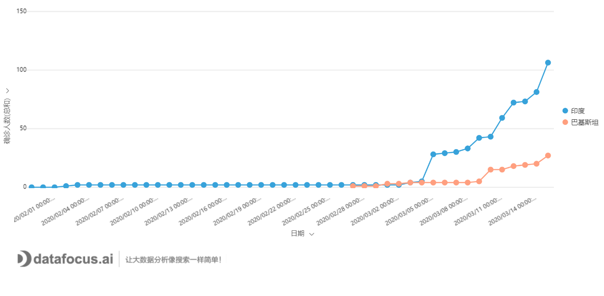
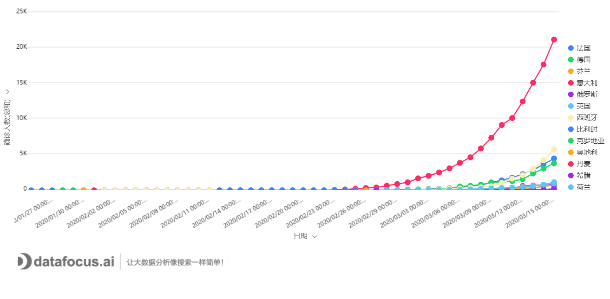
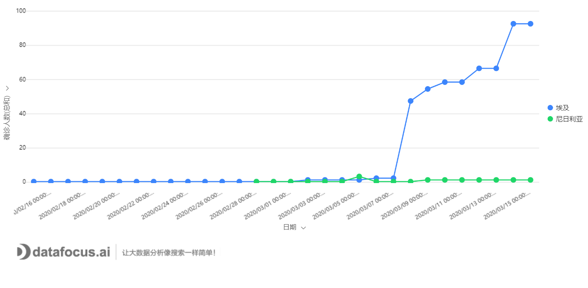

2月初以来，datafocus针对席卷全国的新冠疫情，展开了一系列分析，我们早在2月2日的文章《拐点将现：疫情将迎来第一次转机》中预测了新冠疫情将在5周后，也就是3月初进入增长平台期；之后，我们在2月24日《世界地图即将被全部点亮，全球进入比“烂”时刻》一文中提到：两周之后，也即3月上旬，病毒将会攻陷全球。目前来看，一一应验。

如今，中国经过巨大的努力，已经初步控制疫情的，全国除武汉地区外，已经清零多时。目前大部分散发确诊病例多为境外输入。

现在来看，海外国家情况很糟糕。按照目前的局势演变下去，各国究竟会演变成什么样子？对全球的经济、政治格局，究竟会造成何种影响呢？

先来看看东亚吧。目前亚洲最严重的国家是韩国，但经过严格的管控和排查，增长人数已经开始下降，大概率会在1个月左右基本控制住情况。亚洲另一个大国就是日本了，目前从统计数字来看，日本大概和新加坡类似，医疗资源尚可应付，属于可控的范畴。加之日本这个国家本来就很有危机意识，国民素质也高，其佛系应对方法可以保障不会造成社会混乱，但是鉴于病毒的超强传播力，此种方法使得整个社会带病运行，可能会对经济造成较长远的影响。 

图1 亚洲三国的确诊人数趋势

南亚大国印度，虽然从统计数字来看，波澜不惊，但其实最为凶险，该国医疗资料匮乏，人口众多，唯一的优势就是其交通不够发达，病毒的传播速度会打折扣。但极有可能长期存在。一旦有少量超级传播者加速了病毒的扩散，导致民众恐慌，将会对其经济和社会造成重击。

图2 南亚诸国的疫情趋势

中东诸国中，伊朗问题最大，据统计，其累计排查1000万人，其中发热患者达21万人，这是一个巨大的基数，由于中东并不太平，医疗资源有限。可以推测，中东国家几无幸免，在接下来的1个月时间里，中东将沦为重灾区。上周沙特发动石油价格战，接下来，收疫情影响，石油产量会有跌落，价格可能会止跌回升。

图3 中东国家疫情趋势

欧洲国家，目前危机最严重的是意大利，其次是西班牙。但是，最值得担心的，应该是德国、法国和英国这几个老牌强国。从确诊数据来看，德国和法国有大爆发趋势。一旦这几个国家全部沦陷，欧洲将彻底万劫不复。目前来看，趋势已经明显，英国打算放任自流，靠什么群体免疫解决问题。欧洲的未来要看德国和法国何时打算真正行动起来了。

图4 欧洲国家疫情趋势

世界头号强国，美国有着全球最先进的生物科技，也拥有最完备的医疗体系。一开始他们漫不经心，甚至颇为不屑，妥妥的把一手好牌给打烂了。经过两次股市熔断，其官僚体系才开始正视问题，3月14日，美国已宣布进入紧急状态，财政通路打开之后，就看美国各级政府的行政体系打算以何种力度应对了。

虽然美国并没有大规模进行检测，但是从已有的确诊数据来看，美国疫情大面积蔓延已经不可避免。美国第三产业占GDP高达75%以上，可以预见的是，此次疫情对经济的打击程度必定大于中国，美国制造业回流已经基本不可能。

图5 北美疫情发展趋势

非洲诸国，由于交通不发达，人民生活水平普遍不高，人民耐受力高，因此不太可能引发严重社会问题。具体来看，部分相对发达的非洲城市，由于与外界交流多，可能最先受到影响。虽然不会有迅速爆发和蔓延的疫情，但由于人口众多，人口结构年轻化，且医疗水平低下，很可能会变成长期的慢性病。

图6 非洲国家疫情趋势

有不少人认为新冠就是个大号的感冒，不必大惊小怪，更不应该像中国一样完全停止经济运行，去控制疫情。一部分人，甚至一些专家学者，也抱持这种观点。这是完全错误的。就像在《世界地图即将被全部点亮，全球进入比“烂”时刻》一文中提到的，新冠病毒最大的问题是，尽管总体上来说风险不大，但存在极大的不确定性，因为细胞因子风暴并不会因为患者的身体是否强壮而不发生，何况该病毒的重症率并不低。这也就意味着，该病毒引发的疫情对医疗资源的消耗比感冒多得多。偶尔的年轻人致死病例，一定会引起社会恐慌，从而极大的造成混乱。

因此，寄希望于无为而治，顺其自然，在交通发达，信息爆炸的时代，无异于自掘坟墓。新冠病毒就像是一剂慢性毒药，只有在一开始就断指求生，才能尽快恢复社会正常。迁延越长，可能断腕、断臂也难以解决问题了。
